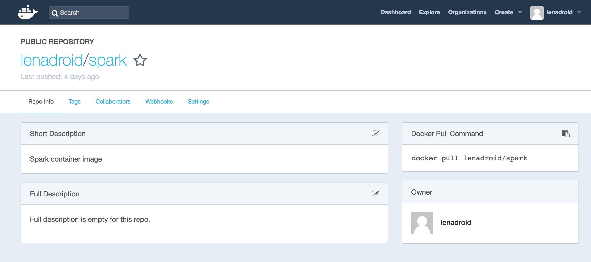

# Running Apache Spark jobs on AKS

[Apache Spark][apache-spark] is a fast and general engine for large-scale data processing. As of the [latest release][spark-latest-release], Apache Spark can run on clusters managed by Kubernetes. Azure Container Service (AKS) manages hosted Kubernetes environments, and this document details preparing and running an Apache Spark job with Azure Container Service (AKS) cluster.

## Prerequisites

In order to complete the steps within this article, you need the following.

* Basic understanding of Kubernetes and Apache Spark.
* An Azure Container Service (AKS) cluster and AKS credentials configured on your development system.
* Docker Hub account, or existing Azure Container Registry.
* Azure CLI installed on your development system.
* SBT (Scala Build Tool) installed on your system.
* Git command-line tools installed on your system.

## Get Apache Spark

Clone the Spark project repository to your development system.

```azurecli-interactive
$ git clone https://github.com/apache/spark
```

Change into the directory of the cloned repository, and save the path to the Spark source to a variable.

```azurecli-interactive
$ cd spark
$ sparkdir=$(pwd)
```

## Deploy Spark container image

Spark container image is necessary because Kubernetes requires users to supply images that can be deployed into containers within pods.

Build Spark source code with Kubernetes support.

```azurecli-interactive
$ ./build/mvn -Pkubernetes -DskipTests clean package
```

Build a container image.

```azurecli-interactive
$ ./bin/docker-image-tool.sh -r <your container repository name> -t <tag> build
```

Publish the container image.

```azurecli-interactive
$ ./bin/docker-image-tool.sh -r <your container repository name> -t <tag> push
```

In commands above, `<your container repository name>` is a name of existing Docker Hub account or Azure Container Registry, and `<tag>` is your choice for a name of the tag the Spark container image should be published with.

For example, if the Docker Hub was used as a container registry with `lenadroid` as an account name, there would be a new container repository called `spark` created under existing account as a result.



## Prepare a Spark job

Next step is preparing a Spark job to run on a Kubernetes cluster.

Navigate to a directory where you would like to create the project for a Spark job.

```azurecli-interactive
$ cd /myprojects
```

Create a new Scala project from a template.

```azurecli-interactive
$ sbt new sbt/scala-seed.g8
```

The command above will prompt for a project name, enter `SparkPi`.

```azurecli-interactive
A minimal Scala project.

name [Scala Seed Project]: SparkPi

Template applied in ./sparkpi
```

Navigate to the newly created project directory.

```azurecli-interactive
$ cd sparkpi
```

Run the following code to add an SBT plugin that allows packaging the project as a `jar` file.

```azurecli-interactive
$ touch project/assembly.sbt
$ echo 'addSbtPlugin("com.eed3si9n" % "sbt-assembly" % "0.14.6")' >> project/assembly.sbt
```

Run the command to copy the code file to calculate Pi number from examples directory into the newly created project, and add necessary dependencies to `build.sbt`.

```azurecli-interactive
$ examplesdir="src/main/scala/org/apache/spark/examples"
$ mkdir -p $examplesdir
$ cp $sparkdir/examples/$examplesdir/SparkPi.scala $examplesdir/SparkPi.scala

$ cat <<EOT >> build.sbt
// https://mvnrepository.com/artifact/org.apache.spark/spark-sql
libraryDependencies += "org.apache.spark" %% "spark-sql" % "2.3.0" % "provided"
EOT

$ sed -ie 's/scalaVersion.*/scalaVersion := "2.11.11",/' build.sbt
$ sed -ie 's/name.*/name := "SparkPi",/' build.sbt
```

To package the project into a `jar`, run the command below.

```azurecli-interactive
$ sbt assembly
```

After successful packaging, you should see output similar to the following.

```azurecli-interactive
[info] Packaging /Users/me/myprojects/sparkpi/target/scala-2.11/SparkPi-assembly-0.1.0-SNAPSHOT.jar ...
[info] Done packaging.
[success] Total time: 10 s, completed Mar 6, 2018 11:07:54 AM
```

Upload the `jar` file to a remotely accessible location. For example, you can use Azure Storage Account [instructions][storage-account] to create a storage account container and upload the `jar` file.

```azurecli-interactive
$ container_name=jars
$ blob_name=SparkPi-assembly-0.1.0-SNAPSHOT.jar
$ file_to_upload=target/scala-2.11/SparkPi-assembly-0.1.0-SNAPSHOT.jar
$ destination_file=SparkPi-assembly-0.1.0-SNAPSHOT.jar

$ echo "Creating the container..."
$ az storage container create --name $container_name
$ az storage container set-permission --name $container_name --public-access blob

$ echo "Uploading the file..."
$ az storage blob upload --container-name $container_name --file $file_to_upload --name $blob_name

$ jarUrl=$(az storage blob url --container-name $container_name --name $blob_name | tr -d '"')
```

Variable `jarUrl` now contains the publicly accessible path to the `jar` file with the Spark job.

## Submit a Spark job

Discover the URL where Kubernetes API server is running at.

```azurecli-interactive
$ kubectl cluster-info
Kubernetes master is running at https://<your api server>:443
```

Navigate back to the root of Spark repository.

```azurecli-interactive
$ cd $sparkdir
```

Submit the job using `spark-submit`. Replacing `<k8s-apiserver-host>` and `<k8s-apiserver-port>` with the appropriate values according to your AKS master, `<spark-image>` with the corresponding container image in format of `<your container repository name>/spark:<tag>`.

```azurecli-interactive
$ ./bin/spark-submit \
    --master k8s://https://<k8s-apiserver-host>:<k8s-apiserver-port> \
    --deploy-mode cluster \
    --name spark-pi \
    --class org.apache.spark.examples.SparkPi \
    --conf spark.executor.instances=3 \
    --conf spark.kubernetes.container.image=<spark-image> \
    $jarUrl
```

This should start the Spark job using Kubernetes scheduler and show the progress of job stages.

```azurecli-interactive
2018-03-06 16:28:22 INFO  LoggingPodStatusWatcherImpl:54 - State changed, new state:
	 pod name: spark-pi-2232778d0f663768ab27edc35cb73040-driver
	 namespace: default
	 labels: spark-app-selector -> spark-275914e628234c3aadf85b1de472c4f6, spark-role -> driver
	 pod uid: 711a0211-219e-11e8-9a3e-0a58ac1f043c
	 creation time: 2018-03-07T00:28:22Z
	 service account name: default
	 volumes: spark-init-properties, download-jars-volume, download-files-volume, default-token-rzdpr
	 node name: N/A
	 start time: N/A
	 container images: N/A
	 phase: Pending
	 status: []

... truncated ...

2018-03-06 16:28:22 INFO  Client:54 - Waiting for application spark-pi to finish...

... truncated ...

2018-03-06 16:28:30 INFO  LoggingPodStatusWatcherImpl:54 - State changed, new state:
	 pod name: spark-pi-2232778d0f663768ab27edc35cb73040-driver
	 namespace: default
	 labels: spark-app-selector -> spark-275914e628234c3aadf85b1de472c4f6, spark-role -> driver
	 pod uid: 711a0211-219e-11e8-9a3e-0a58ac1f043c
	 creation time: 2018-03-07T00:28:22Z
	 service account name: default
	 volumes: spark-init-properties, download-jars-volume, download-files-volume, default-token-rzdpr
	 node name: aks-agentpool-16588529-2
	 start time: 2018-03-07T00:28:22Z
	 container images: lenadroid/spark:spark-2.3.0
	 phase: Running
	 status: [ContainerStatus(containerID=docker://f6cb6b359b022002799cd73fe1dfcf14574d20908372c8771bc1aec1406d5d43, image=lenadroid/spark:spark-2.3.0, imageID=docker-pullable://lenadroid/spark@sha256:9426e915efb7b62a4788588feac06b4217cb8d23bcd5a8fabb5f172a2e428a83, lastState=ContainerState(running=null, terminated=null, waiting=null, additionalProperties={}), name=spark-kubernetes-driver, ready=true, restartCount=0, state=ContainerState(running=ContainerStateRunning(startedAt=Time(time=2018-03-07T00:28:29Z, additionalProperties={}), additionalProperties={}), terminated=null, waiting=null, additionalProperties={}), additionalProperties={})]
2018-03-06 16:28:48 INFO  LoggingPodStatusWatcherImpl:54 - State changed, new state:
	 pod name: spark-pi-2232778d0f663768ab27edc35cb73040-driver
	 namespace: default
	 labels: spark-app-selector -> spark-275914e628234c3aadf85b1de472c4f6, spark-role -> driver
	 pod uid: 711a0211-219e-11e8-9a3e-0a58ac1f043c
	 creation time: 2018-03-07T00:28:22Z
	 service account name: default
	 volumes: spark-init-properties, download-jars-volume, download-files-volume, default-token-rzdpr
	 node name: aks-agentpool-16588529-2
	 start time: 2018-03-07T00:28:22Z
	 container images: lenadroid/spark:spark-2.3.0
	 phase: Succeeded
	 status: [ContainerStatus(containerID=docker://f6cb6b359b022002799cd73fe1dfcf14574d20908372c8771bc1aec1406d5d43, image=lenadroid/spark:spark-2.3.0, imageID=docker-pullable://lenadroid/spark@sha256:9426e915efb7b62a4788588feac06b4217cb8d23bcd5a8fabb5f172a2e428a83, lastState=ContainerState(running=null, terminated=null, waiting=null, additionalProperties={}), name=spark-kubernetes-driver, ready=false, restartCount=0, state=ContainerState(running=null, terminated=ContainerStateTerminated(containerID=docker://f6cb6b359b022002799cd73fe1dfcf14574d20908372c8771bc1aec1406d5d43, exitCode=0, finishedAt=Time(time=2018-03-07T00:28:47Z, additionalProperties={}), message=null, reason=Completed, signal=null, startedAt=Time(time=2018-03-07T00:28:29Z, additionalProperties={}), additionalProperties={}), waiting=null, additionalProperties={}), additionalProperties={})]
2018-03-06 16:28:48 INFO  LoggingPodStatusWatcherImpl:54 - Container final statuses:
	 Container name: spark-kubernetes-driver
	 Container image: lenadroid/spark:spark-2.3.0
	 Container state: Terminated
	 Exit code: 0
2018-03-06 16:28:48 INFO  Client:54 - Application spark-pi finished.
2018-03-06 16:28:48 INFO  ShutdownHookManager:54 - Shutdown hook called
2018-03-06 16:28:48 INFO  ShutdownHookManager:54 - Deleting directory /private/var/folders/tx/y11c6rsn6rg643s8b5jlcvnc0000gn/T/spark-4d9948ad-8a35-46e8-a273-51bef179a9ce
```

While the job is running, it is possible to see Spark driver pod and executor pods running.

```azurecli-interactive
$ kubectl get pods
NAME                                               READY     STATUS     RESTARTS   AGE
spark-pi-2232778d0f663768ab27edc35cb73040-driver   0/1       Init:0/1   0          4s

$ kubectl get pods
NAME                                               READY     STATUS            RESTARTS   AGE
spark-pi-2232778d0f663768ab27edc35cb73040-driver   0/1       PodInitializing   0          8s

$ kubectl get pods
NAME                                               READY     STATUS    RESTARTS   AGE
spark-pi-2232778d0f663768ab27edc35cb73040-driver   1/1       Running   0          9s

$ kubectl get pods
NAME                                               READY     STATUS    RESTARTS   AGE
spark-pi-2232778d0f663768ab27edc35cb73040-driver   1/1       Running   0          11s

$ kubectl get pods
NAME                                               READY     STATUS     RESTARTS   AGE
spark-pi-2232778d0f663768ab27edc35cb73040-driver   1/1       Running    0          12s
spark-pi-2232778d0f663768ab27edc35cb73040-exec-1   0/1       Init:0/1   0          0s
spark-pi-2232778d0f663768ab27edc35cb73040-exec-2   0/1       Init:0/1   0          0s
spark-pi-2232778d0f663768ab27edc35cb73040-exec-3   0/1       Init:0/1   0          0s

$ kubectl get pods
NAME                                               READY     STATUS     RESTARTS   AGE
spark-pi-2232778d0f663768ab27edc35cb73040-driver   1/1       Running    0          16s
spark-pi-2232778d0f663768ab27edc35cb73040-exec-1   0/1       Init:0/1   0          4s
spark-pi-2232778d0f663768ab27edc35cb73040-exec-2   0/1       Init:0/1   0          4s
spark-pi-2232778d0f663768ab27edc35cb73040-exec-3   0/1       Init:0/1   0          4s

$ kubectl get pods
NAME                                               READY     STATUS            RESTARTS   AGE
spark-pi-2232778d0f663768ab27edc35cb73040-driver   1/1       Running           0          19s
spark-pi-2232778d0f663768ab27edc35cb73040-exec-1   0/1       PodInitializing   0          7s
spark-pi-2232778d0f663768ab27edc35cb73040-exec-2   1/1       Running           0          7s
spark-pi-2232778d0f663768ab27edc35cb73040-exec-3   0/1       PodInitializing   0          7s

$ kubectl get pods
NAME                                               READY     STATUS    RESTARTS   AGE
spark-pi-2232778d0f663768ab27edc35cb73040-driver   1/1       Running   0          21s
spark-pi-2232778d0f663768ab27edc35cb73040-exec-1   1/1       Running   0          9s
spark-pi-2232778d0f663768ab27edc35cb73040-exec-2   1/1       Running   0          9s
spark-pi-2232778d0f663768ab27edc35cb73040-exec-3   1/1       Running   0          9s
```

After the job has finished, the driver pod will be in a "Completed" state.

```azurecli-interactive
$ kubectl get pods --show-all
NAME                                               READY     STATUS      RESTARTS   AGE
spark-pi-2232778d0f663768ab27edc35cb73040-driver   0/1       Completed   0          1m
```

Following command helps to see the logs of the driver pod. Rplacing the pod name with your driver pod's name.

```azurecli-interactive
$ kubectl logs spark-pi-2232778d0f663768ab27edc35cb73040-driver
```

In this example, the logs show the job result.

```azurecli-interactive
... truncated ...

2018-03-08 02:16:24 INFO  DAGScheduler:54 - Job 0 finished: reduce at SparkPi.scala:38, took 3.198249 s
Pi is roughly 3.152155760778804
2018-03-08 02:16:24 INFO  AbstractConnector:318 - Stopped Spark@482d776b{HTTP/1.1,[http/1.1]}{0.0.0.0:4040}

... truncated ...
```

When the job is running there is an option to setup port forwarding to access the Spark UI. Open up a new command line window and enter the following command.

```azurecli-interactive
$ kubectl port-forward spark-pi-2232778d0f663768ab27edc35cb73040-driver 4040:4040
Forwarding from 127.0.0.1:4040 -> 4040
```

Open the address `127.0.0.1:4040` in a browser to access Spark UI.


# Pre-packaging Spark job dependencies in a container image

In the example above, the `jar` file of the Spark job was uploaded to a publicly accessible location. Another option is to pre-mount application dependencies into custom-built Docker images. In other words, this referencing the job `jar` file from the local context of the container when submitting a job.

To do that, find the `dockerfile` for the Spark image located at `$sparkdir/resource-managers/kubernetes/docker/src/main/dockerfiles/spark/` directory, and add the `ADD` statement for the Spark job `jar` somewhere between `WORKDIR` and `ENTRYPOINT` declarations.

```azurecli-interactive
... truncated ...

WORKDIR /opt/spark/work-dir

ADD /path/to/SparkPi-assembly-0.1.0.jar SparkPi-assembly-0.1.0.jar

ENTRYPOINT [ "/opt/entrypoint.sh" ]
```

Where `/path/to/SparkPi-assembly-0.1.0.jar` is a path to the `SparkPi-assembly-0.1.0.jar` on your local filesystem.

Build and push the image with the `dockerfile` change.

```azurecli-interactive
$ ./bin/docker-image-tool.sh -r <your container repository name> -t <tag> build
$ ./bin/docker-image-tool.sh -r <your container repository name> -t <tag> push
```

This way, instead of indicating a remote `jar` URL when submitting a job, we can use the `local://` scheme with the path to the `jar` that is already in the Docker image.

```azurecli-interactive
$ ./bin/spark-submit \
    --master k8s://https://<k8s-apiserver-host>:<k8s-apiserver-port> \
    --deploy-mode cluster \
    --name spark-pi \
    --class org.apache.spark.examples.SparkPi \
    --conf spark.executor.instances=3 \
    --conf spark.kubernetes.container.image=<spark-image> \
    local:///opt/spark/work-dir/SparkPi-assembly-0.1.0-SNAPSHOT.jar
```


# Next Steps

Check out [Spark documentation](https://spark.apache.org/docs/latest/running-on-kubernetes.html) for more details.

<!-- LINKS - external -->
[storage-account]: https://docs.microsoft.com/en-us/azure/storage/common/storage-azure-cli
[apache-spark]: https://spark.apache.org/
[spark-latest-release]: https://spark.apache.org/releases/spark-release-2-3-0.html