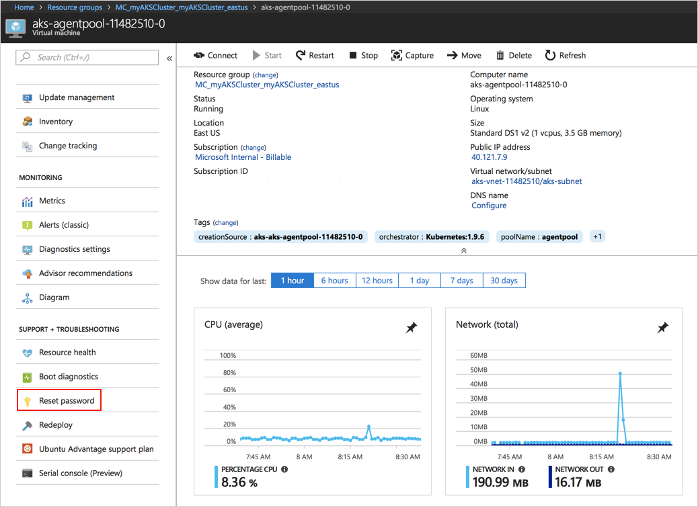
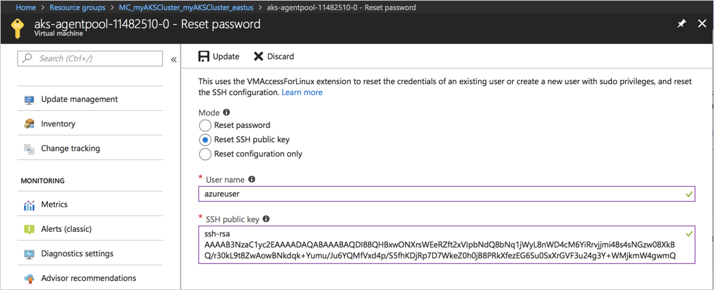

# SSH into Azure Kubernetes Service (AKS) cluster nodes

Occasionally, you may need to access an Azure Kubernetes Service (AKS) node for maintenance, log collection, or other troubleshooting operations. AKS nodes are not exposed to the internet. Use the steps detailed in this document to create an SSH connection with an AKS node.

## Reset SSH keys

If you have deployed an AKS without SSH keys, or do not have access to the proper SSH keys, these can be reset using the Azure portal.

Browse to your AKS cluster, select an AKS node (virtual machine), and select **Reset password** to reset the SSH public key.



Select **Reset SSH public key**, enter the AKS cluster username, which is **azueruser** by default, and copy in an SSH public key. Select **Update** when complete.



Once the SSH key has been reset, you can create an SSH connection using the corresponding private key.

## Get AKS node address

Get the IP address of an AKS cluster node using the `az vm list-ip-addresses` command. Replace the resource group name with the name of your AKS resource group.

```console
$ az vm list-ip-addresses --resource-group MC_myAKSCluster_myAKSCluster_eastus -o table

VirtualMachine            PrivateIPAddresses
------------------------  --------------------
aks-nodepool1-42032720-0  10.240.0.6
aks-nodepool1-42032720-1  10.240.0.5
aks-nodepool1-42032720-2  10.240.0.4
```

## Create SSH connection

Run the `debian` container image and attach a terminal session to it. The container can then be used to create an SSH session with any node in the AKS cluster.

```console
kubectl run -it --rm aks-ssh --image=debian
```

Install an SSH client in the container.

```console
apt-get update && apt-get install openssh-client -y
```

Open a second terminal and list all pods to get the newly created pod name.

```console
$ kubectl get pods

NAME                       READY     STATUS    RESTARTS   AGE
aks-ssh-554b746bcf-kbwvf   1/1       Running   0          1m
```

Copy the private SSH key to the pod, replace the pod name with the proper value.

```console
kubectl cp ~/.ssh/id_rsa aks-ssh-554b746bcf-kbwvf:/id_rsa
```

Update the `id_rsa` file so that it is user read-only.

```console
chmod 0600 id_rsa
```

Now create an SSH connection to the AKS node. The default user name for an AKS cluster is `azureuser`. If this account was changed at cluster creation time, substitute the proper admin user name.

```console
$ ssh -i id_rsa azureuser@10.240.0.6

Welcome to Ubuntu 16.04.3 LTS (GNU/Linux 4.11.0-1016-azure x86_64)

 * Documentation:  https://help.ubuntu.com
 * Management:     https://landscape.canonical.com
 * Support:        https://ubuntu.com/advantage

  Get cloud support with Ubuntu Advantage Cloud Guest:
    http://www.ubuntu.com/business/services/cloud

48 packages can be updated.
0 updates are security updates.


*** System restart required ***
Last login: Tue Feb 27 20:10:38 2018 from 167.220.99.8
To run a command as administrator (user "root"), use "sudo <command>".
See "man sudo_root" for details.

azureuser@aks-nodepool1-42032720-0:~$
```

## Remove SSH access

When done, exit the SSH session and then the interactive container session. This action deletes the pod used for SSH access from the AKS cluster.
