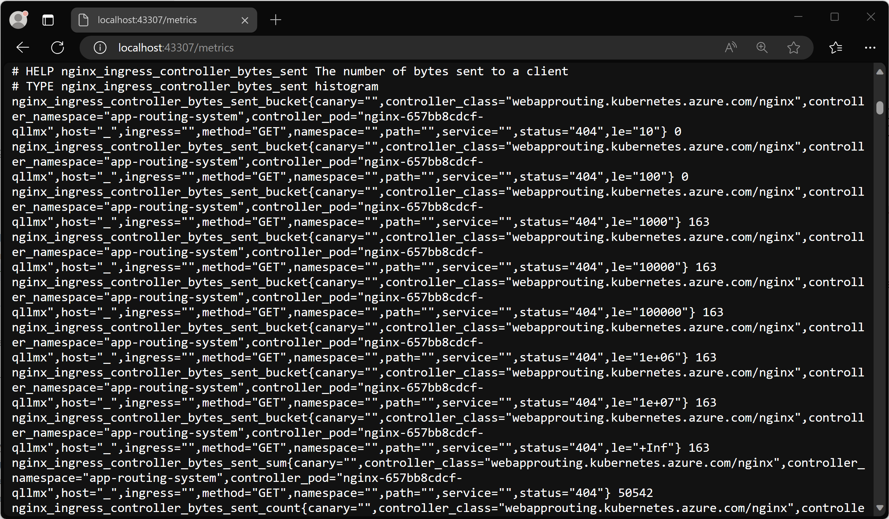
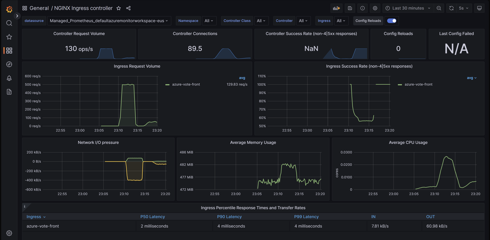
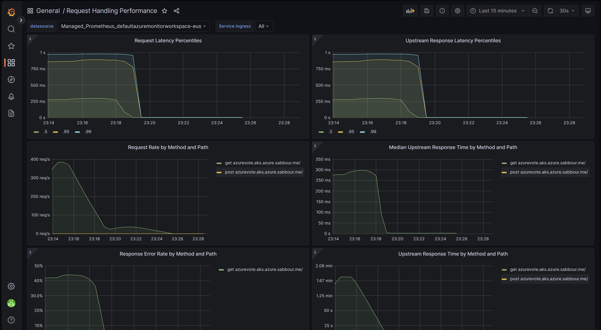
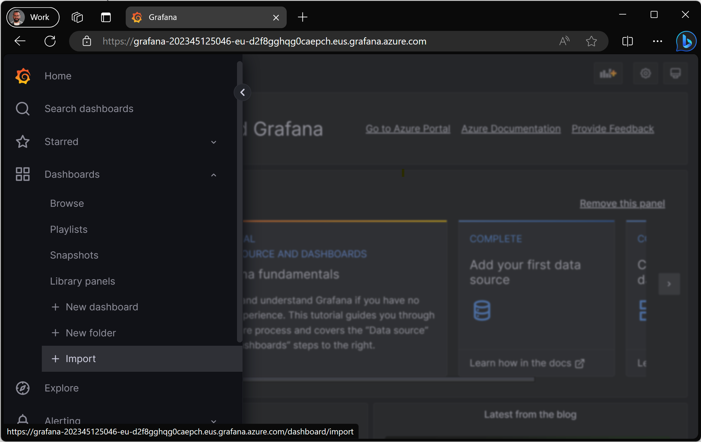
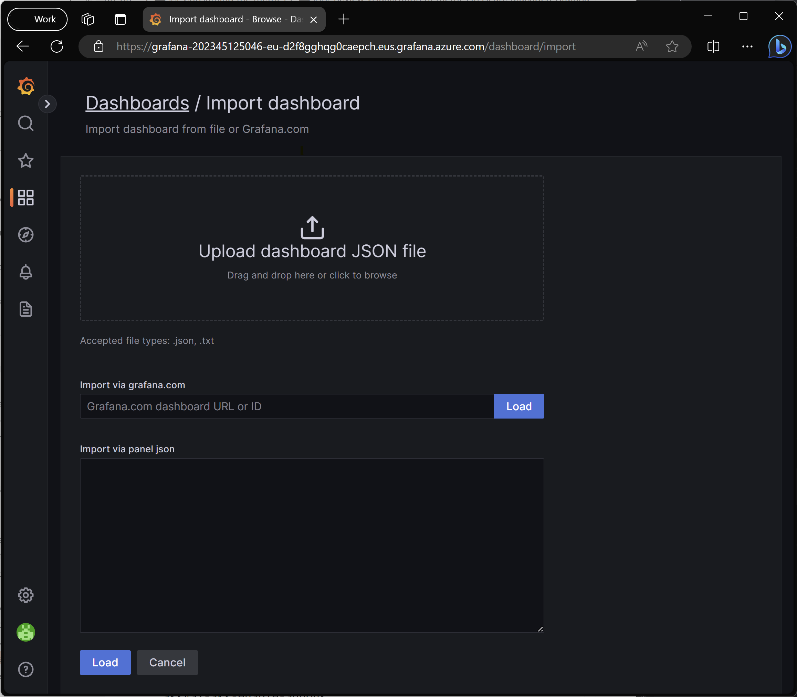

# Monitor the ingress-nginx controller metrics in the application routing add-on with Prometheus in Grafana (preview)

The ingress-nginx controller in the application routing add-on exposes many metrics for requests, the nginx process, and the controller that can be helpful in analyzing the performance and usage of your application.

The application routing add-on exposes the Prometheus metrics endpoint at `/metrics` on port 10254.

[!INCLUDE [preview features callout](./includes/preview/preview-callout.md)]

## Prerequisites

- An Azure Kubernetes Service (AKS) cluster with the [application routing add-on enabled][app-routing].
- A Prometheus instance, such as [Azure Monitor managed service for Prometheus][managed-prometheus-configure].
- A Grafana instance, such as [Azure Managed Grafana][managed-grafana].

## Validating the metrics endpoint

To validate the metrics are being collected, you can set up a port forward to one of the ingress-nginx controller pods.

```bash
kubectl get pods -n app-routing-system
```

```bash
NAME                            READY   STATUS    RESTARTS   AGE
external-dns-667d54c44b-jmsxm   1/1     Running   0          4d6h
nginx-657bb8cdcf-qllmx          1/1     Running   0          4d6h
nginx-657bb8cdcf-wgcr7          1/1     Running   0          4d6h
```

Now forward a local port to port 10254 on one of the nginx pods.

```bash
kubectl port-forward nginx-657bb8cdcf-qllmx -n app-routing-system :10254
```

```bash 
Forwarding from 127.0.0.1:43307 -> 10254
Forwarding from [::1]:43307 -> 10254
```

Note the local port (`43307` in this case) and open http://localhost:43307/metrics in your browser. You should see the ingress-nginx controller metrics loading.



You can now terminate the `port-forward` process to close the forwarding.

## Configuring Azure Monitor managed service for Prometheus and Azure Managed Grafana using Container Insights

Azure Monitor managed service for Prometheus is a fully managed Prometheus-compatible service that supports industry standard features such as PromQL, Grafana dashboards, and Prometheus alerts. This service requires configuring the metrics addon for the Azure Monitor agent, which sends data to Prometheus. If your cluster isn't configured with the add-on, you can follow this article to [configure your Azure Kubernetes Service (AKS) cluster to send data to Azure Monitor managed service for Prometheus][managed-prometheus-configure] and send the collected metrics to [an Azure Managed Grafana instance][create-grafana].

### Enable pod annotation based scraping

Once your cluster is updated with the Azure Monitor agent, you need to configure the agent to enable scraping based on Pod annotations, which are added to the ingress-nginx pods. One way to set this setting is in the [`ama-metrics-settings-configmap`](https://aka.ms/azureprometheus-addon-settings-configmap) ConfigMap in the `kube-system` namespace.

> [!CAUTION]
> This will replace your existing `ama-metrics-settings-configmap` ConfigMap in the `kube-system`. If you already have a configuration, you may want to take a backup or merge it with this configuration.
>
> You can backup an existing `ama-metrics-settings-config` ConfigMap if it exists by running `kubectl get configmap ama-metrics-settings-configmap -n kube-system -o yaml > ama-metrics-settings-configmap-backup.yaml`

The following configuration sets the `podannotationnamespaceregex` parameter to `.*` to scrape all namespaces.

```bash
kubectl apply -f - <<EOF
kind: ConfigMap
apiVersion: v1
metadata:
  name: ama-metrics-settings-configmap
  namespace: kube-system
data:
  schema-version:
    #string.used by agent to parse config. supported versions are {v1}. Configs with other schema versions will be rejected by the agent.
    v1
  config-version:
    #string.used by customer to keep track of this config file's version in their source control/repository (max allowed 10 chars, other chars will be truncated)
    ver1
  prometheus-collector-settings: |-
    cluster_alias = ""
  default-scrape-settings-enabled: |-
    kubelet = true
    coredns = false
    cadvisor = true
    kubeproxy = false
    apiserver = false
    kubestate = true
    nodeexporter = true
    windowsexporter = false
    windowskubeproxy = false
    kappiebasic = true
    prometheuscollectorhealth = false
  # Regex for which namespaces to scrape through pod annotation based scraping.
  # This is none by default. Use '.*' to scrape all namespaces of annotated pods.
  pod-annotation-based-scraping: |-
    podannotationnamespaceregex = ".*"
  default-targets-metrics-keep-list: |-
    kubelet = ""
    coredns = ""
    cadvisor = ""
    kubeproxy = ""
    apiserver = ""
    kubestate = ""
    nodeexporter = ""
    windowsexporter = ""
    windowskubeproxy = ""
    podannotations = ""
    kappiebasic = ""
    minimalingestionprofile = true
  default-targets-scrape-interval-settings: |-
    kubelet = "30s"
    coredns = "30s"
    cadvisor = "30s"
    kubeproxy = "30s"
    apiserver = "30s"
    kubestate = "30s"
    nodeexporter = "30s"
    windowsexporter = "30s"
    windowskubeproxy = "30s"
    kappiebasic = "30s"
    prometheuscollectorhealth = "30s"
    podannotations = "30s"
  debug-mode: |-
    enabled = false
EOF
```

In a few minutes, the `ama-metrics` pods in the `kube-system` namespace should restart and pick up the new configuration.

## Review visualization of metrics in Azure Managed Grafana

Now that you have Azure Monitor managed service for Prometheus and Azure Managed Grafana configured, you should [access your Managed Grafana instance][access-grafana].

There are two [official ingress-nginx dashboards](https://github.com/kubernetes/ingress-nginx/tree/main/deploy/grafana/dashboards) dashboards that you can download and import into your Grafana instance:

- Ingress-nginx controller dashboard
- Request handling performance dashboard

### Ingress-nginx controller dashboard

This dashboard gives you visibility of request volume, connections, success rates, config reloads and configs out of sync. You can also use it to view the network IO pressure, memory and CPU use of the ingress controller. Finally, it also shows the P50, P95, and P99 percentile response times of your ingresses and their throughput.

You can download this dashboard from [GitHub][grafana-nginx-dashboard].



### Request handling performance dashboard

This dashboard gives you visibility into the request handling performance of the different ingress upstream destinations, which are your applications' endpoints that the ingress controller is forwarding traffic to. It shows the P50, P95 and P99 percentile of total request and upstream response times. You can also view aggregates of request errors and latency. Use this dashboard to review and improve the performance and scalability of your applications.

You can download this dashboard from [GitHub][grafana-nginx-request-performance-dashboard].



### Importing a dashboard

To import a Grafana dashboard, expand the left menu and click on **Import** under Dashboards.



Then upload the desired dashboard file and click on **Load**.


## Next steps

- You can configure scaling your workloads using ingress metrics scraped with Prometheus using [Kubernetes Event Driven Autoscaler (KEDA)][KEDA]. Learn more about [integrating KEDA with AKS][keda-prometheus].
- Create and run a load test with [Azure Load Testing][azure-load-testing] to test workload performance and optimize the scalability of your applications.

<!-- LINKS - internal -->
[az-aks-create]: /cli/azure/aks#az-aks-create
[app-routing]: /azure/aks/app-routing
[managed-prometheus]: /azure/azure-monitor/essentials/prometheus-metrics-overview
[managed-prometheus-configure]: /azure/azure-monitor/essentials/prometheus-metrics-enable?tabs=cli
[managed-prometheus-custom-annotations]: /azure/azure-monitor/essentials/prometheus-metrics-scrape-configuration#pod-annotation-based-scraping
[managed-grafana]: /azure/managed-grafana/overview
[create-grafana]: /azure/managed-grafana/quickstart-managed-grafana-portal
[access-grafana]: /azure/managed-grafana/quickstart-managed-grafana-portal#access-your-managed-grafana-instance
[keda]: /azure/aks/keda-about
[keda-prometheus]: /azure/azure-monitor/essentials/integrate-keda#scalers
[azure-load-testing]: /azure/load-testing/quickstart-create-and-run-load-test
[az-aks-show]: /cli/azure/aks#az-aks-show
[az-aks-enable-addons]: /cli/azure/aks#az-aks-enable-addons
[az-aks-disable-addons]: /cli/azure/aks#az-aks-disable-addons
[az-aks-install-cli]: /cli/azure/aks#az-aks-install-cli
[az-aks-get-credentials]: /cli/azure/aks#az-aks-get-credentials
[az-extension-add]: /cli/azure/extension#az-extension-add
[az-extension-update]: /cli/azure/extension#az-extension-update
[install-azure-cli]: /cli/azure/install-azure-cli
[az-keyvault-create]: /cli/azure/keyvault#az_keyvault_create
[az-keyvault-certificate-import]: /cli/azure/keyvault/certificate#az_keyvault_certificate_import
[az-keyvault-certificate-show]: /cli/azure/keyvault/certificate#az_keyvault_certificate_show
[az-network-dns-zone-create]: /cli/azure/network/dns/zone#az_network_dns_zone_create
[az-network-dns-zone-show]: /cli/azure/network/dns/zone#az_network_dns_zone_show
[az-role-assignment-create]: /cli/azure/role/assignment#az_role_assignment_create
[az-aks-addon-update]: /cli/azure/aks/addon#az_aks_addon_update
[az-keyvault-set-policy]: /cli/azure/keyvault#az_keyvault_set_policy

<!-- LINKS - external -->
[osm-release]: https://github.com/openservicemesh/osm/releases/
[nginx]: https://kubernetes.github.io/ingress-nginx/
[external-dns]: https://github.com/kubernetes-incubator/external-dns
[kubectl]: https://kubernetes.io/docs/reference/kubectl/
[kubectl-apply]: https://kubernetes.io/docs/reference/generated/kubectl/kubectl-commands#apply
[grafana-nginx-dashboard]: https://raw.githubusercontent.com/kubernetes/ingress-nginx/main/deploy/grafana/dashboards/request-handling-performance.json
[grafana-nginx-request-performance-dashboard]: https://raw.githubusercontent.com/kubernetes/ingress-nginx/main/deploy/grafana/dashboards/request-handling-performance.json
