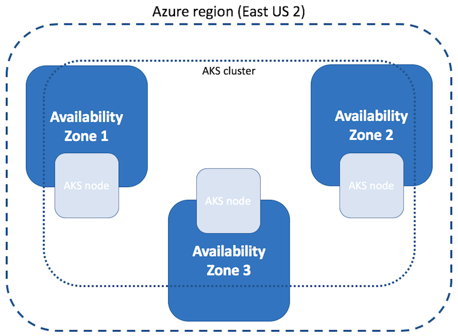

# Create an Azure Kubernetes Service (AKS) cluster that uses availability zones

An Azure Kubernetes Service (AKS) cluster distributes resources such as nodes and storage across logical sections of underlying Azure infrastructure. Using availability zones physically separates nodes from other nodes deployed to different availability zones. AKS clusters deployed with multiple availability zones configured across a cluster provide a higher level of availability to protect against a hardware failure or a planned maintenance event.

By defining node pools in a cluster to span multiple zones, nodes in a given node pool are able to continue operating even if a single zone has gone down. Your applications can continue to be available even if there's a physical failure in a single datacenter if orchestrated to tolerate failure of a subset of nodes.

This article shows you how to create an AKS cluster and distribute the node components across availability zones.

## Before you begin

You need the Azure CLI version 2.0.76 or later installed and configured. Run `az --version` to find the version. If you need to install or upgrade, see [Install Azure CLI][install-azure-cli].

## Limitations and region availability

AKS clusters can use availability zones in any Azure region that has availability zones.

The following limitations apply when you create an AKS cluster using availability zones:

* You can only define availability zones during creation of the cluster or node pool.
* It is not possible to update an existing non-availability zone cluster to use availability zones after creating the cluster.
* The chosen node size (VM SKU) selected must be available across all availability zones selected.
* Clusters with availability zones enabled require using Azure Standard Load Balancers for distribution across zones. You can only define this load balancer type at cluster create time. For more information and the limitations of the standard load balancer, see [Azure load balancer standard SKU limitations][standard-lb-limitations].

### Azure disk availability zone support

 - Volumes that use Azure managed LRS disks aren't zone-redundant resources, attaching across zones isn't supported. You need to co-locate volumes in the same zone as the specified node hosting the target pod.
 - Volumes that use Azure managed ZRS disks (supported by Azure Disk CSI driver v1.5.0 and later) are zone-redundant resources. You can schedule those volumes on all zone and non-zone agent nodes.

Kubernetes is aware of Azure availability zones since version 1.12. You can deploy a PersistentVolumeClaim object referencing an Azure Managed Disk in a multi-zone AKS cluster and [Kubernetes takes care of scheduling](https://kubernetes.io/docs/setup/best-practices/multiple-zones/#storage-access-for-zones) any pod that claims this PVC in the correct availability zone.

### Azure Resource Manager templates and availability zones

When *creating* an AKS cluster, understand the following details about specifying availability zones in a template:

* If you explicitly define a [null value in a template][arm-template-null], for example by specifying `"availabilityZones": null`, the Resource Manager template treats the property as if it doesn't exist. This means your cluster doesn't deploy in an availability zone.
* If you don't include the `"availabilityZones":` property in your Resource Manager template, your cluster doesn't deploy in an availability zone.
* You can't update settings for availability zones on an existing cluster, the behavior is different when you update an AKS cluster with Resource Manager templates. If you explicitly set a null value in your template for availability zones and *update* your cluster, it doesn't update your cluster for availability zones. However, if you omit the availability zones property with syntax such as `"availabilityZones": []`, the deployment attempts to disable availability zones on your existing AKS cluster and **fails**.

## Overview of availability zones for AKS clusters

Availability zones are a high-availability offering that protects your applications and data from datacenter failures. Zones are unique physical locations within an Azure region. Each zone includes one or more datacenters equipped with independent power, cooling, and networking. To ensure resiliency, there's always more than one zone in all zone enabled regions. The physical separation of availability zones within a region protects applications and data from datacenter failures.

For more information, see [What are availability zones in Azure?][az-overview].

AKS clusters deployed using availability zones can distribute nodes across multiple zones within a single region. For example, a cluster in the *East US 2* region can create nodes in all three availability zones in *East US 2*. This distribution of AKS cluster resources improves cluster availability as they're resilient to failure of a specific zone.



If a single zone becomes unavailable, your applications continue to run on clusters configured to spread across multiple zones.

## Create an AKS cluster across availability zones

When you create a cluster using the [az aks create][az-aks-create] command, the `--zones` parameter specifies the availability zones to deploy agent nodes into. The availability zones that the managed control plane components are deployed into are **not** controlled by this parameter. They are automatically spread across all availability zones (if present) in the region during cluster deployment.

The following example creates an AKS cluster named *myAKSCluster* in the resource group named *myResourceGroup* with a total of three nodes. One agent node in zone *1*, one in *2*, and then one in *3*.

```azurecli-interactive
az group create --name myResourceGroup --location eastus2

az aks create \
    --resource-group myResourceGroup \
    --name myAKSCluster \
    --generate-ssh-keys \
    --vm-set-type VirtualMachineScaleSets \
    --load-balancer-sku standard \
    --node-count 3 \
    --zones 1 2 3
```

It takes a few minutes to create the AKS cluster.

When deciding what zone a new node should belong to, a specified AKS node pool uses a [best effort zone balancing offered by underlying Azure Virtual Machine Scale Sets][vmss-zone-balancing]. The AKS node pool is "balanced" when each zone has the same number of VMs or +\- one VM in all other zones for the scale set.

## Verify node distribution across zones

When the cluster is ready, list what availability zone the agent nodes in the scale set are in.

First, get the AKS cluster credentials using the [az aks get-credentials][az-aks-get-credentials] command:

```azurecli-interactive
az aks get-credentials --resource-group myResourceGroup --name myAKSCluster
```

Next, use the [kubectl describe][kubectl-describe] command to list the nodes in the cluster and filter on the `topology.kubernetes.io/zone` value. The following example is for a Bash shell.

```bash
kubectl describe nodes | grep -e "Name:" -e "topology.kubernetes.io/zone"
```

The following example output shows the three nodes distributed across the specified region and availability zones, such as *eastus2-1* for the first availability zone and *eastus2-2* for the second availability zone:

```output
Name:       aks-nodepool1-28993262-vmss000000
            topology.kubernetes.io/zone=eastus2-1
Name:       aks-nodepool1-28993262-vmss000001
            topology.kubernetes.io/zone=eastus2-2
Name:       aks-nodepool1-28993262-vmss000002
            topology.kubernetes.io/zone=eastus2-3
```

As you add more nodes to an agent pool, the Azure platform automatically distributes the underlying VMs across the specified availability zones.

With Kubernetes versions 1.17.0 and later, AKS uses the newer label `topology.kubernetes.io/zone` and the deprecated `failure-domain.beta.kubernetes.io/zone`. You can get the same result from running the `kubelet describe nodes` command in the previous step, by running the following script:

```bash
kubectl get nodes -o custom-columns=NAME:'{.metadata.name}',REGION:'{.metadata.labels.topology\.kubernetes\.io/region}',ZONE:'{metadata.labels.topology\.kubernetes\.io/zone}'
```

The following example resembles the output with more verbose details:

```output
NAME                                REGION   ZONE
aks-nodepool1-34917322-vmss000000   eastus   eastus-1
aks-nodepool1-34917322-vmss000001   eastus   eastus-2
aks-nodepool1-34917322-vmss000002   eastus   eastus-3
```

## Verify pod distribution across zones

As documented in [Well-Known Labels, Annotations and Taints][kubectl-well_known_labels], Kubernetes uses the `topology.kubernetes.io/zone` label to automatically distribute pods in a replication controller or service across the different zones available. To test the label and scale your cluster from 3 to 5 nodes, run the following command to verify the pod correctly spreads:

```azurecli-interactive
az aks scale \
    --resource-group myResourceGroup \
    --name myAKSCluster \
    --node-count 5
```

When the scale operation completes after a few minutes, run the command `kubectl describe nodes | grep -e "Name:" -e "topology.kubernetes.io/zone"` in a Bash shell. The following output resembles the results:

```output
Name:       aks-nodepool1-28993262-vmss000000
            topology.kubernetes.io/zone=eastus2-1
Name:       aks-nodepool1-28993262-vmss000001
            topology.kubernetes.io/zone=eastus2-2
Name:       aks-nodepool1-28993262-vmss000002
            topology.kubernetes.io/zone=eastus2-3
Name:       aks-nodepool1-28993262-vmss000003
            topology.kubernetes.io/zone=eastus2-1
Name:       aks-nodepool1-28993262-vmss000004
            topology.kubernetes.io/zone=eastus2-2
```

You now have two more nodes in zones 1 and 2. You can deploy an application consisting of three replicas. The following example uses NGINX:

```bash
kubectl create deployment nginx --image=mcr.microsoft.com/oss/nginx/nginx:1.15.5-alpine
kubectl scale deployment nginx --replicas=3
```

By viewing nodes where your pods are running, you see pods are running on the nodes corresponding to three different availability zones. For example, with the command `kubectl describe pod | grep -e "^Name:" -e "^Node:"` in a Bash shell, you see the following example output:

```output
Name:         nginx-6db489d4b7-ktdwg
Node:         aks-nodepool1-28993262-vmss000000/10.240.0.4
Name:         nginx-6db489d4b7-v7zvj
Node:         aks-nodepool1-28993262-vmss000002/10.240.0.6
Name:         nginx-6db489d4b7-xz6wj
Node:         aks-nodepool1-28993262-vmss000004/10.240.0.8
```

As you can see from the previous output, the first pod is running on node 0 located in the availability zone `eastus2-1`. The second pod is running on node 2, corresponding to `eastus2-3`, and the third one in node 4, in `eastus2-2`. Without any extra configuration, Kubernetes spreads the pods correctly across all three availability zones.

## Next steps

This article described how to create an AKS cluster using availability zones. For more considerations on highly available clusters, see [Best practices for business continuity and disaster recovery in AKS][best-practices-bc-dr].

<!-- LINKS - internal -->
[install-azure-cli]: /cli/azure/install-azure-cli
[az-feature-register]: /cli/azure/feature#az-feature-register
[az-feature-list]: /cli/azure/feature#az-feature-list
[az-provider-register]: /cli/azure/provider#az-provider-register
[az-aks-create]: /cli/azure/aks#az-aks-create
[az-overview]: ../reliability/availability-zones-overview.md
[best-practices-bc-dr]: operator-best-practices-multi-region.md
[aks-support-policies]: support-policies.md
[aks-faq]: faq.md
[standard-lb-limitations]: load-balancer-standard.md#limitations
[az-extension-add]: /cli/azure/extension#az-extension-add
[az-extension-update]: /cli/azure/extension#az-extension-update
[az-aks-nodepool-add]: /cli/azure/aks/nodepool#az-aks-nodepool-add
[az-aks-get-credentials]: /cli/azure/aks#az-aks-get-credentials
[vmss-zone-balancing]: ../virtual-machine-scale-sets/virtual-machine-scale-sets-use-availability-zones.md#zone-balancing
[arm-template-null]: ../azure-resource-manager/templates/template-expressions.md#null-values

<!-- LINKS - external -->
[kubectl-describe]: https://kubernetes.io/docs/reference/generated/kubectl/kubectl-commands#describe
[kubectl-well_known_labels]: https://kubernetes.io/docs/reference/labels-annotations-taints/
