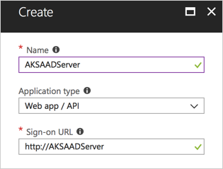
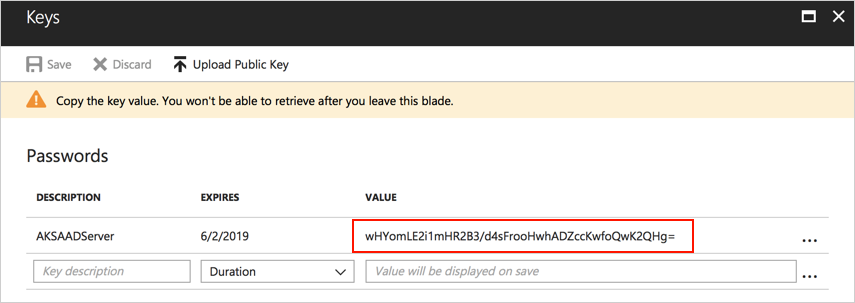
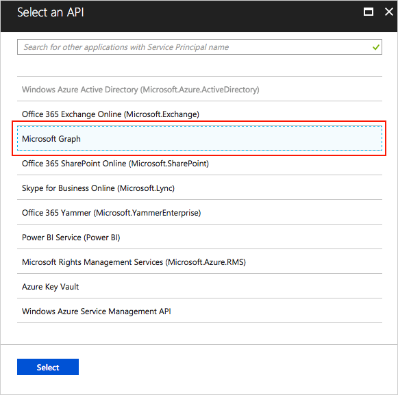
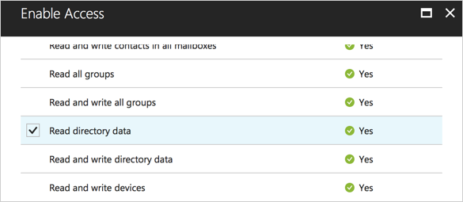
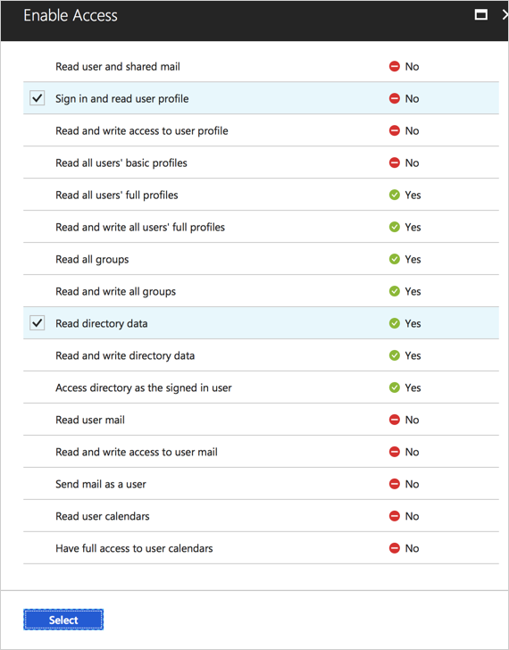
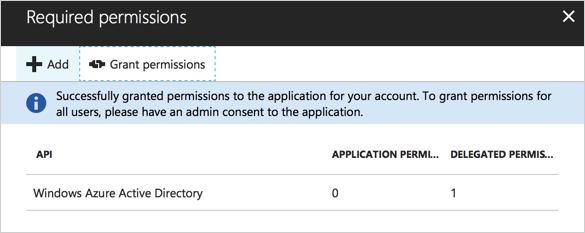
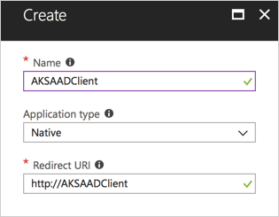
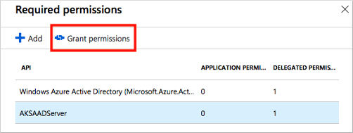

# Integrate Azure Active Directory with Azure Kubernetes Service

Azure Kubernetes Service (AKS) can be configured to use Azure Active Directory (AD) for user authentication. In this configuration, you can sign in to an AKS cluster using your Azure Active Directory authentication token. Additionally, cluster administrators are able to configure Kubernetes role-based access control (RBAC) based on a user's identity or directory group membership.

This article shows you how to deploy the prerequisites for AKS and Azure AD, then how to deploy an Azure AD-enabled cluster and create a basic RBAC role in the AKS cluster.

The following limitations apply:

- Azure AD can only be enabled when you create a new, RBAC-enabled cluster. You can't enable Azure AD on an existing AKS cluster.
- *Guest* users in Azure AD, such as if you are using a federated login from a different directory, are not supported.

## Authentication details

Azure AD authentication is provided to AKS clusters with OpenID Connect. OpenID Connect is an identity layer built on top of the OAuth 2.0 protocol. For more information on OpenID Connect, see the [Open ID connect documentation][open-id-connect].

From inside of the Kubernetes cluster, Webhook Token Authentication is used to verify authentication tokens. Webhook token authentication is configured and managed as part of the AKS cluster. For more information on Webhook token authentication, see the [webhook authentication documentation][kubernetes-webhook].

> [!NOTE]
> When configuring Azure AD for AKS authentication, two Azure AD application are configured. This operation must be completed by an Azure tenant administrator.

## Create server application

The first Azure AD application is used to get a users Azure AD group membership.

1. Select **Azure Active Directory** > **App registrations** > **New application registration**.

   Give the application a name, select **Web app / API** for the application type, and enter any URI formatted value for **Sign-on URL**. Select **Create** when done.

   

2. Select **Manifest** and edit the `groupMembershipClaims` value to `"All"`.

   Save the updates once complete.

   

3. Back on the Azure AD application, select **Settings** > **Keys**.

   Add a key description, select an expiration deadline, and select **Save**. Take note of the key value. When deploying an Azure AD enabled AKS cluster, this value is referred to as the `Server application secret`.

   

4. Return to the Azure AD application, select **Settings** > **Required permissions** > **Add** > **Select an API** > **Microsoft Graph** > **Select**.

   

5. Under **APPLICATION PERMISSIONS** place a check next to **Read directory data**.

   

6. Under **DELEGATED PERMISSIONS**, place a check next to **Sign in and read user profile** and **Read directory data**. Save the updates once done.

   

   Select **Done**.

7. Choose *Microsoft Graph* from the list of APIs, then select **Grant Permissions**. This step will fail if the current account is not a tenant admin.

   

   When the permissions have been successfully granted, the following notification is displayed in the portal:

   

8. Return to the application and take note of the **Application ID**. When deploying an Azure AD-enabled AKS cluster, this value is referred to as the `Server application ID`.

   

## Create client application

The second Azure AD application is used when logging in with the Kubernetes CLI (kubectl.)

1. Select **Azure Active Directory** > **App registrations** > **New application registration**.

   Give the application a name, select **Native** for the application type, and enter any URI formatted value for **Redirect URI**. Select **Create** when done.

   

2. From the Azure AD application, select **Settings** > **Required permissions** > **Add** > **Select an API** and search for the name of the server application created in the last step of this document.

   

3. Place a check mark next to the application and click **Select**.

   

   Select **Done**

4. Select your server API from the list and then choose **Grant Permissions**:

   

5. Back on the AD application, take note of the **Application ID**. When deploying an Azure AD-enabled AKS cluster, this value is referred to as the `Client application ID`.

   

## Get tenant ID

Finally, get the ID of your Azure tenant. This value is also used when deploying the AKS cluster.

From the Azure portal, select **Azure Active Directory** > **Properties** and take note of the **Directory ID**. When deploying an Azure AD-enabled AKS cluster, this value is referred to as the `Tenant ID`.


## Deploy Cluster

Use the [az group create][az-group-create] command to create a resource group for the AKS cluster.

```azurecli
az group create --name myResourceGroup --location eastus
```

Deploy the cluster using the [az aks create][az-aks-create] command. Replace the values in the sample command below with the values collected when creating the Azure AD applications.

```azurecli
az aks create \
  --resource-group myResourceGroup \
  --name myAKSCluster \
  --generate-ssh-keys \
  --aad-server-app-id b1536b67-29ab-4b63-b60f-9444d0c15df1 \
  --aad-server-app-secret wHYomLe2i1mHR2B3/d4sFrooHwADZccKwfoQwK2QHg= \
  --aad-client-app-id 8aaf8bd5-1bdd-4822-99ad-02bfaa63eea7 \
  --aad-tenant-id 72f988bf-0000-0000-0000-2d7cd011db47
```

## Create RBAC binding

Before an Azure Active Directory account can be used with the AKS cluster, a role binding or cluster role binding needs to be created. *Roles* define the permissions to grant, and *bindings* apply them to desired users. These assignments can be applied to a given namespace, or across the entire cluster. For more information, see [Using RBAC authorization][rbac-authorization].

First, use the [az aks get-credentials][az-aks-get-credentials] command with the `--admin` argument to sign in to the cluster with admin access.

```azurecli
az aks get-credentials --resource-group myResourceGroup --name myAKSCluster --admin
```

Next, create a ClusterRoleBinding for an Azure AD account that you want to grant access to the AKS cluster. The following example gives the account full access to all namespaces in the cluster.

- If the user you grant the RBAC binding for is in the same Azure AD tenant, assign permissions based on the user principal name (UPN). Move on to the step to create the YAML manifest for the ClusterRuleBinding.

- If the user is in a different Azure AD tenant, query for and use the *objectId* property instead. If needed, get the *objectId* of the required user account using the [az ad user show][az-ad-user-show] command. Provide the user principal name (UPN) of the required account:

    ```azurecli-interactive
    az ad user show --upn-or-object-id user@contoso.com --query objectId -o tsv
    ```

Create a file, such as *rbac-aad-user.yaml*, and paste the following contents. On the last line, replace *userPrincipalName_or_objectId*  with the UPN or object ID depending on if the user is the same Azure AD tenant or not.

```yaml
apiVersion: rbac.authorization.k8s.io/v1
kind: ClusterRoleBinding
metadata:
  name: contoso-cluster-admins
roleRef:
  apiGroup: rbac.authorization.k8s.io
  kind: ClusterRole
  name: cluster-admin
subjects:
- apiGroup: rbac.authorization.k8s.io
  kind: User
  name: userPrincipalName_or_objectId
```

Apply the binding using the [kubectl apply][kubectl-apply] command as shown in the following example:

```console
kubectl apply -f rbac-aad-user.yaml
```

A role binding can also be created for all members of an Azure AD group. Azure AD groups are specified using the group object ID, as shown in the following example. Create a file, such as *rbac-aad-group.yaml*, and paste the following contents. Update the group object ID with one from your Azure AD tenant:

 ```yaml
apiVersion: rbac.authorization.k8s.io/v1
kind: ClusterRoleBinding
metadata:
  name: contoso-cluster-admins
roleRef:
  apiGroup: rbac.authorization.k8s.io
  kind: ClusterRole
  name: cluster-admin
subjects:
- apiGroup: rbac.authorization.k8s.io
   kind: Group
   name: "894656e1-39f8-4bfe-b16a-510f61af6f41"
```

Apply the binding using the [kubectl apply][kubectl-apply] command as shown in the following example:

```console
kubectl apply -f rbac-aad-group.yaml
```

For more information on securing a Kubernetes cluster with RBAC, see [Using RBAC Authorization][rbac-authorization].

## Access cluster with Azure AD

Next, pull the context for the non-admin user using the [az aks get-credentials][az-aks-get-credentials] command.

```azurecli
az aks get-credentials --resource-group myResourceGroup --name myAKSCluster
```

After running any kubectl command, you will be prompted to authenticate with Azure. Follow the on-screen instructions.

```console
$ kubectl get nodes

To sign in, use a web browser to open the page https://microsoft.com/devicelogin and enter the code BUJHWDGNL to authenticate.

NAME                       STATUS    ROLES     AGE       VERSION
aks-nodepool1-79590246-0   Ready     agent     1h        v1.9.9
aks-nodepool1-79590246-1   Ready     agent     1h        v1.9.9
aks-nodepool1-79590246-2   Ready     agent     1h        v1.9.9
```

Once complete, the authentication token is cached. You are only reprompted to sign in when the token has expired or the Kubernetes config file re-created.

If you are seeing an authorization error message after signing in successfully, check whether:
1. The user you are signing in as is not a Guest in the Azure AD instance (this is often the case if you are using a federated login from a different directory).
2. The user is not a member of more than 200 groups.

```console
error: You must be logged in to the server (Unauthorized)
```

## Next steps

To use Azure AD users and groups to control access to cluster resources, see [Control access to cluster resources using role-based access control and Azure AD identities in AKS][azure-ad-rbac].

For more information about how to secure Kubernetes clusters, see [Access and identity options for AKS)][rbac-authorization].

For best practices on identity and resource control, see [Best practices for authentication and authorization in AKS][operator-best-practices-identity].

<!-- LINKS - external -->
[kubernetes-webhook]:https://kubernetes.io/docs/reference/access-authn-authz/authentication/#webhook-token-authentication
[kubectl-apply]: https://kubernetes.io/docs/reference/generated/kubectl/kubectl-commands#apply

<!-- LINKS - internal -->
[az-aks-create]: /cli/azure/aks?view=azure-cli-latest#az-aks-create
[az-aks-get-credentials]: /cli/azure/aks?view=azure-cli-latest#az-aks-get-credentials
[az-group-create]: /cli/azure/group#az-group-create
[open-id-connect]:../active-directory/develop/v1-protocols-openid-connect-code.md
[az-ad-user-show]: /cli/azure/ad/user#az-ad-user-show
[rbac-authorization]: concepts-identity.md#role-based-access-controls-rbac
[operator-best-practices-identity]: operator-best-practices-identity.md
[azure-ad-rbac]: azure-ad-rbac.md
