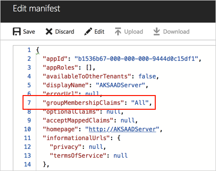
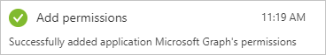
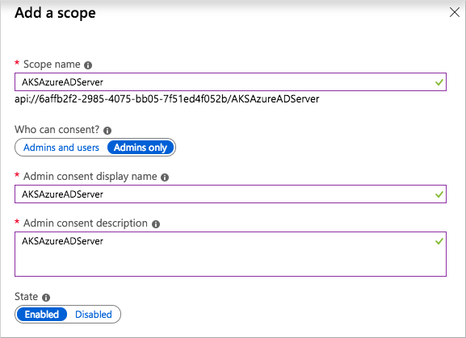
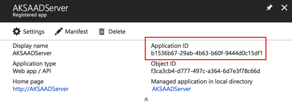
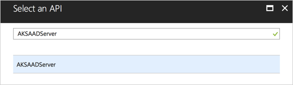
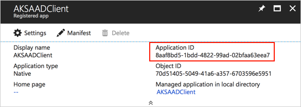
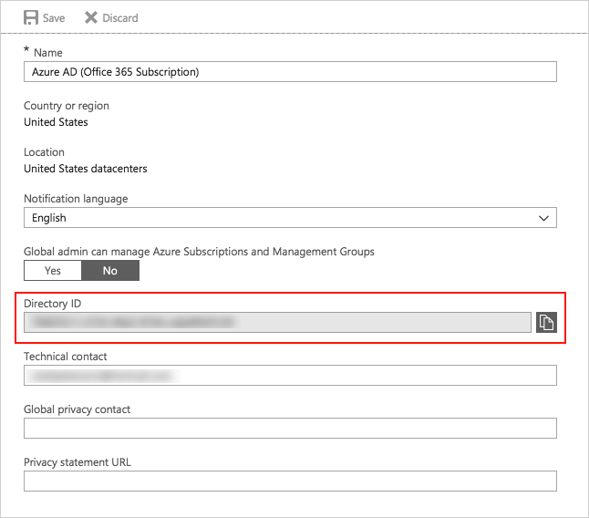

# Integrate Azure Active Directory with Azure Kubernetes Service

Azure Kubernetes Service (AKS) can be configured to use Azure Active Directory (Azure AD) for user authentication. In this configuration, you can sign in to an AKS cluster by using your Azure AD authentication token.

Cluster administrators can configure Kubernetes role-based access control (RBAC) based on a user's identity or directory group membership.

This article explains how to:

- Deploy the prerequisites for AKS and Azure AD.
- Deploy an Azure AD-enabled cluster.
- Create a basic RBAC role in the AKS cluster by using the Azure portal.

You can also complete these steps by using the [Azure CLI][azure-ad-cli].

> [!NOTE]
> Azure AD can only be enabled when you create a new RBAC-enabled cluster. You can't enable Azure AD on an existing AKS cluster.

## Authentication details

Azure AD authentication is provided to AKS clusters that have OpenID Connect. OpenID Connect is an identity layer built on top of the OAuth 2.0 protocol.

For more information about OpenID Connect, see [Authorize access to web applications using OpenID Connect and Azure AD][open-id-connect].

Inside a Kubernetes cluster, webhook token authentication is used to authentication tokens. Webhook token authentication is configured and managed as part of the AKS cluster.

For more information about webhook token authentication, see the [Webhook Token Authentication][kubernetes-webhook] section in Kubernetes Documentation.

To provide Azure AD authentication for an AKS cluster, two Azure AD applications are created. The first application is a server component that provides user authentication. The second application is a client component that's used when you're prompted by the CLI for authentication. This client application uses the server application for the actual authentication of the credentials provided by the client.

> [!NOTE]
> When you configure Azure AD for AKS authentication, two Azure AD applications are configured. The steps to delegate permissions for each application must be completed by an Azure tenant administrator.

## Create the server application

The first Azure AD application is applied to get a user's Azure AD group membership. To create this application in the Azure portal:

1. Select **Azure Active Directory** > **App registrations** > **New registration**.

    a. Give the application a name, such as *AKSAzureADServer*.

    b. For **Supported account types**, select **Accounts in this organizational directory only**.
    
    c. Choose **Web** for the Redirect URI type, and then enter any URI-formatted value, such as *https://aksazureadserver*.

    d. Select **Register** when you're finished.

2. Select **Manifest**, and then edit the **groupMembershipClaims:** value as **All**. When you're finished with the updates, select **Save**.

    

3. In the left pane of the Azure AD application, select **Certificates & secrets**.

    a. Select **+ New client secret**.

    b. Add a key description, such as *AKS Azure AD server*. Choose an expiration time, and then select **Add**.

    c. Note the key value, which is displayed only at this time. When you deploy an    Azure AD-enabled AKS cluster, this value is called the server application secret.

4. In the left pane of the Azure AD application, select **API permissions**, and then select **+ Add a permission**.

    a. Under **Microsoft APIs**, select **Microsoft Graph**.

    b. Select **Delegated permissions**, and then select the check box next to **Directory > Directory.Read.All (Read directory data)**.

    c. If a default delegated permission for **User > User.Read (Sign in and read user profile)** doesn't exist, select the check box next to it.

    d. Select **Application permissions**, and then select the check box next to **Directory > Directory.Read.All (Read directory data)**.

    

    e. Select **Add permissions** to save the updates.

    f. Under **Grant consent**, select **Grant admin consent**. This button isn't unavailable if the current account isn't a tenant admin.

    When permissions are successfully granted, the following notification is displayed in the portal:

   

5. In the left pane of the Azure AD application, select **Expose an API**, and then select **+ Add a scope**.
    
    a. Enter a **Scope name**, an **Admin consent display name**, and then an **Admin consent description** such as *AKSAzureADServer*.

    b. Make sure **State** is set to **Enabled**.

    

    c. Select **Add scope**.

6. Return to the application **Overview** page and note the **Application (client) ID**. When you deploy an Azure AD-enabled AKS cluster, this value is called the server application ID.

    

## Create the client application

The second Azure AD application is used when you sign in with the Kubernetes CLI (kubectl).

1. Select **Azure Active Directory** > **App registrations** > **New registration**.

    a. Give the application a name, such as *AKSAzureADClient*.

    b. For **Supported account types**, select **Accounts in this organizational directory only**.

    c. Select **Web** for the Redirect URI type, and then enter any URI-formatted value such as *https://aksazureadclient*.

    d. Select **Register** when you're finished.

2. In the left pane of the Azure AD application, select **API permissions**, and then select **+ Add a permission**.

    a. Select **My APIs**, and then choose your Azure AD server application created in the previous step, such as *AKSAzureADServer*.

    b. Select **Delegated permissions**, and then select the check box next to your Azure AD server app.

    

    c. Select **Add permissions**.

    d. Under **Grant consent**, select **Grant admin consent**. This button isn't available if the current account isn't a tenant admin. When permissions are granted, the following notification is displayed in the portal:

    

3. In the left pane of the Azure AD application, select **Authentication**.

    - Under **Default client type**, select **Yes** to **Treat the client as a public client**.

5. In the left pane of the Azure AD application, note the application ID. When you deploy an Azure AD-enabled AKS cluster, this value is called the client application ID.

   

## Get the tenant ID

Next, get the ID of your Azure tenant. This value is used when you create the AKS cluster.

From the Azure portal, select **Azure Active Directory** > **Properties** and note the **Directory ID**. When you create an Azure AD-enabled AKS cluster, this value is called the tenant ID.



## Deploy the AKS cluster

Use the [az group create][az-group-create] command to create a resource group for the AKS cluster.

```azurecli
az group create --name myResourceGroup --location eastus
```

Use the [az aks create][az-aks-create] command to deploy the AKS cluster. Next, replace the values in the following sample command. Use the values collected when you created the Azure AD applications for the server app ID, app secret, client app ID, and tenant ID.

```azurecli
az aks create \
  --resource-group myResourceGroup \
  --name myAKSCluster \
  --generate-ssh-keys \
  --aad-server-app-id b1536b67-29ab-4b63-b60f-9444d0c15df1 \
  --aad-server-app-secret wHYomLe2i1mHR2B3/d4sFrooHwADZccKwfoQwK2QHg= \
  --aad-client-app-id 8aaf8bd5-1bdd-4822-99ad-02bfaa63eea7 \
  --aad-tenant-id 72f988bf-0000-0000-0000-2d7cd011db47
```

An AKS cluster takes a few minutes to create.

## Create an RBAC binding

Before you use an Azure Active Directory account with an AKS cluster, you must create role-binding or cluster role-binding. Roles define the permissions to grant, and bindings apply them to desired users. These assignments can be applied to a given namespace, or across the entire cluster. For more information, see [Using RBAC authorization][rbac-authorization].

First, use the [az aks get-credentials][az-aks-get-credentials] command with the `--admin` argument to sign in to the cluster with admin access.

```azurecli
az aks get-credentials --resource-group myResourceGroup --name myAKSCluster --admin
```

Next, create ClusterRoleBinding for an Azure AD account that you want to grant access to the AKS cluster. The following example gives the account full access to all namespaces in the cluster:

- If the user you grant the RBAC binding for is in the same Azure AD tenant, assign permissions based on the user principal name (UPN). Move on to the step to create the YAML manifest for ClusterRoleBinding.

- If the user is in a different Azure AD tenant, query for and use the **objectId** property instead. If needed, get the objectId of the required user account by using the [az ad user show][az-ad-user-show] command. Provide the user principal name (UPN) of the required account:

    ```azurecli-interactive
    az ad user show --upn-or-object-id user@contoso.com --query objectId -o tsv
    ```

Create a file, such as *rbac-aad-user.yaml*, and then paste the following contents. On the last line, replace **userPrincipalName_or_objectId** with the UPN or object ID. The choice depends on whether the user is the same Azure AD tenant or not.

```yaml
apiVersion: rbac.authorization.k8s.io/v1
kind: ClusterRoleBinding
metadata:
  name: contoso-cluster-admins
roleRef:
  apiGroup: rbac.authorization.k8s.io
  kind: ClusterRole
  name: cluster-admin
subjects:
- apiGroup: rbac.authorization.k8s.io
  kind: User
  name: userPrincipalName_or_objectId
```

Apply the binding by using the [kubectl apply][kubectl-apply] command as shown in the following example:

```console
kubectl apply -f rbac-aad-user.yaml
```

A role binding can also be created for all members of an Azure AD group. Azure AD groups are specified by using the group object ID, as shown in the following example.

Create a file, such as *rbac-aad-group.yaml*, and then paste the following contents. Update the group object ID with one from your Azure AD tenant:

 ```yaml
apiVersion: rbac.authorization.k8s.io/v1
kind: ClusterRoleBinding
metadata:
  name: contoso-cluster-admins
roleRef:
  apiGroup: rbac.authorization.k8s.io
  kind: ClusterRole
  name: cluster-admin
subjects:
- apiGroup: rbac.authorization.k8s.io
   kind: Group
   name: "894656e1-39f8-4bfe-b16a-510f61af6f41"
```

Apply the binding by using the [kubectl apply][kubectl-apply] command as shown in the following example:

```console
kubectl apply -f rbac-aad-group.yaml
```

For more information on securing a Kubernetes cluster with RBAC, see [Using RBAC Authorization][rbac-authorization].

## Access the cluster with Azure AD

Pull the context for the non-admin user by using the [az aks get-credentials][az-aks-get-credentials] command.

```azurecli
az aks get-credentials --resource-group myResourceGroup --name myAKSCluster
```

After you run the `kubectl` command, you'll be prompted to authenticate by using Azure. Follow the on-screen instructions to finish the process, as shown in the following example:

```console
$ kubectl get nodes

To sign in, use a web browser to open https://microsoft.com/devicelogin. Next, enter the code BUJHWDGNL to authenticate.

NAME                       STATUS    ROLES     AGE       VERSION
aks-nodepool1-79590246-0   Ready     agent     1h        v1.13.5
aks-nodepool1-79590246-1   Ready     agent     1h        v1.13.5
aks-nodepool1-79590246-2   Ready     agent     1h        v1.13.5
```

When the process is finished, the authentication token is cached. You're only prompted to sign in again when the token expires, or the Kubernetes config file is re-created.

If you see an authorization error message after you successfully sign in, check the following criteria:

```console
error: You must be logged in to the server (Unauthorized)
```


- You defined the appropriate object ID or UPN, depending on if the user account is in the same Azure AD tenant or not.
- The user isn't a member of more than 200 groups.
- The secret defined in the application registration for server matches the value configured by using `--aad-server-app-secret`.

## Next steps

To use Azure AD users and groups to control access to cluster resources, see [Control access to cluster resources using role-based access control and Azure AD identities in AKS][azure-ad-rbac].

For more information about how to secure Kubernetes clusters, see [Access and identity options for AKS][rbac-authorization].

To learn more about identity and resource control, see [Best practices for authentication and authorization in AKS][operator-best-practices-identity].

<!-- LINKS - external -->
[kubernetes-webhook]:https://kubernetes.io/docs/reference/access-authn-authz/authentication/#webhook-token-authentication
[kubectl-apply]: https://kubernetes.io/docs/reference/generated/kubectl/kubectl-commands#apply

<!-- LINKS - internal -->
[az-aks-create]: /cli/azure/aks?view=azure-cli-latest#az-aks-create
[az-aks-get-credentials]: /cli/azure/aks?view=azure-cli-latest#az-aks-get-credentials
[az-group-create]: /cli/azure/group#az-group-create
[open-id-connect]:../active-directory/develop/v1-protocols-openid-connect-code.md
[az-ad-user-show]: /cli/azure/ad/user#az-ad-user-show
[rbac-authorization]: concepts-identity.md#role-based-access-controls-rbac
[operator-best-practices-identity]: operator-best-practices-identity.md
[azure-ad-rbac]: azure-ad-rbac.md
[azure-ad-cli]: azure-ad-integration-cli.md
