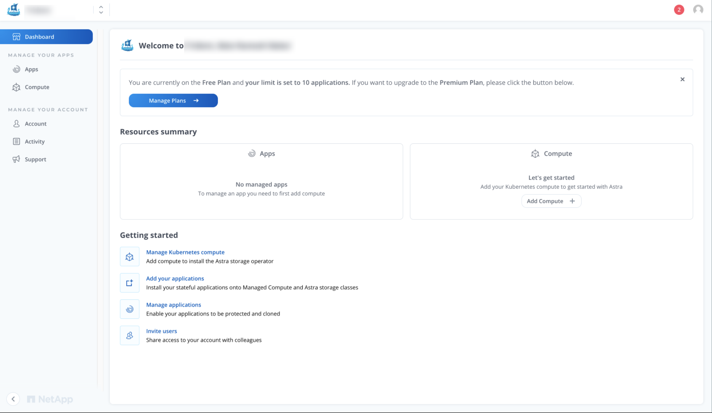
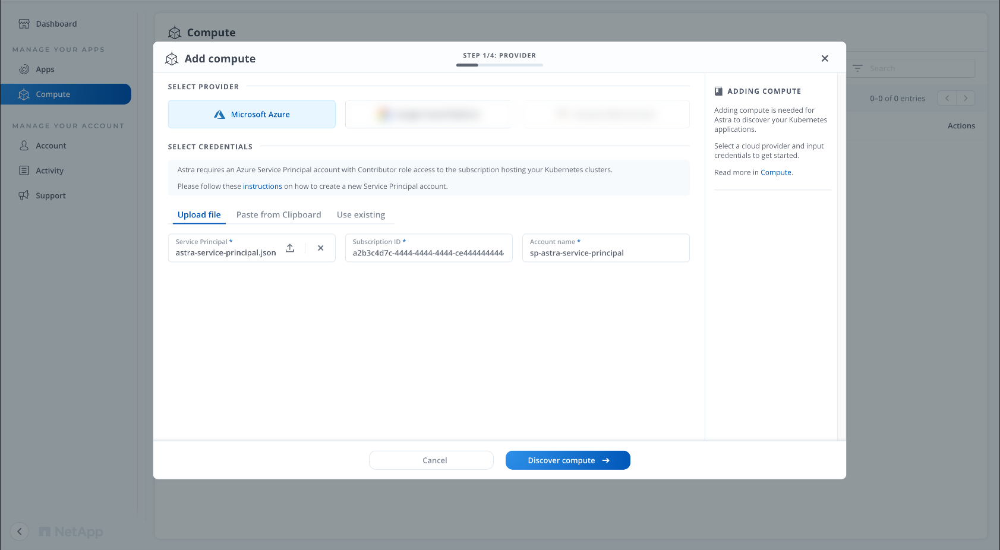
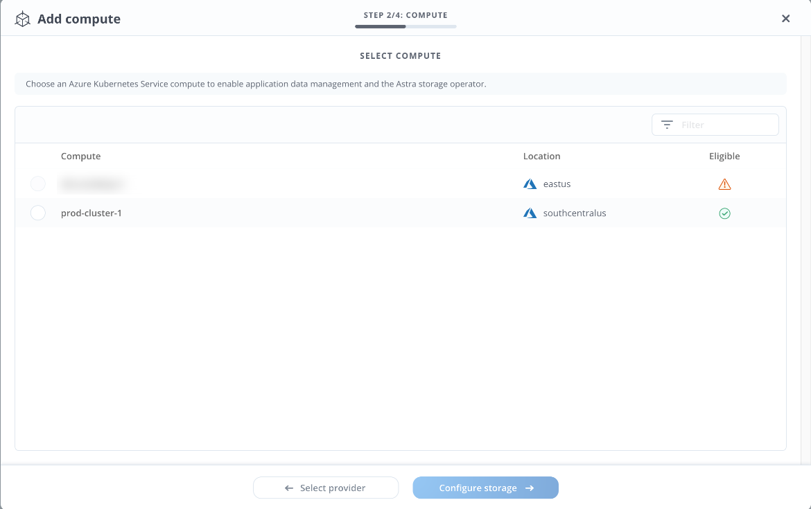
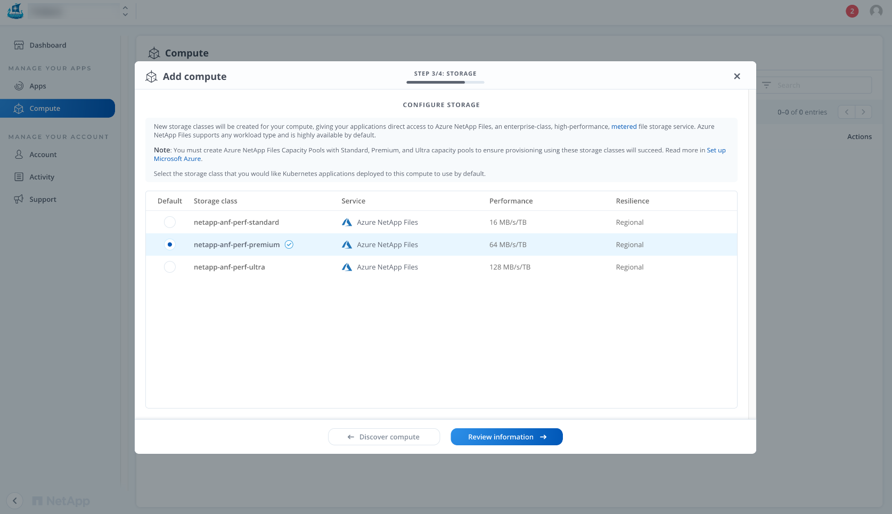
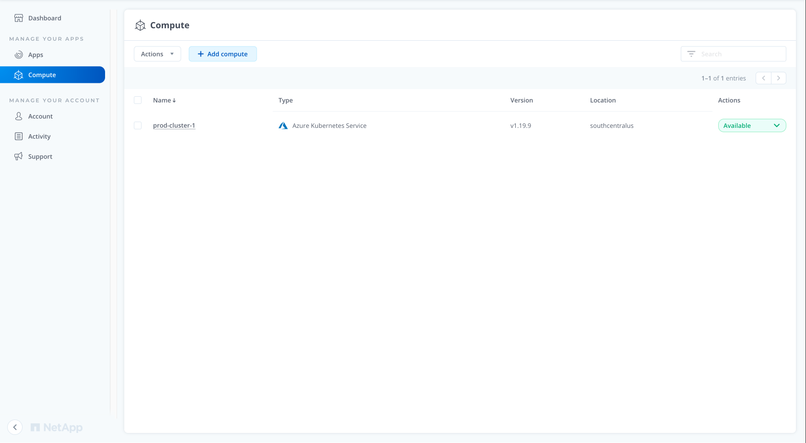
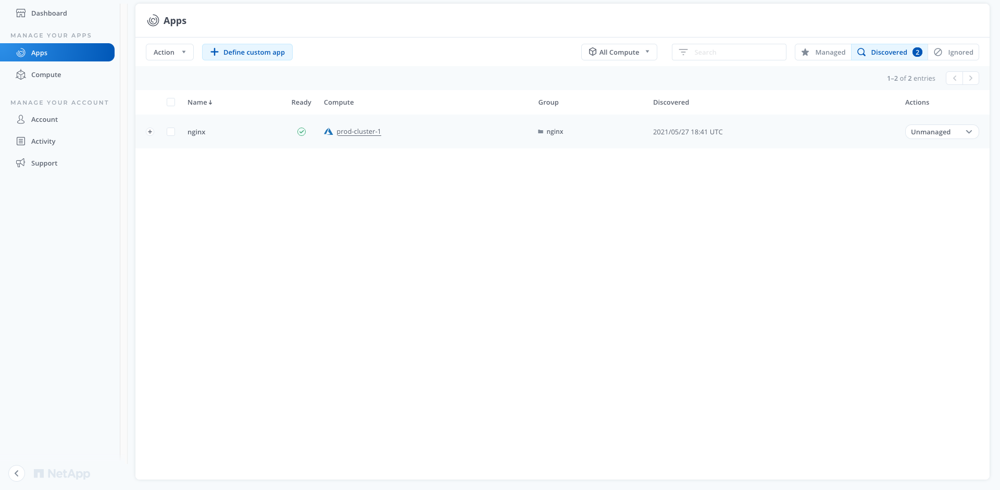
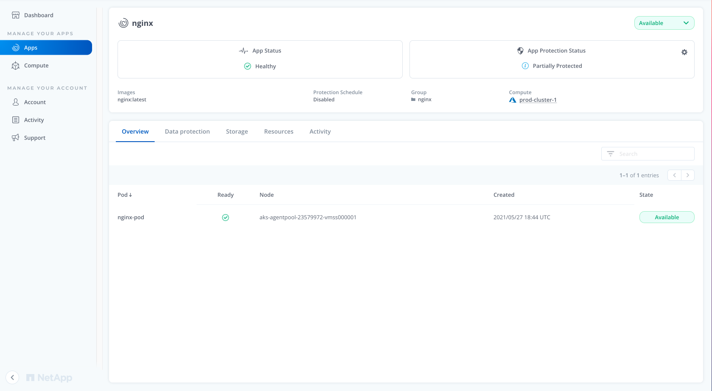

# Dynamically create and use a persistent volume with Azure NetApp Files in Azure Kubernetes Service (AKS)

A persistent volume represents a piece of storage that has been provisioned for use with Kubernetes pods. A persistent volume can be used by one or many pods, and can be dynamically or statically provisioned. This article shows you how to dynamically create an [Azure NetApp Files][anf] volume to be used by pods in an Azure Kubernetes Service (AKS) cluster.

[Azure NetApp Files][anf] is an enterprise-class, high-performance, metered file storage service running on Azure. Kubernetes users have multiple options when it comes to using ANF volumes for Kubernetes workloads:

* Create ANF volumes statically. In this scenario, the creation of ANF volumes is achieved external to AKS; ANF volumes are created using `az`/Azure UI and are then exposed to the Kubernetes plane by the creation of a `PersistentVolume`.
* Create ANF volumes on-demand, orchestrating through Kubernetes. This is the preferred mode of operation for creating multiple ANF volumes directly through Kubernetes and is achieved using NetApp Astra. [Astra](https://cloud.netapp.com/astra) is a **fully managed and supported** application-aware data management service that manages, protects, and moves data-rich Kubernetes workloads across AKS clusters. NetApp recommends Astra for customers who prioritize data protection, disaster recover, and migration for production workloads. This document explains the steps involved to connect AKS clusters with Astra and provision ANF volumes using [Trident](https://netapp-trident.readthedocs.io/). Trident is NetApp's dynamic storage orchestrator, which is deployed and managed by the Astra service.

> [!NOTE]
>  You can also choose to install [Trident](https://netapp-trident.readthedocs.io/) in a standalone manner without requiring Astra. To learn more, check out [Use Container Storage Interface (CSI) driver for Azure NetApp Files on Azure Kubernetes Service (AKS)][az-netappfiles-csi].

If you would like to provision ANF volumes statically, read [Manually create and use a volume with Azure NetApp Files in Azure Kubernetes Service (AKS)][az-netappfiles-static].

## Before you begin
This article assumes that you have an existing AKS cluster. If you need an AKS cluster, see the AKS quickstart [using the Azure CLI][aks-quickstart-cli] or [using the Azure portal][aks-quickstart-portal].

> [!IMPORTANT]
> Your AKS cluster must also be [in a region that supports Azure NetApp Files][anf-regions].

You also need the Azure CLI version 2.0.59 or later installed and configured. Run `az --version` to find the version. If you need to install or upgrade, see [Install Azure CLI][install-azure-cli].

### Prerequisites

The following considerations apply when you use Azure NetApp Files with Astra:

* Azure NetApp Files is only available [in selected Azure regions][anf-regions].
* Before you can use Azure NetApp Files, you must be granted access to the Azure NetApp Files service. To apply for access, you can use the [Azure NetApp Files waitlist submission form][anf-waitlist] or go to https://azure.microsoft.com/services/netapp/#getting-started. You can't access the Azure NetApp Files service until you receive the official confirmation email from the Azure NetApp Files team.
* After the initial deployment of an AKS cluster, users can choose to provision ANF volumes statically or dynamically. This articles covers the latter workflow.
* AKS clusters must be running Kubernetes version 1.17 or later to be used with Astra. You will also need to ensure that node pools are online and running **Linux**. [Learn more about this step](https://docs.netapp.com/us-en/astra/get-started/set-up-microsoft-azure.html#aks-cluster-requirements).

## Configure Azure NetApp Files

> [!IMPORTANT]
> Before you can register the  *Microsoft.NetApp* resource provider, you must complete the [Azure NetApp Files waitlist submission form][anf-waitlist] or go to https://azure.microsoft.com/services/netapp/#getting-started for your subscription. You can't register the resource provide until you receive the official confirmation email from the Azure NetApp Files team.

Register the *Microsoft.NetApp* resource provider:

```azurecli
az provider register --namespace Microsoft.NetApp --wait
```

> [!NOTE]
> This can take some time to complete.

When you create an Azure NetApp account for use with AKS, you need to create the account in the **node** resource group. First, get the resource group name with the [az aks show][az-aks-show] command and add the `--query nodeResourceGroup` query parameter. The following example gets the node resource group for the AKS cluster named *myAKSCluster* in the resource group name *myResourceGroup*:

```azurecli-interactive
az aks show --resource-group myResourceGroup --name myAKSCluster --query nodeResourceGroup -o tsv
```

```output
MC_myResourceGroup_myAKSCluster_eastus
```

Create an Azure NetApp Files account in the **node** resource group and same region as your AKS cluster using [az netappfiles account create][az-netappfiles-account-create]. The following example creates an account named *myaccount1* in the *MC_myResourceGroup_myAKSCluster_eastus* resource group and *eastus* region:

```azurecli
az netappfiles account create \
    --resource-group MC_myResourceGroup_myAKSCluster_eastus \
    --location eastus \
    --account-name myaccount1
```

Create a new capacity pool by using [az netappfiles pool create][az-netappfiles-pool-create]. The following example creates a new capacity pool named *mypool1* with 4 TB in size and *Premium* service level. A capacity pool can have an Ultra, Premium, or Standard service level. You will need to set up a capacity pool for each service level that you want to use with your Kubernetes clusters. You can learn more about service levels [here](https://docs.netapp.com/us-en/astra/learn/azure-storage.html):

```azurecli
az netappfiles pool create \
    --resource-group MC_myResourceGroup_myAKSCluster_eastus \
    --location eastus \
    --account-name myaccount1 \
    --pool-name mypool1 \
    --size 4 \
    --service-level Premium
```
> [!NOTE]
> ANF capacity pools can be defined to use the manual or auto QoS type. Astra supports auto QoS capacity pools. Manual QoS capacity pools aren't supported.

Create a subnet to [delegate to Azure NetApp Files][anf-delegate-subnet] using [az network vnet subnet create][az-network-vnet-subnet-create]. **This subnet must be in the same virtual network as your AKS cluster.**

```azurecli
RESOURCE_GROUP=MC_myResourceGroup_myAKSCluster_eastus
VNET_NAME=$(az network vnet list --resource-group $RESOURCE_GROUP --query [].name -o tsv)
VNET_ID=$(az network vnet show --resource-group $RESOURCE_GROUP --name $VNET_NAME --query "id" -o tsv)
SUBNET_NAME=MyNetAppSubnet
az network vnet subnet create \
    --resource-group $RESOURCE_GROUP \
    --vnet-name $VNET_NAME \
    --name $SUBNET_NAME \
    --delegations "Microsoft.NetApp/volumes" \
    --address-prefixes 10.0.0.0/28
```
Create an Azure service principal that is assigned the **Contributor** role. Astra will use this service principal to handle Kubernetes application data management automatically for you.

```azurecli 
az ad sp create-for-rbac \
    --name http://sp-astra-service-principal \
    --role contributor --scopes /subscriptions/SUBSCRIPTION-ID
```

You will need to store the resulting output as a JSON file. An example JSON file will look like this:

```json
    {
      "appId": "0db3929a-bfb0-4c93-bbbb-bbbb",
      "displayName": "sp-astra-service-principal",
      "name": "http://sp-astra-service-principal",
      "password": "xxxxxxxxxxxxxxxxxx",
      "tenant": "011cdf6c-aaaa-aaaa-aaaa-7721afd8ca37"
    }
```

To learn more about service principal requirements, take a look at [step-by-step instructions](https://docs.netapp.com/us-en/astra/get-started/set-up-microsoft-azure.html#create-an-azure-service-principal-2)

## Install CSI volume snapshot controller

As noted in the list of requirements, AKS clusters must have a CSI volume snapshot controller installed.

### Steps for K8s versions 1.17, 1.18, and 1.19

If your AKS cluster is running a Kubernetes version that is present in [1.17, 1.19], execute the following commands using `kubectl`:

```console
# Install volume snapshot CRDs
kubectl apply -f https://raw.githubusercontent.com/kubernetes-csi/external-snapshotter/release-3.0/client/config/crd/snapshot.storage.k8s.io_volumesnapshotclasses.yaml
kubectl apply -f https://raw.githubusercontent.com/kubernetes-csi/external-snapshotter/release-3.0/client/config/crd/snapshot.storage.k8s.io_volumesnapshotcontents.yaml
kubectl apply -f https://raw.githubusercontent.com/kubernetes-csi/external-snapshotter/release-3.0/client/config/crd/snapshot.storage.k8s.io_volumesnapshots.yaml
# Install volume snapshot controller and RBAC
kubectl apply -f https://raw.githubusercontent.com/kubernetes-csi/external-snapshotter/release-3.0/deploy/kubernetes/snapshot-controller/rbac-snapshot-controller.yaml
kubectl apply -f https://raw.githubusercontent.com/kubernetes-csi/external-snapshotter/release-3.0/deploy/kubernetes/snapshot-controller/setup-snapshot-controller.yaml
```

### Steps for K8s versions 1.20

If your AKS cluster is running a Kubernetes version 1.20 execute the following commands using `kubectl`:

```console
# Install volume snapshot CRDs
kubectl apply -f https://raw.githubusercontent.com/kubernetes-csi/external-snapshotter/v4.0.0/client/config/crd/snapshot.storage.k8s.io_volumesnapshotclasses.yaml
kubectl apply -f https://raw.githubusercontent.com/kubernetes-csi/external-snapshotter/v4.0.0/client/config/crd/snapshot.storage.k8s.io_volumesnapshotcontents.yaml
kubectl apply -f https://raw.githubusercontent.com/kubernetes-csi/external-snapshotter/v4.0.0/client/config/crd/snapshot.storage.k8s.io_volumesnapshots.yaml
# Install volume snapshot controller and RBAC
kubectl apply -f https://raw.githubusercontent.com/kubernetes-csi/external-snapshotter/v4.0.0/deploy/kubernetes/snapshot-controller/rbac-snapshot-controller.yaml
kubectl apply -f https://raw.githubusercontent.com/kubernetes-csi/external-snapshotter/v4.0.0/deploy/kubernetes/snapshot-controller/setup-snapshot-controller.yaml
```

## Discover AKS clusters with Astra

Now that you have a NetApp ANF account created and completed the AKS pre-flight checks, you are ready to go ahead and sign up for Astra. Once complete, you can discover AKS clusters, provision storage dynamically, and achieve more.

### Sign up for Astra

* Create a [NetApp Cloud Central](https://cloud.netapp.com/) account.
* Specify your NetApp Cloud Central email ID when creating your [Astra account](https://cloud.netapp.com/astra).

After completing the registration, you will be able to access the Astra control plane. Your dashboard should look like this:



### Register AKS clusters with Astra

The next step is to have Astra discover your AKS cluster. Choose "Manage Kubernetes compute" and provide the service principal definition that was created earlier.



Astra automatically discovers AKS clusters that are present in the Azure subscription and determines if they are eligible and meet all the requirements. As shown below, `prod-cluster-1` is eligible and can be managed. Select the desired AKS cluster and proceed to the next step.



Configure your default storageClass by choosing from the options provided. You must ensure you have already created capacity pools for the desired service level.



The next step is to confirm your selections. Once that is done, Astra will discover the AKS cluster, install Trident, and create StorageClasses for you.



## Deploy an app and create volumes

You can now deploy applications and create ANF volumes directly through Kubernetes. As part of onboarding an AKS cluster to Astra, [Trident](https://netapp-trident.readthedocs.io/), NetApp's dynamic storage provisioner for Kubernetes, is installed for you. Users can create PersistentVolumeClaim (PVC) objects, which are requests for storage by a user. Upon the creation of a PersistentVolumeClaim, Trident automatically creates an ANF volume and makes it available for Kubernetes workloads to consume.

In this example, you will be deploying WordPress using the [Helm chart][https://bitnami.com/stack/wordpress/helm].

```console
$  helm repo add bitnami https://charts.bitnami.com/bitnami
$  helm install wordpress bitnami/wordpress -n wordpress --create-namespace
```

The application is made up of multiple components such as the WordPress and MariaDB services, statefulsets, and the PVCs to store data. Trident **automatically** creates ANF volumes for the PVCs and mounts them for the application to read/write into.

```console
$   kubectl get all,pvc -n wordpress
NAME                             READY   STATUS    RESTARTS   AGE
pod/wordpress-7dbb7bcfff-vb9fv   1/1     Running   1          13m
pod/wordpress-mariadb-0          1/1     Running   0          13m

NAME                        TYPE           CLUSTER-IP   EXTERNAL-IP     PORT(S)                      AGE
service/wordpress           LoadBalancer   10.1.0.25    20.94.168.202   80:31364/TCP,443:32359/TCP   13m
service/wordpress-mariadb   ClusterIP      10.1.0.114   <none>          3306/TCP                     13m

NAME                        READY   UP-TO-DATE   AVAILABLE   AGE
deployment.apps/wordpress   1/1     1            1           13m

NAME                                   DESIRED   CURRENT   READY   AGE
replicaset.apps/wordpress-7dbb7bcfff   1         1         1       13m

NAME                                 READY   AGE
statefulset.apps/wordpress-mariadb   1/1     13m

NAME                                             STATUS   VOLUME                                     CAPACITY   ACCESS MODES   STORAGECLASS              AGE
persistentvolumeclaim/data-wordpress-mariadb-0   Bound    pvc-9c56d5d6-9bb8-4789-bf29-c423cb5d9980   100Gi      RWO            netapp-anf-perf-premium   13m
persistentvolumeclaim/wordpress                  Bound    pvc-762e1b48-964a-4bfa-8dd4-eacb0333b6ce   100Gi      RWO            netapp-anf-perf-premium   13m
```

Trident supports a number of features with ANF, such as:

* [Expanding volumes](https://netapp-trident.readthedocs.io/en/latest/kubernetes/operations/tasks/volumes/vol-expansion.html)
* [On-demand volume snapshots](https://netapp-trident.readthedocs.io/en/latest/kubernetes/operations/tasks/volumes/snapshots.html)
* [Importing volumes](https://netapp-trident.readthedocs.io/en/latest/kubernetes/operations/tasks/volumes/import.html)

## Discover Kubernetes applications with Astra

Once applications are deployed, Astra will automatically identify them and provide administrators the ability to manage them. Once an app is managed, you can:

* identify the Kubernetes resources that make up the app.
* take point-in-time snapshots of the app.
* clone the application (and its constituent resources) to a different namespace.
* establish protection policies that continuously back up your application on a schedule (daily/weekly/monthly/custom).

Open the **"Apps"** tab under the **"Manage Your Apps"** section. This window contains three types of applications: Managed, Discovered, and Ignored. You will be able to find the **"wordpress"** app deployed in the previous step. Select the drop-down menu in the **"Actions"** column to manage the app. 



Once the app is managed, you will see Astra notifying about the app's status. You can also take point-in-time snapshots of the entire app, clone it to a different namespace, or create backups.



## Next steps

* To learn more about Trident and understand how ANF volumes can be provisioned on-demand using its CSI driver, read [Use Container Storage Interface (CSI) driver for Azure NetApp Files on Azure Kubernetes Service (AKS)][az-netappfiles-csi] and the [Trident documentation](https://netapp-trident.readthedocs.io/en/latest/kubernetes/index.html).
* For more information on Azure NetApp Files, see [What is Azure NetApp Files][anf].
* You can take a look at the Astra documentation [here](https://docs.netapp.com/us-en/astra/).


[aks-quickstart-cli]: kubernetes-walkthrough.md
[aks-quickstart-portal]: kubernetes-walkthrough-portal.md
[aks-nfs]: azure-nfs-volume.md
[anf]: ../azure-netapp-files/azure-netapp-files-introduction.md
[anf-delegate-subnet]: ../azure-netapp-files/azure-netapp-files-delegate-subnet.md
[anf-quickstart]: ../azure-netapp-files/
[anf-regions]: https://azure.microsoft.com/global-infrastructure/services/?products=netapp&regions=all
[anf-waitlist]: https://forms.office.com/Pages/ResponsePage.aspx?id=v4j5cvGGr0GRqy180BHbR8cq17Xv9yVBtRCSlcD_gdVUNUpUWEpLNERIM1NOVzA5MzczQ0dQR1ZTSS4u
[az-aks-show]: /cli/azure/aks#az_aks_show
[az-netappfiles-account-create]: /cli/azure/netappfiles/account#az_netappfiles_account_create
[az-netappfiles-csi]: azure-netapp-files-csi.md
[az-netappfiles-static]: azure-netapp-files.md
[az-netappfiles-pool-create]: /cli/azure/netappfiles/pool#az_netappfiles_pool_create
[az-netappfiles-volume-create]: /cli/azure/netappfiles/volume#az_netappfiles_volume_create
[az-netappfiles-volume-show]: /cli/azure/netappfiles/volume#az_netappfiles_volume_show
[az-network-vnet-subnet-create]: /cli/azure/network/vnet/subnet#az_network_vnet_subnet_create
[install-azure-cli]: /cli/azure/install-azure-cli
[kubectl-apply]: https://kubernetes.io/docs/reference/generated/kubectl/kubectl-commands#apply
[kubectl-describe]: https://kubernetes.io/docs/reference/generated/kubectl/kubectl-commands#describe
[kubectl-exec]: https://kubernetes.io/docs/reference/generated/kubectl/kubectl-commands#exec
