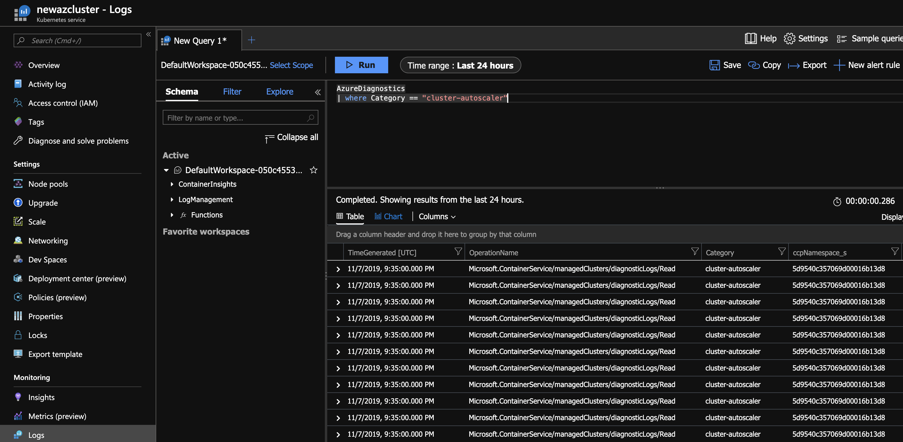

# Automatically scale a cluster to meet application demands on Azure Kubernetes Service (AKS)

To keep up with application demands in Azure Kubernetes Service (AKS), you may need to adjust the number of nodes that run your workloads. The cluster autoscaler component can watch for pods in your cluster that can't be scheduled because of resource constraints. When issues are detected, the number of nodes in a node pool is increased to meet the application demand. Nodes are also regularly checked for a lack of running pods, with the number of nodes then decreased as needed. This ability to automatically scale up or down the number of nodes in your AKS cluster lets you run an efficient, cost-effective cluster.

This article shows you how to enable and manage the cluster autoscaler in an AKS cluster.

## Before you begin

This article requires that you're running the Azure CLI version 2.0.76 or later. Run `az --version` to find the version. If you need to install or upgrade, see [Install Azure CLI][azure-cli-install].

## About the cluster autoscaler

To adjust to changing application demands, such as between the workday and evening or on a weekend, clusters often need a way to automatically scale. AKS clusters can scale in one of two ways:

* The **cluster autoscaler** watches for pods that can't be scheduled on nodes because of resource constraints. The cluster then automatically increases the number of nodes.
* The **horizontal pod autoscaler** uses the Metrics Server in a Kubernetes cluster to monitor the resource demand of pods. If an application needs more resources, the number of pods is automatically increased to meet the demand.


Both the horizontal pod autoscaler and cluster autoscaler can also decrease the number of pods and nodes as needed. The cluster autoscaler decreases the number of nodes when there has been unused capacity for a period of time. Pods on a node to be removed by the cluster autoscaler are safely scheduled elsewhere in the cluster. The cluster autoscaler may be unable to scale down if pods can't move, such as in the following situations:

* A pod is directly created and isn't backed by a controller object, such as a deployment or replica set.
* A pod disruption budget (PDB) is too restrictive and doesn't allow the number of pods to be fall below a certain threshold.
* A pod uses node selectors or anti-affinity that can't be honored if scheduled on a different node.

For more information about how the cluster autoscaler may be unable to scale down, see [What types of pods can prevent the cluster autoscaler from removing a node?][autoscaler-scaledown]

The cluster autoscaler uses startup parameters for things like time intervals between scale events and resource thresholds. For more information on what parameters the cluster autoscaler uses, see [Using the autoscaler profile](#using-the-autoscaler-profile).

The cluster and horizontal pod autoscalers can work together, and are often both deployed in a cluster. When combined, the horizontal pod autoscaler is focused on running the number of pods required to meet application demand. The cluster autoscaler is focused on running the number of nodes required to support the scheduled pods.

> [!NOTE]
> Manual scaling is disabled when you use the cluster autoscaler. Let the cluster autoscaler determine the required number of nodes. If you want to manually scale your cluster, [disable the cluster autoscaler](#disable-the-cluster-autoscaler).

## Create an AKS cluster and enable the cluster autoscaler

If you need to create an AKS cluster, use the [az aks create][az-aks-create] command. To enable and configure the cluster autoscaler on the node pool for the cluster, use the `--enable-cluster-autoscaler` parameter, and specify a node `--min-count` and `--max-count`.

> [!IMPORTANT]
> The cluster autoscaler is a Kubernetes component. Although the AKS cluster uses a virtual machine scale set for the nodes, don't manually enable or edit settings for scale set autoscale in the Azure portal or using the Azure CLI. Let the Kubernetes cluster autoscaler manage the required scale settings. For more information, see [Can I modify the AKS resources in the node resource group?][aks-faq-node-resource-group]

The following example creates an AKS cluster with a single node pool backed by a virtual machine scale set. It also enables the cluster autoscaler on the node pool for the cluster and sets a minimum of *1* and maximum of *3* nodes:

```azurecli-interactive
# First create a resource group
az group create --name myResourceGroup --location eastus

# Now create the AKS cluster and enable the cluster autoscaler
az aks create \
  --resource-group myResourceGroup \
  --name myAKSCluster \
  --node-count 1 \
  --vm-set-type VirtualMachineScaleSets \
  --load-balancer-sku standard \
  --enable-cluster-autoscaler \
  --min-count 1 \
  --max-count 3
```

It takes a few minutes to create the cluster and configure the cluster autoscaler settings.

## Update an existing AKS cluster to enable the cluster autoscaler

Use the [az aks update][az-aks-update] command to enable and configure the cluster autoscaler on the node pool for the existing cluster. Use the `--enable-cluster-autoscaler` parameter, and specify a node `--min-count` and `--max-count`.

> [!IMPORTANT]
> The cluster autoscaler is a Kubernetes component. Although the AKS cluster uses a virtual machine scale set for the nodes, don't manually enable or edit settings for scale set autoscale in the Azure portal or using the Azure CLI. Let the Kubernetes cluster autoscaler manage the required scale settings. For more information, see [Can I modify the AKS resources in the node resource group?][aks-faq-node-resource-group]

The following example updates an existing AKS cluster to enable the cluster autoscaler on the node pool for the cluster and sets a minimum of *1* and maximum of *3* nodes:

```azurecli-interactive
az aks update \
  --resource-group myResourceGroup \
  --name myAKSCluster \
  --enable-cluster-autoscaler \
  --min-count 1 \
  --max-count 3
```

It takes a few minutes to update the cluster and configure the cluster autoscaler settings.

## Change the cluster autoscaler settings

> [!IMPORTANT]
> If you have multiple node pools in your AKS cluster, skip to the [autoscale with multiple agent pools section](#use-the-cluster-autoscaler-with-multiple-node-pools-enabled). Clusters with multiple agent pools require use of the `az aks nodepool` command set to change node pool specific properties instead of `az aks`.

In the previous step to create an AKS cluster or update an existing node pool, the cluster autoscaler minimum node count was set to *1*, and the maximum node count was set to *3*. As your application demands change, you may need to adjust the cluster autoscaler node count.

To change the node count, use the [az aks update][az-aks-update] command.

```azurecli-interactive
az aks update \
  --resource-group myResourceGroup \
  --name myAKSCluster \
  --update-cluster-autoscaler \
  --min-count 1 \
  --max-count 5
```

The above example updates cluster autoscaler on the single node pool in *myAKSCluster* to a minimum of *1* and maximum of *5* nodes.

> [!NOTE]
> The cluster autoscaler makes scaling decisions based on the minimum and maximum counts set on each node pool, but it does not enforce them after updating the min or max counts. For example, setting a min count of 5 when the current node count is 3 will not immediately scale the pool up to 5. If the minimum count on the node pool has a value higher than the current number of nodes, the new min or max settings will be respected when there are enough unschedulable pods present that would require 2 new additional nodes and trigger an autoscaler event. After the scale event, the new count limits are respected.

Monitor the performance of your applications and services, and adjust the cluster autoscaler node counts to match the required performance.

## Using the autoscaler profile

You can also configure more granular details of the cluster autoscaler by changing the default values in the cluster-wide autoscaler profile. For example, a scale down event happens after nodes are under-utilized after 10 minutes. If you had workloads that ran every 15 minutes, you may want to change the autoscaler profile to scale down under utilized nodes after 15 or 20 minutes. When you enable the cluster autoscaler, a default profile is used unless you specify different settings. The cluster autoscaler profile has the following settings that you can update:

| Setting                          | Description                                                                              | Default value |
|----------------------------------|------------------------------------------------------------------------------------------|---------------|
| scan-interval                    | How often cluster is reevaluated for scale up or down                                    | 10 seconds    |
| scale-down-delay-after-add       | How long after scale up that scale down evaluation resumes                               | 10 minutes    |
| scale-down-delay-after-delete    | How long after node deletion that scale down evaluation resumes                          | scan-interval |
| scale-down-delay-after-failure   | How long after scale down failure that scale down evaluation resumes                     | 3 minutes     |
| scale-down-unneeded-time         | How long a node should be unneeded before it is eligible for scale down                  | 10 minutes    |
| scale-down-unready-time          | How long an unready node should be unneeded before it is eligible for scale down         | 20 minutes    |
| scale-down-utilization-threshold | Node utilization level, defined as sum of requested resources divided by capacity, below which a node can be considered for scale down | 0.5 |
| max-graceful-termination-sec     | Maximum number of seconds the cluster autoscaler waits for pod termination when trying to scale down a node | 600 seconds   |
| balance-similar-node-groups      | Detects similar node pools and balances the number of nodes between them                 | false         |
| expander                         | Type of node pool [expander](https://github.com/kubernetes/autoscaler/blob/master/cluster-autoscaler/FAQ.md#what-are-expanders) to be used in scale up. Possible values: `most-pods`, `random`, `least-waste`, `priority` | random | 
| skip-nodes-with-local-storage    | If true cluster autoscaler will never delete nodes with pods with local storage, for example, EmptyDir or HostPath | true |
| skip-nodes-with-system-pods      | If true cluster autoscaler will never delete nodes with pods from kube-system (except for DaemonSet or mirror pods) | true | 
| max-empty-bulk-delete            | Maximum number of empty nodes that can be deleted at the same time                       | 10 nodes      |
| new-pod-scale-up-delay           | For scenarios like burst/batch scale where you don't want CA to act before the kubernetes scheduler could schedule all the pods, you can tell CA to ignore unscheduled pods before they're a certain age.                                                                                                                | 0 seconds    |
| max-total-unready-percentage     | Maximum percentage of unready nodes in the cluster. After this percentage is exceeded, CA halts operations | 45% |
| max-node-provision-time          | Maximum time the autoscaler waits for a node to be provisioned                           | 15 minutes    |   
| ok-total-unready-count           | Number of allowed unready nodes, irrespective of max-total-unready-percentage            | 3 nodes       |

> [!IMPORTANT]
> The cluster autoscaler profile affects all node pools that use the cluster autoscaler. You can't set an autoscaler profile per node pool.
>
> The cluster autoscaler profile requires version *2.11.1* or greater of the Azure CLI. If you need to install or upgrade, see [Install Azure CLI][azure-cli-install].

### Set the cluster autoscaler profile on an existing AKS cluster

Use the [az aks update][az-aks-update-preview] command with the *cluster-autoscaler-profile* parameter to set the cluster autoscaler profile on your cluster. The following example configures the scan interval setting as 30s in the profile.

```azurecli-interactive
az aks update \
  --resource-group myResourceGroup \
  --name myAKSCluster \
  --cluster-autoscaler-profile scan-interval=30s
```

When you enable the cluster autoscaler on node pools in the cluster, those clusters will also use the cluster autoscaler profile. For example:

```azurecli-interactive
az aks nodepool update \
  --resource-group myResourceGroup \
  --cluster-name myAKSCluster \
  --name mynodepool \
  --enable-cluster-autoscaler \
  --min-count 1 \
  --max-count 3
```

> [!IMPORTANT]
> When you set the cluster autoscaler profile, any existing node pools with the cluster autoscaler enabled will start using the profile immediately.

### Set the cluster autoscaler profile when creating an AKS cluster

You can also use the *cluster-autoscaler-profile* parameter when you create your cluster. For example:

```azurecli-interactive
az aks create \
  --resource-group myResourceGroup \
  --name myAKSCluster \
  --node-count 1 \
  --enable-cluster-autoscaler \
  --min-count 1 \
  --max-count 3 \
  --cluster-autoscaler-profile scan-interval=30s
```

The above command creates an AKS cluster and defines the scan interval as 30 seconds for the cluster-wide autoscaler profile. The command also enables the cluster autoscaler on the initial node pool, sets the minimum node count to 1 and the maximum node count to 3.

### Reset cluster autoscaler profile to default values

Use the [az aks update][az-aks-update-preview] command to reset the cluster autoscaler profile on your cluster.

```azurecli-interactive
az aks update \
  --resource-group myResourceGroup \
  --name myAKSCluster \
  --cluster-autoscaler-profile ""
```

## Disable the cluster autoscaler

If you no longer wish to use the cluster autoscaler, you can disable it using the [az aks update][az-aks-update-preview] command, specifying the `--disable-cluster-autoscaler` parameter. Nodes aren't removed when the cluster autoscaler is disabled.

```azurecli-interactive
az aks update \
  --resource-group myResourceGroup \
  --name myAKSCluster \
  --disable-cluster-autoscaler
```

You can manually scale your cluster after disabling the cluster autoscaler by using the [az aks scale][az-aks-scale] command. If you use the horizontal pod autoscaler, that feature continues to run with the cluster autoscaler disabled, but pods may end up unable to be scheduled if all node resources are in use.

## Re-enable a disabled cluster autoscaler

If you wish to re-enable the cluster autoscaler on an existing cluster, you can re-enable it using the [az aks update][az-aks-update-preview] command, specifying the `--enable-cluster-autoscaler`, `--min-count`, and `--max-count` parameters.

## Retrieve cluster autoscaler logs and status

To diagnose and debug autoscaler events, logs and status can be retrieved from the autoscaler add-on.

AKS manages the cluster autoscaler on your behalf and runs it in the managed control plane. You can enable control plane node to see the logs and operations from CA.

To configure logs to be pushed from the cluster autoscaler into Log Analytics, follow these steps.

1. Set up a rule for resource logs to push cluster-autoscaler logs to Log Analytics. [Instructions are detailed here][aks-view-master-logs], ensure you check the box for `cluster-autoscaler` when selecting options for "Logs".
1. Select the "Logs" section on your cluster via the Azure portal.
1. Input the following example query into Log Analytics:

```
AzureDiagnostics
| where Category == "cluster-autoscaler"
```

You should see logs similar to the following example as long as there are logs to retrieve.



The cluster autoscaler will also write out health status to a `configmap` named `cluster-autoscaler-status`. To retrieve these logs, execute the following `kubectl` command. A health status will be reported for each node pool configured with the cluster autoscaler.

```
kubectl get configmap -n kube-system cluster-autoscaler-status -o yaml
```

To learn more about what is logged from the autoscaler, read the FAQ on the [Kubernetes/autoscaler GitHub project][kubernetes-faq].

## Use the cluster autoscaler with multiple node pools enabled

The cluster autoscaler can be used together with [multiple node pools][aks-multiple-node-pools] enabled. Follow that document to learn how to enable multiple node pools and add additional node pools to an existing cluster. When using both features together, you enable the cluster autoscaler on each individual node pool in the cluster and can pass unique autoscaling rules to each.

The below command assumes you followed the [initial instructions](#create-an-aks-cluster-and-enable-the-cluster-autoscaler) earlier in this document and you want to update an existing node pool's max-count from *3* to *5*. Use the [az aks nodepool update][az-aks-nodepool-update] command to update an existing node pool's settings.

```azurecli-interactive
az aks nodepool update \
  --resource-group myResourceGroup \
  --cluster-name myAKSCluster \
  --name nodepool1 \
  --update-cluster-autoscaler \
  --min-count 1 \
  --max-count 5
```

The cluster autoscaler can be disabled with [az aks nodepool update][az-aks-nodepool-update] and passing the `--disable-cluster-autoscaler` parameter.

```azurecli-interactive
az aks nodepool update \
  --resource-group myResourceGroup \
  --cluster-name myAKSCluster \
  --name nodepool1 \
  --disable-cluster-autoscaler
```

If you wish to re-enable the cluster autoscaler on an existing cluster, you can re-enable it using the [az aks nodepool update][az-aks-nodepool-update] command, specifying the `--enable-cluster-autoscaler`, `--min-count`, and `--max-count` parameters.

> [!NOTE]
> If you are planning on using the cluster autoscaler with nodepools that span multiple zones and leverage scheduling features related to zones such as volume topological scheduling, the recommendation is to have one nodepool per zone and enable the `--balance-similar-node-groups` through the autoscaler profile. This will ensure that the autoscaler will scale up succesfully and try and keep the sizes of the nodepools balanced.

## Next steps

This article showed you how to automatically scale the number of AKS nodes. You can also use the horizontal pod autoscaler to automatically adjust the number of pods that run your application. For steps on using the horizontal pod autoscaler, see [Scale applications in AKS][aks-scale-apps].

<!-- LINKS - internal -->
[aks-faq]: faq.md
[aks-faq-node-resource-group]: faq.md#can-i-modify-tags-and-other-properties-of-the-aks-resources-in-the-node-resource-group
[aks-multiple-node-pools]: use-multiple-node-pools.md
[aks-scale-apps]: tutorial-kubernetes-scale.md
[aks-support-policies]: support-policies.md
[aks-upgrade]: upgrade-cluster.md
[aks-view-master-logs]: ./view-control-plane-logs.md#enable-resource-logs
[autoscaler-profile-properties]: #using-the-autoscaler-profile
[azure-cli-install]: /cli/azure/install-azure-cli
[az-aks-show]: /cli/azure/aks#az_aks_show
[az-extension-add]: /cli/azure/extension#az_extension_add
[az-extension-update]: /cli/azure/extension#az_extension_update
[az-aks-create]: /cli/azure/aks#az_aks_create
[az-aks-update]: /cli/azure/aks#az_aks_update
[az-aks-scale]: /cli/azure/aks#az_aks_scale
[az-feature-register]: /cli/azure/feature#az_feature_register
[az-feature-list]: /cli/azure/feature#az_feature_list
[az-provider-register]: /cli/azure/provider#az_provider_register

<!-- LINKS - external -->
[az-aks-update-preview]: https://github.com/Azure/azure-cli-extensions/tree/master/src/aks-preview
[az-aks-nodepool-update]: https://github.com/Azure/azure-cli-extensions/tree/master/src/aks-preview#enable-cluster-auto-scaler-for-a-node-pool
[autoscaler-scaledown]: https://github.com/kubernetes/autoscaler/blob/master/cluster-autoscaler/FAQ.md#what-types-of-pods-can-prevent-ca-from-removing-a-node
[autoscaler-parameters]: https://github.com/kubernetes/autoscaler/blob/master/cluster-autoscaler/FAQ.md#what-are-the-parameters-to-ca
[kubernetes-faq]: https://github.com/kubernetes/autoscaler/blob/master/cluster-autoscaler/FAQ.md#ca-doesnt-work-but-it-used-to-work-yesterday-why