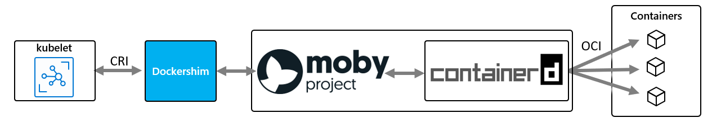

# Configure an AKS cluster

As part of creating an AKS cluster, you may need to customize your cluster configuration to suit your needs. This article introduces a few options for customizing your AKS cluster.

## OS configuration

AKS now supports Ubuntu 18.04 as the node operating system (OS) in general availability for clusters in kubernetes versions higher than 1.18.8. For versions below 1.18.x, AKS Ubuntu 16.04 is still be the default base image. From kubernetes v1.18.x and onward, the default base is AKS Ubuntu 18.04.

> [!IMPORTANT]
> Node pools created on Kubernetes v1.18 or greater default to `AKS Ubuntu 18.04` node image. Node pools on a supported Kubernetes version less than 1.18 receive `AKS Ubuntu 16.04` as the node image, but will be updated to `AKS Ubuntu 18.04` once the node pool Kubernetes version is updated to v1.18 or greater.
> 
> It is highly recommended to test your workloads on AKS Ubuntu 18.04 node pools prior to using clusters on 1.18 or greater. Read about how to [test Ubuntu 18.04 node pools](#use-aks-ubuntu-1804-existing-clusters-preview).

The following section will explain how you case use and test AKS Ubuntu 18.04 on clusters that aren't yet using a kubernetes version 1.18.x or higher, or were created before this feature became generally available, by using the OS configuration preview.

You must have the following resources installed:

- [The Azure CLI][azure-cli-install], version 2.2.0 or later
- The aks-preview 0.4.35 extension

To install the aks-preview 0.4.35 extension or later, use the following Azure CLI commands:

```azurecli
az extension add --name aks-preview
az extension list
```

Register the `UseCustomizedUbuntuPreview` feature:

```azurecli
az feature register --name UseCustomizedUbuntuPreview --namespace Microsoft.ContainerService
```

It might take several minutes for the status to show as **Registered**. You can check the registration status by using the [az feature list](/cli/azure/feature?view=azure-cli-latest#az-feature-list&preserve-view=true) command:

```azurecli
az feature list -o table --query "[?contains(name, 'Microsoft.ContainerService/UseCustomizedUbuntuPreview')].{Name:name,State:properties.state}"
```

When the status shows as registered, refresh the registration of the `Microsoft.ContainerService` resource provider by using the [az provider register](/cli/azure/provider?view=azure-cli-latest#az-provider-register&preserve-view=true) command:

```azurecli
az provider register --namespace Microsoft.ContainerService
```

### Use AKS Ubuntu 18.04 on new clusters (Preview)

Configure the cluster to use Ubuntu 18.04 when the cluster is created. Use the `--aks-custom-headers` flag to set the Ubuntu 18.04 as the default OS.

```azurecli
az aks create --name myAKSCluster --resource-group myResourceGroup --aks-custom-headers CustomizedUbuntu=aks-ubuntu-1804
```

If you want to create clusters with the AKS Ubuntu 16.04 image, you can do so by omitting the custom `--aks-custom-headers` tag.

### Use AKS Ubuntu 18.04 existing clusters (Preview)

Configure a new node pool to use Ubuntu 18.04. Use the `--aks-custom-headers` flag to set the Ubuntu 18.04 as the default OS for that node pool.

```azurecli
az aks nodepool add --name ubuntu1804 --cluster-name myAKSCluster --resource-group myResourceGroup --aks-custom-headers CustomizedUbuntu=aks-ubuntu-1804
```

If you want to create node pools with the AKS Ubuntu 16.04 image, you can do so by omitting the custom `--aks-custom-headers` tag.


## Container runtime configuration (Preview)

A container runtime is software that executes containers and manages container images on a node. The runtime helps abstract away sys-calls or operating system (OS) specific functionality to run containers on Linux or Windows. Today AKS is using [Moby](https://mobyproject.org/) (upstream docker) as its container runtime. 
    


[`Containerd`](https://containerd.io/) is an [OCI](https://opencontainers.org/) (Open Container Initiative) compliant core container runtime that provides the minimum set of required functionality to execute containers and manage images on a node. It was [donated](https://www.cncf.io/announcement/2017/03/29/containerd-joins-cloud-native-computing-foundation/) to the Cloud Native Compute Foundation (CNCF) in March of 2017. The current Moby version that AKS uses today already leverages and is built on top of `containerd`, as shown above. 

With a containerd-based node and node pools, instead of talking to the `dockershim`, the kubelet will talk directly to `containerd` via the CRI (container runtime interface) plugin, removing extra hops on the flow when compared to the Docker CRI implementation. As such, you'll see better pod startup latency and less resource (CPU and memory) usage.

By using `containerd` for AKS nodes, pod startup latency improves and node resource consumption by the container runtime decreases. These improvements are enabled by this new architecture where kubelet talks directly to `containerd` through the CRI plugin while in Moby/docker architecture kubelet would talk to the `dockershim` and docker engine before reaching `containerd`, thus having extra hops on the flow.


`Containerd` works on every GA version of kubernetes in AKS, and in every upstream kubernetes version above v1.10, and supports all kubernetes and AKS features.

> [!IMPORTANT]
> After `containerd` becomes generally available on AKS, it'll be the default and only option available for container runtime on new clusters. You can still use Moby nodepools and clusters on older supported versions until those fall off support. 
> 
> We recommend you test your workloads on `containerd` node pools before upgrading or creating new clusters with this container runtime.

### Use `containerd` as your container runtime (Preview)

You must have the following pre-requisites:

- [The Azure CLI][azure-cli-install], version 2.8.0 or later installed
- The aks-preview extension version 0.4.53 or later
- The `UseCustomizedContainerRuntime` feature flag registered
- The `UseCustomizedUbuntuPreview` feature flag registered

To install the aks-preview 0.4.53 extension or later, use the following Azure CLI commands:

```azurecli
az extension add --name aks-preview
az extension list
```

Register the `UseCustomizedContainerRuntime` and `UseCustomizedUbuntuPreview` features:

```azurecli
az feature register --name UseCustomizedContainerRuntime --namespace Microsoft.ContainerService
az feature register --name UseCustomizedUbuntuPreview --namespace Microsoft.ContainerService

```

It might take several minutes for the status to show as **Registered**. You can check the registration status by using the [az feature list](/cli/azure/feature?view=azure-cli-latest#az-feature-list&preserve-view=true) command:

```azurecli
az feature list -o table --query "[?contains(name, 'Microsoft.ContainerService/UseCustomizedContainerRuntime')].{Name:name,State:properties.state}"
az feature list -o table --query "[?contains(name, 'Microsoft.ContainerService/UseCustomizedUbuntuPreview')].{Name:name,State:properties.state}"
```

When the status shows as registered, refresh the registration of the `Microsoft.ContainerService` resource provider by using the [az provider register](/cli/azure/provider?view=azure-cli-latest#az-provider-register&preserve-view=true) command:

```azurecli
az provider register --namespace Microsoft.ContainerService
```  

### Use `containerd` on new clusters (Preview)

Configure the cluster to use `containerd` when the cluster is created. Use the `--aks-custom-headers` flag to set `containerd` as the container runtime.

> [!NOTE]
> The `containerd` runtime is only supported on nodes and node pools using the AKS Ubuntu 18.04 image.

```azurecli
az aks create --name myAKSCluster --resource-group myResourceGroup --aks-custom-headers CustomizedUbuntu=aks-ubuntu-1804,ContainerRuntime=containerd
```

If you want to create clusters with the Moby (docker) runtime, you can do so by omitting the custom `--aks-custom-headers` tag.

### Use `containerd` on existing clusters (Preview)

Configure a new node pool to use `containerd`. Use the `--aks-custom-headers` flag to set `containerd` as the runtime for that node pool.

```azurecli
az aks nodepool add --name ubuntu1804 --cluster-name myAKSCluster --resource-group myResourceGroup --aks-custom-headers CustomizedUbuntu=aks-ubuntu-1804,ContainerRuntime=containerd
```

If you want to create node pools with the Moby (docker) runtime, you can do so by omitting the custom `--aks-custom-headers` tag.


### `Containerd` limitations/differences

* To use `containerd` as the container runtime you must use AKS Ubuntu 18.04 as your base OS image.
* While the docker toolset is still present on the nodes, Kubernetes uses `containerd` as the container runtime. Therefore, since Moby/Docker doesn't manage the Kubernetes-created containers on the nodes, you can't view or interact with your containers using Docker commands (like `docker ps`) or the Docker API.
* For `containerd`, we recommend using [`crictl`](https://kubernetes.io/docs/tasks/debug-application-cluster/crictl) as a replacement CLI instead of the Docker CLI for **troubleshooting** pods, containers, and container images on Kubernetes nodes (for example, `crictl ps`). 
   * It doesn't provide the complete functionality of the docker CLI. It's intended for troubleshooting only.
   * `crictl` offers a more kubernetes-friendly view of containers, with concepts like pods, etc. being present.
* `Containerd` sets up logging using the standardized `cri` logging format (which is different from what you currently get from docker’s json driver). Your logging solution needs to support the `cri` logging format (like [Azure Monitor for Containers](../azure-monitor/insights/container-insights-enable-new-cluster.md))
* You can no longer access the docker engine, `/var/run/docker.sock`, or use Docker-in-Docker (DinD).
  * If you currently extract application logs or monitoring data from Docker Engine, please use something like [Azure Monitor for Containers](../azure-monitor/insights/container-insights-enable-new-cluster.md) instead. Additionally AKS doesn't  support running any out of band commands on the agent nodes that could cause instability.
  * Even when using Moby/docker, building images and directly leveraging the docker engine via the methods above is strongly discouraged. Kubernetes isn't fully aware of those consumed resources, and those approaches present numerous issues detailed [here](https://jpetazzo.github.io/2015/09/03/do-not-use-docker-in-docker-for-ci/) and [here](https://securityboulevard.com/2018/05/escaping-the-whale-things-you-probably-shouldnt-do-with-docker-part-1/), for example.
* Building images - The recommended approach for building images is to use [ACR Tasks](../container-registry/container-registry-quickstart-task-cli.md). An alternative approach is to use more secure in-cluster options like [docker buildx](https://github.com/docker/buildx).

## Generation 2 virtual machines (Preview)

Azure supports [Generation 2 (Gen2) virtual machines (VMs)](../virtual-machines/generation-2.md). Generation 2 VMs support key features that aren't supported in generation 1 VMs (Gen1). These features include increased memory, Intel Software Guard Extensions (Intel SGX), and virtualized persistent memory (vPMEM).

Generation 2 VMs use the new UEFI-based boot architecture rather than the BIOS-based architecture used by generation 1 VMs.
Only specific SKUs and sizes support Gen2 VMs. Check the [list of supported sizes](../virtual-machines/generation-2.md#generation-2-vm-sizes), to see if your SKU supports or requires Gen2.

Additionally not all VM images support Gen2, on AKS Gen2 VMs will use the new [AKS Ubuntu 18.04 image](#os-configuration). This image supports all Gen2 SKUs and sizes.

To use Gen2 VMs during preview, you'll require:
- The `aks-preview` CLI extension installed.
- The `Gen2VMPreview` feature flag registered.

Register the `Gen2VMPreview` feature:

```azurecli
az feature register --name Gen2VMPreview --namespace Microsoft.ContainerService
```

It might take several minutes for the status to show as **Registered**. You can check the registration status by using the [az feature list](/cli/azure/feature?view=azure-cli-latest#az-feature-list&preserve-view=true) command:

```azurecli
az feature list -o table --query "[?contains(name, 'Microsoft.ContainerService/Gen2VMPreview')].{Name:name,State:properties.state}"
```

When the status shows as registered, refresh the registration of the `Microsoft.ContainerService` resource provider by using the [az provider register](/cli/azure/provider?view=azure-cli-latest#az-provider-register&preserve-view=true) command:

```azurecli
az provider register --namespace Microsoft.ContainerService
```

To install the aks-preview CLI extension, use the following Azure CLI commands:

```azurecli
az extension add --name aks-preview
```

To update the aks-preview CLI extension, use the following Azure CLI commands:

```azurecli
az extension update --name aks-preview
```

### Use Gen2 VMs on new clusters (Preview)
Configure the cluster to use Gen2 VMs for the selected SKU when the cluster is created. Use the `--aks-custom-headers` flag to set Gen2 as the VM generation on a new cluster.

```azurecli
az aks create --name myAKSCluster --resource-group myResourceGroup -s Standard_D2s_v3 --aks-custom-headers usegen2vm=true
```

If you want to create a regular cluster using Generation 1 (Gen1) VMs, you can do so by omitting the custom `--aks-custom-headers` tag. You can also choose to add more Gen1 or Gen2 VMs as per below.

### Use Gen2 VMs on existing clusters (Preview)
Configure a new node pool to use Gen2 VMs. Use the `--aks-custom-headers` flag to set Gen2 as the VM generation for that node pool.

```azurecli
az aks nodepool add --name gen2 --cluster-name myAKSCluster --resource-group myResourceGroup -s Standard_D2s_v3 --aks-custom-headers usegen2vm=true
```

If you want to create regular Gen1 node pools, you can do so by omitting the custom `--aks-custom-headers` tag.


## Ephemeral OS (Preview)

By default, the operating system disk for an Azure virtual machine is automatically replicated to Azure storage to avoid data loss should the VM need to be relocated to another host. However, since containers aren't designed to have local state persisted, this behavior offers limited value while providing some drawbacks, including slower node provisioning and higher read/write latency.

By contrast, ephemeral OS disks are stored only on the host machine, just like a temporary disk. This provides lower read/write latency, along with faster node scaling and cluster upgrades.

Like the temporary disk, an ephemeral OS disk is included in the price of the virtual machine, so you incur no additional storage costs.

Register the `EnableEphemeralOSDiskPreview` feature:

```azurecli
az feature register --name EnableEphemeralOSDiskPreview --namespace Microsoft.ContainerService
```

It might take several minutes for the status to show as **Registered**. You can check the registration status by using the [az feature list](/cli/azure/feature?view=azure-cli-latest#az-feature-list&preserve-view=true) command:

```azurecli
az feature list -o table --query "[?contains(name, 'Microsoft.ContainerService/EnableEphemeralOSDiskPreview')].{Name:name,State:properties.state}"
```

When the status shows as registered, refresh the registration of the `Microsoft.ContainerService` resource provider by using the [az provider register](/cli/azure/provider?view=azure-cli-latest#az-provider-register&preserve-view=true) command:

```azurecli
az provider register --namespace Microsoft.ContainerService
```

Ephemeral OS requires at least version 0.4.63 of the aks-preview CLI extension.

To install the aks-preview CLI extension, use the following Azure CLI commands:

```azurecli
az extension add --name aks-preview
```

To update the aks-preview CLI extension, use the following Azure CLI commands:

```azurecli
az extension update --name aks-preview
```

### Use Ephemeral OS on new clusters (Preview)

Configure the cluster to use Ephemeral OS disks when the cluster is created. Use the `--node-osdisk-type` flag to set Ephemeral OS as the OS disk type for the new cluster.

```azurecli
az aks create --name myAKSCluster --resource-group myResourceGroup -s Standard_DS3_v2 --node-osdisk-type Ephemeral
```

If you want to create a regular cluster using network-attached OS disks, you can do so by omitting the custom `--node-osdisk-type` tag, or specifying `--node-osdisk-type=Managed`. You can also choose to add more ephemeral OS node pools as per below.

### Use Ephemeral OS on existing clusters (Preview)
Configure a new node pool to use Ephemeral OS disks. Use the `--node-osdisk-type` flag to set as the OS disk type as the OS disk type for that node pool.

```azurecli
az aks nodepool add --name ephemeral --cluster-name myAKSCluster --resource-group myResourceGroup -s Standard_DS3_v2 --node-osdisk-type Ephemeral
```

> [!IMPORTANT]
> With ephemeral OS you can deploy VM and instance images up to the size of the VM cache. In the AKS case, the default node OS disk configuration uses 100GiB, which means that you need a VM size that has a cache larger than 100 GiB. The default Standard_DS2_v2 has a cache size of 86 GiB, which is not large enough. The Standard_DS3_v2 has a cache size of 172 GiB, which is large enough. You can also reduce the default size of the OS disk by using `--node-osdisk-size`. The minimum size for AKS images is 30GiB. 

If you want to create node pools with network-attached OS disks, you can do so by omitting the custom `--node-osdisk-type` tag.

## Custom resource group name

When you deploy an Azure Kubernetes Service cluster in Azure, a second resource group gets created for the worker nodes. By default, AKS will name the node resource group `MC_resourcegroupname_clustername_location`, but you can also provide your own name.

To specify your own resource group name, install the aks-preview Azure CLI extension version 0.3.2 or later. Using the Azure CLI, use the `--node-resource-group` parameter of the `az aks create` command to specify a custom name for the resource group. If you use an Azure Resource Manager template to deploy an AKS cluster, you can define the resource group name by using the `nodeResourceGroup` property.

```azurecli
az aks create --name myAKSCluster --resource-group myResourceGroup --node-resource-group myNodeResourceGroup
```

The secondary resource group is automatically created by the Azure resource provider in your own subscription. You can only specify the custom resource group name when the cluster is created. 

As you work with the node resource group, keep in mind that you can't:

- Specify an existing resource group for the node resource group.
- Specify a different subscription for the node resource group.
- Change the node resource group name after the cluster has been created.
- Specify names for the managed resources within the node resource group.
- Modify or delete Azure-created tags of managed resources within the node resource group.

## Next steps

- Learn how to use `Kured` to [apply security and kernel updates to Linux nodes](node-updates-kured.md) in your cluster.
- See [Upgrade an Azure Kubernetes Service (AKS) cluster](upgrade-cluster.md) to learn how to upgrade your cluster to the latest version of Kubernetes.
- Read more about [`containerd` and Kubernetes](https://kubernetes.io/blog/2018/05/24/kubernetes-containerd-integration-goes-ga/)
- See the list of [Frequently asked questions about AKS](faq.md) to find answers to some common AKS questions.
- Read more about [Ephemeral OS disks](../virtual-machines/ephemeral-os-disks.md).


<!-- LINKS - internal -->
[azure-cli-install]: /cli/azure/install-azure-cli
[az-feature-register]: /cli/azure/feature#az-feature-register
[az-feature-list]: /cli/azure/feature#az-feature-list
[az-provider-register]: /cli/azure/provider#az-provider-register
[az-extension-add]: /cli/azure/extension#az-extension-add
[az-extension-update]: /cli/azure/extension#az-extension-update
[az-feature-register]: /cli/azure/feature#az-feature-register
[az-feature-list]: /cli/azure/feature#az-feature-list
[az-provider-register]: /cli/azure/provider#az-provider-register