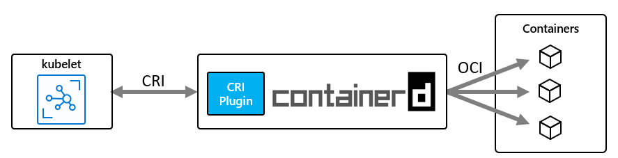

# Configure an AKS cluster

As part of creating an AKS cluster, you may need to customize your cluster configuration to suit your needs. This article introduces a few options for customizing your AKS cluster.

## OS configuration

AKS supports Ubuntu 22.04 as the only node operating system (OS) for clusters with Kubernetes 1.25 and higher. Ubuntu 18.04 can also be specified at node pool creation for Kubernetes versions 1.24 and below. 

AKS supports Windows Server 2022 as the default operating system (OS) for Windows node pools in clusters with Kubernetes 1.25 and higher. Windows Server 2019 can also be specified at node pool creation for Kubernetes versions 1.32 and below. Windows Server 2019 is being retired after Kubernetes version 1.32 reaches end of life (EOL) and isn't supported in future releases. For more information about this retirement, see the [AKS release notes][aks-release-notes].

## Container runtime configuration

A container runtime is software that executes containers and manages container images on a node. The runtime helps abstract away sys-calls or operating system (OS) specific functionality to run containers on Linux or Windows. For Linux node pools, `containerd` is used on Kubernetes version 1.19 and higher. For Windows Server 2019 and 2022 node pools, `containerd` is generally available and is the only runtime option on Kubernetes version 1.23 and higher. As of May 2023, Docker is retired and no longer supported. For more information about this retirement, see the [AKS release notes][aks-release-notes].

[`Containerd`](https://containerd.io/) is an [OCI](https://opencontainers.org/) (Open Container Initiative) compliant core container runtime that provides the minimum set of required functionality to execute containers and manage images on a node. `Containerd` was [donated](https://www.cncf.io/announcement/2017/03/29/containerd-joins-cloud-native-computing-foundation/) to the Cloud Native Compute Foundation (CNCF) in March of 2017.  AKS uses the current Moby (upstream Docker) version, which is built on top of `containerd`.

With a `containerd`-based node and node pools, instead of talking to the `dockershim`, the kubelet talks directly to `containerd` using the CRI (container runtime interface) plugin, removing extra hops in the data flow when compared to the Docker CRI implementation. As such, you see better pod startup latency and less resource (CPU and memory) usage.

By using `containerd` for AKS nodes, pod startup latency improves and node resource consumption by the container runtime decreases. These improvements through this new architecture enable kubelet communicating directly to `containerd` through the CRI plugin. While in a Moby/docker architecture, kubelet communicates to the `dockershim` and docker engine before reaching `containerd`, therefore having extra hops in the data flow. For more details on the origin of the `dockershim` and its deprecation, see the [Dockershim removal FAQ][kubernetes-dockershim-faq].



`Containerd` works on every GA version of Kubernetes in AKS, and in every newer Kubernetes version above v1.19, and supports all Kubernetes and AKS features.

> [!IMPORTANT]
> Clusters with Linux node pools created on Kubernetes v1.19 or greater default to `containerd` for its container runtime. Clusters with node pools on a earlier supported Kubernetes versions receive Docker for their container runtime. Linux node pools will be updated to `containerd` once the node pool Kubernetes version is updated to a version that supports `containerd`.
>
> `containerd` with Windows Server 2019 and 2022 node pools is generally available, and is the only container runtime option in Kubernetes 1.23 and higher. You can continue using Docker node pools and clusters on versions earlier than 1.23, but Docker is no longer supported as of May 2023. For more information, see [Add a Windows Server node pool with `containerd`][aks-add-np-containerd].
>
> We highly recommend testing your workloads on AKS node pools with `containerd` before using clusters with a Kubernetes version that supports `containerd` for your node pools.

### `containerd` limitations/differences

* For `containerd`, we recommend using [`crictl`](https://kubernetes.io/docs/tasks/debug-application-cluster/crictl) as a replacement CLI instead of the Docker CLI for **troubleshooting** pods, containers, and container images on Kubernetes nodes. For more information on `crictl`, see [General usage][general-usage] and [Client configuration options][client-config-options].

   * `Containerd` doesn't provide the complete functionality of the docker CLI. It's available for troubleshooting only.
   * `crictl` offers a more Kubernetes-friendly view of containers, with concepts like pods, etc. being present.

* `Containerd` sets up logging using the standardized `cri` logging format (which is different from what you currently get from docker's json driver). Your logging solution needs to support the `cri` logging format (like [Azure Monitor for Containers](../azure-monitor/containers/container-insights-enable-new-cluster.md))
* You can no longer access the docker engine, `/var/run/docker.sock`, or use Docker-in-Docker (DinD).

  * If you currently extract application logs or monitoring data from Docker engine, use [Container insights](../azure-monitor/containers/container-insights-enable-new-cluster.md) instead. AKS doesn't support running any out of band commands on the agent nodes that could cause instability.
  * Building images and directly using the Docker engine using the methods mentioned earlier aren't recommended. Kubernetes isn't fully aware of those consumed resources, and those methods present numerous issues as described [here](https://jpetazzo.github.io/2015/09/03/do-not-use-docker-in-docker-for-ci/) and [here](https://securityboulevard.com/2018/05/escaping-the-whale-things-you-probably-shouldnt-do-with-docker-part-1/).

* Building images - You can continue to use your current Docker build workflow as normal, unless you're building images inside your AKS cluster. In this case, consider switching to the recommended approach for building images using [ACR Tasks](../container-registry/container-registry-quickstart-task-cli.md), or a more secure in-cluster option like [Docker Buildx](https://github.com/docker/buildx).

## Generation 2 virtual machines

Azure supports [Generation 2 (Gen2) virtual machines (VMs)](../virtual-machines/generation-2.md). Generation 2 VMs support key features not supported in generation 1 VMs (Gen1). These features include increased memory, Intel Software Guard Extensions (Intel SGX), and virtualized persistent memory (vPMEM).

Generation 2 VMs use the new UEFI-based boot architecture rather than the BIOS-based architecture used by generation 1 VMs. Only specific SKUs and sizes support Gen2 VMs. Check the [list of supported sizes](../virtual-machines/generation-2.md#generation-2-vm-sizes), to see if your SKU supports or requires Gen2.

Additionally, not all VM images support Gen2 VMs. On AKS, Gen2 VMs use [AKS Ubuntu 22.04 or 18.04 image](#os-configuration) or [AKS Windows Server 2022 image](#os-configuration). These images support all Gen2 SKUs and sizes.

Gen2 VMs are supported on Linux. Gen2 VMs on Windows are supported for WS2022 only.

### Generation 2 virtual machines on Windows (preview)

[!INCLUDE [preview features callout](includes/preview/preview-callout.md)]

* Generation 2 VMs are supported on Windows for WS2022 only.
* Generation 2 VMs are default for Windows clusters greater than or equal to Kubernetes 1.25.
  * If your Kubernetes version is greater than 1.25, you only need to set the `vm_size` to get the generation 2 node pool. You can still use WS2019 generation 1 if you define that in the `os_sku`.
  * If your Kubernetes version is less than 1.25, you can set the `os_sku` to WS2022 and set the `vm_size` to generation 2 to get the generation 2 node pool.

#### Install the aks-preview Azure CLI extension

* Install or update the aks-preview Azure CLI extension using the [`az extension add`][az-extension-add] or the [`az extension update`][az-extension-update] command.

    ```azurecli
    # Install the aks-preview extension
    az extension add --name aks-preview

    # Update to the latest version of the aks-preview extension
    az extension update --name aks-preview
    ```

#### Register the AKSWindows2022Gen2Preview feature flag

1. Register the AKSWindows2022Gen2Preview feature flag using the [`az feature register`][az-feature-register] command.

    ```azurecli-interactive
    az feature register --namespace "Microsoft.ContainerService" --name "AKSWindows2022Gen2Preview"
    ```

    It takes a few minutes for the status to show *Registered*.

2. Verify the registration using the [`az feature show`][az-feature-show] command.

    ```azurecli-interactive
    az feature show --namespace "Microsoft.ContainerService" --name "AKSWindows2022Gen2Preview"
    ```

3. When the status reflects *Registered*, refresh the registration of the `Microsoft.ContainerService` resource provider using the [`az provider register`][az-provider-register] command.

    ```azurecli-interactive
    az provider register --namespace "Microsoft.ContainerService"
    ```

#### Add a Windows node pool with a generation 2 VM

* Add a node pool with generation 2 VMs on Windows using the [`az aks nodepool add`][az-aks-nodepool-add] command.

    ```azurecli
    # Sample command
    az aks nodepool add --resource-group myResourceGroup --cluster-name myAKSCluster --name gen2np 
    --kubernetes-version 1.23.5 --node-vm-size Standard_D32_v4 --os-type Windows --os-sku Windows2022

    # Default command
    az aks nodepool add --resource-group myResourceGroup --cluster-name myAKSCluster --name gen2np --os-type Windows --kubernetes-version 1.23.5
    ```

* Determine whether you're on generation 1 or generation 2 using the [`az aks nodepool show`][az-aks-nodepool-show] command, and check that the `nodeImageVersion` contains `gen2`.

    ```azurecli
    az aks nodepool show
    ```

* Check available generation 2 VM sizes using the [`az vm list`][az-vm-list] command.

    ```azurecli
    az vm list -skus -l $region
    ```

For more information, see [Support for generation 2 VMs on Azure](../virtual-machines/generation-2.md).

## Default OS disk sizing

When you create a new cluster or add a new node pool to an existing cluster, the number for vCPUs by default determines the OS disk size. The number of vCPUs is based on the VM SKU, and in the following table we list the default values:

|VM SKU Cores (vCPUs)| Default OS Disk Tier | Provisioned IOPS | Provisioned Throughput (Mbps) |
|--|--|--|--|
| 1 - 7 | P10/128G | 500 | 100 |
| 8 - 15 | P15/256G | 1100 | 125 |
| 16 - 63 | P20/512G | 2300 | 150 |
| 64+ | P30/1024G | 5000 | 200 |

> [!IMPORTANT]
> Default OS disk sizing is only used on new clusters or node pools when ephemeral OS disks are not supported and a default OS disk size isn't specified. The default OS disk size may impact the performance or cost of your cluster, and you cannot change the OS disk size after cluster or node pool creation. This default disk sizing affects clusters or node pools created on July 2022 or later.

## Use Ephemeral OS on new clusters

Configure the cluster to use ephemeral OS disks when the cluster is created. Use the `--node-osdisk-type` argument to set Ephemeral OS as the OS disk type for the new cluster.

```azurecli
az aks create --name myAKSCluster --resource-group myResourceGroup -s Standard_DS3_v2 --node-osdisk-type Ephemeral
```

If you want to create a regular cluster using network-attached OS disks, you can do so by specifying the `--node-osdisk-type=Managed` argument. You can also choose to add other ephemeral OS node pools, which we cover in the following section.

## Use Ephemeral OS on existing clusters

Configure a new node pool to use Ephemeral OS disks. Use the `--node-osdisk-type` argument to set as the OS disk type as the OS disk type for that node pool.

```azurecli
az aks nodepool add --name ephemeral --cluster-name myAKSCluster --resource-group myResourceGroup -s Standard_DS3_v2 --node-osdisk-type Ephemeral
```

> [!IMPORTANT]
> With ephemeral OS you can deploy VM and instance images up to the size of the VM cache. In the AKS case, the default node OS disk configuration uses 128 GB, which means that you need a VM size that has a cache larger than 128 GB. The default Standard_DS2_v2 has a cache size of 86 GB, which isn't large enough. The Standard_DS3_v2 has a cache size of 172 GB, which is large enough. You can also reduce the default size of the OS disk by using `--node-osdisk-size`. The minimum size for AKS images is 30 GB.

If you want to create node pools with network-attached OS disks, you can do so by specifying `--node-osdisk-type Managed`.

## Azure Linux container host for AKS

You can deploy the Azure Linux container host for through Azure CLI or ARM templates.

### Prerequisites

1. You need the Azure CLI version 2.44.1 or later installed and configured. Run `az --version` to find the version currently installed. If you need to install or upgrade, see [Install Azure CLI][azure-cli-install].
1. If you don't already have kubectl installed, install it through Azure CLI using `az aks install-cli` or follow the [upstream instructions](https://kubernetes.io/docs/tasks/tools/install-kubectl-linux/).

### Deploy an Azure Linux AKS cluster with Azure CLI

Use the following example commands to create an Azure Linux cluster.

```azurecli
az group create --name AzureLinuxTest --location eastus

az aks create --name testAzureLinuxCluster --resource-group AzureLinuxTest --os-sku AzureLinux --generate-ssh-keys

az aks get-credentials --resource-group AzureLinuxTest --name testAzureLinuxCluster

kubectl get pods --all-namespaces
```

### Deploy an Azure Linux AKS cluster with an ARM template

To add Azure Linux to an existing ARM template, you need to make the following changes:

- Add `"osSKU": "AzureLinux"` and `"mode": "System"` to agentPoolProfiles property.
- Set the apiVersion to 2021-03-01 or newer: `"apiVersion": "2021-03-01"`

The following deployment uses the ARM template `azurelinuxaksarm.json`.

```json
{
  "$schema": "https://schema.management.azure.com/schemas/2019-04-01/deploymentTemplate.json#",
  "contentVersion": "1.0.0.1",
  "parameters": {
    "clusterName": {
      "type": "string",
      "defaultValue": "azurelinuxakscluster",
      "metadata": {
        "description": "The name of the Managed Cluster resource."
      }
    },
    "location": {
      "type": "string",
      "defaultValue": "[resourceGroup().location]",
      "metadata": {
        "description": "The location of the Managed Cluster resource."
      }
    },
    "dnsPrefix": {
      "type": "string",
      "defaultValue": "azurelinux",
      "metadata": {
        "description": "Optional DNS prefix to use with hosted Kubernetes API server FQDN."
      }
    },
    "osDiskSizeGB": {
      "type": "int",
      "defaultValue": 0,
      "minValue": 0,
      "maxValue": 1023,
      "metadata": {
        "description": "Disk size (in GB) to provision for each of the agent pool nodes. This value ranges from 0 to 1023. Specifying 0 will apply the default disk size for that agentVMSize."
      }
    },
    "agentCount": {
      "type": "int",
      "defaultValue": 3,
      "minValue": 1,
      "maxValue": 50,
      "metadata": {
        "description": "The number of nodes for the cluster."
      }
    },
    "agentVMSize": {
      "type": "string",
      "defaultValue": "Standard_DS2_v2",
      "metadata": {
        "description": "The size of the Virtual Machine."
      }
    },
    "linuxAdminUsername": {
      "type": "string",
      "metadata": {
        "description": "User name for the Linux Virtual Machines."
      }
    },
    "sshRSAPublicKey": {
      "type": "string",
      "metadata": {
        "description": "Configure all linux machines with the SSH RSA public key string. Your key should include three parts, for example 'ssh-rsa AAAAB...snip...UcyupgH azureuser@linuxvm'"
      }
    },
    "osType": {
      "type": "string",
      "defaultValue": "Linux",
      "allowedValues": [
        "Linux"
      ],
      "metadata": {
        "description": "The type of operating system."
      }
    },
    "osSKU": {
      "type": "string",
      "defaultValue": "azurelinux",
      "allowedValues": [
        "AzureLinux",
        "Ubuntu",
      ],
      "metadata": {
        "description": "The Linux SKU to use."
      }
    }
  },
  "resources": [
    {
      "type": "Microsoft.ContainerService/managedClusters",
      "apiVersion": "2021-03-01",
      "name": "[parameters('clusterName')]",
      "location": "[parameters('location')]",
      "properties": {
        "dnsPrefix": "[parameters('dnsPrefix')]",
        "agentPoolProfiles": [
          {
            "name": "agentpool",
            "mode": "System",
            "osDiskSizeGB": "[parameters('osDiskSizeGB')]",
            "count": "[parameters('agentCount')]",
            "vmSize": "[parameters('agentVMSize')]",
            "osType": "[parameters('osType')]",
            "osSKU": "[parameters('osSKU')]",
            "storageProfile": "ManagedDisks"
          }
        ],
        "linuxProfile": {
          "adminUsername": "[parameters('linuxAdminUsername')]",
          "ssh": {
            "publicKeys": [
              {
                "keyData": "[parameters('sshRSAPublicKey')]"
              }
            ]
          }
        }
      },
      "identity": {
          "type": "SystemAssigned"
      }
    }
  ],
  "outputs": {
    "controlPlaneFQDN": {
      "type": "string",
      "value": "[reference(parameters('clusterName')).fqdn]"
    }
  }
}
```

Create this file on your system and include the settings defined in the `azurelinuxaksarm.json` file.

```azurecli
az group create --name AzureLinuxTest --location eastus

az deployment group create --resource-group AzureLinuxTest --template-file azurelinuxaksarm.json --parameters linuxAdminUsername=azureuser sshRSAPublicKey=`<contents of your id_rsa.pub>`

az aks get-credentials --resource-group AzureLinuxTest --name testAzureLinuxCluster

kubectl get pods --all-namespaces
```

### Deploy an Azure Linux AKS cluster with Terraform

To deploy an Azure Linux cluster with Terraform, you first need to set your `azurerm` provider to version 2.76 or higher.

```
required_providers {
  azurerm = {
    source = "hashicorp/azurerm"
    version = "~> 2.76"
  }
}
```

Once you've updated your `azurerm` provider, you can specify the AzureLinux `os_sku` in `default_node_pool`.

```
default_node_pool {
  name = "default"
  node_count = 2
  vm_size = "Standard_D2_v2"
  os_sku = "AzureLinux"
}
```

Similarly, you can specify the AzureLinux `os_sku` in [`azurerm_kubernetes_cluster_node_pool`][azurerm-azurelinux].

## Custom resource group name

When you deploy an Azure Kubernetes Service cluster in Azure, it also creates a second resource group for the worker nodes. By default, AKS names the node resource group `MC_resourcegroupname_clustername_location`, but you can specify a custom name.

To specify a custom resource group name, install the `aks-preview` Azure CLI extension version 0.3.2 or later. When using the Azure CLI, include the `--node-resource-group` parameter with the `az aks create` command to specify a custom name for the resource group. To deploy an AKS cluster with an Azure Resource Manager template, you can define the resource group name by using the `nodeResourceGroup` property.

```azurecli
az aks create --name myAKSCluster --resource-group myResourceGroup --node-resource-group myNodeResourceGroup
```

The Azure resource provider in your subscription automatically creates the secondary resource group. You can only specify the custom resource group name during cluster creation.

As you work with the node resource group, keep in mind that you can't:

- Specify an existing resource group for the node resource group.
- Specify a different subscription for the node resource group.
- Change the node resource group name after creating the cluster.
- Specify names for the managed resources within the node resource group.
- Modify or delete Azure-created tags of managed resources within the node resource group.

## Node Restriction (Preview)

The [Node Restriction](https://kubernetes.io/docs/reference/access-authn-authz/admission-controllers/#noderestriction) admission controller limits the Node and Pod objects a kubelet can modify. Node Restriction is on by default in AKS 1.24+ clusters.  If you're using an older version, use the following commands to create a cluster with Node Restriction, or update an existing cluster to add Node Restriction.

[!INCLUDE [preview features callout](./includes/preview/preview-callout.md)]

### Before you begin

You must have the following resource installed:

* The Azure CLI
* The `aks-preview` extension version 0.5.95 or later

#### Install the aks-preview CLI extension

```azurecli-interactive
# Install the aks-preview extension
az extension add --name aks-preview

# Update the extension to make sure you have the latest version installed
az extension update --name aks-preview
```

### Create an AKS cluster with Node Restriction

To create a cluster using Node Restriction.

```azurecli-interactive
az aks create -n aks -g myResourceGroup --enable-node-restriction
```

### Update an AKS cluster with Node Restriction

To update a cluster to use Node Restriction.

```azurecli-interactive
az aks update -n aks -g myResourceGroup --enable-node-restriction
```

### Remove Node Restriction from an AKS cluster

To remove Node Restriction from a cluster.

```azurecli-interactive
az aks update -n aks -g myResourceGroup --disable-node-restriction
```

## Fully managed resource group (Preview)

AKS deploys infrastructure into your subscription for connecting to and running your applications.  Changes made directly to resources in the [node resource group][whatis-nrg] can affect cluster operations or cause issues later.  For example, scaling, storage, or network configuration should be through the Kubernetes API, and not directly on these resources.

To prevent changes from being made to the Node Resource Group, you can apply a deny assignment and block users from modifying resources created as part of the AKS cluster.

[!INCLUDE [preview features callout](./includes/preview/preview-callout.md)]

### Before you begin

You must have the following resources installed:

* The Azure CLI version 2.44.0 or later. Run `az --version` to find the current version, and if you need to install or upgrade, see [Install Azure CLI][azure-cli-install]. 
* The `aks-preview` extension version 0.5.126 or later

#### Install the aks-preview CLI extension

```azurecli-interactive
# Install the aks-preview extension
az extension add --name aks-preview

# Update the extension to make sure you have the latest version installed
az extension update --name aks-preview
```

#### Register the 'NRGLockdownPreview' feature flag

Register the `NRGLockdownPreview` feature flag by using the [az feature register][az-feature-register] command, as shown in the following example:

```azurecli-interactive
az feature register --namespace "Microsoft.ContainerService" --name "NRGLockdownPreview"
```

It takes a few minutes for the status to show *Registered*. Verify the registration status by using the [az feature show][az-feature-show] command:

```azurecli-interactive
az feature show --namespace "Microsoft.ContainerService" --name "NRGLockdownPreview"
```
When the status reflects *Registered*, refresh the registration of the *Microsoft.ContainerService* resource provider by using the [az provider register][az-provider-register] command:

```azurecli-interactive
az provider register --namespace Microsoft.ContainerService
```

### Create an AKS cluster with node resource group lockdown

To create a cluster using node resource group lockdown, set the `--nrg-lockdown-restriction-level` to **ReadOnly**. This configuration allows you to view the resources, but not modify them.

```azurecli-interactive
az aks create -n aksTest -g aksTest --nrg-lockdown-restriction-level ReadOnly
```

### Update an existing cluster with node resource group lockdown

```azurecli-interactive
az aks update -n aksTest -g aksTest --nrg-lockdown-restriction-level ReadOnly
```

### Remove node resource group lockdown from a cluster

```azurecli-interactive
az aks update -n aksTest -g aksTest --nrg-lockdown-restriction-level Unrestricted
```


## Next steps

- Learn how to [upgrade the node images](node-image-upgrade.md) in your cluster.
- Review [Baseline architecture for an Azure Kubernetes Service (AKS) cluster][baseline-reference-architecture-aks] to learn about our recommended baseline infrastructure architecture.
- See [Upgrade an Azure Kubernetes Service (AKS) cluster](upgrade-cluster.md) to learn how to upgrade your cluster to the latest version of Kubernetes.
- Read more about [`containerd` and Kubernetes](https://kubernetes.io/blog/2018/05/24/kubernetes-containerd-integration-goes-ga/)
- See the list of [Frequently asked questions about AKS](faq.md) to find answers to some common AKS questions.
- Read more about [Ephemeral OS disks](../virtual-machines/ephemeral-os-disks.md).

<!-- LINKS - external -->
[aks-release-notes]: https://github.com/Azure/AKS/releases
[azurerm-azurelinux]: https://registry.terraform.io/providers/hashicorp/azurerm/latest/docs/resources/kubernetes_cluster_node_pool#os_sku
[general-usage]: https://kubernetes.io/docs/tasks/debug/debug-cluster/crictl/#general-usage
[client-config-options]: https://github.com/kubernetes-sigs/cri-tools/blob/master/docs/crictl.md#client-configuration-options
[kubernetes-dockershim-faq]: https://kubernetes.io/blog/2022/02/17/dockershim-faq/#why-was-the-dockershim-removed-from-kubernetes

<!-- LINKS - internal -->
[azure-cli-install]: /cli/azure/install-azure-cli
[az-feature-register]: /cli/azure/feature#az_feature_register
[az-feature-list]: /cli/azure/feature#az_feature_list
[az-provider-register]: /cli/azure/provider#az_provider_register
[az-extension-add]: /cli/azure/extension#az_extension_add
[az-extension-update]: /cli/azure/extension#az_extension_update
[az-feature-register]: /cli/azure/feature#az_feature_register
[az-feature-list]: /cli/azure/feature#az_feature_list
[az-provider-register]: /cli/azure/provider#az_provider_register
[aks-add-np-containerd]: create-node-pools.md#add-a-windows-server-node-pool-with-containerd
[az-aks-create]: /cli/azure/aks#az-aks-create
[az-aks-update]: /cli/azure/aks#az-aks-update
[baseline-reference-architecture-aks]: /azure/architecture/reference-architectures/containers/aks/baseline-aks
[whatis-nrg]: ./concepts-clusters-workloads.md#node-resource-group
[az-feature-show]: /cli/azure/feature#az_feature_show
[az-aks-nodepool-add]: /cli/azure/aks/nodepool#az_aks_nodepool_add
[az-aks-nodepool-show]: /cli/azure/aks/nodepool#az_aks_nodepool_show
[az-vm-list]: /cli/azure/vm#az_vm_list
