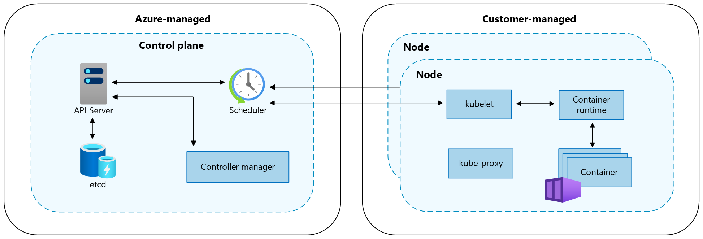
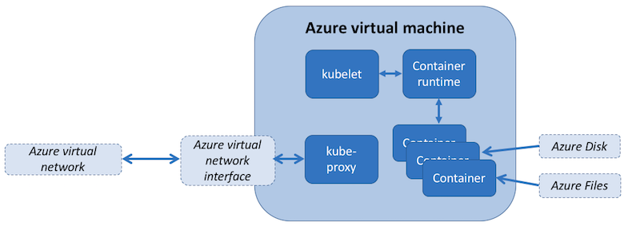
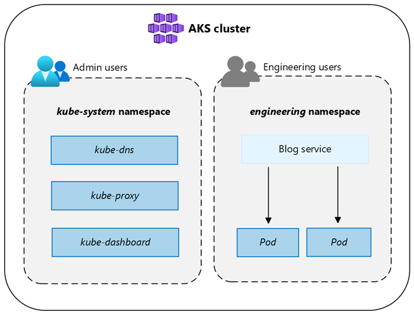

# Kubernetes core concepts for Azure Kubernetes Service (AKS)

Application development continues to move toward a container-based approach, increasing our need to orchestrate and manage resources. As the leading platform, Kubernetes provides reliable scheduling of fault-tolerant application workloads. Azure Kubernetes Service (AKS), a managed Kubernetes offering, further simplifies container-based application deployment and management.

This article introduces:
* Core Kubernetes infrastructure components:
    * *control plane*
    * *nodes*
    * *node pools*
* Workload resources: 
    * *pods*
    * *deployments*
    * *sets* 
* How to group resources into *namespaces*.

## What is Kubernetes?

Kubernetes is a rapidly evolving platform that manages container-based applications and their associated networking and storage components. Kubernetes focuses on the application workloads, not the underlying infrastructure components. Kubernetes provides a declarative approach to deployments, backed by a robust set of APIs for management operations.

You can build and run modern, portable, microservices-based applications, using Kubernetes to orchestrate and manage the availability of the application components. Kubernetes supports both stateless and stateful applications as teams progress through the adoption of microservices-based applications.

As an open platform, Kubernetes allows you to build your applications with your preferred programming language, OS, libraries, or messaging bus. Existing continuous integration and continuous delivery (CI/CD) tools can integrate with Kubernetes to schedule and deploy releases.

AKS provides a managed Kubernetes service that reduces the complexity of deployment and core management tasks, like upgrade coordination. The Azure platform manages the AKS control plane, and you only pay for the AKS nodes that run your applications.

## Kubernetes cluster architecture

A Kubernetes cluster is divided into two components:

- *Control plane*: provides the core Kubernetes services and orchestration of application workloads.
- *Nodes*: run your application workloads.



## Control plane

When you create an AKS cluster, a control plane is automatically created and configured. This control plane is provided at no cost as a managed Azure resource abstracted from the user. You only pay for the nodes attached to the AKS cluster. The control plane and its resources reside only on the region where you created the cluster.

The control plane includes the following core Kubernetes components:

| Component | Description |  
| ----------------- | ------------- |  
| *kube-apiserver*                                                                                 | The API server is how the underlying Kubernetes APIs are exposed. This component provides the interaction for management tools, such as `kubectl` or the Kubernetes dashboard.                                                        |  
| *etcd* | To maintain the state of your Kubernetes cluster and configuration, the highly available *etcd* is a key value store within Kubernetes.                                      |  
| *kube-scheduler*                                                                            | When you create or scale applications, the Scheduler determines what nodes can run the workload and starts them.                                                                                    |  
| *kube-controller-manager*                                                                            | The Controller Manager oversees a number of smaller controllers that perform actions such as replicating pods and handling node operations.                                                                  |  

AKS provides a single-tenant control plane, with a dedicated API server, scheduler, etc. You define the number and size of the nodes, and the Azure platform configures the secure communication between the control plane and nodes. Interaction with the control plane occurs through Kubernetes APIs, such as `kubectl` or the Kubernetes dashboard.

While you don't need to configure components (like a highly available *etcd* store) with this managed control plane, you can't access the control plane directly. Kubernetes control plane and node upgrades are orchestrated through the Azure CLI or Azure portal. To troubleshoot possible issues, you can review the control plane logs through Azure Monitor logs.

To configure or directly access a control plane, deploy a self-managed Kubernetes cluster using [Cluster API Provider Azure][cluster-api-provider-azure].

For associated best practices, see [Best practices for cluster security and upgrades in AKS][operator-best-practices-cluster-security].

For AKS cost management information, see [AKS cost basics](/azure/architecture/aws-professional/eks-to-aks/cost-management#aks-cost-basics) and [Pricing for AKS](https://azure.microsoft.com/pricing/details/kubernetes-service/#pricing).

## Nodes and node pools

To run your applications and supporting services, you need a Kubernetes *node*. An AKS cluster has at least one node, an Azure virtual machine (VM) that runs the Kubernetes node components and container runtime.

| Component | Description |  
| ----------------- | ------------- |  
| `kubelet` | The Kubernetes agent that processes the orchestration requests from the control plane along with scheduling and running the requested containers. |  
| *kube-proxy* | Handles virtual networking on each node. The proxy routes network traffic and manages IP addressing for services and pods. |  
| *container runtime* | Allows containerized applications to run and interact with additional resources, such as the virtual network and storage. AKS clusters using Kubernetes version 1.19+ for Linux node pools use `containerd` as their container runtime. Beginning in Kubernetes version 1.20 for Windows node pools, `containerd` can be used in preview for the container runtime, but Docker is still the default container runtime. AKS clusters using prior versions of Kubernetes for node pools use Docker as their container runtime. |  



The Azure VM size for your nodes defines CPUs, memory, size, and the storage type available (such as high-performance SSD or regular HDD). Plan the node size around whether your applications may require large amounts of CPU and memory or high-performance storage. Scale out the number of nodes in your AKS cluster to meet demand. For more information on scaling, see [Scaling options for applications in AKS](concepts-scale.md).

In AKS, the VM image for your cluster's nodes is based on Ubuntu Linux, [Azure Linux](use-azure-linux.md), or Windows Server 2019. When you create an AKS cluster or scale out the number of nodes, the Azure platform automatically creates and configures the requested number of VMs. Agent nodes are billed as standard VMs, so any VM size discounts (including [Azure reservations][reservation-discounts]) are automatically applied.

For managed disks, the default disk size and performance will be assigned according to the selected VM SKU and vCPU count. For more information, see [Default OS disk sizing](cluster-configuration.md#default-os-disk-sizing).

If you need advanced configuration and control on your Kubernetes node container runtime and OS, you can deploy a self-managed cluster using [Cluster API Provider Azure][cluster-api-provider-azure].

### Resource reservations

AKS uses node resources to help the node function as part of your cluster. This usage can create a discrepancy between your node's total resources and the allocatable resources in AKS. Remember this information when setting requests and limits for user deployed pods.

To find a node's allocatable resources, run:
```kubectl
kubectl describe node [NODE_NAME]
```

To maintain node performance and functionality, AKS reserves resources on each node. As a node grows larger in resources, the resource reservation grows due to a higher need for management of user-deployed pods.

>[!NOTE]
> Using AKS add-ons such as Container Insights (OMS) will consume additional node resources.

Two types of resources are reserved:

#### CPU

Reserved CPU is dependent on node type and cluster configuration, which may cause less allocatable CPU due to running additional features.

| CPU cores on host | 1    | 2    | 4    | 8    | 16 | 32|64|
|---|---|---|---|---|---|---|---|
|Kube-reserved (millicores)|60|100|140|180|260|420|740|

#### Memory

Memory utilized by AKS includes the sum of two values.

> [!IMPORTANT]
> AKS 1.28 includes certain changes to memory reservations. These changes are detailed in the following section.

**AKS 1.28 and later**

1. **`kubelet` daemon** has the *memory.available<100Mi* eviction rule by default. This ensures that a node always has at least 100Mi allocatable at all times. When a host is below that available memory threshold, the `kubelet` triggers the termination of one of the running pods and frees up memory on the host machine.
2. **A rate of memory reservations** set according to the lesser value of: *20MB * Max Pods supported on the Node + 50MB* or *25% of the total system memory resources*.

    **Examples**:
   * If the VM provides 8GB of memory and the node supports up to 30 pods, AKS reserves *20MB * 30 Max Pods + 50MB = 650MB* for kube-reserved. `Allocatable space = 8GB - 0.65GB (kube-reserved) - 0.1GB (eviction threshold) = 7.25GB or 90.625% allocatable.`
   * If the VM provides 4GB of memory and the node supports up to 70 pods, AKS reserves *25% * 4GB = 1000MB* for kube-reserved, as this is less than *20MB * 70 Max Pods + 50MB = 1450MB*.

    For more information, see [Configure maximum pods per node in an AKS cluster](./azure-cni-overview.md#maximum-pods-per-node).

**AKS versions prior to 1.28**

1. **`kubelet` daemon** is installed on all Kubernetes agent nodes to manage container creation and termination. By default on AKS, `kubelet` daemon has the *memory.available<750Mi* eviction rule, ensuring a node must always have at least 750Mi allocatable at all times. When a host is below that available memory threshold, the `kubelet` will trigger to terminate one of the running pods and free up memory on the host machine.

2. **A regressive rate of memory reservations** for the kubelet daemon to properly function (*kube-reserved*).
   * 25% of the first 4GB of memory
   * 20% of the next 4GB of memory (up to 8GB)
   * 10% of the next 8GB of memory (up to 16GB)
   * 6% of the next 112GB of memory (up to 128GB)
   * 2% of any memory above 128GB

>[!NOTE]
> AKS reserves an additional 2GB for system process in Windows nodes that are not part of the calculated memory.

Memory and CPU allocation rules are designed to do the following:

* Keep agent nodes healthy, including some hosting system pods critical to cluster health.
* Cause the node to report less allocatable memory and CPU than it would report if it weren't part of a Kubernetes cluster.

The above resource reservations can't be changed.

For example, if a node offers 7 GB, it will report 34% of memory not allocatable including the 750Mi hard eviction threshold.

`0.75 + (0.25*4) + (0.20*3) = 0.75GB + 1GB + 0.6GB = 2.35GB / 7GB = 33.57% reserved`

In addition to reservations for Kubernetes itself, the underlying node OS also reserves an amount of CPU and memory resources to maintain OS functions.

For associated best practices, see [Best practices for basic scheduler features in AKS][operator-best-practices-scheduler].

### Node pools

> [!NOTE]
> The Azure Linux node pool is now generally available (GA). To learn about the benefits and deployment steps, see the [Introduction to the Azure Linux Container Host for AKS][intro-azure-linux].

Nodes of the same configuration are grouped together into *node pools*. A Kubernetes cluster contains at least one node pool. The initial number of nodes and size are defined when you create an AKS cluster, which creates a *default node pool*. This default node pool in AKS contains the underlying VMs that run your agent nodes.

> [!NOTE]
> To ensure your cluster operates reliably, you should run at least two (2) nodes in the default node pool.

You scale or upgrade an AKS cluster against the default node pool. You can choose to scale or upgrade a specific node pool. For upgrade operations, running containers are scheduled on other nodes in the node pool until all the nodes are successfully upgraded.

For more information about how to use multiple node pools in AKS, see [Create multiple node pools for a cluster in AKS][use-multiple-node-pools].

### Node selectors

In an AKS cluster with multiple node pools, you may need to tell the Kubernetes Scheduler which node pool to use for a given resource. For example, ingress controllers shouldn't run on Windows Server nodes. 

Node selectors let you define various parameters, like node OS, to control where a pod should be scheduled.

The following basic example schedules an NGINX instance on a Linux node using the node selector *"kubernetes.io/os": linux*:

```yaml
kind: Pod
apiVersion: v1
metadata:
  name: nginx
spec:
  containers:
    - name: myfrontend
      image: mcr.microsoft.com/oss/nginx/nginx:1.15.12-alpine
  nodeSelector:
    "kubernetes.io/os": linux
```

For more information on how to control where pods are scheduled, see [Best practices for advanced scheduler features in AKS][operator-best-practices-advanced-scheduler].

### Node resource group

When you create an AKS cluster, you need to specify a resource group to create the cluster resource in. In addition to this resource group, the AKS resource provider also creates and manages a separate resource group called the node resource group. The *node resource group* contains the following infrastructure resources:

- The virtual machine scale sets and VMs for every node in the node pools
- The virtual network for the cluster
- The storage for the cluster

The node resource group is assigned a name by default, such as *MC_myResourceGroup_myAKSCluster_eastus*. During cluster creation, you also have the option to specify the name assigned to your node resource group. When you delete your AKS cluster, the AKS resource provider automatically deletes the node resource group.

The node resource group has the following limitations:

* You can't specify an existing resource group for the node resource group.
* You can't specify a different subscription for the node resource group.
* You can't change the node resource group name after the cluster has been created.
* You can't specify names for the managed resources within the node resource group.
* You can't modify or delete Azure-created tags of managed resources within the node resource group.

If you modify or delete Azure-created tags and other resource properties in the node resource group, you could get unexpected results, such as scaling and upgrading errors.  As AKS manages the lifecycle of infrastructure in the Node Resource Group, any changes will move your cluster into an [unsupported state][aks-support].

A common scenario where customers want to modify resources is through tags.  AKS allows you to create and modify tags that are propagated to resources in the Node Resource Group, and you can add those tags when [creating or updating][aks-tags] the cluster. You might want to create or modify custom tags, for example, to assign a business unit or cost center. This can also be achieved by creating Azure Policies with a scope on the managed resource group.

Modifying any **Azure-created tags** on resources under the node resource group in the AKS cluster is an unsupported action, which breaks the service-level objective (SLO). For more information, see [Does AKS offer a service-level agreement?][aks-service-level-agreement]

To reduce the chance of changes in the node resource group affecting your clusters, you can enable node resource group lockdown to apply a deny assignment to your AKS resources. More information can be found in [Cluster configuration in AKS][configure-nrg].

> [!WARNING]
> If you don't have node resource group lockdown enabled, you can directly modify any resource in the node resource group. Directly modifying resources in the node resource group can cause your cluster to become unstable or unresponsive.

## Pods

Kubernetes uses *pods* to run an instance of your application. A pod represents a single instance of your application. 

Pods typically have a 1:1 mapping with a container. In advanced scenarios, a pod may contain multiple containers. Multi-container pods are scheduled together on the same node, and allow containers to share related resources.

When you create a pod, you can define *resource requests* to request a certain amount of CPU or memory resources. The Kubernetes Scheduler tries to meet the request by scheduling the pods to run on a node with available resources. You can also specify maximum resource limits to prevent a pod from consuming too much compute resource from the underlying node. Best practice is to include resource limits for all pods to help the Kubernetes Scheduler identify necessary, permitted resources.

For more information, see [Kubernetes pods][kubernetes-pods] and [Kubernetes pod lifecycle][kubernetes-pod-lifecycle].

A pod is a logical resource, but application workloads run on the containers. Pods are typically ephemeral, disposable resources. Individually scheduled pods miss some of the high availability and redundancy Kubernetes features. Instead, pods are deployed and managed by Kubernetes *Controllers*, such as the Deployment Controller.

## Deployments and YAML manifests

A *deployment* represents identical pods managed by the Kubernetes Deployment Controller. A deployment defines the number of pod *replicas* to create. The Kubernetes Scheduler ensures that additional pods are scheduled on healthy nodes if pods or nodes encounter problems.

You can update deployments to change the configuration of pods, container image used, or attached storage. The Deployment Controller:
* Drains and terminates a given number of replicas.
* Creates replicas from the new deployment definition.
* Continues the process until all replicas in the deployment are updated.

Most stateless applications in AKS should use the deployment model rather than scheduling individual pods. Kubernetes can monitor deployment health and status to ensure that the required number of replicas run within the cluster. When scheduled individually, pods aren't restarted if they encounter a problem, and aren't rescheduled on healthy nodes if their current node encounters a problem.

You don't want to disrupt management decisions with an update process if your application requires a minimum number of available instances. *Pod Disruption Budgets* define how many replicas in a deployment can be taken down during an update or node upgrade. For example, if you have *five (5)* replicas in your deployment, you can define a pod disruption of *4 (four)* to only allow one replica to be deleted or rescheduled at a time. As with pod resource limits, best practice is to define pod disruption budgets on applications that require a minimum number of replicas to always be present.

Deployments are typically created and managed with `kubectl create` or `kubectl apply`. Create a deployment by defining a manifest file in the YAML format.

The following example creates a basic deployment of the NGINX web server. The deployment specifies *three (3)* replicas to be created, and requires port *80* to be open on the container. Resource requests and limits are also defined for CPU and memory.

```yaml
apiVersion: apps/v1
kind: Deployment
metadata:
  name: nginx
spec:
  replicas: 3
  selector:
    matchLabels:
      app: nginx
  template:
    metadata:
      labels:
        app: nginx
    spec:
      containers:
      - name: nginx
        image: mcr.microsoft.com/oss/nginx/nginx:1.15.2-alpine
        ports:
        - containerPort: 80
        resources:
          requests:
            cpu: 250m
            memory: 64Mi
          limits:
            cpu: 500m
            memory: 256Mi
```

A breakdown of the deployment specifications in the YAML manifest file is as follows:

| Specification | Description |  
| ----------------- | ------------- |  
| `.apiVersion` | Specifies the API group and API resource you want to use when creating the resource. |  
| `.kind` | Specifies the type of resource you want to create. |  
| `.metadata.name` | Specifies the name of the deployment. This file will run the *nginx* image from Docker Hub. |  
| `.spec.replicas` | Specifies how many pods to create. This file will create three duplicate pods. |  
| `.spec.selector` | Specifies which pods will be affected by this deployment. |
| `.spec.selector.matchLabels` | Contains a map of *{key, value}* pairs that allow the deployment to find and manage the created pods. |  
| `.spec.selector.matchLabels.app` | Has to match `.spec.template.metadata.labels`. |  
| `.spec.template.labels` | Specifies the *{key, value}* pairs attached to the object. |  
| `.spec.template.app` | Has to match `.spec.selector.matchLabels`. |  
| `.spec.spec.containers` | Specifies the list of containers belonging to the pod. |  
| `.spec.spec.containers.name` | Specifies the name of the container specified as a DNS label. |
| `.spec.spec.containers.image` | Specifies the container image name. |
| `.spec.spec.containers.ports` | Specifies the list of ports to expose from the container. |  
| `.spec.spec.containers.ports.containerPort` | Specifies the number of ports to expose on the pod's IP address. |  
| `.spec.spec.resources` | Specifies the compute resources required by the container. |
| `.spec.spec.resources.requests` | Specifies the minimum amount of compute resources required. |
| `.spec.spec.resources.requests.cpu` | Specifies the minimum amount of CPU required. |
| `.spec.spec.resources.requests.memory` | Specifies the minimum amount of memory required. |
| `.spec.spec.resources.limits` | Specifies the maximum amount of compute resources allowed. This limit is enforced by the kubelet. |
| `.spec.spec.resources.limits.cpu` | Specifies the maximum amount of CPU allowed. This limit is enforced by the kubelet. |
| `.spec.spec.resources.limits.memory` | Specifies the maximum amount of memory allowed. This limit is enforced by the kubelet. |

More complex applications can be created by including services (such as load balancers) within the YAML manifest.

For more information, see [Kubernetes deployments][kubernetes-deployments].

### Package management with Helm

[Helm][helm] is commonly used to manage applications in Kubernetes. You can deploy resources by building and using existing public Helm *charts* that contain a packaged version of application code and Kubernetes YAML manifests. You can store Helm charts either locally or in a remote repository, such as an [Azure Container Registry Helm chart repo][acr-helm].

To use Helm, install the Helm client on your computer, or use the Helm client in the [Azure Cloud Shell][azure-cloud-shell]. Search for or create Helm charts, and then install them to your Kubernetes cluster. For more information, see [Install existing applications with Helm in AKS][aks-helm].

## StatefulSets and DaemonSets

Using the Kubernetes Scheduler, the Deployment Controller runs replicas on any available node with available resources. While this approach may be sufficient for stateless applications, the Deployment Controller isn't ideal for applications that require:

* A persistent naming convention or storage.
* A replica to exist on each select node within a cluster.

Two Kubernetes resources, however, let you manage these types of applications:

- *StatefulSets* maintain the state of applications beyond an individual pod lifecycle, such as storage.
- *DaemonSets* ensure a running instance on each node, early in the Kubernetes bootstrap process.

### StatefulSets

Modern application development often aims for stateless applications. For stateful applications, like those that include database components, you can use *StatefulSets*. Like deployments, a StatefulSet creates and manages at least one identical pod. Replicas in a StatefulSet follow a graceful, sequential approach to deployment, scale, upgrade, and termination. The naming convention, network names, and storage persist as replicas are rescheduled with a StatefulSet.

Define the application in YAML format using `kind: StatefulSet`. From there, the StatefulSet Controller handles the deployment and management of the required replicas. Data is written to persistent storage, provided by Azure Managed Disks or Azure Files. With StatefulSets, the underlying persistent storage remains, even when the StatefulSet is deleted.

For more information, see [Kubernetes StatefulSets][kubernetes-statefulsets].

Replicas in a StatefulSet are scheduled and run across any available node in an AKS cluster. To ensure at least one pod in your set runs on a node, you use a DaemonSet instead.

### DaemonSets

For specific log collection or monitoring, you may need to run a pod on all, or selected, nodes. You can use *DaemonSet* deploy on one or more identical pods, but the DaemonSet Controller ensures that each node specified runs an instance of the pod.

The DaemonSet Controller can schedule pods on nodes early in the cluster boot process, before the default Kubernetes scheduler has started. This ability ensures that the pods in a DaemonSet are started before traditional pods in a Deployment or StatefulSet are scheduled.

Like StatefulSets, a DaemonSet is defined as part of a YAML definition using `kind: DaemonSet`.

For more information, see [Kubernetes DaemonSets][kubernetes-daemonset].

> [!NOTE]
> If using the [Virtual Nodes add-on](virtual-nodes-cli.md#enable-the-virtual-nodes-addon), DaemonSets will not create pods on the virtual node.

## Namespaces

Kubernetes resources, such as pods and deployments, are logically grouped into a *namespace* to divide an AKS cluster and create, view, or manage access to resources. For example, you can create namespaces to separate business groups. Users can only interact with resources within their assigned namespaces.



When you create an AKS cluster, the following namespaces are available:

| Namespace | Description |  
| ----------------- | ------------- |  
| *default*                                                                                 | Where pods and deployments are created by default when none is provided. In smaller environments, you can deploy applications directly into the default namespace without creating additional logical separations. When you interact with the Kubernetes API, such as with `kubectl get pods`, the default namespace is used when none is specified.                                                        |  
| *kube-system* | Where core resources exist, such as network features like DNS and proxy, or the Kubernetes dashboard. You typically don't deploy your own applications into this namespace.                                      |  
| *kube-public*                                                                            | Typically not used, but can be used for resources to be visible across the whole cluster, and can be viewed by any user.                                                                                    |  


For more information, see [Kubernetes namespaces][kubernetes-namespaces].

## Next steps

This article covers some of the core Kubernetes components and how they apply to AKS clusters. For more information on core Kubernetes and AKS concepts, see the following articles:

- [Kubernetes / AKS access and identity][aks-concepts-identity]
- [Kubernetes / AKS security][aks-concepts-security]
- [Kubernetes / AKS virtual networks][aks-concepts-network]
- [Kubernetes / AKS storage][aks-concepts-storage]
- [Kubernetes / AKS scale][aks-concepts-scale]

<!-- EXTERNAL LINKS -->
[cluster-api-provider-azure]: https://github.com/kubernetes-sigs/cluster-api-provider-azure
[kubernetes-pods]: https://kubernetes.io/docs/concepts/workloads/pods/pod-overview/
[kubernetes-pod-lifecycle]: https://kubernetes.io/docs/concepts/workloads/pods/pod-lifecycle/
[kubernetes-deployments]: https://kubernetes.io/docs/concepts/workloads/controllers/deployment/
[kubernetes-statefulsets]: https://kubernetes.io/docs/concepts/workloads/controllers/statefulset/
[kubernetes-daemonset]: https://kubernetes.io/docs/concepts/workloads/controllers/daemonset/
[kubernetes-namespaces]: https://kubernetes.io/docs/concepts/overview/working-with-objects/namespaces/
[helm]: https://helm.sh/
[azure-cloud-shell]: https://shell.azure.com

<!-- INTERNAL LINKS -->
[aks-concepts-identity]: concepts-identity.md
[aks-concepts-security]: concepts-security.md
[aks-concepts-scale]: concepts-scale.md
[aks-concepts-storage]: concepts-storage.md
[aks-concepts-network]: concepts-network.md
[acr-helm]: ../container-registry/container-registry-helm-repos.md
[aks-helm]: kubernetes-helm.md
[operator-best-practices-cluster-security]: operator-best-practices-cluster-security.md
[operator-best-practices-scheduler]: operator-best-practices-scheduler.md
[use-multiple-node-pools]: create-node-pools.md
[operator-best-practices-advanced-scheduler]: operator-best-practices-advanced-scheduler.md
[reservation-discounts]:../cost-management-billing/reservations/save-compute-costs-reservations.md
[configure-nrg]: ./cluster-configuration.md#fully-managed-resource-group-preview
[aks-service-level-agreement]: faq.md#does-aks-offer-a-service-level-agreement
[aks-tags]: use-tags.md
[aks-support]: support-policies.md#user-customization-of-agent-nodes
[intro-azure-linux]: ../azure-linux/intro-azure-linux.md
