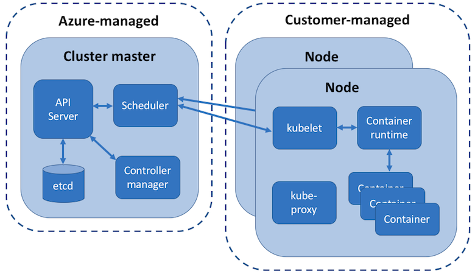

# Kubernetes core concepts for Azure Kubernetes Service (AKS)

As application development has moved towards a contained-based approach, the need to orchestrate and manage the inter-connected resources becomes important. Kubernetes is the leading platform that provides the ability to provide reliable scheduling of fault-tolerant application workloads. Azure Kubernetes Service (AKS) is a managed Kubernetes offering that further simplifies container-based application deployment and management.

This article introduces the core Kubernetes infrastructure components such as the *cluster master*, *nodes*, and *node pools*. Workload resources such as *pods*, *deployments*, and *sets* are also introduced, along with how to group resources into *namespaces*.

## What is Kubernetes?

Kubernetes is a rapidly evolving platform that manages container-based applications and their associated networking and storage components. The focus is on the application workloads, not the underlying infrastructure components. Kubernetes provides a declarative approach to deployments, backed by a robust set of APIs for management operations.

You can build and run modern, portable, microservices-based applications that benefit from Kubernetes orchestrating and managing the availability of those application components. Kubernetes supports both stateless and stateful applications as teams progress through the adoption of microservices-based applications.

As an open platform, Kubernetes allows you to build your applications with your preferred programming language, OS, libraries, or messaging bus. Existing continuous integration and continuous delivery (CI/CD) tools can integrate with Kubernetes to schedule and deploy releases.

Azure Kubernetes Service (AKS) provides a managed Kubernetes service, built on top of the open-source Azure Container Service Engine (acs-engine). With this managed Kubernetes approach, the Azure platform handles the deployment and core management tasks, including co-ordinating upgrades.

## Kubernetes cluster architecture

A Kubernetes cluster is divided into two components:

- *Cluster master* nodes provide the core Kubernetes services and orchestration of application workloads.
- *Nodes* run your application workloads.



## Cluster master

When you create an AKS cluster, a cluster master is automatically created and configured. This cluster master is provided as a managed Azure resource abstracted from the user. There is no cost for the cluster master, only the nodes that are part of the AKS cluster.

The cluster master includes the following core Kubernetes components:

- *kube-apiserver* - The API server is how the underlying Kubernetes APIs are exposed. This component provides the interaction for management tools, such as `kubectl` or the Kubernetes dashboard.
- *etcd* - To maintain the state of your Kubernetes cluster and configuration, the highly available *etcd* is a key value store within Kubernetes.
- *kube-scheduler* - When you create or scale applications, the Scheduler determines what nodes can run the workload and starts them.
- *kube-controller-manager* - The Controller Manager oversees a number of smaller Controllers that perform actions such as replicating pods and handling node operations.

AKS provides a single-tenant cluster master, with a dedicated API server, Scheduler, etc. You define the number and size of the nodes, and the Azure platform configures the secure communication between the cluster master and nodes. Interaction with the cluster master occurs through Kubernetes APIs, such as `kubectl` or the Kubernetes dashboard.

This managed cluster master means that you do not need to configure components like a highly available *etcd* store, but it also means that you cannot access the cluster master directly. Upgrades to Kubernetes are orchestrated through the Azure CLI or Azure portal, which upgrades the cluster master and then the nodes. To troubleshoot possible issues, you can review the cluster master logs through Azure Log Analytics.

If you need to configure the cluster master in a particular way or need direct access to them, you can deploy your own Kubernetes cluster using [acs-engine][acs-engine].

## Nodes and node pools

To run your applications and supporting services, you need a Kubernetes *node*. An AKS cluster has one or more nodes, which is an Azure virtual machine (VM) that runs the Kubernetes node components and container runtime:

- The `kubelet` is the Kubernetes agent that processes the orchestration requests from the cluster master and scheduling of running the requested containers.
- Virtual networking is handled by the *kube-proxy* on each node. The proxy routes network traffic and manages IP addressing for services and pods.
- The *container runtime* is the component that allows containerized applications to run and interact with additional resources such as the virtual network and storage. In AKS, Docker is used as the container runtime.

The Azure VM size for your nodes defines how many CPUs, how much memory, and the size and type of storage available (such as high-performance SSD or regular HDD). If you anticipate a need for applications that require large amounts of CPU and memory or high-performance storage, plan the node size accordingly. You can also scale up the number of nodes in your AKS cluster to meet demand.

In AKS, the VM image for the nodes in your cluster is currently based on Ubuntu Linux. When you create an AKS cluster or scale up the number of nodes, the Azure platform creates the requested number of VMs and configures them. There is no manual configuration for your to perform.

If you need to use a different host OS, container runtime, or include custom packages, you can deploy your own Kubernetes cluster using [acs-engine][acs-engine].

### Node pools

Nodes of the same configuration are grouped together into *node pools*. A Kubernetes cluster contains one or more node pools. The initial number of nodes and size are defined when you create an AKS cluster, which creates a *default node pool*. This default node pool in AKS contains the underlying VMs that run your agent nodes.

When you scale or upgrade an AKS cluster, the action is performed against the default node pool. For upgrade operations, running containers are scheduled on other nodes in the node pool until all the nodes are successfully upgraded.

## Pods

Kubernetes uses *pods* to run an instance of your application. A pod represents a single instance of your application. Pods typically have a 1:1 mapping with a container, although there are advanced scenarios where a pod may contain multiple containers. These multi-container pods are scheduled together on the same node, and allow containers to share related resources.

When you create a pod, you can define *resource limits* to request a certain amount of CPU or memory resources. The Kubernetes Scheduler tries to schedule the pods to run on a node with available resources to meet the request. You can also specify maximum resource limits that prevents a given pod from consuming too much compute resource from the underlying node. A best practice is to include resource limits for all pods to help the Kubernetes Scheduler understand what resources are needed and permitted.

For more information, see [Kubernetes pods][kubernetes-pods] and [Kubernetes pod lifecycle][kubernetes-pod-lifecycle].

A pod is a logical resource, but the container(s) are where the application workloads run. Pods are typically ephemeral, disposable resources, and individually scheduled pods miss out on some of the high availability and redundancy features Kubernetes provides. Instead, pods are usually deployed and managed by Kubernetes *Controllers*, such as the Deployment Controller.

## Deployments

A *deployment* represents one or more identical pods, managed by the Kubernetes Deployment Controller. A deployment defines the number of *replicas* (pods) to create, and the Kubernetes Scheduler ensures that if pods or nodes encounter problems, additional pods are scheduled on healthy nodes.

You can update deployments to change the configuration of pods, container image used, or attached storage. The Deployment Controller drains and terminates a given number of replicas, creates replicas from the new deployment definition, and continues the process until all replicas in the deployment are updated.

Most stateless applications in AKS should use the deployment model rather than scheduling individual pods. Kubernetes can monitor the health and status of deployments to ensure that the required number of replicas run within the cluster. When you only schedule individual pods, the pods are not restarted if they encounter a problem, and are not rescheduled on healthy nodes if their current node encounters a problem.

If an application requires a quorum of instances to always be available for management decisions to be made, you don't want an update process to disrupt that ability. *Pod Disruption Budgets* can be used to define how many replicas in a deployment can be taken down during an update or node upgrade. For example, if you have *5* replicas in your deployment, you can define a pod disruption of *4* to only permit one replica from being deleted/rescheduled at a time. As with pod resource limits, a best practice is to define pod disruption budgets on applications that require a minimum number of replicas to always be present.

Deployments are typically created and managed with `kubectl create` or `kubectl apply`. To create a deployment, you define a manifest file in the YAML (YAML Ain't Markup Language) format. The following example creates a basic deployment of the NGINX web server. The deployment specifies *3* replicas to be created, and that port *80* be open on the container. Resource requests and limits are also defined for CPU and memory.

```yaml
apiVersion: apps/v1
kind: Deployment
metadata:
  name: nginx
spec:
  replicas: 3
  template:
    metadata:
      labels:
        app: nginx
    spec:
      containers:
      - name: nginx
        image: nginx:1.15.2
        ports:
        - containerPort: 80
        resources:
          requests:
            cpu: 250m
            memory: 64Mi
          limits:
            cpu: 500m
            memory: 256Mi
```

More complex applications can be created by also including services such as load balancers within the YAML manifest.

For more information, see [Kubernetes deployments][kubernetes-deployments].

## StatefulSets and DaemonSets

The Deployment Controller uses the Kubernetes Scheduler to run a given number of replicas on any available node with available resources. This approach of using deployments may be sufficient for stateless applications, but not for applications that require a persistent naming convention or storage. For applications that require a replica to exist on each node, or selected nodes, within a cluster, the Deployment Controller doesn't look at how replicas are distributed across the nodes.

### StatefulSets

Modern application development often aims for stateless applications, but *StatefulSets* can be used for stateful applications, such as applications that include database components. A StatefulSet is similar to a deployment in that one or more identical pods are created and managed. Replicas in a StatefulSet follow a graceful, sequential approach to deployment, scale, upgrades, and terminations. With a StatefulSet, the naming convention, network names, and storage persist as replicas are rescheduled.

You define the application in YAML format using `kind: StatefulSet`, and the StatefulSet Controller then handles the deployment and management of the required replicas. Data is written to persistent storage, provided by Azure Managed Disks or Azure Files. A feature of StatefulSets is that the underlying persistent storage remains when the StatefulSet is deleted.

For more information, see [Kubernetes StatefulSets][kubernetes-statefulsets].

Replicas in a StatefulSet are scheduled and run across any available node in an AKS cluster. If you need to ensure that at least one pod in your Set runs on a node, you can instead use a DaemonSet.

### DaemonSets

For specific log collection or monitoring needs, you may need to run a given pod on all, or selected, nodes. A *DaemonSet* is again used to deploy one or more identical pods, but the DaemonSet Controller ensures that each node specified runs an instance of the pod.

The DaemonSet Controller can schedule pods on nodes early in the cluster boot process, before the default Kubernetes scheduler has started. This ability ensures that the pods in a DaemonSet are started before traditional pods in a Deployment or StatefulSet are scheduled.

Like StatefulSets, a DaemonSet is defined as part of a YAML definition using `kind: DaemonSet`.

For more information, see [Kubernetes DaemonSets][kubernetes-daemonset].

## Namespaces

Kubernetes resources, such as pods and Deployments, are logically grouped into a *namespace*. These groupings provide a way to logically divide an AKS cluster and restrict access to create, view, or manage resources. You can create namespaces to separate business groups, for example. Users can only interact with resources within their assigned namespaces.

When you create an AKS cluster, the following namespaces are available:

- *default* - This namespace is where pods and deployments are created by default when none is provided. In smaller environments, you can deploy applications directly into the default namespace without creating additional logical separations. When you interact with the Kubernetes API, such as with `kubectl get pods`, the default namespace is used when none is specified.
- *kube-system* - This namespace is where core resources exist, such as network features like DNS and proxy, or the Kubernetes dashboard. You typically don't deploy your own applications into this namespace.
- *kube-public* - This namespace is typically not used, but can be used for resources to be visible across the whole cluster, and can viewed by any users.

For more information, see [Kubernetes namespaces][kubernetes-namespaces].

## Next steps

This article covers some of the core Kubernetes components and how they apply to AKS clusters. For additional information on core Kubernetes and AKS concepts, see the following articles:

- [Kubernetes / AKS access and identity][aks-concepts-identity]
- [Kubernetes / AKS security][aks-concepts-security]
- [Kubernetes / AKS virtual networks][aks-concepts-network]
- [Kubernetes / AKS storage][aks-concepts-storage]
- [Kubernetes / AKS scale][aks-concepts-scale]

<!-- EXTERNAL LINKS -->
[acs-engine]: https://github.com/Azure/acs-engine
[kubernetes-pods]: https://kubernetes.io/docs/concepts/workloads/pods/pod-overview/
[kubernetes-pod-lifecycle]: https://kubernetes.io/docs/concepts/workloads/pods/pod-lifecycle/
[kubernetes-deployments]: https://kubernetes.io/docs/concepts/workloads/controllers/deployment/
[kubernetes-statefulsets]: https://kubernetes.io/docs/concepts/workloads/controllers/statefulset/
[kubernetes-daemonset]: https://kubernetes.io/docs/concepts/workloads/controllers/daemonset/
[kubernetes-namespaces]: https://kubernetes.io/docs/concepts/overview/working-with-objects/namespaces/

<!-- INTERNAL LINKS -->
[aks-concepts-identity]: concepts-identity.md
[aks-concepts-security]: concepts-security.md
[aks-concepts-scale]: concepts-scale.md
[aks-concepts-storage]: concepts-storage.md
[aks-concepts-network]: concepts-network.md
