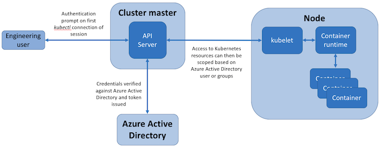
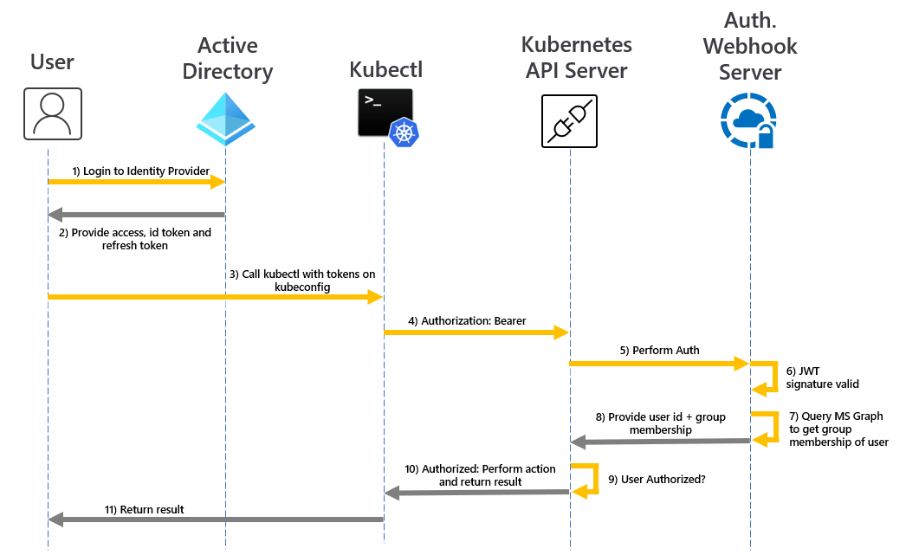
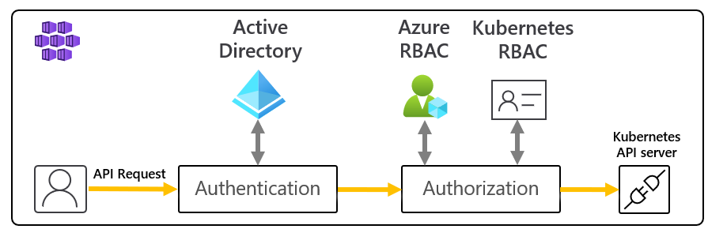

# Access and identity options for Azure Kubernetes Service (AKS)

You can authenticate, authorize, secure, and control access to Kubernetes clusters in a variety of ways. 
* Using Kubernetes role-based access control (Kubernetes RBAC), you can grant users, groups, and service accounts access to only the resources they need. 
* With Azure Kubernetes Service (AKS), you can further enhance the security and permissions structure via Azure Active Directory and Azure RBAC. 

Kubernetes RBAC and AKS help you secure your cluster access and provide only the minimum required permissions to developers and operators.

This article introduces the core concepts that help you authenticate and assign permissions in AKS.

## AKS service permissions

When creating a cluster, AKS generates or modifies resources it needs (like VMs and NICs) to create and run the cluster on behalf of the user. This identity is distinct from the cluster's identity permission, which is created during cluster creation.

### Identity creating and operating the cluster permissions

The following permissions are needed by the identity creating and operating the cluster.

| Permission | Reason |
|---|---|
| `Microsoft.Compute/diskEncryptionSets/read` | Required to read disk encryption set ID. |
| `Microsoft.Compute/proximityPlacementGroups/write` | Required for updating proximity placement groups. |
| `Microsoft.Network/applicationGateways/read`   `Microsoft.Network/applicationGateways/write`   `Microsoft.Network/virtualNetworks/subnets/join/action` | Required to configure application gateways and join the subnet. |
| `Microsoft.Network/virtualNetworks/subnets/join/action` | Required to configure the Network Security Group for the subnet when using a custom VNET.|
| `Microsoft.Network/publicIPAddresses/join/action`   `Microsoft.Network/publicIPPrefixes/join/action` | Required to configure the outbound public IPs on the Standard Load Balancer. |
| `Microsoft.OperationalInsights/workspaces/sharedkeys/read`   `Microsoft.OperationalInsights/workspaces/read`   `Microsoft.OperationsManagement/solutions/write`   `Microsoft.OperationsManagement/solutions/read`   `Microsoft.ManagedIdentity/userAssignedIdentities/assign/action` | Required to create and update Log Analytics workspaces and Azure monitoring for containers. |

### AKS cluster identity permissions

The following permissions are used by the AKS cluster identity, which is created and associated with the AKS cluster. Each permission is used for the reasons below:

| Permission | Reason |
|---|---|
| `Microsoft.ContainerService/managedClusters/*`    | Required for creating users and operating the cluster
| `Microsoft.Network/loadBalancers/delete`   `Microsoft.Network/loadBalancers/read`   `Microsoft.Network/loadBalancers/write` | Required to configure the load balancer for a LoadBalancer service. |
| `Microsoft.Network/publicIPAddresses/delete`   `Microsoft.Network/publicIPAddresses/read`   `Microsoft.Network/publicIPAddresses/write` | Required to find and configure public IPs for a LoadBalancer service. |
| `Microsoft.Network/publicIPAddresses/join/action` | Required for configuring public IPs for a LoadBalancer service. |
| `Microsoft.Network/networkSecurityGroups/read`   `Microsoft.Network/networkSecurityGroups/write` | Required to create or delete security rules for a LoadBalancer service. |
| `Microsoft.Compute/disks/delete`   `Microsoft.Compute/disks/read`   `Microsoft.Compute/disks/write`   `Microsoft.Compute/locations/DiskOperations/read` | Required to configure AzureDisks. |
| `Microsoft.Storage/storageAccounts/delete`   `Microsoft.Storage/storageAccounts/listKeys/action`   `Microsoft.Storage/storageAccounts/read`   `Microsoft.Storage/storageAccounts/write`   `Microsoft.Storage/operations/read` | Required to configure storage accounts for AzureFile or AzureDisk. |
| `Microsoft.Network/routeTables/read`   `Microsoft.Network/routeTables/routes/delete`   `Microsoft.Network/routeTables/routes/read`   `Microsoft.Network/routeTables/routes/write`   `Microsoft.Network/routeTables/write` | Required to configure route tables and routes for nodes. |
| `Microsoft.Compute/virtualMachines/read` | Required to find information for virtual machines in a VMAS, such as zones, fault domain, size, and data disks. |
| `Microsoft.Compute/virtualMachines/write` | Required to attach AzureDisks to a virtual machine in a VMAS. |
| `Microsoft.Compute/virtualMachineScaleSets/read`   `Microsoft.Compute/virtualMachineScaleSets/virtualMachines/read`   `Microsoft.Compute/virtualMachineScaleSets/virtualmachines/instanceView/read` | Required to find information for virtual machines in a virtual machine scale set, such as zones, fault domain, size, and data disks. |
| `Microsoft.Network/networkInterfaces/write` | Required to add a virtual machine in a VMAS to a load balancer backend address pool. |
| `Microsoft.Compute/virtualMachineScaleSets/write` | Required to add a virtual machine scale set to a load balancer backend address pools and scale out nodes in a virtual machine scale set. |
| `Microsoft.Compute/virtualMachineScaleSets/virtualmachines/write` | Required to attach AzureDisks and add a virtual machine from a virtual machine scale set to the load balancer. |
| `Microsoft.Network/networkInterfaces/read` | Required to search internal IPs and load balancer backend address pools for virtual machines in a VMAS. |
| `Microsoft.Compute/virtualMachineScaleSets/virtualMachines/networkInterfaces/read` | Required to search internal IPs and load balancer backend address pools for a virtual machine in a virtual machine scale set. |
| `Microsoft.Compute/virtualMachineScaleSets/virtualMachines/networkInterfaces/ipconfigurations/publicipaddresses/read` | Required to find public IPs for a virtual machine in a virtual machine scale set. |
| `Microsoft.Network/virtualNetworks/read`   `Microsoft.Network/virtualNetworks/subnets/read` | Required to verify if a subnet exists for the internal load balancer in another resource group. |
| `Microsoft.Compute/snapshots/delete`   `Microsoft.Compute/snapshots/read`   `Microsoft.Compute/snapshots/write` | Required to configure snapshots for AzureDisk. |
| `Microsoft.Compute/locations/vmSizes/read`   `Microsoft.Compute/locations/operations/read` | Required to find virtual machine sizes for finding AzureDisk volume limits. |

### Additional cluster identity permissions

When creating a cluster with specific attributes, you will need the following additional permissions for the cluster identity. Since these permissions are not automatically assigned, you must add them to the cluster identity after it's created.

| Permission | Reason |
|---|---|
| `Microsoft.Network/networkSecurityGroups/write`   `Microsoft.Network/networkSecurityGroups/read` | Required if using a network security group in another resource group. Required to configure security rules for a LoadBalancer service. |
| `Microsoft.Network/virtualNetworks/subnets/read`   `Microsoft.Network/virtualNetworks/subnets/join/action` | Required if using a subnet in another resource group such as a custom VNET. |
| `Microsoft.Network/routeTables/routes/read`   `Microsoft.Network/routeTables/routes/write` | Required if using a subnet associated with a route table in another resource group such as a custom VNET with a custom route table. Required to verify if a subnet already exists for the subnet in the other resource group. |
| `Microsoft.Network/virtualNetworks/subnets/read` | Required if using an internal load balancer in another resource group. Required to verify if a subnet already exists for the internal load balancer in the resource group. |
| `Microsoft.Network/privatednszones/*` | Required if using a private DNS zone in another resource group such as a custom privateDNSZone. |

## Kubernetes RBAC

Kubernetes RBAC provides granular filtering of user actions. With this control mechanism:
* You assign users or user groups permission to create and modify resources or view logs from running application workloads. 
* You can scope permissions to a single namespace or across the entire AKS cluster. 
* You create *roles* to define permissions, and then assign those roles to users with *role bindings*.

For more information, see [Using Kubernetes RBAC authorization][kubernetes-rbac].

### Roles and ClusterRoles

#### Roles
Before assigning permissions to users with Kubernetes RBAC, you'll define user permissions as a *Role*. Grant permissions within a namespace using roles. 

> [!NOTE]
> Kubernetes roles *grant* permissions; they don't *deny* permissions.

To grant permissions across the entire cluster or to cluster resources outside a given namespace, you can instead use *ClusterRoles*.

#### ClusterRoles

A ClusterRole grants and applies permissions to resources across the entire cluster, not a specific namespace.

### RoleBindings and ClusterRoleBindings

Once you've defined roles to grant permissions to resources, you assign those Kubernetes RBAC permissions with a *RoleBinding*. If your AKS cluster [integrates with Azure Active Directory (Azure AD)](#azure-ad-integration), RoleBindings grant permissions to Azure AD users to perform actions within the cluster. See how in [Control access to cluster resources using Kubernetes role-based access control and Azure Active Directory identities](azure-ad-rbac.md).

#### RoleBindings

Assign roles to users for a given namespace using RoleBindings. With RoleBindings, you can logically segregate a single AKS cluster, only enabling users to access the application resources in their assigned namespace. 

To bind roles across the entire cluster, or to cluster resources outside a given namespace, you instead use *ClusterRoleBindings*.

#### ClusterRoleBinding

With a ClusterRoleBinding, you bind roles to users and apply to resources across the entire cluster, not a specific namespace. This approach lets you grant administrators or support engineers access to all resources in the AKS cluster.

> [!NOTE]
> Microsoft/AKS performs any cluster actions with user consent under a built-in Kubernetes role `aks-service` and built-in role binding `aks-service-rolebinding`. 
> 
> This role enables AKS to troubleshoot and diagnose cluster issues, but can't modify permissions nor create roles or role bindings, or other high privilege actions. Role access is only enabled under active support tickets with just-in-time (JIT) access. Read more about [AKS support policies](support-policies.md).

### Kubernetes service accounts

*Service accounts* are one of the primary user types in Kubernetes. The Kubernetes API holds and manages service accounts. Service account credentials are stored as Kubernetes secrets, allowing them to be used by authorized pods to communicate with the API Server. Most API requests provide an authentication token for a service account or a normal user account.

Normal user accounts allow more traditional access for human administrators or developers, not just services and processes. While Kubernetes doesn't provide an identity management solution to store regular user accounts and passwords, you can integrate external identity solutions into Kubernetes. For AKS clusters, this integrated identity solution is Azure AD.

For more information on the identity options in Kubernetes, see [Kubernetes authentication][kubernetes-authentication].

## Azure AD integration

Enhance your AKS cluster security with Azure AD integration. Built on decades of enterprise identity management, Azure AD is a multi-tenant, cloud-based directory and identity management service that combines core directory services, application access management, and identity protection. With Azure AD, you can integrate on-premises identities into AKS clusters to provide a single source for account management and security.

With Azure AD-integrated AKS clusters, you can grant users or groups access to Kubernetes resources within a namespace or across the cluster. 

1. To obtain a `kubectl` configuration context, a user runs the [az aks get-credentials][az-aks-get-credentials] command. 
1. When a user interacts with the AKS cluster with `kubectl`, they're prompted to sign in with their Azure AD credentials. 

This approach provides a single source for user account management and password credentials. The user can only access the resources as defined by the cluster administrator.

Azure AD authentication is provided to AKS clusters with OpenID Connect. OpenID Connect is an identity layer built on top of the OAuth 2.0 protocol. For more information on OpenID Connect, see the [Open ID connect documentation][openid-connect]. From inside of the Kubernetes cluster, [Webhook Token Authentication][webhook-token-docs] is used to verify authentication tokens. Webhook token authentication is configured and managed as part of the AKS cluster.

### Webhook and API server

As shown in the graphic above, the API server calls the AKS webhook server and performs the following steps:

1. `kubectl` uses the Azure AD client application to sign in users with [OAuth 2.0 device authorization grant flow](../active-directory/develop/v2-oauth2-device-code.md).
2. Azure AD provides an access_token, id_token, and a refresh_token.
3. The user makes a request to `kubectl` with an access_token from `kubeconfig`.
4. `kubectl` sends the access_token to API Server.
5. The API Server is configured with the Auth WebHook Server to perform validation.
6. The authentication webhook server confirms the JSON Web Token signature is valid by checking the Azure AD public signing key.
7. The server application uses user-provided credentials to query group memberships of the logged-in user from the MS Graph API.
8. A response is sent to the API Server with user information such as the user principal name (UPN) claim of the access token, and the group membership of the user based on the object ID.
9. The API performs an authorization decision based on the Kubernetes Role/RoleBinding.
10. Once authorized, the API server returns a response to `kubectl`.
11. `kubectl` provides feedback to the user.
 
Learn how to integrate AKS with Azure AD with our [AKS-managed Azure AD integration how-to guide](managed-aad.md).

## Azure role-based access control

Azure role-based access control (RBAC) is an authorization system built on [Azure Resource Manager](../azure-resource-manager/management/overview.md) that provides fine-grained access management of Azure resources.

| RBAC system | Description |
|---|---|
| Kubernetes RBAC | Designed to work on Kubernetes resources within your AKS cluster. |
| Azure RBAC | Designed to work on resources within your Azure subscription. |

With Azure RBAC, you create a *role definition* that outlines the permissions to be applied. You then assign a user or group this role definition via a *role assignment* for a particular *scope*. The scope can be an individual resource, a resource group, or across the subscription.

For more information, see [What is Azure role-based access control (Azure RBAC)?][azure-rbac]

There are two levels of access needed to fully operate an AKS cluster: 
* [Access the AKS resource in your Azure subscription](#azure-rbac-to-authorize-access-to-the-aks-resource). 
  * Control scaling or upgrading your cluster using the AKS APIs.
  * Pull your `kubeconfig`.
* Access to the Kubernetes API. This access is controlled by either:
  * [Kubernetes RBAC](#kubernetes-rbac) (traditionally).
  * [Integrating Azure RBAC with AKS for Kubernetes authorization](#azure-rbac-for-kubernetes-authorization-preview).

### Azure RBAC to authorize access to the AKS resource

With Azure RBAC, you can provide your users (or identities) with granular access to AKS resources across one or more subscriptions. For example, you could use the [Azure Kubernetes Service Contributor role](../role-based-access-control/built-in-roles.md#azure-kubernetes-service-contributor-role) to scale and upgrade your cluster. Meanwhile, another user with the [Azure Kubernetes Service Cluster Admin role](../role-based-access-control/built-in-roles.md#azure-kubernetes-service-cluster-admin-role) only has permission to pull the Admin `kubeconfig`.

Alternatively, you could give your user the general [Contributor](../role-based-access-control/built-in-roles.md#contributor) role. With the general Contributor role, users can perform the above permissions and every action possible on the AKS resource, except managing permissions.

[Use Azure RBAC to define access to the Kubernetes configuration file in AKS](control-kubeconfig-access.md).

### Azure RBAC for Kubernetes Authorization (Preview)

With the Azure RBAC integration, AKS will use a Kubernetes Authorization webhook server so you can manage Azure AD-integrated Kubernetes cluster resource permissions and assignments using Azure role definition and role assignments.

As shown in the above diagram, when using the Azure RBAC integration, all requests to the Kubernetes API will follow the same authentication flow as explained on the [Azure Active Directory integration section](#azure-ad-integration). 

If the identity making the request exists in Azure AD, Azure will team with Kubernetes RBAC to authorize the request. If the identity exists outside of Azure AD (i.e., a Kubernetes service account), authorization will deter to the normal Kubernetes RBAC.

In this scenario, you use Azure RBAC mechanisms and APIs to assign users built-in roles or create custom roles, just as you would with Kubernetes roles. 

With this feature, you not only give users permissions to the AKS resource across subscriptions, but you also configure the role and permissions for inside each of those clusters controlling Kubernetes API access. For example, you can grant the `Azure Kubernetes Service RBAC Viewer` role on the subscription scope. The role recipient will be able to list and get all Kubernetes objects from all clusters without modifying them.

> [!IMPORTANT]
> You need to enable Azure RBAC for Kubernetes authorization before using this feature. For more details and step by step guidance, follow our [Use Azure RBAC for Kubernetes Authorization](manage-azure-rbac.md) how-to guide.

#### Built-in roles

AKS provides the following four built-in roles. They are similar to the [Kubernetes built-in roles](https://kubernetes.io/docs/reference/access-authn-authz/rbac/#user-facing-roles) with a few differences, like supporting CRDs. See the full list of actions allowed by each [Azure built-in role](../role-based-access-control/built-in-roles.md).

| Role                                | Description  |
|-------------------------------------|--------------|
| Azure  Kubernetes Service RBAC Viewer  | Allows read-only access to see most objects in a namespace.   Doesn't allow viewing roles or role bindings.  Doesn't allow viewing `Secrets`. Reading the `Secrets` contents enables access to `ServiceAccount` credentials in the namespace, which would allow API access as any `ServiceAccount` in the namespace (a form of privilege escalation).  |
| Azure Kubernetes Service RBAC  Writer | Allows read/write access to most objects in a namespace.   Doesn't allow viewing or modifying roles, or role bindings.   Allows accessing `Secrets` and running pods as any ServiceAccount in the namespace, so it can be used to gain the API access levels of any ServiceAccount in the namespace. |
| Azure Kubernetes Service RBAC Admin  | Allows admin access, intended to be granted within a namespace.   Allows read/write access to most resources in a namespace (or cluster scope), including the ability to create roles and role bindings within the namespace.   Doesn't allow write access to resource quota or to the namespace itself. |
| Azure Kubernetes Service RBAC Cluster Admin  | Allows super-user access to perform any action on any resource.   Gives full control over every resource in the cluster and in all namespaces. |

## Summary

View the table for a quick summary of how users can authenticate to Kubernetes when Azure AD integration is enabled. In all cases, the user's sequence of commands is:
1. Run `az login` to authenticate to Azure.
1. Run `az aks get-credentials` to download credentials for the cluster into `.kube/config`.
1. Run `kubectl` commands. 
   * The first command may trigger browser-based authentication to authenticate to the cluster, as described in the following table.

In the Azure portal, you can find:
* The *Role Grant* (Azure RBAC role grant) referred to in the second column is shown on the **Access Control** tab. 
* The Cluster Admin Azure AD Group is shown on the **Configuration** tab.
  * Also found with parameter name `--aad-admin-group-object-ids` in the Azure CLI.

| Description        | Role grant required| Cluster admin Azure AD group(s) | When to use |
| -------------------|------------|----------------------------|-------------|
| Legacy admin login using client certificate| **Azure Kubernetes Admin Role**. This role allows `az aks get-credentials` to be used with the `--admin` flag, which downloads a [legacy (non-Azure AD) cluster admin certificate](control-kubeconfig-access.md) into the user's `.kube/config`. This is the only purpose of "Azure Kubernetes Admin Role".|n/a|If you're permanently blocked by not having access to a valid Azure AD group with access to your cluster.| 
| Azure AD with manual (Cluster)RoleBindings| **Azure Kubernetes User Role**. The "User" role allows `az aks get-credentials` to be used without the `--admin` flag. (This is the only purpose of "Azure Kubernetes User Role".) The result, on an Azure AD-enabled cluster, is the download of [an empty entry](control-kubeconfig-access.md) into `.kube/config`, which triggers browser-based authentication when it's first used by `kubectl`.| User is not in any of these groups. Because the user is not in any Cluster Admin groups, their rights will be controlled entirely by any RoleBindings or ClusterRoleBindings that have been set up by cluster admins. The (Cluster)RoleBindings [nominate Azure AD users or Azure AD groups](azure-ad-rbac.md) as their `subjects`. If no such bindings have been set up, the user will not be able to excute any `kubectl` commands.|If you want fine-grained access control, and you're not using Azure RBAC for Kubernetes Authorization. Note that the user who sets up the bindings must log in by one of the other methods listed in this table.|
| Azure AD by member of admin group| Same as above|User is a member of one of the groups listed here. AKS automatically generates a ClusterRoleBinding that binds all of the listed groups to the `cluster-admin` Kubernetes role. So users in these groups can run all `kubectl` commands as `cluster-admin`.|If you want to conveniently grant users full admin rights, and are _not_ using Azure RBAC for Kubernetes authorization.|
| Azure AD with Azure RBAC for Kubernetes Authorization|Two roles:   First, **Azure Kubernetes User Role** (as above).   Second, one of the "Azure Kubernetes Service **RBAC**..." roles listed above, or your own custom alternative.|The admin roles field on the Configuration tab is irrelevant when Azure RBAC for Kubernetes Authorization is enabled.|You are using Azure RBAC for Kubernetes authorization. This approach gives you fine-grained control, without the need to set up RoleBindings or ClusterRoleBindings.|

## Next steps

- To get started with Azure AD and Kubernetes RBAC, see [Integrate Azure Active Directory with AKS][aks-aad].
- For associated best practices, see [Best practices for authentication and authorization in AKS][operator-best-practices-identity].
- To get started with Azure RBAC for Kubernetes Authorization, see [Use Azure RBAC to authorize access within the Azure Kubernetes Service (AKS) Cluster](manage-azure-rbac.md).
- To get started securing your `kubeconfig` file, see [Limit access to cluster configuration file](control-kubeconfig-access.md)

For more information on core Kubernetes and AKS concepts, see the following articles:

- [Kubernetes / AKS clusters and workloads][aks-concepts-clusters-workloads]
- [Kubernetes / AKS security][aks-concepts-security]
- [Kubernetes / AKS virtual networks][aks-concepts-network]
- [Kubernetes / AKS storage][aks-concepts-storage]
- [Kubernetes / AKS scale][aks-concepts-scale]

<!-- LINKS - External -->
[kubernetes-authentication]: https://kubernetes.io/docs/reference/access-authn-authz/authentication
[webhook-token-docs]: https://kubernetes.io/docs/reference/access-authn-authz/authentication/#webhook-token-authentication
[kubernetes-rbac]: https://kubernetes.io/docs/reference/access-authn-authz/rbac/

<!-- LINKS - Internal -->
[openid-connect]: ../active-directory/develop/v2-protocols-oidc.md
[az-aks-get-credentials]: /cli/azure/aks#az_aks_get_credentials
[azure-rbac]: ../role-based-access-control/overview.md
[aks-aad]: managed-aad.md
[aks-concepts-clusters-workloads]: concepts-clusters-workloads.md
[aks-concepts-security]: concepts-security.md
[aks-concepts-scale]: concepts-scale.md
[aks-concepts-storage]: concepts-storage.md
[aks-concepts-network]: concepts-network.md
[operator-best-practices-identity]: operator-best-practices-identity.md
[upgrade-per-cluster]: ../azure-monitor/containers/container-insights-update-metrics.md#upgrade-per-cluster-using-azure-cli
