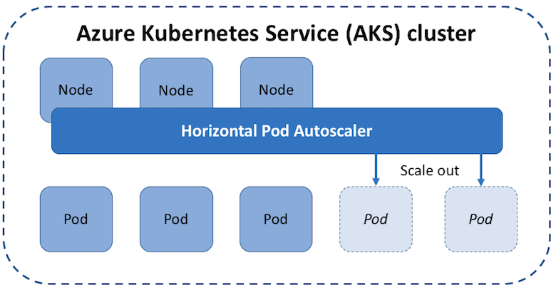
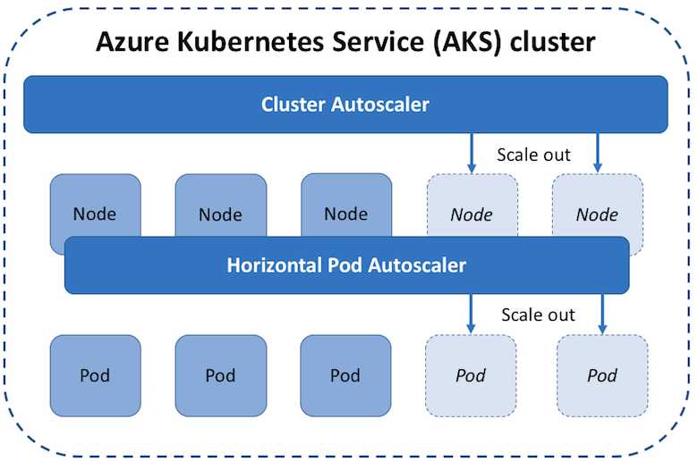
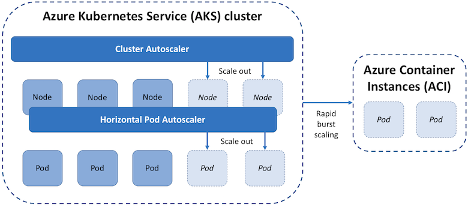

# Scaling options for applications in Azure Kubernetes Service (AKS)

As you run applications in Azure Kubernetes Service (AKS), you may need to increase or decrease the amount of compute resources. As the number of application instances you need change, the number of underlying Kubernetes nodes may also need to change. You may also need to quickly provision a large number of additional application instances.

This article introduces the core concepts that help you scale applications in AKS:

- [Manually scale](#manually-scale-pods-or-nodes)
- [Horizontal pod autoscaler (HPA)](#horizontal-pod-autoscaler)
- [Cluster autoscaler](#cluster-autoscaler)
- [Azure Container Instance (ACI) integration with AKS](#burst-to-azure-container-instances)

## Manually scale pods or nodes

You can manually scale replicas (pods) and nodes to test how your application responds to a change in available resources and state. Manually scaling resources also lets you define a set amount of resources to use to maintain a fixed cost, such as the number of nodes. To manually scale, you define the replica or node count, and the Kubernetes API schedules creating additional pods or draining nodes.

To get started with manually scaling pods and nodes see [Scale applications in AKS][aks-scale].

## Horizontal pod autoscaler

Kubernetes uses the horizontal pod autoscaler (HPA) to monitor the resource demand and automatically scale the number of replicas. By default, the horizontal pod autoscaler checks the Metrics API every 30 seconds for any required changes in replica count. When changes are required, the number of replicas is increased or decreased accordingly. Horizontal pod autoscaler works with AKS clusters that have deployed the Metrics Server for Kubernetes 1.8+.

When you configure the horizontal pod autoscaler for a given deployment, you define the minimum and maximum number of replicas that can run. You also define the metric to monitor and base any scaling decisions on, such as CPU usage.

To get started with the horizontal pod autoscaler in AKS, see [Autoscale pods in AKS][aks-hpa].

### Cooldown of scaling events

As the horizontal pod autoscaler checks the Metrics API every 30 seconds, previous scale events may not have successfully completed before another check is made. This behavior could cause the horizontal pod autoscaler to change the number of replicas before the previous scale event has been able to receive application workload and the resource demands to adjust accordingly.

To minimize these race events, cooldown or delay values can be set. These values define how long the horizontal pod autoscaler must wait after a scale event before another scale event can be triggered. This behavior allows the new replica count to take effect and the Metrics API reflect the distributed workload. By default, the delay on scale up events is 3 minutes, and the delay on scale down events is 5 minutes

You may need to tune these cooldown values. The default cooldown values may give the impression that the horizontal pod autoscaler isn't scaling the replica count quickly enough. For example, to more quickly increase the number of replicas in use, reduce the `--horizontal-pod-autoscaler-upscale-delay` when you create your horizontal pod autoscaler definitions using `kubectl`.

## Cluster autoscaler

To respond to changing pod demands, Kubernetes has a cluster autoscaler (currently in preview in AKS) that adjusts the number of nodes based on the requested compute resources in the node pool. By default, the cluster autoscaler checks the API server every 10 seconds for any required changes in node count. If the cluster autoscale determines that a change is required, the number of nodes in your AKS cluster is increased or decreased accordingly. The cluster autoscaler works with RBAC-enabled AKS clusters that run Kubernetes 1.10.x or higher.

Cluster autoscaler is typically used alongside the horizontal pod autoscaler. When combined, the horizontal pod autoscaler increases or decreases the number of pods based on application demand, and the cluster autoscaler adjusts the number of nodes as needed to run those additional pods accordingly.

Cluster autoscaler should only be tested in preview on AKS clusters with a single node pool.

To get started with the cluster autoscaler in AKS, see [Cluster Autoscaler on AKS][aks-cluster-autoscaler].

### Scale up events

If a node does not have sufficient compute resources to run a requested pod, that pod cannot progress through the scheduling process. The pod cannot start unless additional compute resources are available within the node pool.

When the cluster autoscaler notices pods that cannot be scheduled due to node pool resource constraints, the number of nodes within the node pool is increased to provide the additional compute resources. When those additional nodes are successfully deployed and available for use within the node pool, the pods are then scheduled to run on them.

If your application needs to scale rapidly, some pods may remain in a state waiting to be scheduled until the additional nodes deployed by the cluster autoscaler can accept the scheduled pods. For applications that have high burst demands, you can scale with virtual nodes and Azure Container Instances.

### Scale down events

The cluster autoscaler also monitors the pod scheduling status for nodes that have not recently received new scheduling requests. This scenario indicates that the node pool has more compute resources than are required, and that the number of nodes can be decreased.

A node that passes a threshold for no longer being needed for 10 minutes by default is scheduled for deletion. When this situation occurs, pods are scheduled to run on other nodes within the node pool, and the cluster autoscaler decreases the number of nodes.

Your applications may experience some disruption as pods are scheduled on different nodes when the cluster autoscaler decreases the number of nodes. To minimize disruption, avoid applications that use a single pod instance.

## Burst to Azure Container Instances

To rapidly scale your AKS cluster, you can integrate with Azure Container Instances (ACI). Kubernetes has built-in components to scale the replica and node count. However, if your application needs to rapidly scale, the horizontal pod autoscaler may schedule more pods than can be provided by the existing compute resources in the node pool. If configured, this scenario would then trigger the cluster autoscaler to deploy additional nodes in the node pool, but it may take a few minutes for those nodes to successfully provision and allow the Kubernetes scheduler to run pods on them.

ACI lets you quickly deploy container instances without additional infrastructure overhead. When you connect with AKS, ACI becomes a secured, logical extension of your AKS cluster. The Virtual Kubelet component is installed in your AKS cluster that presents ACI as a virtual Kubernetes node. Kubernetes can then schedule pods that run as ACI instances through virtual nodes, not as pods on VM nodes directly in your AKS cluster. Virtual nodes are currently in preview in AKS.

Your application requires no modification to use virtual nodes. Deployments can scale across AKS and ACI and with no delay as cluster autoscaler deploys new nodes in your AKS cluster.

Virtual nodes are deployed to an additional subnet in the same virtual network as your AKS cluster. This virtual network configuration allows the traffic between ACI and AKS to be secured. Like an AKS cluster, an ACI instance is a secure, logical compute resource that is isolated from other users.

## Next steps

To get started with scaling applications, first follow the [quickstart to create an AKS cluster with the Azure CLI][aks-quickstart]. You can then start to manually or automatically scale applications in your AKS cluster:

- Manually scale [pods][aks-manually-scale-pods] or [nodes][aks-manually-scale-nodes]
- Use the [horizontal pod autoscaler][aks-hpa]
- Use the [cluster autoscaler][aks-cluster-autoscaler]

For more information on core Kubernetes and AKS concepts, see the following articles:

- [Kubernetes / AKS clusters and workloads][aks-concepts-clusters-workloads]
- [Kubernetes / AKS access and identity][aks-concepts-identity]
- [Kubernetes / AKS security][aks-concepts-security]
- [Kubernetes / AKS virtual networks][aks-concepts-network]
- [Kubernetes / AKS storage][aks-concepts-storage]

<!-- LINKS - external -->

<!-- LINKS - internal -->
[aks-quickstart]: kubernetes-walkthrough.md
[aks-hpa]: tutorial-kubernetes-scale.md#autoscale-pods
[aks-scale]: tutorial-kubernetes-scale.md
[aks-manually-scale-pods]: tutorial-kubernetes-scale.md#manually-scale-pods
[aks-manually-scale-nodes]: tutorial-kubernetes-scale.md#manually-scale-aks-nodes
[aks-cluster-autoscaler]: autoscaler.md
[aks-concepts-clusters-workloads]: concepts-clusters-workloads.md
[aks-concepts-security]: concepts-security.md
[aks-concepts-storage]: concepts-storage.md
[aks-concepts-identity]: concepts-identity.md
[aks-concepts-network]: concepts-network.md
