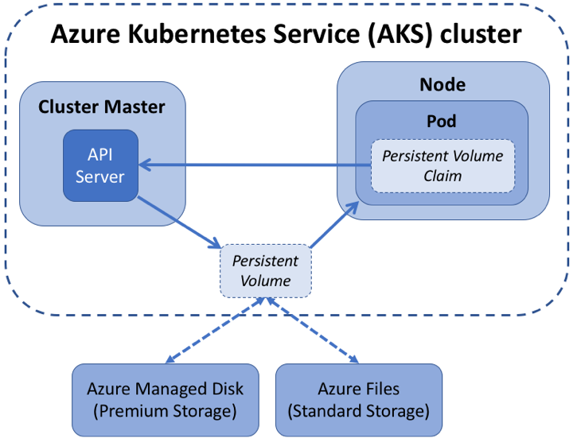
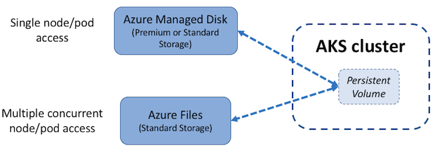
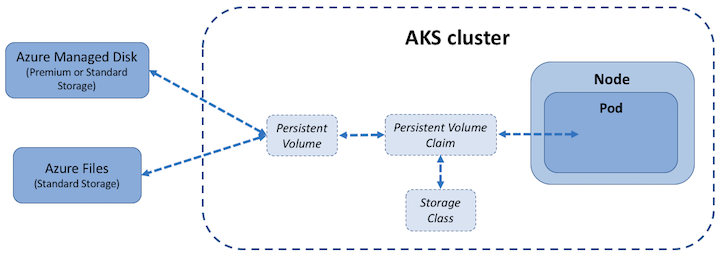

# Storage options for applications in Azure Kubernetes Service (AKS)

Applications that run in Azure Kubernetes Service (AKS) may need to store and retrieve data. For some application workloads, this data storage can use local, fast storage on the node that is no longer needed when the pods are deleted. Other application workloads may require storage that persists on more regular data volumes within the Azure platform. Multiple pods may need to share the same data volumes, or reattach data volumes if the pod is rescheduled on a different node. Finally, you may need to inject sensitive data or application configuration information into pods.



This article introduces the core concepts that provide storage to your applications in AKS:

- [Volumes](#volumes)
- [Persistent volumes](#persistent-volumes)
- [Storage classes](#storage-classes)
- [Persistent volume claims](#persistent-volume-claims)

## Volumes

Applications often need to be able to store and retrieve data. As Kubernetes typically treats individual pods as ephemeral, disposable resources, different approaches are available for applications to use and persist data as necessary. A *volume* represents a way to store, retrieve, and persist data across pods and through the application lifecycle.

Traditional volumes to store and retrieve data are created as Kubernetes resources backed by Azure Storage. You can manually create these data volumes to be assigned to pods directly, or have Kubernetes automatically create them. These data volumes can use Azure Disks or Azure Files:

- *Azure Disks* can be used to create a Kubernetes *DataDisk* resource. Disks can use Azure Premium storage, backed by high-performance SSDs, or Azure Standard storage, backed by regular HDDs. For most production and development workloads, use Premium storage. Azure Disks are mounted as *ReadWriteOnce*, so are only available to a single pod. For storage volumes that can be accessed by multiple pods simultaneously, use Azure Files.
- *Azure Files* can be used to mount an SMB 3.0 share backed by an Azure Storage account to pods. Files let you share data across multiple nodes and pods. Files can use Azure Standard storage backed by regular HDDs, or Azure Premium storage, backed by high-performance SSDs.
> [!NOTE] 
> Azure Files support premium storage in AKS clusters that run Kubernetes 1.13 or higher.

In Kubernetes, volumes can represent more than just a traditional disk where information can be stored and retrieved. Kubernetes volumes can also be used as a way to inject data into a pod for use by the containers. Common additional volume types in Kubernetes include:

- *emptyDir* - This volume is commonly used as temporary space for a pod. All containers within a pod can access the data on the volume. Data written to this volume type persists only for the lifespan of the pod - when the pod is deleted, the volume is deleted. This volume typically uses the underlying local node disk storage, though it can also exist only in the node's memory.
- *secret* - This volume is used to inject sensitive data into pods, such as passwords. You first create a Secret using the Kubernetes API. When you define your pod or deployment, a specific Secret can be requested. Secrets are only provided to nodes that have a scheduled pod that requires it, and the Secret is stored in *tmpfs*, not written to disk. When the last pod on a node that requires a Secret is deleted, the Secret is deleted from the node's tmpfs. Secrets are stored within a given namespace and can only be accessed by pods within the same namespace.
- *configMap* - This volume type is used to inject key-value pair properties into pods, such as application configuration information. Rather than defining application configuration information within a container image, you can define it as a Kubernetes resource that can be easily updated and applied to new instances of pods as they are deployed. Like using a Secret, you first create a ConfigMap using the Kubernetes API. This ConfigMap can then be requested when you define a pod or deployment. ConfigMaps are stored within a given namespace and can only be accessed by pods within the same namespace.

## Persistent volumes

Volumes that are defined and created as part of the pod lifecycle only exist until the pod is deleted. Pods often expect their storage to remain if a pod is rescheduled on a different host during a maintenance event, especially in StatefulSets. A *persistent volume* (PV) is a storage resource created and managed by the Kubernetes API that can exist beyond the lifetime of an individual pod.

Azure Disks or Files are used to provide the PersistentVolume. As noted in the previous section on Volumes, the choice of Disks or Files is often determined by the need for concurrent access to the data or the performance tier.



A PersistentVolume can be *statically* created by a cluster administrator, or *dynamically* created by the Kubernetes API server. If a pod is scheduled and requests storage that is not currently available, Kubernetes can create the underlying Azure Disk or Files storage and attach it to the pod. Dynamic provisioning uses a *StorageClass* to identify what type of Azure storage needs to be created.

## Storage classes

To define different tiers of storage, such as Premium and Standard, you can create a *StorageClass*. The StorageClass also defines the *reclaimPolicy*. This reclaimPolicy controls the behavior of the underlying Azure storage resource when the pod is deleted and the persistent volume may no longer be required. The underlying storage resource can be deleted, or retained for use with a future pod.

In AKS, two initial StorageClasses are created:

- *default* - Uses Azure Standard storage to create a Managed Disk. The reclaim policy indicates that the underlying Azure Disk is deleted when the persistent volume that used it is deleted.
- *managed-premium* - Uses Azure Premium storage to create Managed Disk. The reclaim policy again indicates that the underlying Azure Disk is deleted when the persistent volume that used it is deleted.

If no StorageClass is specified for a persistent volume, the default StorageClass is used. Take care when requesting persistent volumes so that they use the appropriate storage you need. You can create a StorageClass for additional needs using `kubectl`. The following example uses Premium Managed Disks and specifies that the underlying Azure Disk should be *retained* when the pod is deleted:

```yaml
kind: StorageClass
apiVersion: storage.k8s.io/v1
metadata:
  name: managed-premium-retain
provisioner: kubernetes.io/azure-disk
reclaimPolicy: Retain
parameters:
  storageaccounttype: Premium_LRS
  kind: Managed
```

## Persistent volume claims

A PersistentVolumeClaim requests either Disk or File storage of a particular StorageClass, access mode, and size. The Kubernetes API server can dynamically provision the underlying storage resource in Azure if there is no existing resource to fulfill the claim based on the defined StorageClass. The pod definition includes the volume mount once the volume has been connected to the pod.



A PersistentVolume is *bound* to a PersistentVolumeClaim once an available storage resource has been assigned to the pod requesting it. There is a 1:1 mapping of persistent volumes to claims.

The following example YAML manifest shows a persistent volume claim that uses the *managed-premium* StorageClass and requests a Disk *5Gi* in size:

```yaml
apiVersion: v1
kind: PersistentVolumeClaim
metadata:
  name: azure-managed-disk
spec:
  accessModes:
  - ReadWriteOnce
  storageClassName: managed-premium
  resources:
    requests:
      storage: 5Gi
```

When you create a pod definition, the persistent volume claim is specified to request the desired storage. You also then specify the *volumeMount* for your applications to read and write data. The following example YAML manifest shows how the previous persistent volume claim can be used to mount a volume at */mnt/azure*:

```yaml
kind: Pod
apiVersion: v1
metadata:
  name: nginx
spec:
  containers:
    - name: myfrontend
      image: nginx
      volumeMounts:
      - mountPath: "/mnt/azure"
        name: volume
  volumes:
    - name: volume
      persistentVolumeClaim:
        claimName: azure-managed-disk
```

## Next steps

For associated best practices, see [Best practices for storage and backups in AKS][operator-best-practices-storage].

To see how to create dynamic and static volumes that use Azure Disks or Azure Files, see the following how-to articles:

- [Create a static volume using Azure Disks][aks-static-disks]
- [Create a static volume using Azure Files][aks-static-files]
- [Create a dynamic volume using Azure Disks][aks-dynamic-disks]
- [Create a dynamic volume using Azure Files][aks-dynamic-files]

For additional information on core Kubernetes and AKS concepts, see the following articles:

- [Kubernetes / AKS clusters and workloads][aks-concepts-clusters-workloads]
- [Kubernetes / AKS identity][aks-concepts-identity]
- [Kubernetes / AKS security][aks-concepts-security]
- [Kubernetes / AKS virtual networks][aks-concepts-network]
- [Kubernetes / AKS scale][aks-concepts-scale]

<!-- EXTERNAL LINKS -->

<!-- INTERNAL LINKS -->
[aks-static-disks]: azure-disk-volume.md
[aks-static-files]: azure-files-volume.md
[aks-dynamic-disks]: azure-disks-dynamic-pv.md
[aks-dynamic-files]: azure-files-dynamic-pv.md
[aks-concepts-clusters-workloads]: concepts-clusters-workloads.md
[aks-concepts-identity]: concepts-identity.md
[aks-concepts-scale]: concepts-scale.md
[aks-concepts-security]: concepts-security.md
[aks-concepts-network]: concepts-network.md
[operator-best-practices-storage]: operator-best-practices-storage.md
