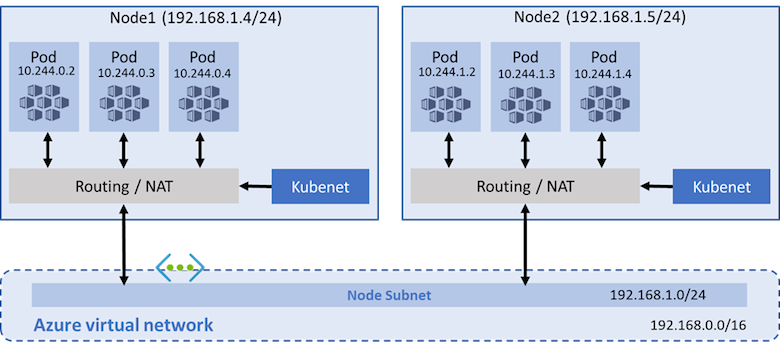

# Use kubenet networking with your own IP address ranges in Azure Kubernetes Service (AKS)

By default, AKS clusters use [kubenet][kubenet], and an Azure virtual network and subnet are created for you. With *kubenet*, nodes get an IP address from the Azure virtual network subnet. Pods receive an IP address from a logically different address space to the Azure virtual network subnet of the nodes. Network address translation (NAT) is then configured so that the pods can reach resources on the Azure virtual network. The source IP address of the traffic is NAT'd to the node's primary IP address. This approach greatly reduces the number of IP addresses that you need to reserve in your network space for pods to use.

With [Azure Container Networking Interface (CNI)][cni-networking], every pod gets an IP address from the subnet and can be accessed directly. These IP addresses must be unique across your network space, and must be planned in advance. Each node has a configuration parameter for the maximum number of pods that it supports. The equivalent number of IP addresses per node are then reserved up front for that node. This approach requires more planning, and often leads to IP address exhaustion or the need to rebuild clusters in a larger subnet as your application demands grow. You can configure the maximum pods deployable to a node at cluster create time or when creating new node pools. If you don't specify maxPods when creating new node pools, you receive a default value of 110 for kubenet.

This article shows you how to use *kubenet* networking to create and use a virtual network subnet for an AKS cluster. For more information on network options and considerations, see [Network concepts for Kubernetes and AKS][aks-network-concepts].

## Prerequisites

* The virtual network for the AKS cluster must allow outbound internet connectivity.
* Don't create more than one AKS cluster in the same subnet.
* AKS clusters may not use `169.254.0.0/16`, `172.30.0.0/16`, `172.31.0.0/16`, or `192.0.2.0/24` for the Kubernetes service address range, pod address range or cluster virtual network address range.
* The cluster identity used by the AKS cluster must have at least [Network Contributor](../role-based-access-control/built-in-roles.md#network-contributor) role on the subnet within your virtual network. You must also have the appropriate permissions, such as the subscription owner, to create a cluster identity and assign it permissions. If you wish to define a [custom role](../role-based-access-control/custom-roles.md) instead of using the built-in Network Contributor role, the following permissions are required:
  * `Microsoft.Network/virtualNetworks/subnets/join/action`
  * `Microsoft.Network/virtualNetworks/subnets/read`

> [!WARNING]
> To use Windows Server node pools, you must use Azure CNI. The use of kubenet as the network model is not available for Windows Server containers.

## Before you begin

You need the Azure CLI version 2.0.65 or later installed and configured. Run `az --version` to find the version. If you need to install or upgrade, see [Install Azure CLI][install-azure-cli].

## Overview of kubenet networking with your own subnet

In many environments, you have defined virtual networks and subnets with allocated IP address ranges. These virtual network resources are used to support multiple services and applications. To provide network connectivity, AKS clusters can use *kubenet* (basic networking) or Azure CNI (*advanced networking*).

With *kubenet*, only the nodes receive an IP address in the virtual network subnet. Pods can't communicate directly with each other. Instead, User Defined Routing (UDR) and IP forwarding is used for connectivity between pods across nodes. By default, UDRs and IP forwarding configuration is created and maintained by the AKS service, but you have to the option to [bring your own route table for custom route management][byo-subnet-route-table]. You could also deploy pods behind a service that receives an assigned IP address and load balances traffic for the application. The following diagram shows how the AKS nodes receive an IP address in the virtual network subnet, but not the pods:



Azure supports a maximum of 400 routes in a UDR, so you can't have an AKS cluster larger than 400 nodes. AKS [Virtual Nodes][virtual-nodes] and Azure Network Policies aren't supported with *kubenet*.  You can use [Calico Network Policies][calico-network-policies], as they are supported with kubenet.

With *Azure CNI*, each pod receives an IP address in the IP subnet, and can directly communicate with other pods and services. Your clusters can be as large as the IP address range you specify. However, the IP address range must be planned in advance, and all of the IP addresses are consumed by the AKS nodes based on the maximum number of pods that they can support. Advanced network features and scenarios such as [Virtual Nodes][virtual-nodes] or Network Policies (either Azure or Calico) are supported with *Azure CNI*.

### Limitations & considerations for kubenet

* An additional hop is required in the design of kubenet, which adds minor latency to pod communication.
* Route tables and user-defined routes are required for using kubenet, which adds complexity to operations.
* Direct pod addressing isn't supported for kubenet due to kubenet design.
* Unlike Azure CNI clusters, multiple kubenet clusters can't share a subnet.
* Features **not supported on kubenet** include:
   * [Azure network policies](use-network-policies.md#create-an-aks-cluster-and-enable-network-policy), but Calico network policies are supported on kubenet
   * [Windows node pools](./windows-faq.md)
   * [Virtual nodes add-on](virtual-nodes.md#network-requirements)

### IP address availability and exhaustion

With *Azure CNI*, a common issue is the assigned IP address range is too small to then add additional nodes when you scale or upgrade a cluster. The network team may also not be able to issue a large enough IP address range to support your expected application demands.

As a compromise, you can create an AKS cluster that uses *kubenet* and connect to an existing virtual network subnet. This approach lets the nodes receive defined IP addresses, without the need to reserve a large number of IP addresses up front for all of the potential pods that could run in the cluster.

With *kubenet*, you can use a much smaller IP address range and be able to support large clusters and application demands. For example, even with a */27* IP address range on your subnet, you could run a 20-25 node cluster with enough room to scale or upgrade. This cluster size would support up to *2,200-2,750* pods (with a default maximum of 110 pods per node). The maximum number of pods per node that you can configure with *kubenet* in AKS is 110.

The following basic calculations compare the difference in network models:

- **kubenet** - a simple */24* IP address range can support up to *251* nodes in the cluster (each Azure virtual network subnet reserves the first three IP addresses for management operations)
  - This node count could support up to *27,610* pods (with a default maximum of 110 pods per node with *kubenet*)
- **Azure CNI** - that same basic */24* subnet range could only support a maximum of *8* nodes in the cluster
  - This node count could only support up to *240* pods (with a default maximum of 30 pods per node with *Azure CNI*)

> [!NOTE]
> These maximums don't take into account upgrade or scale operations. In practice, you can't run the maximum number of nodes that the subnet IP address range supports. You must leave some IP addresses available for use during scale of upgrade operations.

### Virtual network peering and ExpressRoute connections

To provide on-premises connectivity, both *kubenet* and *Azure-CNI* network approaches can use [Azure virtual network peering][vnet-peering] or [ExpressRoute connections][express-route]. Plan your IP address ranges carefully to prevent overlap and incorrect traffic routing. For example, many on-premises networks use a *10.0.0.0/8* address range that is advertised over the ExpressRoute connection. It's recommended to create your AKS clusters into Azure virtual network subnets outside of this address range, such as *172.16.0.0/16*.

### Choose a network model to use

The choice of which network plugin to use for your AKS cluster is usually a balance between flexibility and advanced configuration needs. The following considerations help outline when each network model may be the most appropriate.

Use *kubenet* when:

- You have limited IP address space.
- Most of the pod communication is within the cluster.
- You don't need advanced AKS features such as virtual nodes or Azure Network Policy.  Use [Calico network policies][calico-network-policies].

Use *Azure CNI* when:

- You have available IP address space.
- Most of the pod communication is to resources outside of the cluster.
- You don't want to manage user defined routes for pod connectivity.
- You need AKS advanced features such as virtual nodes or Azure Network Policy.  Use [Calico network policies][calico-network-policies].

For more information to help you decide which network model to use, see [Compare network models and their support scope][network-comparisons].

## Create a virtual network and subnet

To get started with using *kubenet* and your own virtual network subnet, first create a resource group using the [az group create][az-group-create] command. The following example creates a resource group named *myResourceGroup* in the *eastus* location:

```azurecli-interactive
az group create --name myResourceGroup --location eastus
```

If you don't have an existing virtual network and subnet to use, create these network resources using the [az network vnet create][az-network-vnet-create] command. In the following example, the virtual network is named *myVnet* with the address prefix of *192.168.0.0/16*. A subnet is created named *myAKSSubnet* with the address prefix *192.168.1.0/24*.

```azurecli-interactive
az network vnet create \
    --resource-group myResourceGroup \
    --name myAKSVnet \
    --address-prefixes 192.168.0.0/16 \
    --subnet-name myAKSSubnet \
    --subnet-prefix 192.168.1.0/24
```

## Create a service principal and assign permissions

To allow an AKS cluster to interact with other Azure resources, an Azure Active Directory service principal is used. The service principal needs to have permissions to manage the virtual network and subnet that the AKS nodes use. To create a service principal, use the [az ad sp create-for-rbac][az-ad-sp-create-for-rbac] command:

```azurecli-interactive
az ad sp create-for-rbac --skip-assignment
```

The following example output shows the application ID and password for your service principal. These values are used in additional steps to assign a role to the service principal and then create the AKS cluster:

```output
{
  "appId": "476b3636-5eda-4c0e-9751-849e70b5cfad",
  "displayName": "azure-cli-2019-01-09-22-29-24",
  "name": "http://azure-cli-2019-01-09-22-29-24",
  "password": "a1024cd7-af7b-469f-8fd7-b293ecbb174e",
  "tenant": "72f998bf-85f1-41cf-92ab-2e7cd014db46"
}
```

To assign the correct delegations in the remaining steps, use the [az network vnet show][az-network-vnet-show] and [az network vnet subnet show][az-network-vnet-subnet-show] commands to get the required resource IDs. These resource IDs are stored as variables and referenced in the remaining steps:

```azurecli-interactive
VNET_ID=$(az network vnet show --resource-group myResourceGroup --name myAKSVnet --query id -o tsv)
SUBNET_ID=$(az network vnet subnet show --resource-group myResourceGroup --vnet-name myAKSVnet --name myAKSSubnet --query id -o tsv)
```

Now assign the service principal for your AKS cluster *Network Contributor* permissions on the virtual network using the [az role assignment create][az-role-assignment-create] command. Provide your own *\<appId>* as shown in the output from the previous command to create the service principal:

```azurecli-interactive
az role assignment create --assignee <appId> --scope $VNET_ID --role "Network Contributor"
```

## Create an AKS cluster in the virtual network

You've now created a virtual network and subnet, and created and assigned permissions for a service principal to use those network resources. Now create an AKS cluster in your virtual network and subnet using the [az aks create][az-aks-create] command. Define your own service principal *\<appId>* and *\<password>*, as shown in the output from the previous command to create the service principal.

The following IP address ranges are also defined as part of the cluster create process:

* The *--service-cidr* is used to assign internal services in the AKS cluster an IP address. This IP address range should be an address space that isn't in use elsewhere in your network environment, including any on-premises network ranges if you connect, or plan to connect, your Azure virtual networks using Express Route or a Site-to-Site VPN connection.

* The *--dns-service-ip* address should be the *.10* address of your service IP address range.

* The *--pod-cidr* should be a large address space that isn't in use elsewhere in your network environment. This range includes any on-premises network ranges if you connect, or plan to connect, your Azure virtual networks using Express Route or a Site-to-Site VPN connection.
    * This address range must be large enough to accommodate the number of nodes that you expect to scale up to. You can't change this address range once the cluster is deployed if you need more addresses for additional nodes.
    * The pod IP address range is used to assign a */24* address space to each node in the cluster. In the following example, the *--pod-cidr* of *10.244.0.0/16* assigns the first node *10.244.0.0/24*, the second node *10.244.1.0/24*, and the third node *10.244.2.0/24*.
    * As the cluster scales or upgrades, the Azure platform continues to assign a pod IP address range to each new node.
    
* The *--docker-bridge-address* lets the AKS nodes communicate with the underlying management platform. This IP address must not be within the virtual network IP address range of your cluster, and shouldn't overlap with other address ranges in use on your network.

```azurecli-interactive
az aks create \
    --resource-group myResourceGroup \
    --name myAKSCluster \
    --node-count 3 \
    --network-plugin kubenet \
    --service-cidr 10.0.0.0/16 \
    --dns-service-ip 10.0.0.10 \
    --pod-cidr 10.244.0.0/16 \
    --docker-bridge-address 172.17.0.1/16 \
    --vnet-subnet-id $SUBNET_ID \
    --service-principal <appId> \
    --client-secret <password>
```

> [!Note]
> If you wish to enable an AKS cluster to include a [Calico network policy][calico-network-policies] you can use the following command.

```azurecli-interactive
az aks create \
    --resource-group myResourceGroup \
    --name myAKSCluster \
    --node-count 3 \
    --network-plugin kubenet --network-policy calico \
    --service-cidr 10.0.0.0/16 \
    --dns-service-ip 10.0.0.10 \
    --pod-cidr 10.244.0.0/16 \
    --docker-bridge-address 172.17.0.1/16 \
    --vnet-subnet-id $SUBNET_ID \
    --service-principal <appId> \
    --client-secret <password>
```

When you create an AKS cluster, a network security group and route table are automatically created. These network resources are managed by the AKS control plane. The network security group is automatically associated with the virtual NICs on your nodes. The route table is automatically associated with the virtual network subnet. Network security group rules and route tables are automatically updated as you create and expose services.

## Bring your own subnet and route table with kubenet

With kubenet, a route table must exist on your cluster subnet(s). AKS supports bringing your own existing subnet and route table.

If your custom subnet does not contain a route table, AKS creates one for you and adds rules to it throughout the cluster lifecycle. If your custom subnet contains a route table when you create your cluster, AKS acknowledges the existing route table during cluster operations and adds/updates rules accordingly for cloud provider operations.

> [!WARNING]
> Custom rules can be added to the custom route table and updated. However, rules are added by the Kubernetes cloud provider which must not be updated or removed. Rules such as 0.0.0.0/0 must always exist on a given route table and map to the target of your internet gateway, such as an NVA or other egress gateway. Take caution when updating rules that only your custom rules are being modified.

Learn more about setting up a [custom route table][custom-route-table].

Kubenet networking requires organized route table rules to successfully route requests. Due to this design, route tables must be carefully maintained for each cluster which relies on it. Multiple clusters cannot share a route table because pod CIDRs from different clusters may overlap which causes unexpected and broken routing. When configuring multiple clusters on the same virtual network or dedicating a virtual network to each cluster, ensure the following limitations are considered.

Limitations:

* Permissions must be assigned before cluster creation, ensure you are using a service principal with write permissions to your custom subnet and custom route table.
* A custom route table must be associated to the subnet before you create the AKS cluster.
* The associated route table resource cannot be updated after cluster creation. While the route table resource cannot be updated, custom rules can be modified on the route table.
* Each AKS cluster must use a single, unique route table for all subnets associated with the cluster. You cannot reuse a route table with multiple clusters due to the potential for overlapping pod CIDRs and conflicting routing rules.

After you create a custom route table and associate it to your subnet in your virtual network, you can create a new AKS cluster that uses your route table.
You need to use the subnet ID for where you plan to deploy your AKS cluster. This subnet also must be associated with your custom route table.

```azurecli-interactive
# Find your subnet ID
az network vnet subnet list --resource-group
                            --vnet-name
                            [--subscription]
```

```azurecli-interactive
# Create a kubernetes cluster with with a custom subnet preconfigured with a route table
az aks create -g MyResourceGroup -n MyManagedCluster --vnet-subnet-id MySubnetID
```

## Next steps

With an AKS cluster deployed into your existing virtual network subnet, you can now use the cluster as normal. Get started with [creating new apps using Helm][develop-helm] or [deploy existing apps using Helm][use-helm].

<!-- LINKS - External -->
[cni-networking]: https://github.com/Azure/azure-container-networking/blob/master/docs/cni.md
[kubenet]: https://kubernetes.io/docs/concepts/cluster-administration/network-plugins/#kubenet
[Calico-network-policies]: https://docs.projectcalico.org/v3.9/security/calico-network-policy

<!-- LINKS - Internal -->
[install-azure-cli]: /cli/azure/install-azure-cli
[aks-network-concepts]: concepts-network.md
[az-group-create]: /cli/azure/group#az_group_create
[az-network-vnet-create]: /cli/azure/network/vnet#az_network_vnet_create
[az-ad-sp-create-for-rbac]: /cli/azure/ad/sp#az_ad_sp_create_for_rbac
[az-network-vnet-show]: /cli/azure/network/vnet#az_network_vnet_show
[az-network-vnet-subnet-show]: /cli/azure/network/vnet/subnet#az_network_vnet_subnet_show
[az-role-assignment-create]: /cli/azure/role/assignment#az_role_assignment_create
[az-aks-create]: /cli/azure/aks#az_aks_create
[byo-subnet-route-table]: #bring-your-own-subnet-and-route-table-with-kubenet
[develop-helm]: quickstart-helm.md
[use-helm]: kubernetes-helm.md
[virtual-nodes]: virtual-nodes-cli.md
[vnet-peering]: ../virtual-network/virtual-network-peering-overview.md
[express-route]: ../expressroute/expressroute-introduction.md
[network-comparisons]: concepts-network.md#compare-network-models
[custom-route-table]: ../virtual-network/manage-route-table.md
