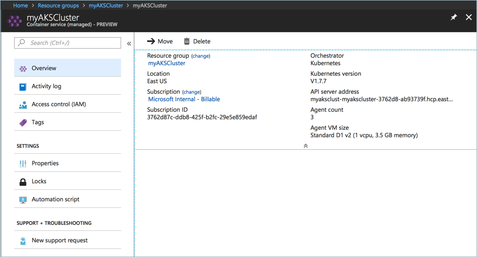

# Delete an Azure Kubernetes Service (AKS) cluster

When deleting an Azure Kubernetes Service cluster, the resource group in which the cluster was deployed remains, however all AKS-related resources are deleted. This document shows how to delete an AKS cluster using the Azure CLI and Azure portal.

In addition to deleting the cluster, the resource group in which it was deployed can be deleted, which also deletes the AKS cluster.

## Azure CLI

Use the [az aks delete][az-aks-delete] command to delete the AKS cluster.

```azurecli-interactive
az aks delete --resource-group myResourceGroup --name myAKSCluster
```

The following options are available with the `az aks delete` command.

| Argument | Description | Required |
|---|---|:---:|
| `--name` `-n` | Resource name for the managed cluster. | yes |
| `--resource-group` `-g` | Name of the Azure Kubernetes Service resource group. | yes |
| `--no-wait` | Do not wait for the long-running operation to finish. | no |
| `--yes` `-y` | Do not prompt for confirmation. | no |

## Azure portal

While in the Azure portal, browse to the resource group containing the Azure Kubernetes Service (AKS) resource, select the resource, and click **Delete**. You are prompted to confirm the delete operation.



<!-- LINKS - internal -->
[az-aks-delete]: /cli/azure/aks?view=azure-cli-latest#az-aks-delete