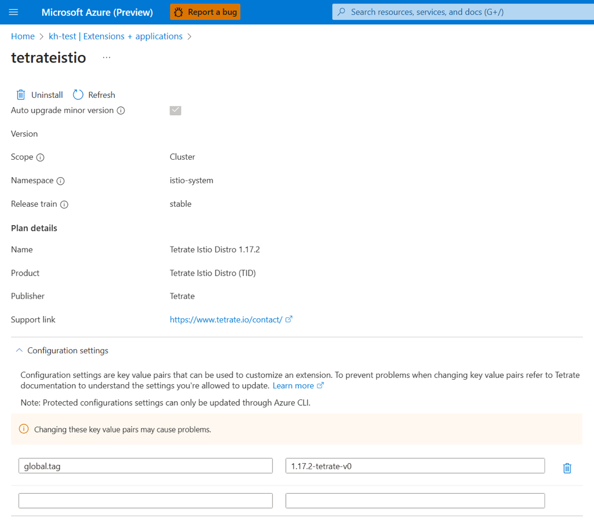

# Deploy and manage a Kubernetes application from Azure Marketplace

[Azure Marketplace][azure-marketplace] is an online store that contains thousands of IT software applications and services built by industry-leading technology companies. In Azure Marketplace, you can find, try, buy, and deploy the software and services that you need to build new solutions and manage your cloud infrastructure. The catalog includes solutions for different industries and technical areas, free trials, and consulting services from Microsoft partners.

Included among these solutions are Kubernetes application-based container offers. These offers contain applications that are meant to run on Kubernetes clusters such as Azure Kubernetes Service (AKS). In this article, you'll learn how to:

- Browse offers in Azure Marketplace.
- Purchase an application.
- Deploy the application on your AKS cluster.
- Monitor usage and billing information.

## Limitations

This feature is currently supported only in the following regions:

- East US, EastUS2EUAP, West US, Central US, West Central US, South Central US, East US2, West US2, West Europe, North Europe, Canada Central, South East Asia, Australia East, Central India, Japan East, Korea Central, UK South, UK West, Germany West Central, France Central, East Asia, West US3, Norway East, South African North, North Central US, Australia South East, Switzerland North, Japan West, South India

Kubernetes application-based container offers can't be deployed on AKS for Azure Stack HCI or AKS Edge Essentials.

## Select and deploy a Kubernetes application

### From an AKS cluster

1. In the [Azure portal](https://portal.azure.com/), you can deploy a Kubernetes application from an existing cluster by navigating to **Marketplace** or selecting **Extensions + applications**, then selecting **+ Add**.

   :::image type="content" source="./media/deploy-marketplace/add-inline.png" alt-text="The Azure portal page for the A K S cluster is shown. 'Extensions + Applications' is selected, and '+ Add' is highlighted." lightbox="./media/deploy-marketplace/add.png":::

1. You can search for an offer or publisher directly by name, or you can browse all offers.

   :::image type="content" source="./media/deploy-marketplace/marketplace-view-inline.png" alt-text="Screenshot of Kubernetes offers in the Azure portal." lightbox="./media/deploy-marketplace/marketplace-view.png":::

1. After you decide on an application, select the offer.

1. On the **Plans + Pricing** tab, select an option. Ensure that the terms are acceptable, and then select **Create**.

   :::image type="content" source="./media/deploy-marketplace/plan-pricing.png" alt-text="Screenshot of the offer purchasing page in the Azure portal, showing plan and pricing information.":::

1. Follow each page in the wizard, all the way through **Review + Create**. Fill in information for your resource group, your cluster, and any configuration options that the application requires.

   :::image type="content" source="./media/deploy-marketplace/review-create.png" alt-text="Screenshot of the Azure portal wizard for deploying a new offer, with the selector for creating a cluster or using an existing one.":::

1. When the application is deployed, the portal shows your deployment in progress, along with details.

   :::image type="content" source="./media/deploy-marketplace/deploying.png" alt-text="Screenshot of the Azure portal deployments screen, showing that the Kubernetes offer is currently being deployed.":::

### Search in the Azure portal

1. In the [Azure portal](https://portal.azure.com/), search for **Marketplace** on the top search bar. In the results, under **Services**, select **Marketplace**.

1. You can search for an offer or publisher directly by name, or you can browse all offers. To find Kubernetes application offers, on the left side under **Categories** select **Containers**.

   :::image type="content" source="./media/deploy-marketplace/containers-inline.png" alt-text="Screenshot of Azure Marketplace offers in the Azure portal, with the container category on the left side highlighted." lightbox="./media/deploy-marketplace/containers.png":::

   > [!IMPORTANT]
   > The **Containers** category includes both Kubernetes applications and standalone container images. This walkthrough is specific to Kubernetes applications. If you find that the steps to deploy an offer differ in some way, you're most likely trying to deploy a container image-based offer instead of a Kubernetes application-based offer.

1. You'll see several Kubernetes application offers displayed on the page. To view all of the Kubernetes application offers, select **See more**.

   :::image type="content" source="./media/deploy-marketplace/see-more-inline.png" alt-text="Screenshot of Azure Marketplace K8s offers in the Azure portal. 'See More' is highlighted." lightbox="./media/deploy-marketplace/see-more.png":::

1. After you decide on an application, select the offer.

1. On the **Plans + Pricing** tab, select an option. Ensure that the terms are acceptable, and then select **Create**.

   :::image type="content" source="./media/deploy-marketplace/plans-pricing-inline.png" alt-text="Screenshot of the offer purchasing page in the Azure portal, including plan and pricing information." lightbox="./media/deploy-marketplace/plans-pricing-full.png":::

1. Follow each page in the wizard, all the way through **Review + Create**. Fill in information for your resource group, your cluster, and any configuration options that the application requires. You can decide to deploy on a new AKS cluster or use an existing cluster.

   :::image type="content" source="./media/deploy-marketplace/purchase-experience-inline.png" alt-text="Screenshot of the Azure portal wizard for deploying a new offer, with the selector for creating a new cluster or using an existing cluster." lightbox="./media/deploy-marketplace/purchase-experience-full.png":::

   When the application is deployed, the portal shows **Your deployment is complete**, along with details of the deployment.

   :::image type="content" source="./media/deploy-marketplace/deployment-inline.png" alt-text="Screenshot of the Azure portal that shows a successful resource deployment to the cluster." lightbox="./media/deploy-marketplace/deployment-full.png":::

## Verify the deployment

### [Portal](#tab/azure-portal)

Verify the deployment navigating to the cluster you recently installed the extension on, then navigate to "Extensions + Applications", where you'll see the extension status:

   :::image type="content" source="./media/deploy-marketplace/verify-inline.png" lightbox="./media/deploy-marketplace/verify.png" alt-text="The Azure portal page for the A K S cluster is shown. 'Extensions + Applications' is selected, and the deployed extension is listed.":::

### [Azure CLI](#tab/azure-cli)

Verify the deployment by using the following command to list the extensions that are running on your cluster:

```azurecli-interactive
az k8s-extension list --cluster-name <clusterName> --resource-group <resourceGroupName> --cluster-type managedClusters
```


---

## Manage the offer lifecycle

For lifecycle management, an Azure Kubernetes offer is represented as a cluster extension for AKS. For more information, see [Cluster extensions for AKS][cluster-extensions].

Purchasing an offer from Azure Marketplace creates a new instance of the extension on your AKS cluster.

### [Portal](#tab/azure-portal)

First, navigate to an existing cluster, then select "Extensions + applications":

:::image type="content" source="./media/deploy-marketplace/cluster-view.png" alt-text="The Azure portal page for the A K S cluster. 'Extensions + Applications' is highlighted.":::

You'll see your recently installed extensions listed:

:::image type="content" source="./media/deploy-marketplace/verify-inline.png" lightbox="./media/deploy-marketplace/verify.png" alt-text="The Azure portal page for the A K S cluster. 'Extensions + Applications' is selected, and deployed extensions are listed.":::

Select an extension name to navigate to a properties view where you're able to disable auto upgrades, check the provisioning state, delete the extension instance, or modify configuration settings as needed.

:::image type="content" source="./media/deploy-marketplace/properties.png" alt-text="The Azure portal page for extension properties."::: 

To manage settings of your installed extension, you can edit the configuration settings:



### [Azure CLI](#tab/azure-cli)

You can view the extension instance from the cluster by using the following command:

```azurecli-interactive
az k8s-extension show --name <extension-name> --cluster-name <clusterName> --resource-group <resourceGroupName> --cluster-type managedClusters
```


---

## Monitor billing and usage information

To monitor billing and usage information for the offer that you deployed:

1. In the Azure portal, go to the page for your cluster's resource group.

1. Select **Cost Management** > **Cost analysis**. Under **Product**, you can see a cost breakdown for the plan that you selected.

   :::image type="content" source="./media/deploy-marketplace/billing-inline.png" alt-text="Screenshot of the Azure portal page for a resource group, with billing information broken down by offer plan." lightbox="./media/deploy-marketplace/billing-full.png":::

## Remove an offer

You can delete a purchased plan for an Azure container offer by deleting the extension instance on the cluster.

### [Portal](#tab/azure-portal)

Select an application, then select the uninstall button to remove the extension from your cluster:

:::image type="content" source="./media/deploy-marketplace/uninstall-inline.png" alt-text="The Azure portal page for the A K S cluster is shown. The deployed extension is listed with the 'uninstall' button highlighted." lightbox="./media/deploy-marketplace/uninstall.png":::

### [Azure CLI](#tab/azure-cli)

```azurecli-interactive
az k8s-extension delete --name <extension-name> --cluster-name <clusterName> --resource-group <resourceGroupName> --cluster-type managedClusters
```


---

## Troubleshooting

If you experience issues, see the [troubleshooting checklist for failed deployments of a Kubernetes offer][marketplace-troubleshoot].

## Next steps

- Learn more about [exploring and analyzing costs][billing].
- Learn more about [deploying a Kubernetes application programmatically using Azure CLI](/azure/aks/deploy-application-az-cli)
- Learn more about [deploying a Kubernetes application through an ARM template](/azure/aks/deploy-application-template)

<!-- LINKS -->
[azure-marketplace]: /marketplace/azure-marketplace-overview

[cluster-extensions]: ./cluster-extensions.md

[billing]: ../cost-management-billing/costs/quick-acm-cost-analysis.md

[marketplace-troubleshoot]: /troubleshoot/azure/azure-kubernetes/troubleshoot-failed-kubernetes-deployment-offer


