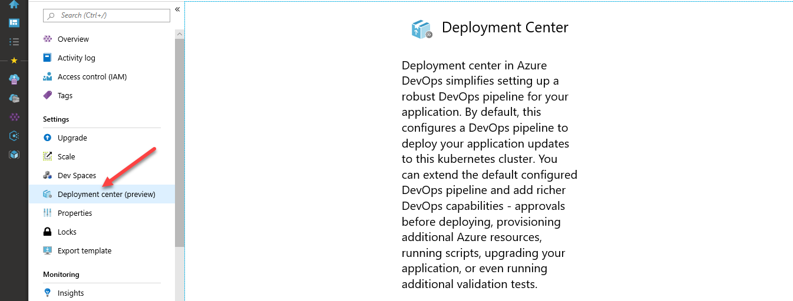
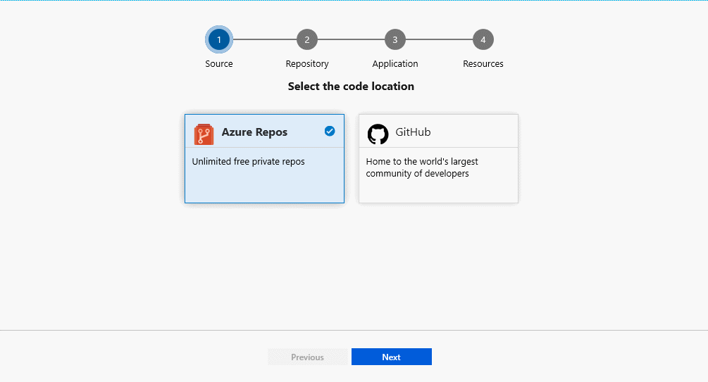
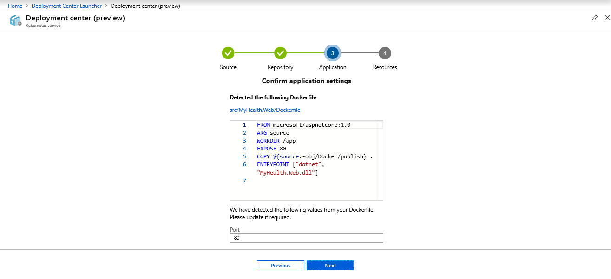
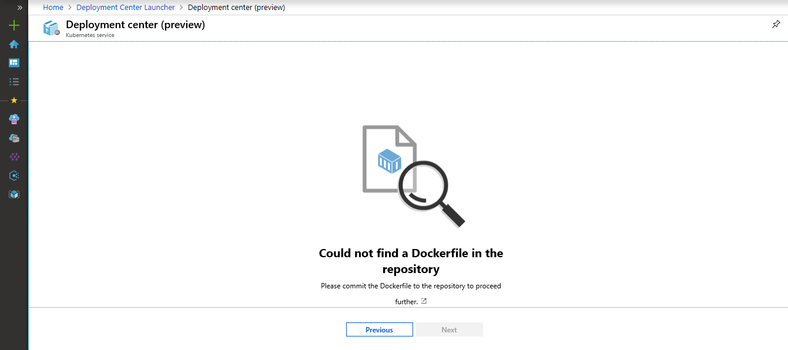
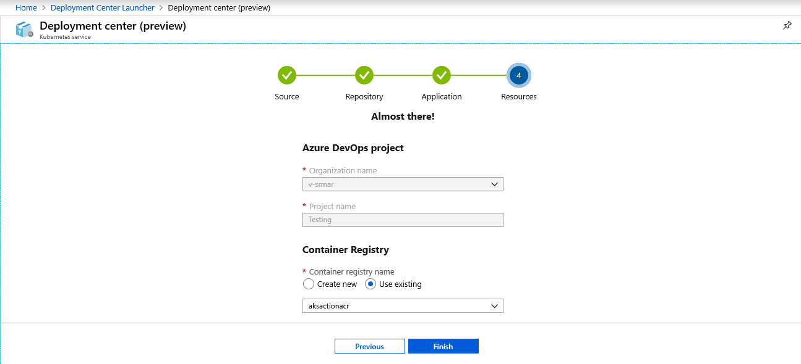
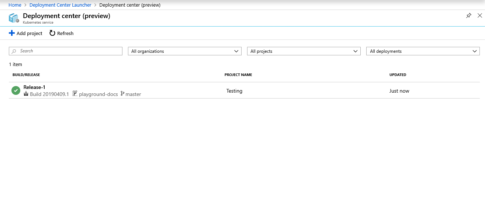

# Deployment Center Launcher

Deployment center in Azure DevOps simplifies setting up of a robust DevOps pipeline for your application. By default, configures a DevOps pipeline to deploy your application updates to the kubernetes cluster. You can extend the default configured DevOps pipeline and add the richer DevOps capabilities - approvals before deploying, provisioning additional Azure resources, running scripts, upgrading your application, or even running additional validation tests.

In this tutorial, you will:

> [!div class="checklist"]
> * Configure a DevOps pipeline to deploy your application updates to the k8s cluster
> * Examine the CI pipeline
> * Examine the CD pipeline
> * Clean up the resources

## Prerequisites

* An Azure subscription. You can get one free through [Visual Studio Dev Essentials](https://visualstudio.microsoft.com/dev-essentials/)

* Azure Kubernetes Service (AKS) cluster

## Create AKS cluster

1. Login to your [Azure portal](https://portal.azure.com/)

1. Select the [Cloud Shell](https://docs.microsoft.com/azure/cloud-shell/overview) button on the menu in the upper-right corner of the Azure portal.

1. To create the AKS cluster, run the following commands.

    ```cmd
    # The below command creates Resource Group in the south india location

    az group create --name azooaks --location southindia

    # The below command creates a cluster named azookubectl with one node. 

    az aks create --resource-group azooaks --name azookubectl --node-count 1 --enable-addons monitoring --generate-ssh-keys
    ```

## Deploy application updates to K8s Cluster

1. Navigate to the above created resource group.

1. Select the AKS cluster and click under left blade settings on the **Deployment Center (preview)**. Click on **Get started**.

   

1. Choose the location of the code and click **Next**. Currently, the repositories supported are, **[Azure Repos](https://docs.microsoft.com/azure/devops/repos/index?view=azure-devops)** and **GitHub**. You can follow the steps below based on the repository selection.

    Azure Repos is a set of version control tools that you can use to manage your code. Whether your software project is large or small, using version control as soon as possible is a good idea.

    - **Azure Repos**: Choose a repository from your existing project and organization.

        

    - **GitHub**: Authorize and select the repository for your GitHub account.

        


1. We're going to analyze repo and detect your Dockerfile. If you want to update it, you can edit the identified port number.

    

    If the repository does not contain the Dockerfile, the system will display a message to commit one. 

    

1. Select or create an existing Container Registry and click on **Finish**. The pipeline will be created automatically and queue a build in [Azure Pipelines](https://docs.microsoft.com/azure/devops/pipelines/index?view=azure-devops).

    Azure Pipelines is a cloud service that you can use to automatically build and test your code project and make it available to other users. Azure Pipelines combines continuous integration (CI) and continuous delivery (CD) to constantly and consistently test and build your code and ship it to any target.

    

1. Click on the link to see the ongoing pipeline.

1. You will see the successful logs as shown once the deployment is complete.

    

## Examine the CI pipeline

Deployment center configures your Azure DevOps organization's CI / CD pipeline automatically. The pipeline can be explored and customized. 

1. Go to the dashboard of the Deployment Center.  

1. Click on the build number from the list of successful logs to view the build pipeline for your project. 

1. Click ellipsis(...) from the top right corner. A menu shows several options such as queuing a new build, retaining build, and editing the build pipeline. Choose the **Edit pipeline**. 

1. You can examine the different tasks for your build pipeline in this pane. The build performs various tasks, such as collecting sources from the Git repo, creating an image, pushing an image to the container registry, and publishing outputs that are used for deployments.

1. Select the name of the build pipeline at the top of the build pipeline.

1. Change your build pipeline name to something more descriptive, select **Save & queue**, and then select **Save**.

1. Select **History** under your build pipeline. This pane shows an audit trail of your recent build changes. Azure DevOps monitors any changes made to the build pipeline and allows you to compare versions.

1. Choose **Triggers**. Optionally, branches can be included or excluded from the CI process.

1. Choose **Retention**. You can specify policies to keep or remove a number of builds depending on your scenario.

## Examine the CD pipeline

Deployment center creates and configures automatically the necessary steps from your Azure DevOps organization to your Azure subscription. These steps include setting up an Azure service connection to authenticate your Azure subscription with Azure DevOps. The automation also creates a release pipeline, which provides the CD to Azure.

1. Choose **Pipelines**, and then choose **Releases**.

1. To edit the release pipeline, click **Edit** .

1. Select **Drop** from **Artifacts**. In the previous steps, the construction pipeline you examined produces the output used for the artifact. 

1. Select **Continuous deployment** trigger on the right of the **Drop** icon. This release pipeline has an enabled CD trigger that runs a deployment whenever a new build artifact is available. Optionally, you can disable the trigger to require manual execution for your deployments.

1. To examine all the tasks for your pipeline, click on **Tasks**. The release sets the tiller environment, configures the imagePullSecrets, installs Helm tools and deploys the Helm charts to the K8s cluster.

1. To view releases history, click on **View releases**. 

1. To see the summary, click on the **Release**. Click on any of the stage to explore multiple menus, such as a release summary, associated work items, and tests. 

1. Select **Commits**. This view shows code commits related to this deployment. Compare releases to see the commit differences between deployments.

1. Select **Logs**. The logs contain useful deployment information. During and after deployments, you can view them.

## Clean up resources

You can delete the related resources that you created when you don't need them anymore. Use the Delete functionality on the DevOps Projects dashboard.

## Next steps

You can optionally modify these build and release pipelines to meet the needs of your team. You can also use this CI/CD pattern as a template for your other pipelines. In this tutorial, you learned how to:

> [!div class="checklist"]
> * Configure a DevOps pipeline to deploy your application updates to the k8s cluster
> * Examine the CI pipeline
> * Examine the CD pipeline
> * Clean up the resources
