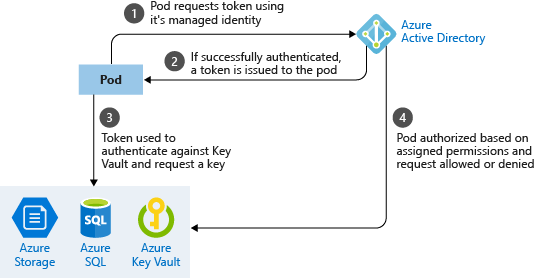
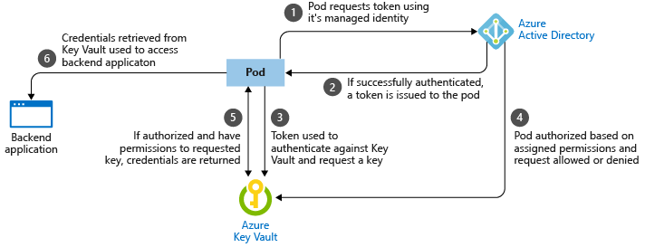

# Best practices for pod security in Azure Kubernetes Service (AKS)

As you develop and run applications in Azure Kubernetes Service (AKS), the security of your pods is a key consideration. Your applications should be designed for the principal of least number of privileges required. Credentials such as passwords, keys, and certificates shouldn't be included in your application code. Adding them to your code creates a risk for exposure and limits the ability to rotate those credentials.

This best practices article focuses on how secure pods in AKS. You learn how to:

> [!div class="checklist"]
> * Use pod security context to limit access to processes and services or privilege escalation
> * Authenticate with other Azure resources using pod managed identities
> * Request and retrieve credentials from a digital vault such as Azure Key Vault

You can also read the best practices for [cluster security][best-practices-cluster-security] and for [container image management][best-practices-container-image-management].

## Secure pod access to resources

**Best practice guidance** - To run as a different user or group and limit access to the underlying node processes and services, define pod security context settings. Assign the least number of privileges required.

For your applications to run correctly, pods may need to run as a defined user or group. The `securityContext` for a pod or container lets you define settings such as *runAsUser* or *fsGroup* to assume the appropriate permissions. Only assign the required user or group permissions, and don't use the security context as a means to assume additional permissions.

A pod security context can also define additional capabilities or permissions for accessing processes and services. The following common security context definitions can be set:

* **allowPrivilegeEscalation** defines if the pod can assume *root* privileges. Design your applications so this setting is always set to *false*.
* **Linux capabilities** let the pod access underlying node processes. Take care with assigning these capabilities. Assign the least number of privileges needed. For more information, see [Linux capabilities][linux-capabilities].
* **SELinux labels** is a Linux kernel security module that lets you define access policies for services, processes, and filesystem access. Again, assign the least number of privileges needed. For more information, see [SELinux options in Kubernetes][selinux-labels]

The following example pod YAML manifest sets security context settings to define:

* Pod runs as user ID *1000* and part of group ID *2000*
* Can't escalate privileges to use `root`
* Allows Linux capabilities to access network interfaces and the host's real-time (hardware) clock

```yaml
apiVersion: v1
kind: Pod
metadata:
  name: security-context-demo
spec:
  containers:
    - name: security-context-demo
      image: nginx:1.15.5
    securityContext:
      runAsUser: 1000
      fsGroup: 2000
      allowPrivilegeEscalation: false
      capabilities:
        add: ["NET_ADMIN", "SYS_TIME"]
```

Work with your cluster operator to determine what security context settings you need. Try to design your applications to minimize additional permissions and access the pod requires. There are additional security features to limit access using AppArmor and seccomp (secure computing) that can be implemented by cluster operators. For more information, see [Secure container access to resources][apparmor-seccomp].

## Limit credential exposure

**Best practice guidance** - Don't define credentials in your application code. Use managed identities for Azure resources to let your pod request access to other resources. A digital vault, such as Azure Key Vault, should also be used to store and retrieve digital keys and credentials.

To limit the risk of credentials being exposed in your application code, avoid the use of fixed or shared credentials. Credentials or keys shouldn't be included directly in your code. If these credentials are exposed, the application needs to be updated and redeployed. A better approach is to give pods their own identity and way to authenticate themselves, or automatically retrieve credentials from a digital vault.

AKS includes two ways to automatically authenticate pods or request credentials and keys from a digital vault:

* Managed identities for Azure resources, and
* Azure Key Vault FlexVol driver

### Use pod managed identities

A managed identity for Azure resources lets a pod authenticate itself against a service such as Storage or SQL. The pod is assigned an identity that lets them authenticate to Azure Active Directory and receive a digital token. This digital token can be presented to other Azure services that check if the pod is authorized to access the service and perform the required actions. The simplified workflow for pod managed identity is shown in the following diagram:



With a managed identity, your application code doesn't need to include credentials to access a service, such as Azure Storage. As each pod authenticates with its own identity, so you can audit and review access. If your application connects with other Azure services, use managed identities to limit credential reuse and risk of exposure.

For more information about pod identities, see [Configure an AKS cluster to use pod managed identities][aad-pod-identity] and [Assign and use pod managed identities in your code][aad-pod-identity].

### Use Azure Key Vault with FlexVol

Managed pod identities work great to authenticate against supporting Azure services. For your own services or applications without managed identities for Azure resources, you still authenticate using credentials or keys. A digital vault can be used to store these credentials.

When applications need a credential, they communicate with the digital vault, retrieve the latest credentials, and then connect to the required service. Azure Key Vault can be this digital vault. The simplified workflow for retrieving a credential from Azure Key Vault using pod managed identities is shown in the following diagram:



With Key Vault, you store and regularly rotate secrets such as credentials, storage account keys, or certificates. You can integrate Azure Key Vault with an AKS cluster using a FlexVolume. The FlexVolume driver lets the AKS cluster natively retrieve credentials from Key Vault and securely provide them only to the requesting pod. Work with your cluster operator to deploy the Key Vault FlexVol driver onto the AKS nodes. You can use a pod managed identity to request access to Key Vault and retrieve the credentials you need through the FlexVolume driver.

## Next steps

This article focused on how to secure your pods. To implement some of these areas, see the following articles:

* [Use managed identities for Azure resources with AKS][aad-pod-identity]
* [Integrate Azure Key Vault with AKS][aks-keyvault-flexvol]

<!-- EXTERNAL LINKS -->
[aad-pod-identity]: https://github.com/Azure/aad-pod-identity#demo-pod
[aks-keyvault-flexvol]: https://github.com/Azure/kubernetes-keyvault-flexvol
[linux-capabilities]: http://man7.org/linux/man-pages/man7/capabilities.7.html
[selinux-labels]: https://kubernetes.io/docs/reference/generated/kubernetes-api/v1.12/#selinuxoptions-v1-core

<!-- INTERNAL LINKS -->
[best-practices-cluster-security]: operator-best-practices-cluster-security.md
[best-practices-container-image-management]: operator-best-practices-container-image-management.md
[aks-pod-identities]: operator-best-practices-identity.md#use-pod-identities
[apparmor-seccomp]: operator-best-practices-cluster-security.md#secure-container-access-to-resources
