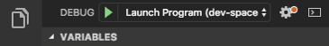
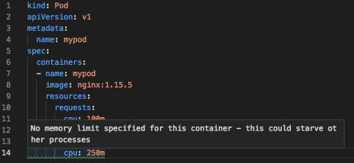

# Best practices for application developers to manage resources in Azure Kubernetes Service (AKS)

As you develop and run applications in Azure Kubernetes Service (AKS), there are a few key areas to consider. How you manage your application deployments can negatively impact the end-user experience of services that you provide. To help you succeed, keep in mind some best practices you can follow as you develop and run applications in AKS.

This best practices article focuses on how to run your cluster and workloads from an application developer perspective. For information about administrative best practices, see [Cluster operator best practices for isolation and resource management in Azure Kubernetes Service (AKS)][operator-best-practices-isolation]. In this article, you learn:

> [!div class="checklist"]
> * What are pod resource requests and limits
> * Ways to develop and deploy applications with Dev Spaces and Visual Studio Code
> * How to use the `kube-advisor` tool to check for issues with deployments

## Define pod resource requests and limits

**Best practice guidance** - Set pod requests and limits on all pods in your YAML manifests. If the AKS cluster uses *resource quotas*, your deployment may be rejected if you don't define these values.

A primary way to manage the compute resources within an AKS cluster is to use pod requests and limits. These requests and limits let the Kubernetes scheduler know what compute resources a pod should be assigned.

* **Pod CPU/Memory requests** define a set amount of CPU and memory that the pod needs on a regular basis.
    * When the Kubernetes scheduler tries to place a pod on a node, the pod requests are used to determine which node has sufficient resources available for scheduling.
    * Not setting a pod request will default it to the limit defined.
    * It is very important to monitor the performance of your application to adjust these requests. If insufficient requests are made, your application may receive degraded performance due to over scheduling a node. If requests are overestimated, your application  may have increased difficulty getting scheduled.
* **Pod CPU/Memory limits** are the maximum amount of CPU and memory that a pod can use. These limits help define which pods should be killed in the event of node instability due to insufficient resources. Without proper limits set pods will be killed until resource pressure is lifted.
    * Pod limits help define when a pod has lost control of resource consumption. When a limit is exceeded, the pod is prioritized for killing to maintain node health and minimize impact to pods sharing the node.
    * Not setting a pod limit defaults it to the highest available value on a given node.
    * Don't set a pod limit higher than your nodes can support. Each AKS node reserves a set amount of CPU and memory for the core Kubernetes components. Your application may try to consume too many resources on the node for other pods to successfully run.
    * Again, it is very important to monitor the performance of your application at different times during the day or week. Determine when the peak demand is, and align the pod limits to the resources required to meet the application's max needs.

In your pod specifications, it's **best practice and very important** to define these requests and limits based on the above information. If you don't include these values, the Kubernetes scheduler cannot take into account the resources your applications require to aid in scheduling decisions.

If the scheduler places a pod on a node with insufficient resources, application performance will be degraded. It is highly recommended for cluster administrators to set *resource quotas* on a namespace that requires you to set resource requests and limits. For more information, see [resource quotas on AKS clusters][resource-quotas].

When you define a CPU request or limit, the value is measured in CPU units. 
* *1.0* CPU equates to one underlying virtual CPU core on the node. 
* The same measurement is used for GPUs.
* You can define fractions measured in millicores. For example, *100m* is *0.1* of an underlying vCPU core.

In the following basic example for a single NGINX pod, the pod requests *100m* of CPU time, and *128Mi* of memory. The resource limits for the pod are set to *250m* CPU and *256Mi* memory:

```yaml
kind: Pod
apiVersion: v1
metadata:
  name: mypod
spec:
  containers:
  - name: mypod
    image: nginx:1.15.5
    resources:
      requests:
        cpu: 100m
        memory: 128Mi
      limits:
        cpu: 250m
        memory: 256Mi
```

For more information about resource measurements and assignments, see [Managing compute resources for containers][k8s-resource-limits].

## Develop and debug applications against an AKS cluster

**Best practice guidance** - Development teams should deploy and debug against an AKS cluster using Dev Spaces. This development model makes sure that role-based access controls, network, or storage needs are implemented before the app is deployed to production.

With Azure Dev Spaces, you develop, debug, and test applications directly against an AKS cluster. Developers within a team work together to build and test throughout the application lifecycle. You can continue to use existing tools such as Visual Studio or Visual Studio Code. An extension is installed for Dev Spaces that gives an option to run and debug the application in an AKS cluster:



This integrated development and test process with Dev Spaces reduces the need for local test environments, such as [minikube][minikube]. Instead, you develop and test against an AKS cluster. This cluster can be secured and isolated as noted in previous section on the use of namespaces to logically isolate a cluster. When your apps are ready to deploy to production, you can confidently deploy as your development was all done against a real AKS cluster.

Azure Dev Spaces is intended for use with applications that run on Linux pods and nodes.

## Use the Visual Studio Code extension for Kubernetes

**Best practice guidance** - Install and use the VS Code extension for Kubernetes when you write YAML manifests. You can also use the extension for integrated deployment solution, which may help application owners that infrequently interact with the AKS cluster.

The [Visual Studio Code extension for Kubernetes][vscode-kubernetes] helps you develop and deploy applications to AKS. The extension provides intellisense for Kubernetes resources, and Helm charts and templates. You can also browse, deploy, and edit Kubernetes resources from within VS Code. The extension also provides an intellisense check for resource requests or limits being set in the pod specifications:



## Regularly check for application issues with kube-advisor

**Best practice guidance** - Regularly run the latest version of `kube-advisor` open source tool to detect issues in your cluster. If you apply resource quotas on an existing AKS cluster, run `kube-advisor` first to find pods that don't have resource requests and limits defined.

The [kube-advisor][kube-advisor] tool is an associated AKS open source project that scans a Kubernetes cluster and reports on issues that it finds. One useful check is to identify pods that don't have resource requests and limits in place.

The kube-advisor tool can report on resource request and limits missing in PodSpecs for Windows applications as well as Linux applications, but the kube-advisor tool itself must be scheduled on a Linux pod. You can schedule a pod to run on a node pool with a specific OS using a [node selector][k8s-node-selector] in the pod's configuration.

In an AKS cluster that hosts many development teams and applications, it can be hard to track pods without these resource requests and limits set. As a best practice, regularly run `kube-advisor` on your AKS clusters.

## Next steps

This best practices article focused on how to run your cluster and workloads from a cluster operator perspective. For information about administrative best practices, see [Cluster operator best practices for isolation and resource management in Azure Kubernetes Service (AKS)][operator-best-practices-isolation].

To implement some of these best practices, see the following articles:

* [Develop with Dev Spaces][dev-spaces]
* [Check for issues with kube-advisor][aks-kubeadvisor]

<!-- EXTERNAL LINKS -->
[k8s-resource-limits]: https://kubernetes.io/docs/concepts/configuration/manage-compute-resources-container/
[vscode-kubernetes]: https://github.com/Azure/vscode-kubernetes-tools
[kube-advisor]: https://github.com/Azure/kube-advisor
[minikube]: https://kubernetes.io/docs/setup/minikube/

<!-- INTERNAL LINKS -->
[aks-kubeadvisor]: kube-advisor-tool.md
[dev-spaces]: ../dev-spaces/get-started-netcore.md
[operator-best-practices-isolation]: operator-best-practices-cluster-isolation.md
[resource-quotas]: operator-best-practices-scheduler.md#enforce-resource-quotas
[k8s-node-selector]: concepts-clusters-workloads.md#node-selectors
