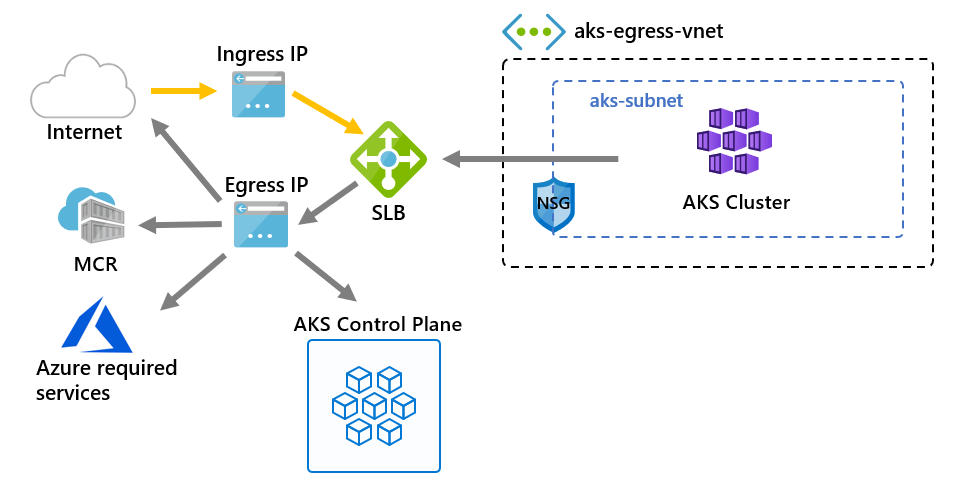

# Customize cluster egress with a User-Defined Route

Egress from an AKS cluster can be customized to fit specific scenarios. By default, AKS will provision a Standard SKU Load Balancer to be set up and used for egress. However, the default setup may not meet the requirements of all scenarios if public IPs are disallowed or additional hops are required for egress.

This article walks through how to customize a cluster's egress route to support custom network scenarios, such as those which disallows public IPs and requires the cluster to sit behind a network virtual appliance (NVA).

## Prerequisites
* Azure CLI version 2.0.81 or greater
* API version of `2020-01-01` or greater

## Limitations
* OutboundType can only be defined at cluster create time and can't be updated afterwards.
* Setting `outboundType` requires AKS clusters with a `vm-set-type` of `VirtualMachineScaleSets` and `load-balancer-sku` of `Standard`.
* Setting `outboundType` to a value of `UDR` requires a user-defined route with valid outbound connectivity for the cluster.
* Setting `outboundType` to a value of `UDR` implies the ingress source IP routed to the load-balancer may **not match** the cluster's outgoing egress destination address.

## Overview of outbound types in AKS

An AKS cluster can be customized with a unique `outboundType` of type load balancer or user-defined routing.

> [!IMPORTANT]
> Outbound type impacts only the egress traffic of your cluster. For more information, see [setting up ingress controllers](ingress-basic.md).

> [!NOTE]
> You can use your own [route table][byo-route-table] with UDR and kubenet networking. Make sure you cluster identity (service principal or managed identity) has Contributor permissions to the custom route table.

### Outbound type of loadBalancer

If `loadBalancer` is set, AKS completes the following configuration automatically. The load balancer is used for egress through an AKS assigned public IP. An outbound type of `loadBalancer` supports Kubernetes services of type `loadBalancer`, which expect egress out of the load balancer created by the AKS resource provider.

The following configuration is done by AKS.
   * A public IP address is provisioned for cluster egress.
   * The public IP address is assigned to the load balancer resource.
   * Backend pools for the load balancer are set up for agent nodes in the cluster.

Below is a network topology deployed in AKS clusters by default, which use an `outboundType` of `loadBalancer`.

### Outbound type of userDefinedRouting

> [!NOTE]
> Using outbound type is an advanced networking scenario and requires proper network configuration.

If `userDefinedRouting` is set, AKS won't automatically configure egress paths. The egress setup must be done by you.

The AKS cluster must be deployed into an existing virtual network with a subnet that has been previously configured because when using standard load balancer (SLB) architecture, you must establish explicit egress. As such, this architecture requires explicitly sending egress traffic to an appliance like a firewall, gateway, proxy or to allow the Network Address Translation (NAT) to be done by a public IP assigned to the standard load balancer or appliance.

The AKS resource provider will deploy a standard load balancer (SLB). The load balancer isn't configured with any rules and [doesn't incur a charge until a rule is placed](https://azure.microsoft.com/pricing/details/load-balancer/). AKS **won't** automatically provision a public IP address for the SLB frontend nor automatically configure the load balancer backend pool.

## Deploy a cluster with outbound type of UDR and Azure Firewall

To illustrate the application of a cluster with outbound type using a user-defined route, a cluster can be configured on a virtual network with an Azure Firewall on its own subnet. See this example on the [restrict egress traffic with Azure firewall example](limit-egress-traffic.md#restrict-egress-traffic-using-azure-firewall).

> [!IMPORTANT]
> Outbound type of UDR requires there is a route for 0.0.0.0/0 and next hop destination of NVA (Network Virtual Appliance) in the route table.
> The route table already has a default 0.0.0.0/0 to Internet, without a Public IP to SNAT just adding this route will not provide you egress. AKS will validate that you don't create a 0.0.0.0/0 route pointing to the Internet but instead to NVA or gateway, etc.

## Next steps

See [Azure networking UDR overview](https://docs.microsoft.com/azure/virtual-network/virtual-networks-udr-overview).

See [how to create, change, or delete a route table](https://docs.microsoft.com/azure/virtual-network/manage-route-table).

<!-- LINKS - internal -->
[az-aks-get-credentials]: /cli/azure/aks?view=azure-cli-latest#az-aks-get-credentials
[byo-route-table]: configure-kubenet.md#bring-your-own-subnet-and-route-table-with-kubenet