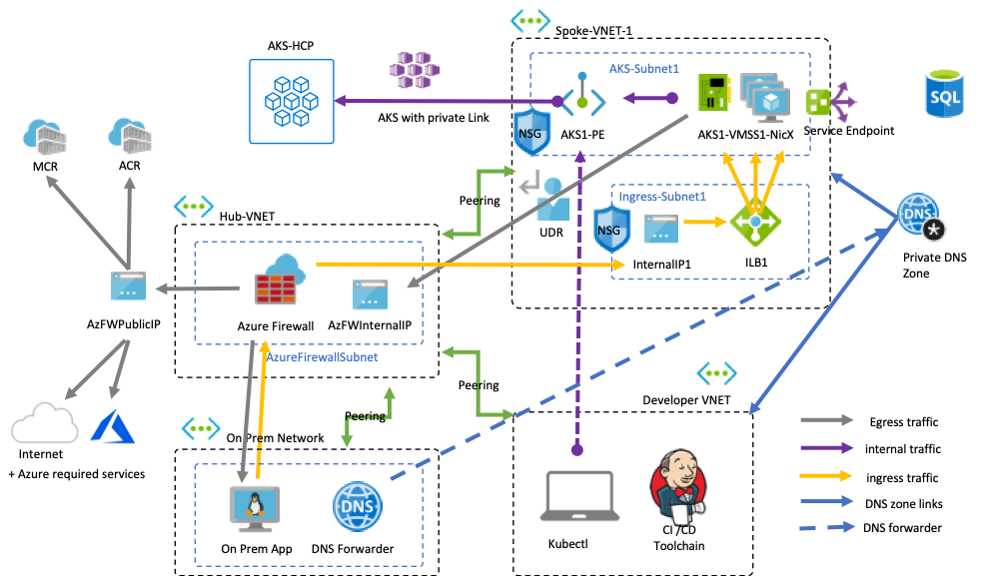

# Customize user-defined-routes for egress from an Azure Kubernetes Service (AKS) cluster

Egress from an AKS cluster can be customized to fit specific scenarios. By default, AKS will provision a Standard SKU Load Balancer to be setup and used for egress. The setup of the load balancer is done on behalf of the user for the following reasons.
1. A public IP address is required for the Standard SKU load balancer for egress, so AKS automatically assigns a public IP to the load balancer as egress setup is not provided by default. This behavior changes between the Basic SKU load balancers. 
1. AKS [requires outbound connectivity](limit-egress-traffic.md) to function properly and issue common operations such as pulling system-pod images or security patches. To learn more about why clusters require external connectivity and the required endpoints that clusters must be able to access, read about [controlling egress traffic for cluster nodes](limit-egress-traffic.md).

However, this setup may not meet the requirements of all scenarios.

This article walks through how to customize a cluster's egress path to support a locked down scenario which disallows public IPs and requires the cluster to sit behind a network virtual appliance (NVA).

## Before you begin

Ensure you have the Azure CLI preview extension installed with at least version `0.4.28`. This requires an API version of at least `2019-11-01` or above.

## Limitations
* `outboundType` can only be defined at cluster create time and cannot be updated afterwards.
* Setting `outboundType` requires AKS clusters to use Azure CNI. There is no support for Kubenet.
* Setting `outboundType` requires AKS clusters created with a `vm-set-type` of `VirtualMachineScaleSets`.
* Setting `outboundType` to a value of `UDR` requires AKS clusters created with a `load-balancer-sku` of `Standard`.
* Setting `outboundType` to a value of `UDR` requires a valid user created path of outbound connectivity for a cluster.
* Setting `outboundType` to a value of `UDR` implies the ingress source IP routed to the load-balancer will *not match* the outgoing egress destination.

## Overview of cluster outbound types

An AKS cluster can define it's `outboundType` as `loadBalancer` or `userDefinedRoute`. This impacts only the egress traffic of your cluster, to learn about ingress read documentation on setting up [ingress controllers](ingress-basic.md).

* If `loadBalancer` is set, AKS completes the following setup automatically. The load balancer is used for egress through an AKS assigned public IP. This supports Kubernetes services of type loadBalancer which expect egress out of the cloud provider created load balancer. The following setup is done by AKS.
   * A public IP address is provisioned
   * The public IP address is assigned to the load balancer resource
   * Backend pools are setup for agent nodes in the cluster
* If `userDefinedRoute` is set, AKS will not automatically configure egress paths. The following is expected to be done by **the user**.
   * User creates a  user defined route (UDR) on the subnet the cluster is deployed into
   * The cluster has valid outbound connectivity through the UDR setup

## Configure an isolated network topology with Azure Firewall

To illustrate the application of a UDR outbound type cluster, a cluster will be configured on a virtual network which is shared with an Azure Firewall. 

Resources are isolated to dedicated subnets and route inbound traffic from the Azure Firewall to an internal load balancer created with the AKS cluster. Egress from the AKS cluster follows a UDR which defines the next hop to the Azure Firewall.



### Create dedicated subnets for your cluster and the NVA

To begin, define a set of environment variables to be used in resource creations.

```bash
export PREFIX="yourPrefix"
export RG="${PREFIX}-rg"
export LOC="canadacentral"
export AKSNAME="${PREFIX}"
export AKSSUBNET_NAME="${PREFIX}akssubnet"
export VNET_NAME="${PREFIX}vnet"
# DO NOT CHANGE FWSUBNET_NAME - This is currently a requirement for Azure Firewall.
export FWSUBNET_NAME="AzureFirewallSubnet"
export FWNAME="${PREFIX}fw"
export FWPUBLICIP_NAME="${PREFIX}fwpublicip"
export FWIPCONFIG_NAME="${PREFIX}fwconfig"
export FWROUTE_TABLE_NAME="${PREFIX}fwrt"
export FWROUTE_NAME="${PREFIX}fwrn"
export FWROUTE_NAME_INTERNET="${PREFIX}fwrninternet"
export PLUGIN="azure"
export APPID="enter service principal id"
export PASSWORD="enter service principal secret"
export BASE_ADDRESS=10.42
```

Now, create a resource group to hold all of the resources in this scenario.

```
az group create --name $RG --location $LOC
```

Create a virtual network to host the AKS cluster and Azure Firewall.

```
az network vnet create \
    --resource-group $RG \
    --name $VNET_NAME \
    --address-prefixes $BASE_ADDRESS.0.0/16 \
    --subnet-name $AKSSUBNET_NAME \
    --subnet-prefix $BASE_ADDRESS.1.0/24
```

Now we can create a subnet within this virtual network to be dedicated to the Azure Firewall resource.

```
az network vnet subnet create \
    --resource-group $RG \
    --vnet-name $VNET_NAME \
    --name $FWSUBNET_NAME \
    --address-prefix $BASE_ADDRESS.4.0/24
```

### Create an Azure Firewall with a public endpoint

Azure Firewall is the NVA, acting as the ingress point for incoming traffic so firewall filters can be applied upfront. On egress, the AKS cluster will rely on a UDR to make the next hop to the Azure Firewall for exit from the virtual network.

Create a standard SKU public IP resource which will be used as the Azure Firewall frontend address.

```azure-cli
az network public-ip create -g $RG -n $FWPUBLICIP_NAME -l $LOC --sku "Standard"
```

Register the preview cli-extension to create an Azure Firewall.
```azure-cli
az extension add --name azure-firewall
az network firewall create -g $RG -n $FWNAME -l $LOC
```

The IP address created earlier can now be assigned to the firewall frontend.
```azure-cli
## Configure Firewall IP Config
## This command will take a few minutes.
az network firewall ip-config create -g $RG -f $FWNAME -n $FWIPCONFIG_NAME --public-ip-address $FWPUBLICIP_NAME --vnet-name $VNET_NAME
```

Save the firewall frontend IP address for configuration later.
```bash
## Capture Firewall IP Address for Later Use
export FWPUBLIC_IP=$(az network public-ip show -g $RG -n $FWPUBLICIP_NAME --query "ipAddress" -o tsv)
export FWPRIVATE_IP=$(az network firewall show -g $RG -n $FWNAME --query "ipConfigurations[0].privateIpAddress" -o tsv)
```

## Create UDRs for the cluster and firewall

Azure automatically routes traffic between Azure subnets, virtual networks, and on-premises networks. If you want to change any of Azure's default routing, you do so by creating a route table.

Create a route table for the Azure Firewall to reach the public internet.

```azure-cli
az network route-table create -g $RG --name $FWROUTE_TABLE_NAME
```

We can now add a route to each route-table, one for the cluster and one for the firewall. The cluster's route connects the AKS cluster to the Azure Firewall. The firewall's route defines a path to the public internet.

Each subnet can have zero or one route table associated to it.
```azure-cli
az network route-table route create -g $RG --name $FWROUTE_NAME --route-table-name $FWROUTE_TABLE_NAME --address-prefix 0.0.0.0/0 --next-hop-type VirtualAppliance --next-hop-ip-address $FWPRIVATE_IP
az network route-table route create -g $RG --name $FWROUTE_NAME_INTERNET --route-table-name $FWROUTE_TABLE_NAME --address-prefix $FWPUBLIC_IP/32 --next-hop-type Internet
```

To learn more about how to create custom, or user-defined, routes read [virtual network documentation](https://docs.microsoft.com/azure/virtual-network/virtual-networks-udr-overview#user-defined) about how you can override Azure's default system routes or add additional routes to a subnet's route table.

## Add network firewall rules

When configuring firewall rules, read the [required egress endpoints](egress.md) AKS needs to operate. All of these must be accounted for in addition to any specific egress needs for workloads running on the cluster. In this example we will only add one as an example.

```
# Add Network FW Rules

az network firewall network-rule create -g $RG -f $FWNAME --collection-name 'aksfwnr' -n 'netrules' --protocols 'Any' --source-addresses '*' --destination-addresses '*' --destination-ports '*' --action allow --priority 100

# Add Application FW Rules
# IMPORTANT: Add AKS required egress endpoints
az network firewall application-rule create -g $RG -f $FWNAME --collection-name 'aksfwar' -n 'fqdn' --source-addresses '*' --protocols 'http=80' 'https=443' --target-fqdns '*' --action allow --priority 100
```

To learn more about Azure Firewall rules, visit the [Azure Firewall documentation](https://docs.microsoft.com/azure/firewall/overview).

## Associate the AKS cluster subnet to the Azure Firewall

To connect egress from the cluster, the dedicated subnet for the AKS cluster must be associated with the Azure Firewall. This can be done by issuing a command to the virtual network holding both the cluster and firewall to update the route table of the cluster's subnet.

```azure-cli
# Associate AKS Subnet to FW
az network vnet subnet update -g $RG --vnet-name $VNET_NAME --name $AKSSUBNET_NAME --route-table $FWROUTE_TABLE_NAME
```

Permissions must also be granted to the service principal passed to the AKS cluster to enable permission to be deployed into the network.

```azure-cli
az role assignment create --assignee $APPID --scope $VNETID --role Contributor
```

## Deploy a cluster with outbound type set to UDR to the existing subnet

Finally, the AKS cluster can be deployed into the existing subnet we have dedicated for the cluster. We will define the outbound type to follow the UDR which exists on the subnet, enabling AKS to skip setup and IP provisioning for the load balancer which can now be strictly internal.

```azure-cli
az aks create -g $RG -n $AKSNAME -l $LOC \
  --node-count 3 \
  --network-plugin $PLUGIN --generate-ssh-keys \
  --network-policy azure \
  --service-cidr $BASE_ADDRESS.5.0/24 \
  --dns-service-ip $BASE_ADDRESS.5.10 \
  --docker-bridge-address 172.17.0.1/16 \
  --vnet-subnet-id $SUBNETID \
  --service-principal $APPID \
  --client-secret $PASSWORD \
  --load-balancer-sku standard \
  --outbound-type userDefinedRouting
  ```

## Create and configure additional Kubernetes services

When adding additional Kubernetes services into a cluster with outbound type customized with UDR, an additional destination network address translation (DNAT) rule may be required. This is a hard requirement in the firewall scenario described above. This requires a new public IP to be available on the Azure Firewall and a dedicated DNAT rule for each subsequent service.

## Next steps

To learn more about virtual network traffic routing, visit the [Azure networking UDR overview](https://docs.microsoft.com/azure/virtual-network/virtual-networks-udr-overview.)

To learn more read about managing a route table, visit [how to create, change, or delete a route table](https://docs.microsoft.com/azure/virtual-network/manage-route-table).