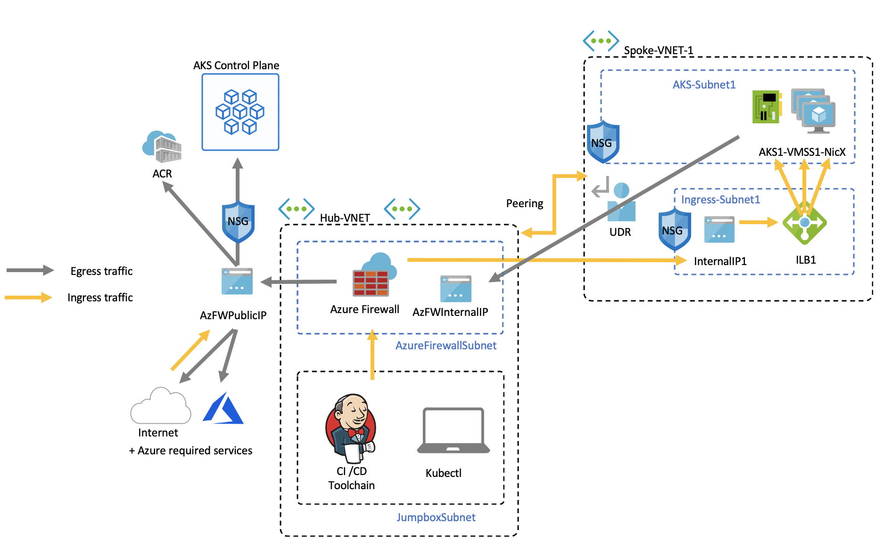
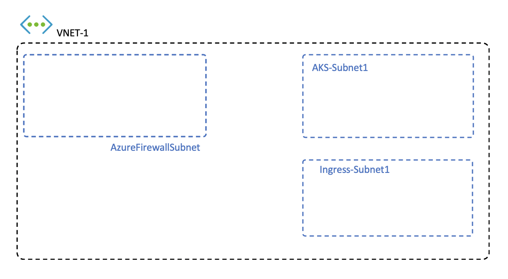
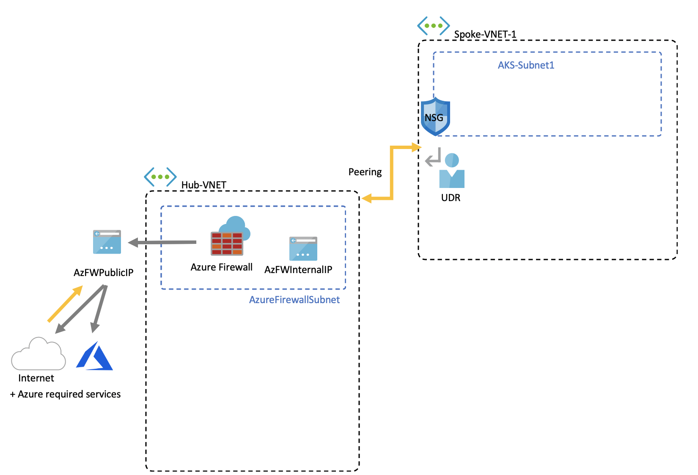

# Customize cluster egress with a User-Defined Route

Egress from an AKS cluster can be customized to fit specific scenarios. By default, AKS will provision a Standard SKU Load Balancer to be set up and used for egress. However, the default setup may not meet the requirements of all scenarios if public IPs are disallowed or additional hops are required for egress.

This article walks through how to customize a cluster's egress route to support custom network scenarios, such as those which disallows public IPs and requires the cluster to sit behind a network virtual appliance (NVA).

## Prerequisites
* Azure CLI version 2.0.81 or greater
* API version of `2020-01-01` or greater


## Limitations
* OutboundType can only be defined at cluster create time and cannot be updated afterward.
* Setting `outboundType` requires AKS clusters with a `vm-set-type` of `VirtualMachineScaleSets` and `load-balancer-sku` of `Standard`.
* Setting `outboundType` to a value of `UDR` requires a user-defined route with valid outbound connectivity for the cluster.
* Setting `outboundType` to a value of `UDR` implies the ingress source IP routed to the load-balancer may **not match** the cluster's outgoing egress destination address.

## Overview of outbound types in AKS

An AKS cluster can be customized with a unique `outboundType` of type load balancer or user-defined routing.

> [!IMPORTANT]
> Outbound type impacts only the egress traffic of your cluster. See [setting up ingress controllers](ingress-basic.md) for more information.

> [!NOTE]
> You can use your own [route table][byo-route-table] with UDR and kubenet networking.

### Outbound type of loadBalancer

If `loadBalancer` is set, AKS completes the following configuration automatically. The load balancer is used for egress through an AKS assigned public IP. An outbound type of `loadBalancer` supports Kubernetes services of type `loadBalancer`, which expect egress out of the load balancer created by the AKS resource provider.

The following configuration is done by AKS.
   * A public IP address is provisioned for cluster egress.
   * The public IP address is assigned to the load balancer resource.
   * Backend pools for the load balancer are set up for agent nodes in the cluster.

Below is a network topology deployed in AKS clusters by default, which use an `outboundType` of `loadBalancer`.


### Outbound type of userDefinedRouting

> [!NOTE]
> Using outbound type is an advanced networking scenario and requires proper network configuration.

If `userDefinedRouting` is set, AKS will not automatically configure egress paths. The following is expected to be done by **the user**.

The AKS cluster must be deployed into an existing virtual network with a subnet that has been configured. When using standard load balancer (SLB) architecture you must establish explicit egress. This requires sending egress requests to an appliance such as a firewall, gateway, on-prem or to allow the egress to be done by a public IP assigned to the standard load balancer or a given node.

The AKS resource provider will deploy a standard load balancer (SLB). The load balancer is not configured with any rules and [does not incur a charge until a rule is placed](https://azure.microsoft.com/pricing/details/load-balancer/). AKS will **not** automatically provision a public IP address for the SLB frontend. AKS will **not** automatically configure the load balancer backend pool.

## Deploy a cluster with outbound type of UDR and Azure Firewall

To illustrate the application of a cluster with outbound type using a user-defined route, a cluster can be configured on a virtual network peered with an Azure Firewall.



* Ingress is forced to flow through firewall filters
   * An isolated subnet holds an internal load balancer for routing into agent nodes
   * Agent nodes are isolated in a dedicated subnet
* Outbound requests start from agent nodes to the Azure Firewall internal IP using a user-defined route
   * Requests from AKS agent nodes follow a UDR that has been placed on the subnet the AKS cluster was deployed into.
   * Azure Firewall egresses out of the virtual network from a public IP frontend
   * Access to the AKS control plane is protected by an NSG, which has enabled the firewall frontend IP address
   * Access to the public internet or other Azure services flows to and from the firewall frontend IP address

### Set configuration via environment variables

Define a set of environment variables to be used in resource creations.

```bash
PREFIX="contosofin"
RG="${PREFIX}-rg"
LOC="eastus"
NAME="${PREFIX}outboundudr"
AKS_NAME="${PREFIX}aks"
VNET_NAME="${PREFIX}vnet"
AKSSUBNET_NAME="${PREFIX}akssubnet"
SVCSUBNET_NAME="${PREFIX}svcsubnet"
# DO NOT CHANGE FWSUBNET_NAME - This is currently a requirement for Azure Firewall.
FWSUBNET_NAME="AzureFirewallSubnet"
FWNAME="${PREFIX}fw"
FWPUBLICIP_NAME="${PREFIX}fwpublicip"
FWIPCONFIG_NAME="${PREFIX}fwconfig"
FWROUTE_TABLE_NAME="${PREFIX}fwrt"
FWROUTE_NAME="${PREFIX}fwrn"
FWROUTE_NAME_INTERNET="${PREFIX}fwinternet"
DEVSUBNET_NAME="${PREFIX}dev"
```

Next, set subscription IDs.

```azure-cli

# NOTE: Update Subscription Name
# Set Default Azure Subscription to be Used via Subscription ID

az account set -s <SUBSCRIPTION_ID_GOES_HERE>

# NOTE: Update Subscription Name for setting SUBID

SUBID=$(az account show -s '<SUBSCRIPTION_NAME_GOES_HERE>' -o tsv --query 'id')
```

## Create a virtual network with multiple subnets

Provision a virtual network with three separate subnets, one for the cluster, one for the firewall, and one for service ingress.



Create a resource group to hold all of the resources.

```azure-cli
# Create Resource Group

az group create --name $RG --location $LOC
```

Create a two virtual networks to host the AKS cluster and the Azure Firewall. Each will have their own subnet. Let's start with the AKS network.

```
# Dedicated virtual network with AKS subnet

az network vnet create \
    --resource-group $RG \
    --name $VNET_NAME \
    --address-prefixes 100.64.0.0/16 \
    --subnet-name $AKSSUBNET_NAME \
    --subnet-prefix 100.64.1.0/24

# Dedicated subnet for K8s services

az network vnet subnet create \
    --resource-group $RG \
    --vnet-name $VNET_NAME \
    --name $SVCSUBNET_NAME \
    --address-prefix 100.64.2.0/24

# Dedicated subnet for Azure Firewall (Firewall name cannot be changed)

az network vnet subnet create \
    --resource-group $RG \
    --vnet-name $VNET_NAME \
    --name $FWSUBNET_NAME \
    --address-prefix 100.64.3.0/24
```

## Create and set up an Azure Firewall with a UDR

Azure Firewall inbound and outbound rules must be configured. The main purpose of the firewall is to enable organizations to configure granular ingress and egress traffic rules into and out of the AKS Cluster.



Create a standard SKU public IP resource which will be used as the Azure Firewall frontend address.

```azure-cli
az network public-ip create -g $RG -n $FWPUBLICIP_NAME -l $LOC --sku "Standard"
```

Register the preview cli-extension to create an Azure Firewall.
```azure-cli
# Install Azure Firewall preview CLI extension

az extension add --name azure-firewall

# Deploy Azure Firewall

az network firewall create -g $RG -n $FWNAME -l $LOC
```

The IP address created earlier can now be assigned to the firewall frontend.
> [!NOTE]
> Set up of the public IP address to the Azure Firewall may take a few minutes.
> 
> If errors are repeatedly received on the below command, delete the existing firewall and public IP and  provision the Public IP and Azure Firewall through the portal at the same time.

```azure-cli
# Configure Firewall IP Config

az network firewall ip-config create -g $RG -f $FWNAME -n $FWIPCONFIG_NAME --public-ip-address $FWPUBLICIP_NAME --vnet-name $VNET_NAME
```

When the previous command has succeeded, save the firewall frontend IP address for configuration later.

```bash
# Capture Firewall IP Address for Later Use

FWPUBLIC_IP=$(az network public-ip show -g $RG -n $FWPUBLICIP_NAME --query "ipAddress" -o tsv)
FWPRIVATE_IP=$(az network firewall show -g $RG -n $FWNAME --query "ipConfigurations[0].privateIpAddress" -o tsv)
```

> [!Note]
> If you use secure access to the AKS API server with [authorized IP address ranges](https://docs.microsoft.com/azure/aks/api-server-authorized-ip-ranges), you need to add the firewall public IP into the authorized IP range.

### Create a UDR with a hop to Azure Firewall

> [!IMPORTANT]
> Outbound type of UDR requires there is a route for 0.0.0.0/0 and next hop destination of NVA (Network Virtual Appliance) in the route table.

Azure automatically routes traffic between Azure subnets, virtual networks, and on-premises networks. If you want to change any of Azure's default routing, you do so by creating a route table.

Create an empty route table to be associated with a given subnet. The route table will define the next hop as the Azure Firewall created above. Each subnet can have zero or one route table associated to it.

```azure-cli
# Create UDR and add a route for Azure Firewall

az network route-table create -g $RG --name $FWROUTE_TABLE_NAME
az network route-table route create -g $RG --name $FWROUTE_NAME --route-table-name $FWROUTE_TABLE_NAME --address-prefix 0.0.0.0/0 --next-hop-type VirtualAppliance --next-hop-ip-address $FWPRIVATE_IP --subscription $SUBID
az network route-table route create -g $RG --name $FWROUTE_NAME_INTERNET --route-table-name $FWROUTE_TABLE_NAME --address-prefix $FWPUBLIC_IP/32 --next-hop-type Internet
```

See [virtual network route table documentation](../virtual-network/virtual-networks-udr-overview.md#user-defined) about how you can override Azure's default system routes or add additional routes to a subnet's route table.

## Adding network firewall rules

> [!WARNING]
> Below shows one example of adding a firewall rule. All egress endpoints defined in the [required egress endpoints](limit-egress-traffic.md) must be enabled by application firewall rules for AKS clusters to function. Without these endpoints enabled, your cluster cannot operate.

Below is an example of a network and application rule. We add a network rule which allows any protocol, source-address, destination-address, and destination-ports. We also add an application rule for **some** of the endpoints required by AKS.

In a production scenario, you should only enable access to required endpoints for your application and those defined in [AKS required egress](limit-egress-traffic.md).

```
# Add Network FW Rules

az network firewall network-rule create -g $RG -f $FWNAME --collection-name 'aksfwnr' -n 'netrules' --protocols 'Any' --source-addresses '*' --destination-addresses '*' --destination-ports '*' --action allow --priority 100

# Add Application FW Rules
# IMPORTANT: Add AKS required egress endpoints

az network firewall application-rule create -g $RG -f $FWNAME \
    --collection-name 'AKS_Global_Required' \
    --action allow \
    --priority 100 \
    -n 'required' \
    --source-addresses '*' \
    --protocols 'http=80' 'https=443' \
    --target-fqdns \
        'aksrepos.azurecr.io' \
        '*blob.core.windows.net' \
        'mcr.microsoft.com' \
        '*cdn.mscr.io' \
        '*.data.mcr.microsoft.com' \
        'management.azure.com' \
        'login.microsoftonline.com' \
        'ntp.ubuntu.com' \
        'packages.microsoft.com' \
        'acs-mirror.azureedge.net'
```

See [Azure Firewall documentation](https://docs.microsoft.com/azure/firewall/overview) to learn more about the Azure Firewall service.

## Associate the route table to AKS

To associate the cluster with the firewall, the dedicated subnet for the cluster's subnet must reference the route table created above. Association can be done by issuing a command to the virtual network holding both the cluster and firewall to update the route table of the cluster's subnet.

```azure-cli
# Associate route table with next hop to Firewall to the AKS subnet

az network vnet subnet update -g $RG --vnet-name $VNET_NAME --name $AKSSUBNET_NAME --route-table $FWROUTE_TABLE_NAME
```

## Deploy AKS with outbound type of UDR to the existing network

Now an AKS cluster can be deployed into the existing virtual network. In order to set a cluster outbound type to user-defined routing, an existing subnet must be provided to AKS.


### Create a service principal with access to provision inside the existing virtual network

A service principal is used by AKS to create cluster resources. The service principal passed at create time is used to create underlying AKS resources such as VMs, Storage, and Load Balancers used by AKS. If granted too few permissions, it will not be able to provision an AKS Cluster.

```azure-cli
# Create SP and Assign Permission to Virtual Network

az ad sp create-for-rbac -n "${PREFIX}sp" --skip-assignment
```

Now replace the `APPID` and `PASSWORD` below with the service principal appid and service principal password autogenerated by the previous command output. We will reference the VNET resource ID to grant the permissions to the service principal so AKS can deploy resources into it.

```azure-cli
APPID="<SERVICE_PRINCIPAL_APPID_GOES_HERE>"
PASSWORD="<SERVICEPRINCIPAL_PASSWORD_GOES_HERE>"
VNETID=$(az network vnet show -g $RG --name $VNET_NAME --query id -o tsv)

# Assign SP Permission to VNET

az role assignment create --assignee $APPID --scope $VNETID --role Contributor

# View Role Assignment
az role assignment list --assignee $APPID --all -o table
```

### Deploy AKS

Finally, the AKS cluster can be deployed into the existing subnet we have dedicated for the cluster. The target subnet to be deployed into is defined with the environment variable, `$SUBNETID`. We didn't define the `$SUBNETID` variable in the previous steps. To set the value for the subnet ID, you can use the following command:

```azurecli
SUBNETID="/subscriptions/$SUBID/resourceGroups/$RG/providers/Microsoft.Network/virtualNetworks/$VNET_NAME/subnets/$AKSSUBNET_NAME"
```

Define the outbound type to follow the UDR which exists on the subnet, enabling AKS to skip set up and IP provisioning for the load balancer which can now be strictly internal.

The AKS feature for [API server authorized IP ranges](api-server-authorized-ip-ranges.md) can be added to limit API server access to only the firewall's public endpoint. The authorized IP ranges feature is denoted in the diagram as the NSG which must be passed to access the control plane. When enabling the authorized IP range feature to limit API server access, your developer tools must use a jumpbox from the firewall's virtual network or you must add all developer endpoints to the authorized IP range.

> [!TIP]
> Additional features can be added to the cluster deployment such as (Private Cluster)[]. When using authorized IP ranges, a jumpbox will be required inside of the cluster network to access the API server.

```azure-cli
az aks create -g $RG -n $AKS_NAME -l $LOC \
  --node-count 3 \
  --network-plugin azure --generate-ssh-keys \
  --service-cidr 192.168.0.0/16 \
  --dns-service-ip 192.168.0.10 \
  --docker-bridge-address 172.22.0.1/29 \
  --vnet-subnet-id $SUBNETID \
  --service-principal $APPID \
  --client-secret $PASSWORD \
  --load-balancer-sku standard \
  --outbound-type userDefinedRouting \
  --api-server-authorized-ip-ranges $FWPUBLIC_IP
  ```

### Enable developer access to the API server

Due to the authorized IP ranges for the cluster, you must add your developer tooling IP addresses to the AKS cluster list of approved IP ranges to access the API server. Another option is to configure a jumpbox with the needed tooling inside a separate subnet in the Firewall's virtual network.

Add another IP address to the approved ranges with the following command

```bash
# Retrieve your IP address
CURRENT_IP=$(dig @resolver1.opendns.com ANY myip.opendns.com +short)

# Add to AKS approved list
az aks update -g $RG -n $AKS_NAME --api-server-authorized-ip-ranges $CURRENT_IP/32

```

 Use the [az aks get-credentials][az-aks-get-credentials] command to configure `kubectl` to connect to your newly created Kubernetes cluster. 

 ```azure-cli
 az aks get-credentials -g $RG -n $AKS_NAME
 ```

### Set up the internal load balancer

AKS has deployed a load balancer with the cluster which can be set up as an [internal load balancer](internal-lb.md).

To create an internal load balancer, create a service manifest named internal-lb.yaml with the service type LoadBalancer and the azure-load-balancer-internal annotation as shown in the following example:

```yaml
apiVersion: v1
kind: Service
metadata:
  name: internal-app
  annotations:
    service.beta.kubernetes.io/azure-load-balancer-internal: "true"
    service.beta.kubernetes.io/azure-load-balancer-internal-subnet: "contosofinsvcsubnet"
spec:
  type: LoadBalancer
  ports:
  - port: 80
  selector:
    app: internal-app
```

Deploy the internal load balancer using the kubectl apply and specify the name of your YAML manifest:

```bash
kubectl apply -f internal-lb.yaml
```

## Deploy a Kubernetes service

Since the cluster outbound type is set as UDR, associating the agent nodes as the backend pool for the load balancer is not completed automatically by AKS at cluster create time. However, backend pool association is handled by the Kubernetes Azure cloud provider when the Kubernetes service is deployed.

Deploy the Azure voting app application by copying the yaml below to a file named `example.yaml`.

```yaml
apiVersion: apps/v1
kind: Deployment
metadata:
  name: azure-vote-back
spec:
  replicas: 1
  selector:
    matchLabels:
      app: azure-vote-back
  template:
    metadata:
      labels:
        app: azure-vote-back
    spec:
      nodeSelector:
        "beta.kubernetes.io/os": linux
      containers:
      - name: azure-vote-back
        image: redis
        resources:
          requests:
            cpu: 100m
            memory: 128Mi
          limits:
            cpu: 250m
            memory: 256Mi
        ports:
        - containerPort: 6379
          name: redis
---
apiVersion: v1
kind: Service
metadata:
  name: azure-vote-back
spec:
  ports:
  - port: 6379
  selector:
    app: azure-vote-back
---
apiVersion: apps/v1
kind: Deployment
metadata:
  name: azure-vote-front
spec:
  replicas: 1
  selector:
    matchLabels:
      app: azure-vote-front
  template:
    metadata:
      labels:
        app: azure-vote-front
    spec:
      nodeSelector:
        "beta.kubernetes.io/os": linux
      containers:
      - name: azure-vote-front
        image: microsoft/azure-vote-front:v1
        resources:
          requests:
            cpu: 100m
            memory: 128Mi
          limits:
            cpu: 250m
            memory: 256Mi
        ports:
        - containerPort: 80
        env:
        - name: REDIS
          value: "azure-vote-back"
---
apiVersion: v1
kind: Service
metadata:
  name: azure-vote-front
  annotations:
    service.beta.kubernetes.io/azure-load-balancer-internal: "true"
    service.beta.kubernetes.io/azure-load-balancer-internal-subnet: "contosofinsvcsubnet"
spec:
  type: LoadBalancer
  ports:
  - port: 80
  selector:
    app: azure-vote-front
```

Deploy the service by running:

```bash
kubectl apply -f example.yaml
```

## Add a DNAT rule to Azure Firewall

To configure inbound connectivity, a DNAT rule must be written to the Azure Firewall. To test connectivity to our cluster, a rule is defined for the firewall frontend public IP address to route to the internal IP exposed by the internal service.

The destination address can be customized as it is the port on the firewall to be accessed. The translated address must be the IP address of the internal load balancer. The translated port must be the exposed port for your Kubernetes service.

You will need to specify the internal IP address assigned to the load balancer created by the Kubernetes service. Retrieve the address by running:

```bash
kubectl get services
```

The IP address needed will be listed in the EXTERNAL-IP column, similar to the following.

```bash
NAME               TYPE           CLUSTER-IP       EXTERNAL-IP   PORT(S)        AGE
azure-vote-back    ClusterIP      192.168.92.209   <none>        6379/TCP       23m
azure-vote-front   LoadBalancer   192.168.19.183   100.64.2.5    80:32106/TCP   23m
kubernetes         ClusterIP      192.168.0.1      <none>        443/TCP        4d3h
```

```azure-cli
az network firewall nat-rule create --collection-name exampleset --destination-addresses $FWPUBLIC_IP --destination-ports 80 --firewall-name $FWNAME --name inboundrule --protocols Any --resource-group $RG --source-addresses '*' --translated-port 80 --action Dnat --priority 100 --translated-address <INSERT IP OF K8s SERVICE>
```

## Clean up resources

> [!NOTE]
> When deleting the Kubernetes internal service, if the internal load balancer is no longer in use by any service, the Azure cloud provider will delete the internal load balancer. On the next service deployment, a load balancer will be deployed if none can be found with the configuration requested.

To clean up Azure resources, delete the AKS resource group.

```azure-cli
az group delete -g $RG
```

## Validate connectivity

Navigate to the Azure Firewall frontend IP address in a browser to validate connectivity.

You should see an image of the Azure voting app.

## Next steps

See [Azure networking UDR overview](https://docs.microsoft.com/azure/virtual-network/virtual-networks-udr-overview).

See [how to create, change, or delete a route table](https://docs.microsoft.com/azure/virtual-network/manage-route-table).

<!-- LINKS - internal -->
[az-aks-get-credentials]: /cli/azure/aks?view=azure-cli-latest#az-aks-get-credentials
[byo-route-table]: configure-kubenet.md#bring-your-own-subnet-and-route-table-with-kubenet
