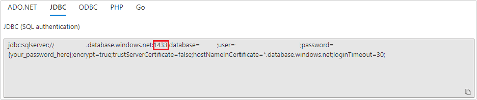

# Deploy a Java application with Open Liberty or WebSphere Liberty on an Azure Kubernetes Service (AKS) cluster

This article demonstrates how to:  
* Run your Java, Java EE, Jakarta EE, or MicroProfile application on the Open Liberty or WebSphere Liberty runtime.
* Build the application Docker image using Open Liberty container images.
* Deploy the containerized application to an AKS cluster using the Open Liberty Operator.   

The Open Liberty Operator simplifies the deployment and management of applications running on Kubernetes clusters. With Open Liberty Operator, you can also perform more advanced operations, such as gathering traces and dumps. 

For more details on Open Liberty, see [the Open Liberty project page](https://openliberty.io/). For more details on IBM WebSphere Liberty, see [the WebSphere Liberty product page](https://www.ibm.com/cloud/websphere-liberty).

[!INCLUDE [quickstarts-free-trial-note](../../includes/quickstarts-free-trial-note.md)]

[!INCLUDE [azure-cli-prepare-your-environment.md](../../includes/azure-cli-prepare-your-environment.md)]

* This article requires the latest version of Azure CLI. If using Azure Cloud Shell, the latest version is already installed.
* If running the commands in this guide locally (instead of Azure Cloud Shell):
  * Prepare a local machine with Unix-like operating system installed (for example, Ubuntu, macOS, Windows Subsystem for Linux).
  * Install a Java SE implementation (for example, [AdoptOpenJDK OpenJDK 8 LTS/OpenJ9](https://adoptopenjdk.net/?variant=openjdk8&jvmVariant=openj9)).
  * Install [Maven](https://maven.apache.org/download.cgi) 3.5.0 or higher.
  * Install [Docker](https://docs.docker.com/get-docker/) for your OS.
* Please make sure you have been assigned either `Owner` role or `Contributor` and `User Access Administrator` roles of the subscription. You can verify it by following steps in [List role assignments for a user or group](../role-based-access-control/role-assignments-list-portal.md#list-role-assignments-for-a-user-or-group)

## Create a resource group

An Azure resource group is a logical group in which Azure resources are deployed and managed.  

Create a resource group called *java-liberty-project* using the [az group create](/cli/azure/group#az-group-create) command in the *eastus* location. This resource group will be used later for creating the Azure Container Registry (ACR) instance and the AKS cluster. 

```azurecli-interactive
RESOURCE_GROUP_NAME=java-liberty-project
az group create --name $RESOURCE_GROUP_NAME --location eastus
```

## Create an ACR instance

Use the [az acr create](/cli/azure/acr#az-acr-create) command to create the ACR instance. The following example creates an ACR instance named *youruniqueacrname*. Make sure *youruniqueacrname* is unique within Azure.

```azurecli-interactive
export REGISTRY_NAME=youruniqueacrname
az acr create --resource-group $RESOURCE_GROUP_NAME --name $REGISTRY_NAME --sku Basic --admin-enabled
```

After a short time, you should see a JSON output that contains:

```output
  "provisioningState": "Succeeded",
  "publicNetworkAccess": "Enabled",
  "resourceGroup": "java-liberty-project",
```

### Connect to the ACR instance

You will need to sign in to the ACR instance before you can push an image to it. Run the following commands to verify the connection:

```azurecli-interactive
export LOGIN_SERVER=$(az acr show -n $REGISTRY_NAME --query 'loginServer' -o tsv)
export USER_NAME=$(az acr credential show -n $REGISTRY_NAME --query 'username' -o tsv)
export PASSWORD=$(az acr credential show -n $REGISTRY_NAME --query 'passwords[0].value' -o tsv)

docker login $LOGIN_SERVER -u $USER_NAME -p $PASSWORD
```

You should see `Login Succeeded` at the end of command output if you have logged into the ACR instance successfully.

## Create an AKS cluster

Use the [az aks create](/cli/azure/aks#az-aks-create) command to create an AKS cluster. The following example creates a cluster named *myAKSCluster* with one node. This will take several minutes to complete.

```azurecli-interactive
CLUSTER_NAME=myAKSCluster
az aks create --resource-group $RESOURCE_GROUP_NAME --name $CLUSTER_NAME --node-count 1 --generate-ssh-keys --enable-managed-identity
```

After a few minutes, the command completes and returns JSON-formatted information about the cluster, including the following:

```output
  "nodeResourceGroup": "MC_java-liberty-project_myAKSCluster_eastus",
  "privateFqdn": null,
  "provisioningState": "Succeeded",
  "resourceGroup": "java-liberty-project",
```

### Connect to the AKS cluster

To manage a Kubernetes cluster, you use [kubectl](https://kubernetes.io/docs/reference/kubectl/overview/), the Kubernetes command-line client. If you use Azure Cloud Shell, `kubectl` is already installed. To install `kubectl` locally, use the [az aks install-cli](/cli/azure/aks#az-aks-install-cli) command:

```azurecli-interactive
az aks install-cli
```

To configure `kubectl` to connect to your Kubernetes cluster, use the [az aks get-credentials](/cli/azure/aks#az-aks-get-credentials) command. This command downloads credentials and configures the Kubernetes CLI to use them.

```azurecli-interactive
az aks get-credentials --resource-group $RESOURCE_GROUP_NAME --name $CLUSTER_NAME --overwrite-existing
```

> [!NOTE]
> The above command uses the default location for the [Kubernetes configuration file](https://kubernetes.io/docs/concepts/configuration/organize-cluster-access-kubeconfig/), which is `~/.kube/config`. You can specify a different location for your Kubernetes configuration file using *--file*.

To verify the connection to your cluster, use the [kubectl get]( https://kubernetes.io/docs/reference/generated/kubectl/kubectl-commands#get) command to return a list of the cluster nodes.

```azurecli-interactive
kubectl get nodes
```

The following example output shows the single node created in the previous steps. Make sure that the status of the node is *Ready*:

```output
NAME                                STATUS   ROLES   AGE     VERSION
aks-nodepool1-xxxxxxxx-yyyyyyyyyy   Ready    agent   76s     v1.18.10
```

## Create an Azure SQL Database

The steps in this section guide you through creating an Azure SQL Database single database for use with your app. If your application doesn't require a database, you can skip this section.

1. Create a single database in Azure SQL Database by following the steps in: [Quickstart: Create an Azure SQL Database single database](/azure/azure-sql/database/single-database-create-quickstart). Return to this document after creating and configuring the database server.
    > [!NOTE]
    >
    > * At the **Basics** step, write down **Database name**, ***Server name**.database.windows.net*, **Server admin login** and **Password**.
    > * At the **Networking** step, set **Connectivity method** to **Public endpoint**, **Allow Azure services and resources to access this server** to **Yes**, and **Add current client IP address** to **Yes**.
    >
    >   

2. Once your database is created, open **your SQL server** > **Firewalls and virtual networks**. Set **Minimal TLS Version** to **> 1.0** and select **Save**.

    

3. Open **your SQL database** > **Connection strings** > Select **JDBC**. Write down the **Port number** following sql server address. For example, **1433** is the port number in the example below.

   


## Install Open Liberty Operator

After creating and connecting to the cluster, install the [Open Liberty Operator](https://github.com/OpenLiberty/open-liberty-operator/tree/main/deploy/releases/0.8.0#option-2-install-using-kustomize) by running the following commands.

```azurecli-interactive
# Install Open Liberty Operator
mkdir -p overlays/watch-all-namespaces
wget https://raw.githubusercontent.com/OpenLiberty/open-liberty-operator/main/deploy/releases/0.8.0/kustomize/overlays/watch-all-namespaces/olo-all-namespaces.yaml -q -P ./overlays/watch-all-namespaces
wget https://raw.githubusercontent.com/OpenLiberty/open-liberty-operator/main/deploy/releases/0.8.0/kustomize/overlays/watch-all-namespaces/cluster-roles.yaml -q -P ./overlays/watch-all-namespaces
wget https://raw.githubusercontent.com/OpenLiberty/open-liberty-operator/main/deploy/releases/0.8.0/kustomize/overlays/watch-all-namespaces/kustomization.yaml -q -P ./overlays/watch-all-namespaces
mkdir base
wget https://raw.githubusercontent.com/OpenLiberty/open-liberty-operator/main/deploy/releases/0.8.0/kustomize/base/kustomization.yaml -q -P ./base
wget https://raw.githubusercontent.com/OpenLiberty/open-liberty-operator/main/deploy/releases/0.8.0/kustomize/base/open-liberty-crd.yaml -q -P ./base
wget https://raw.githubusercontent.com/OpenLiberty/open-liberty-operator/main/deploy/releases/0.8.0/kustomize/base/open-liberty-operator.yaml -q -P ./base
kubectl apply -k overlays/watch-all-namespaces
```

## Configure and build the application image

To deploy and run your Liberty application on the AKS cluster, containerize your application as a Docker image using [Open Liberty container images](https://github.com/OpenLiberty/ci.docker) or [WebSphere Liberty container images](https://github.com/WASdev/ci.docker).

# [with DB connection](#tab/with-sql)

Follow the steps in this section to deploy the sample application on the Jakarta EE runtime. These steps use Maven and the `liberty-maven-plugin`. To learn more about the `liberty-maven-plugin`, see [Building a web application with Maven](https://openliberty.io/guides/maven-intro.html).

### Check out the application

Clone the sample code for this guide. The sample is on [GitHub](https://github.com/Azure-Samples/open-liberty-on-aks). 
There are three samples in the repository. We will use *javaee-app-db-using-actions/mssql*. Here is the file structure of the application.

```
javaee-app-db-using-actions/mssql
├─ src/main/
│  ├─ aks/
│  │  ├─ db-secret.yaml
│  │  ├─ openlibertyapplication.yaml
│  ├─ docker/
│  │  ├─ Dockerfile
│  │  ├─ Dockerfile-local
│  │  ├─ Dockerfile-wlp
│  │  ├─ Dockerfile-wlp-local
│  ├─ liberty/config/
│  │  ├─ server.xml
│  ├─ java/
│  ├─ resources/
│  ├─ webapp/
├─ pom.xml
```

The directories *java*, *resources*, and *webapp* contain the source code of the sample application. The code declares and uses a data source named `jdbc/JavaEECafeDB`.

In the *aks* directory, we placed two deployment files. *db-secret.xml* is used to create [Kubernetes Secrets](https://kubernetes.io/docs/concepts/configuration/secret/) with DB connection credentials. The file *openlibertyapplication.yaml* is used to deploy the application image.

In the *docker* directory, we place four Dockerfiles. *Dockerfile-local* is used for local debugging, and *Dockerfile* is used to build the image for an AKS deployment. These two files work with Open Liberty. *Dockerfile-wlp-local* and *Dockerfile-wlp* are also used for local debugging and to build the image for an AKS deployment respectively, but instead work with WebSphere Liberty.

In the *liberty/config* directory, the *server.xml* is used to configure the DB connection for the Open Liberty and WebSphere Liberty cluster.

### Build project

Now that you have gathered the necessary properties, you can build the application. The POM file for the project reads many properties from the environment.

```bash
cd <path-to-your-repo>/javaee-app-db-using-actions/mssql

# The following variables will be used for deployment file generation
export LOGIN_SERVER=${LOGIN_SERVER}
export REGISTRY_NAME=${REGISTRY_NAME}
export USER_NAME=${USER_NAME}
export PASSWORD=${PASSWORD}
export DB_SERVER_NAME=<Server name>.database.windows.net
export DB_PORT_NUMBER=1433
export DB_NAME=<Database name>
export DB_USER=<Server admin login>@<Database name>
export DB_PASSWORD=<Server admin password>
export NAMESPACE=${OPERATOR_NAMESPACE}

mvn clean install
```
### Test your project locally
Use the `liberty:devc` command to run and test the project locally before dealing with any Azure complexity. For more information on `liberty:devc`, see the [Liberty Plugin documentation](https://github.com/OpenLiberty/ci.maven/blob/main/docs/dev.md#devc-container-mode).
In the sample application, we've prepared *Dockerfile-local* and *Dockerfile-wlp-local* for use with `liberty:devc`.

1. Start your local docker environment if you haven't done so already. The instructions for doing this vary depending on the host operating system.

1. Start the application in `liberty:devc` mode

  ```bash
  cd <path-to-your-repo>/javaee-app-db-using-actions/mssql

  # If you are running with Open Liberty
  mvn liberty:devc -Ddb.server.name=${DB_SERVER_NAME} -Ddb.port.number=${DB_PORT_NUMBER} -Ddb.name=${DB_NAME} -Ddb.user=${DB_USER} -Ddb.password=${DB_PASSWORD} -Ddockerfile=target/Dockerfile-local
  
  # If you are running with WebSphere Liberty
  mvn liberty:devc -Ddb.server.name=${DB_SERVER_NAME} -Ddb.port.number=${DB_PORT_NUMBER} -Ddb.name=${DB_NAME} -Ddb.user=${DB_USER} -Ddb.password=${DB_PASSWORD} -Ddockerfile=target/Dockerfile-wlp-local
  ```

1. Verify the application works as expected. You should see a message similar to `[INFO] [AUDIT] CWWKZ0003I: The application javaee-cafe updated in 1.930 seconds.` in the command output if successful. Go to `http://localhost:9080/` in your browser to verify the application is accessible and all functions are working.

1. Press `Ctrl+C` to stop `liberty:devc` mode.

### Build image for AKS deployment

After successfully running the app in the Liberty Docker container, you can run the `docker build` command to build the image.

```bash
cd <path-to-your-repo>/javaee-app-db-using-actions/mssql

# Fetch maven artifactId as image name, maven build version as image version
IMAGE_NAME=$(mvn -q -Dexec.executable=echo -Dexec.args='${project.artifactId}' --non-recursive exec:exec)
IMAGE_VERSION=$(mvn -q -Dexec.executable=echo -Dexec.args='${project.version}' --non-recursive exec:exec)

cd <path-to-your-repo>/javaee-app-db-using-actions/mssql/target

# If you are running with Open Liberty
docker build -t ${IMAGE_NAME}:${IMAGE_VERSION} --pull --file=Dockerfile .

# If you are running with WebSphere Liberty
docker build -t ${IMAGE_NAME}:${IMAGE_VERSION} --pull --file=Dockerfile-wlp .
```

### Upload image to ACR

Now, we upload the built image to the ACR created in the previous steps.

```bash
docker tag ${IMAGE_NAME}:${IMAGE_VERSION} ${LOGIN_SERVER}/${IMAGE_NAME}:${IMAGE_VERSION}
docker login -u ${USER_NAME} -p ${PASSWORD} ${LOGIN_SERVER}
docker push ${LOGIN_SERVER}/${IMAGE_NAME}:${IMAGE_VERSION}
```

# [without DB connection](#tab/without-sql)

1. Clone the sample code for this guide. The sample is on [GitHub](https://github.com/Azure-Samples/open-liberty-on-aks).
1. Change directory to `javaee-app-simple-cluster` of your local clone.
1. Run `mvn clean package` to package the application.
1. Run `mvn liberty:dev` to test the application. You should see `The defaultServer server is ready to run a smarter planet.` in the command output if successful. Use `CTRL-C` to stop the application.
1. Retrieve values for properties `artifactId` and `version` defined in the `pom.xml`.

   ```azurecli-interactive
   artifactId=$(mvn -q -Dexec.executable=echo -Dexec.args='${project.artifactId}' --non-recursive exec:exec)
   version=$(mvn -q -Dexec.executable=echo -Dexec.args='${project.version}' --non-recursive exec:exec)
   ```
1. Run `cd target` to change directory to the build of the sample.
1. Run one of the following commands to build the application image and push it to the ACR instance.
   * Build with Open Liberty base image if you prefer to use Open Liberty as a lightweight open source Java™ runtime:

     ```azurecli-interactive
     # Build and tag application image. This will cause the ACR instance to pull the necessary Open Liberty base images.
     az acr build -t ${artifactId}:${version} -r $REGISTRY_NAME .
     ```

   * Build with WebSphere Liberty base image if you prefer to use a commercial version of Open Liberty:

     ```azurecli-interactive
     # Build and tag application image. This will cause the ACR instance to pull the necessary WebSphere Liberty base images.
     az acr build -t ${artifactId}:${version} -r $REGISTRY_NAME --file=Dockerfile-wlp .
     ```

---

## Deploy application on the AKS cluster

The steps in this section deploy the application.

# [with DB connection](#tab/with-sql)

Follow steps below to deploy the Liberty application on the AKS cluster.

1. Attach the ACR instance to the AKS cluster so that the AKS cluster is authenticated to pull image from the ACR instance.

   ```azurecli-interactive
   az aks update -n $CLUSTER_NAME -g $RESOURCE_GROUP_NAME --attach-acr $REGISTRY_NAME
   ```

1. Retrieve the value for `artifactId` defined in `pom.xml`.

   ```bash
   cd <path-to-your-repo>/javaee-app-db-using-actions/mssql
   artifactId=$(mvn -q -Dexec.executable=echo -Dexec.args='${project.artifactId}' --non-recursive exec:exec)
   ```

1. Apply the DB secret and deployment file by running the following command:

   ```bash
   cd <path-to-your-repo>/javaee-app-db-using-actions/mssql/target
   
   # Apply DB secret
   kubectl apply -f <path-to-your-repo>/javaee-app-db-using-actions/mssql/target/db-secret.yaml

   # Apply deployment file
   kubectl apply -f <path-to-your-repo>/javaee-app-db-using-actions/mssql/target/openlibertyapplication.yaml

   # Check if OpenLibertyApplication instance is created
   kubectl get openlibertyapplication ${artifactId}-cluster

   NAME                        IMAGE                                                   EXPOSED   RECONCILED   AGE
   javaee-cafe-cluster         youruniqueacrname.azurecr.io/javaee-cafe:1.0.25         True         59s

   # Check if deployment created by Operator is ready
   kubectl get deployment ${artifactId}-cluster --watch

   NAME                        READY   UP-TO-DATE   AVAILABLE   AGE
   javaee-cafe-cluster         0/3     3            0           20s
   ```

1. Wait until you see `3/3` under the `READY` column and `3` under the `AVAILABLE` column, then use `CTRL-C` to stop the `kubectl` watch process.

# [without DB connection](#tab/without-sql)

Follow steps below to deploy the Liberty application on the AKS cluster.

1. Attach the ACR instance to the AKS cluster so that the AKS cluster is authenticated to pull image from the ACR instance.

   ```azurecli-interactive
   az aks update -n $CLUSTER_NAME -g $RESOURCE_GROUP_NAME --attach-acr $REGISTRY_NAME
   ```

1. Verify the current working directory is `javaee-app-simple-cluster/target` of your local clone.
1. Run the following commands to deploy your Liberty application with 3 replicas to the AKS cluster. Command output is also shown inline.

   ```azurecli-interactive
   # Create OpenLibertyApplication "javaee-cafe-cluster"
   kubectl apply -f openlibertyapplication.yaml

   openlibertyapplication.openliberty.io/javaee-cafe-cluster created

   # Check if OpenLibertyApplication instance is created
   kubectl get openlibertyapplication ${artifactId}-cluster

   NAME                        IMAGE                                                   EXPOSED   RECONCILED   AGE
   javaee-cafe-cluster         youruniqueacrname.azurecr.io/javaee-cafe:1.0.25         True         59s

   # Check if deployment created by Operator is ready
   kubectl get deployment ${artifactId}-cluster --watch

   NAME                        READY   UP-TO-DATE   AVAILABLE   AGE
   javaee-cafe-cluster         0/3     3            0           20s
   ```

1. Wait until you see `3/3` under the `READY` column and `3` under the `AVAILABLE` column, use `CTRL-C` to stop the `kubectl` watch process.

---

### Test the application

When the application runs, a Kubernetes load balancer service exposes the application front end to the internet. This process can take a while to complete.

To monitor progress, use the [kubectl get service](https://kubernetes.io/docs/reference/generated/kubectl/kubectl-commands#get) command with the `--watch` argument.

```azurecli-interactive
kubectl get service ${artifactId}-cluster --watch

NAME                        TYPE           CLUSTER-IP     EXTERNAL-IP     PORT(S)          AGE
javaee-cafe-cluster         LoadBalancer   10.0.251.169   52.152.189.57   80:31732/TCP     68s
```

Once the *EXTERNAL-IP* address changes from *pending* to an actual public IP address, use `CTRL-C` to stop the `kubectl` watch process.

Open a web browser to the external IP address of your service (`52.152.189.57` for the above example) to see the application home page. You should see the pod name of your application replicas displayed at the top-left of the page. Wait for a few minutes and refresh the page to see a different pod name displayed due to load balancing provided by the AKS cluster.

:::image type="content" source="./media/howto-deploy-java-liberty-app/deploy-succeeded.png" alt-text="Java liberty application successfully deployed on AKS":::

>[!NOTE]
> - Currently the application is not using HTTPS. It is recommended to [ENABLE TLS with your own certificates](ingress-own-tls.md).

## Clean up the resources

To avoid Azure charges, you should clean up unnecessary resources. When the cluster is no longer needed, use the [az group delete](/cli/azure/group#az-group-delete) command to remove the resource group, container service, container registry, and all related resources.

```azurecli-interactive
az group delete --name $RESOURCE_GROUP_NAME --yes --no-wait
```

## Next steps

You can learn more from references used in this guide:

* [Azure Kubernetes Service](https://azure.microsoft.com/free/services/kubernetes-service/)
* [Open Liberty](https://openliberty.io/)
* [Open Liberty Operator](https://github.com/OpenLiberty/open-liberty-operator)
* [Open Liberty Server Configuration](https://openliberty.io/docs/ref/config/)
* [Liberty Maven Plugin](https://github.com/OpenLiberty/ci.maven#liberty-maven-plugin)
* [Open Liberty Container Images](https://github.com/OpenLiberty/ci.docker)
* [WebSphere Liberty Container Images](https://github.com/WASdev/ci.docker)