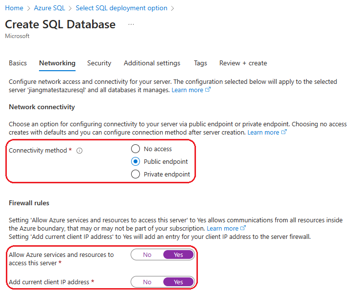
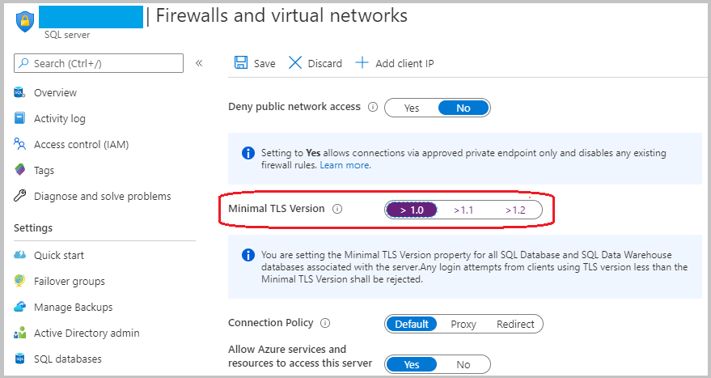

# Deploy a Java application with Open Liberty or WebSphere Liberty on an Azure Kubernetes Service (AKS) cluster

This article demonstrates how to:

* Run your Java, Java EE, Jakarta EE, or MicroProfile application on the Open Liberty or WebSphere Liberty runtime.
* Build the application Docker image using Open Liberty or WebSphere Liberty container images.
* Deploy the containerized application to an AKS cluster using the Open Liberty Operator.

The Open Liberty Operator simplifies the deployment and management of applications running on Kubernetes clusters. With the Open Liberty Operator, you can also perform more advanced operations, such as gathering traces and dumps.

For more information on Open Liberty, see [the Open Liberty project page](https://openliberty.io/). For more information on IBM WebSphere Liberty, see [the WebSphere Liberty product page](https://www.ibm.com/cloud/websphere-liberty).

This article uses the Azure Marketplace offer for Open/WebSphere Liberty to accelerate your journey to AKS. The offer automatically provisions a number of Azure resources including an Azure Container Registry (ACR) instance, an AKS cluster, an Azure App Gateway Ingress Controller (AGIC) instance, the Liberty Operator, and optionally a container image including Liberty and your application. To see the offer, visit the [Azure portal](https://aka.ms/liberty-aks). If you prefer manual step-by-step guidance for running Liberty on AKS that doesn't utilize the automation enabled by the offer, see [Manually deploy a Java application with Open Liberty or WebSphere Liberty on an Azure Kubernetes Service (AKS) cluster](/azure/developer/java/ee/howto-deploy-java-liberty-app-manual).

[!INCLUDE [quickstarts-free-trial-note](../../includes/quickstarts-free-trial-note.md)]

[!INCLUDE [azure-cli-prepare-your-environment.md](~/articles/reusable-content/azure-cli/azure-cli-prepare-your-environment.md)]

* This article requires at least version 2.31.0 of Azure CLI. If using Azure Cloud Shell, the latest version is already installed.

> [!NOTE]
>  This guidance can also be executed from a local developer command line with Azure CLI installed. To learn how to install the Azure CLI, see [How to install the Azure CLI](/cli/azure/install-azure-cli).

* If running the commands in this guide locally (instead of Azure Cloud Shell):
  * Prepare a local machine with Unix-like operating system installed (for example, Ubuntu, Azure Linux, macOS, Windows Subsystem for Linux).
  * Install a Java SE implementation, version 17 or later. (for example, [Eclipse Open J9](https://www.eclipse.org/openj9/)).
  * Install [Maven](https://maven.apache.org/download.cgi) 3.5.0 or higher.
  * Install [Docker](https://docs.docker.com/get-docker/) for your OS.
* Make sure you've been assigned either the `Owner` role or the `Contributor` and `User Access Administrator` roles in the subscription. You can verify it by following steps in [List role assignments for a user or group](../role-based-access-control/role-assignments-list-portal.md#list-role-assignments-for-a-user-or-group).

## Create a Liberty on AKS deployment using the portal

The following steps guide you to create a Liberty runtime on AKS. After completing these steps, you'll have an Azure Container Registry and an Azure Kubernetes Service cluster for the sample application.

1. Visit the [Azure portal](https://portal.azure.com/). In the search box at the top of the page, type *IBM WebSphere Liberty and Open Liberty on Azure Kubernetes Service*. When the suggestions start appearing, select the one and only match that appears in the **Marketplace** section. If you prefer, you can go directly to the offer with this shortcut link: [https://aka.ms/liberty-aks](https://aka.ms/liberty-aks).
1. Select **Create**.
1. In the **Basics** pane, create a new resource group. Because resource groups must be unique within a subscription, pick a unique name. An easy way to have unique names is to use a combination of your initials, today's date, and some identifier. For example, `ejb0913-java-liberty-project-rg`.
1. Select *East US* as **Region**.
1. Select **Next: Configure cluster**.
1. This section allows you to select an existing AKS cluster and Azure Container Registry (ACR), instead of causing the deployment to create a new one, if desired. This capability enables you to use the sidecar pattern, as shown in the [Azure architecture center](/azure/architecture/patterns/sidecar). You can also adjust the settings for the size and number of the virtual machines in the AKS node pool. Leave all other values at the defaults and select **Next: Networking**.
1. Next to **Connect to Azure Application Gateway?** select **Yes**. This pane lets you customize the following deployment options.
   1. You can customize the virtual network and subnet into which the deployment will place the resources. Leave these values at their defaults.
   1. You can provide the TLS/SSL certificate presented by the Azure Application Gateway. Leave the values at the default to cause the offer to generate a self-signed certificate. Don't go to production using a self-signed certificate. For more information about self-signed certificates, see [Create a self-signed public certificate to authenticate your application](../active-directory/develop/howto-create-self-signed-certificate.md).
   1. You can enable cookie based affinity, also known as sticky sessions. We want sticky sessions enabled for this article, so ensure this option is selected.
      
1. Select **Review + create** to validate your selected options.
1. When you see the message **Validation Passed**, select **Create**. The deployment may take up to 20 minutes.

## Capture selected information from the deployment

If you navigated away from the **Deployment is in progress** page, the following steps will show you how to get back to that page. If you're still on the page that shows **Your deployment is complete**, you can skip to the third step.

1. In the upper left of any portal page, select the hamburger menu and select **Resource groups**.
1. In the box with the text **Filter for any field**, enter the first few characters of the resource group you created previously. If you followed the recommended convention, enter your initials, then select the appropriate resource group.
1. In the list of resources in the resource group, select the resource with **Type** of **Container registry**.
1. In the navigation pane, under **Settings** select **Access keys**.
1. Save aside the values for **Login server**, **Registry name**, **Username**, and **password**. You may use the copy icon at the right of each field to copy the value of that field to the system clipboard.
1. Navigate again to the resource group into which you deployed the resources.
1. In the **Settings** section, select **Deployments**.
1. Select the bottom-most deployment in the list. The **Deployment name** will match the publisher ID of the offer. It will contain the string `ibm`.
1. In the left pane, select **Outputs**.
1. Using the same copy technique as with the preceding values, save aside the values for the following outputs:

   * `cmdToConnectToCluster`
   * `appDeploymentTemplateYaml`

1. Paste the value of `appDeploymentTemplateYaml` into a Bash shell, append `| grep secretName`, and execute. This command will output the Ingress TLS secret name, such as `- secretName: secret785e2c`. Save aside the value for `secretName` from the output.

These values will be used later in this article. Note that several other useful commands are listed in the outputs.

## Create an Azure SQL Database

The following steps guide you through creating an Azure SQL Database single database for use with your app.

1. Create a single database in Azure SQL Database by following the steps in [Quickstart: Create an Azure SQL Database single database](/azure/azure-sql/database/single-database-create-quickstart), carefully noting the differences in the box below. Return to this article after creating and configuring the database server.

   > [!NOTE]
   > At the **Basics** step, write down **Resource group**, **Database name**, **_\<server-name>_.database.windows.net**, **Server admin login**, and **Password**. The database **Resource group** will be referred to as `<db-resource-group>` later in this article.
   >
   > At the **Networking** step, set **Connectivity method** to **Public endpoint**, **Allow Azure services and resources to access this server** to **Yes**, and **Add current client IP address** to **Yes**.
   >
   > 
   >
   > Also at the **Networking** step, under **Encrypted connections**, set the **Minimum TLS version** to **TLS 1.0**.
   >
   > 

Now that the database and AKS cluster have been created, we can proceed to preparing AKS to host your Open Liberty application.

## Configure and deploy the sample application

Follow the steps in this section to deploy the sample application on the Liberty runtime. These steps use Maven.

### Check out the application

Clone the sample code for this guide. The sample is on [GitHub](https://github.com/Azure-Samples/open-liberty-on-aks).

There are a few samples in the repository. We'll use *java-app/*. Here's the file structure of the application.

```azurecli-interactive
git clone https://github.com/Azure-Samples/open-liberty-on-aks.git
cd open-liberty-on-aks
git checkout 20230723
```

If you see a message about being in "detached HEAD" state, this message is safe to ignore. It just means you have checked out a tag.

```
java-app
├─ src/main/
│  ├─ aks/
│  │  ├─ db-secret.yaml
│  │  ├─ openlibertyapplication-agic.yaml
│  ├─ docker/
│  │  ├─ Dockerfile
│  │  ├─ Dockerfile-wlp
│  ├─ liberty/config/
│  │  ├─ server.xml
│  ├─ java/
│  ├─ resources/
│  ├─ webapp/
├─ pom.xml
```

The directories *java*, *resources*, and *webapp* contain the source code of the sample application. The code declares and uses a data source named `jdbc/JavaEECafeDB`.

In the *aks* directory, we placed three deployment files. *db-secret.xml* is used to create [Kubernetes Secrets](https://kubernetes.io/docs/concepts/configuration/secret/) with DB connection credentials. The file *openlibertyapplication-agic.yaml* is used to deploy the application image. In the *docker* directory, there are two files to create the application image with either Open Liberty or WebSphere Liberty.

In directory *liberty/config*, the *server.xml* file is used to configure the DB connection for the Open Liberty and WebSphere Liberty cluster.

### Build the project

Now that you've gathered the necessary properties, you can build the application. The POM file for the project reads many variables from the environment. As part of the Maven build, these variables are used to populate values in the YAML files located in *src/main/aks*. You can do something similar for your application outside Maven if you prefer.

```bash
cd <path-to-your-repo>/java-app

# The following variables will be used for deployment file generation into target.
export LOGIN_SERVER=<Azure_Container_Registery_Login_Server_URL>
export REGISTRY_NAME=<Azure_Container_Registery_Name>
export USER_NAME=<Azure_Container_Registery_Username>
export PASSWORD=<Azure_Container_Registery_Password>
export DB_SERVER_NAME=<Server name>.database.windows.net
export DB_NAME=<Database name>
export DB_USER=<Server admin login>@<Server name>
export DB_PASSWORD=<Server admin password>
export INGRESS_TLS_SECRET=<Ingress TLS secret name>

mvn clean install
```

### (Optional) Test your project locally

You can now run and test the project locally before deploying to Azure. For convenience, we use the `liberty-maven-plugin`. To learn more about the `liberty-maven-plugin`, see [Building a web application with Maven](https://openliberty.io/guides/maven-intro.html). For your application, you can do something similar using any other mechanism, such as your local IDE. You can also consider using the `liberty:devc` option intended for development with containers. You can read more about `liberty:devc` in the [Liberty docs](https://openliberty.io/docs/latest/development-mode.html#_container_support_for_dev_mode).

1. Start the application using `liberty:run`. `liberty:run` will also use the environment variables defined in the previous step.

   ```bash
   cd <path-to-your-repo>/java-app
   mvn liberty:run
   ```

1. Verify the application works as expected. You should see a message similar to `[INFO] [AUDIT] CWWKZ0003I: The application javaee-cafe updated in 1.930 seconds.` in the command output if successful. Go to `http://localhost:9080/` in your browser and verify the application is accessible and all functions are working.

1. Press <kbd>Ctrl</kbd>+<kbd>C</kbd> to stop.

### Build image for AKS deployment

You can now run the `docker build` command to build the image. 

```bash
cd <path-to-your-repo>/java-app/target

# If you're running with Open Liberty
docker build -t javaee-cafe:v1 --pull --file=Dockerfile .

# If you're running with WebSphere Liberty
docker build -t javaee-cafe:v1 --pull --file=Dockerfile-wlp .
```

### (Optional) Test the Docker image locally

You can now use the following steps to test the Docker image locally before deploying to Azure.

1. Run the image using the following command. Note we're using the environment variables defined previously.

   ```bash
   docker run -it --rm -p 9080:9080 \
       -e DB_SERVER_NAME=${DB_SERVER_NAME} \
       -e DB_NAME=${DB_NAME} \
       -e DB_USER=${DB_USER} \
       -e DB_PASSWORD=${DB_PASSWORD} \
       javaee-cafe:v1
   ```

1. Once the container starts, go to `http://localhost:9080/` in your browser to access the application.

1. Press <kbd>Ctrl</kbd>+<kbd>C</kbd> to stop.

### Upload image to ACR

Now, we upload the built image to the ACR created in the offer.

```bash
docker tag javaee-cafe:v1 ${LOGIN_SERVER}/javaee-cafe:v1
docker login -u ${USER_NAME} -p ${PASSWORD} ${LOGIN_SERVER}
docker push ${LOGIN_SERVER}/javaee-cafe:v1
```

### Deploy and test the application

The following steps deploy and test the application.

1. Connect to the AKS cluster.

   Paste the value of **cmdToConnectToCluster** into a Bash shell and execute.

1. Apply the DB secret.

   ```bash
   cd <path-to-your-repo>/java-app/target
   kubectl apply -f db-secret.yaml
   ```

   You'll see the output `secret/db-secret-postgres created`.

1. Apply the deployment file.

   ```bash
   kubectl apply -f openlibertyapplication-agic.yaml
   ```

1. Wait for the pods to be restarted.

   Wait until all pods are restarted successfully using the following command.

   ```bash
   kubectl get pods --watch
   ```

   You should see output similar to the following to indicate that all the pods are running.

   ```output
   NAME                                       READY   STATUS    RESTARTS   AGE
   javaee-cafe-cluster-agic-67cdc95bc-2j2gr   1/1     Running   0          29s
   javaee-cafe-cluster-agic-67cdc95bc-fgtt8   1/1     Running   0          29s
   javaee-cafe-cluster-agic-67cdc95bc-h47qm   1/1     Running   0          29s
   ```

1. Verify the results.

   1. Get **ADDRESS** of the Ingress resource deployed with the application

      ```bash
      kubectl get ingress
      ```

      Copy the value of **ADDRESS** from the output, this is the frontend public IP address of the deployed Azure Application Gateway.
      
   1. Go to `https://<ADDRESS>` to test the application. For your convenience, this shell command will create an environment variable whose value you can paste straight into the browser.
      
      ```bash
      export APP_URL=https://$(kubectl get ingress | grep javaee-cafe-cluster-agic-ingress | cut -d " " -f14)/
      echo $APP_URL
      ```

## Clean up resources

To avoid Azure charges, you should clean up unnecessary resources. When the cluster is no longer needed, use the [az group delete](/cli/azure/group#az-group-delete) command to remove the resource group, container service, container registry, and all related resources.

```azurecli-interactive
az group delete --name $RESOURCE_GROUP_NAME --yes --no-wait
az group delete --name <db-resource-group> --yes --no-wait
```

## Next steps

* [Azure Kubernetes Service](https://azure.microsoft.com/free/services/kubernetes-service/)
* [Open Liberty](https://openliberty.io/)
* [Open Liberty Operator](https://github.com/OpenLiberty/open-liberty-operator)
* [Open Liberty Server Configuration](https://openliberty.io/docs/ref/config/)
