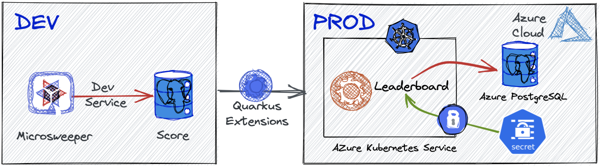
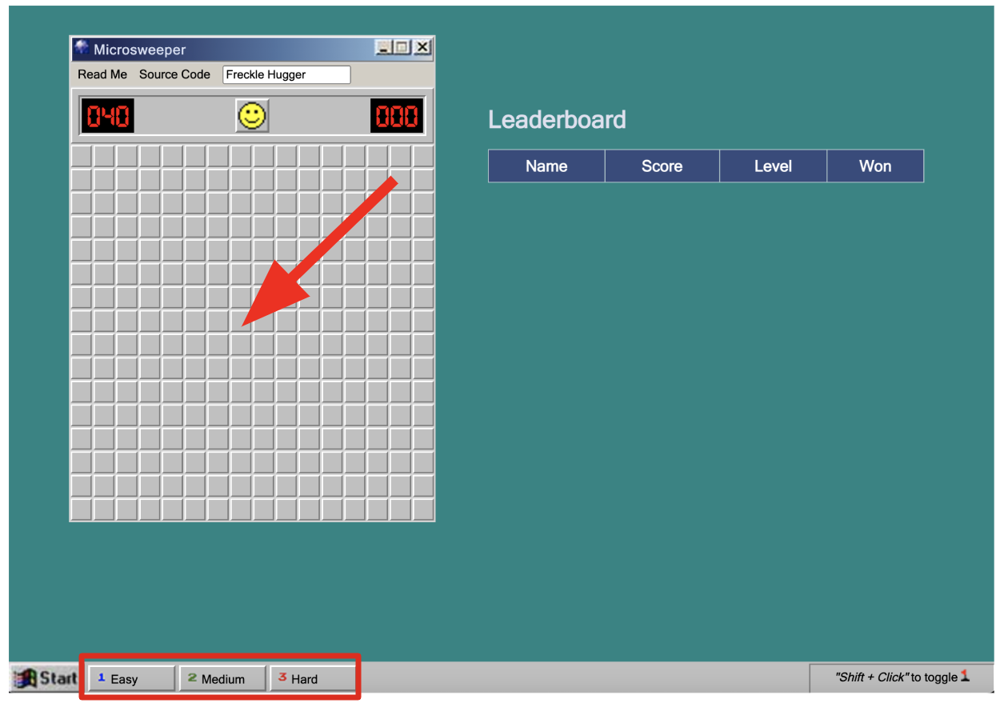
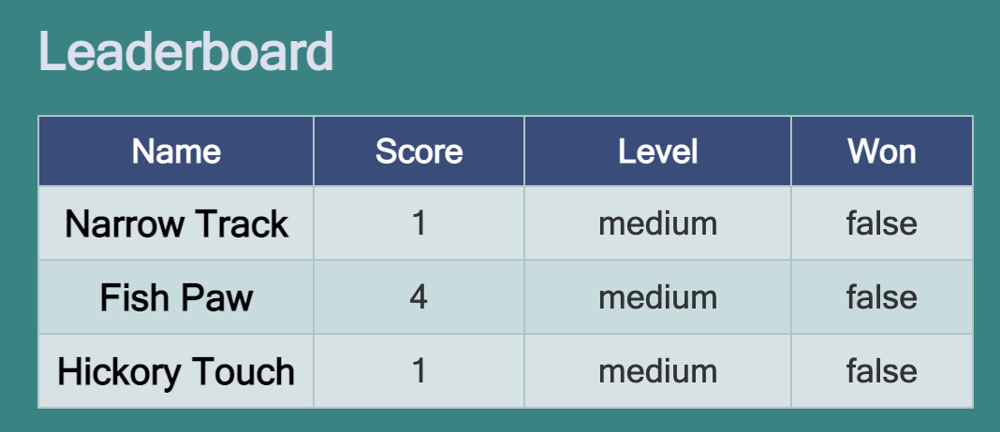
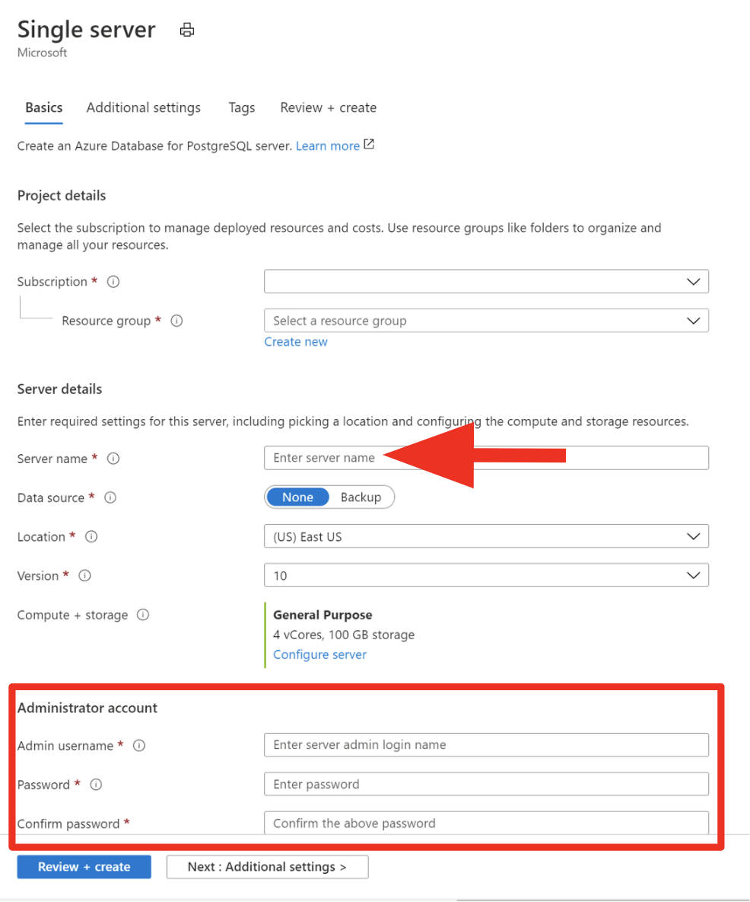
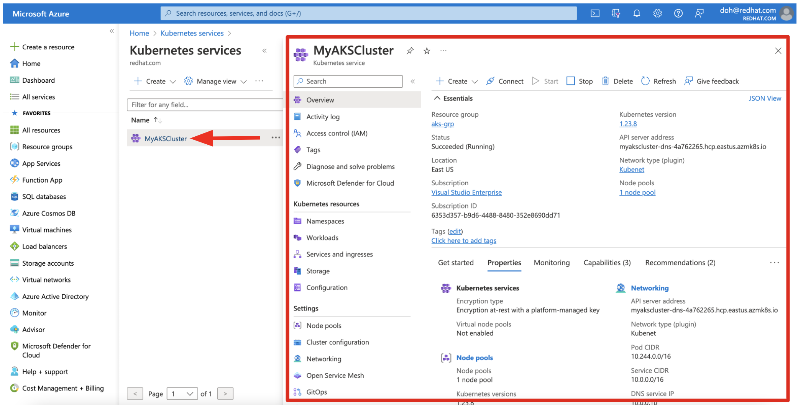
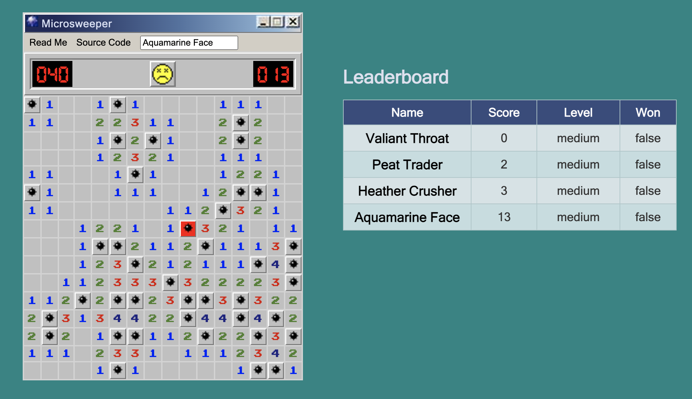
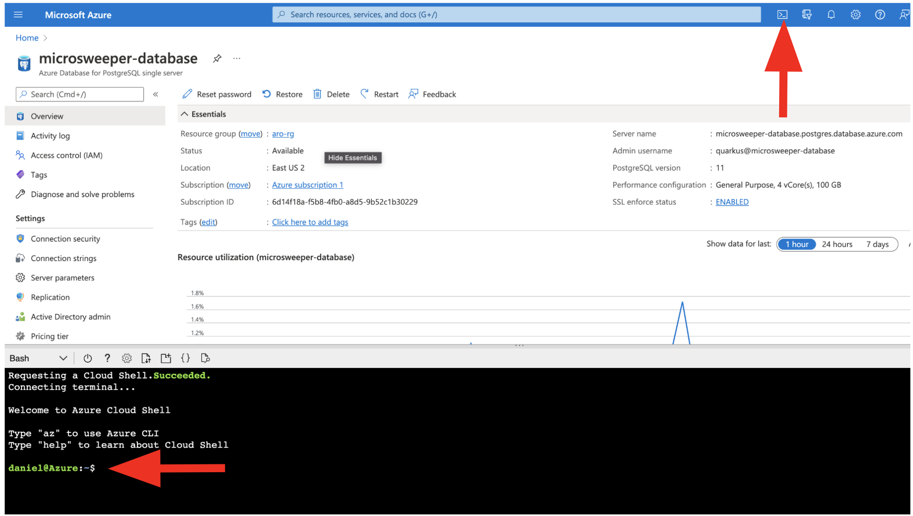
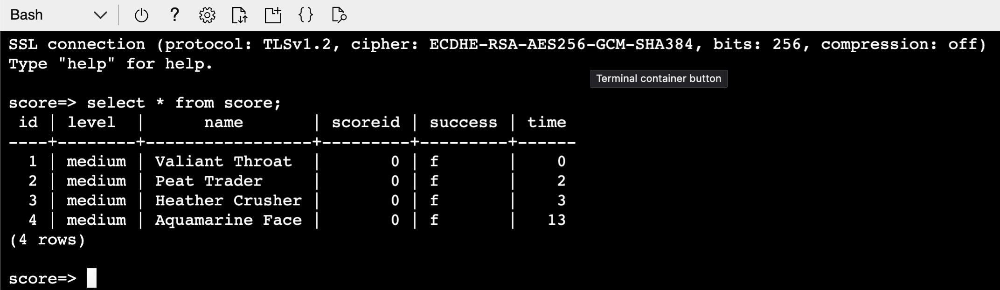
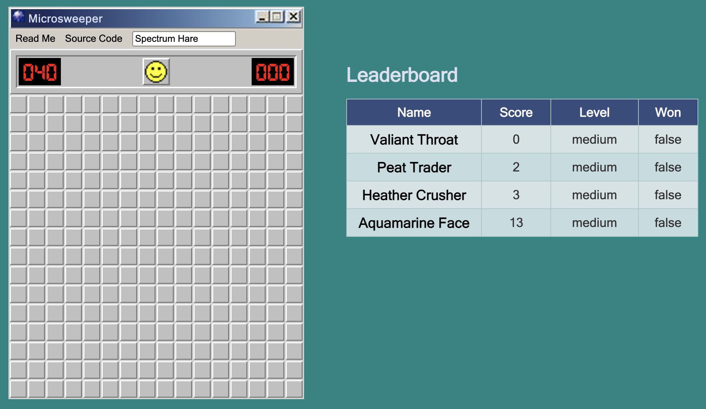

# Deploy a Java application with Quarkus on an Azure Kubernetes Service (AKS) cluster

When you develop and run microservices in the Kubernetes cluster, you need to think of better practices and tools to evlove your existing microservices in the Kubernetes native way. For example, Kubernetes already provides non-functional microservices' capabilities such as *service discovery*, *externalizing config*, and *health check* that you should implement them inside methods and classes. The challenge for you as a developer is how to integrate these capabilities into your applications at build time rather than creating multiple Kubernetes manifest _YAML_ files manually.

This best practices article focuses on how to deploy the `Minesweeper` with [Quarkus](https://quarkus.io/) on an Azure Kubernetes Service (AKS) cluster. You learn how to:

- Test your Quarkus App Locally
- Deploy the Quarkus App to Azure Kubernetes Service (AKS)
- Secure Database credential to Kubernetes Secrets



## Technologies include:

- JQuery-based Minesweeper written by [Nick Arocho](http://www.nickarocho.com/) and [available on GitHub](https://github.com/nickarocho/minesweeper).
- Backend based on [Quarkus](https://quarkus.io) to persist scoreboard and provide a reactive frontend and backend connected to [Postgres](https://azure.microsoft.com/en-us/services/postgresql/).
- Application Deployment on [Azure Kubernetes Service (AKS)](https://docs.microsoft.com/en-us/azure/aks/intro-kubernetes)
- Datastore to store scores on [Azure Database for PostgreSQL](https://azure.microsoft.com/en-us/services/postgresql/) 

## Test your Quarkus App Locally

Quarkus supports the automatic provisioning of unconfigured services in development and test mode. We refer to this capability as [Dev Services](https://quarkus.io/guides/dev-services#databases). From a developer’s perspective this means that if you include an extension and don’t configure it then Quarkus will automatically start the relevant service (usually using _Testcontainers_ behind the scenes) and wire up your application to use this service. 

**quarkus:dev** runs Quarkus in development mode. This enables live reload with background compilation, which means that when you modify your Java files and/or your resource files and refresh your browser, these changes will automatically take effect. This works too for resource files like the configuration property file. Refreshing the browser triggers a scan of the workspace, and if any changes are detected, the Java files are recompiled and the application is redeployed; your request is then serviced by the redeployed application. If there are any issues with compilation or deployment an error page will let you know.

This will also listen for a debugger on port 5005. If you want to wait for the debugger to attach before running you can pass _-Dsuspend_ on the command line. If you don’t want the debugger at all you can use _-Ddebug=false_.

Quarkus also provides a command-line tool (CLI) for developers to create projects, manage extensions and do essential build and dev commands using the underlying project build tool. Find the installation document [here](https://quarkus.io/guides/cli-tooling).

Run the following command line to start Quarkus dev mode. It will automatically start a PostgreSQL container on your local container runtime (e.g. Docker or [Podman](https://podman.io/)):


```shell
quarkus dev
```

_Note_ that you can also use _Maven_ command-line tool (_mvn quarkus:dev_).

The output should look like:

```shell
__  ____  __  _____   ___  __ ____  ______ 
 --/ __ \/ / / / _ | / _ \/ //_/ / / / __/ 
 -/ /_/ / /_/ / __ |/ , _/ ,< / /_/ /\ \   
--\___\_\____/_/ |_/_/|_/_/|_|\____/___/   
[org.hib.eng.jdb.spi.SqlExceptionHelper] (JPA Startup Thread: <default>) SQL Warning Code: 0, SQLState: 00000

...

INFO  [io.quarkus] (Quarkus Main Thread) microsweeper-appservice 1.0.0-SNAPSHOT on JVM (powered by Quarkus xx.xx.xx.Final) started in 9.631s. Listening on: http://localhost:8080
INFO  [io.quarkus] (Quarkus Main Thread) Profile dev activated. Live Coding activated.
INFO  [io.quarkus] (Quarkus Main Thread) Installed features: [agroal, cdi, hibernate-orm, hibernate-orm-panache, jdbc-postgresql, kubernetes, kubernetes-client, micrometer, narayana-jta, resteasy-reactive, resteasy-reactive-jsonb, smallrye-context-propagation, vertx]

--
Tests paused
Press [r] to resume testing, [o] Toggle test output, [:] for the terminal, [h] for more options>
```

Press `w` key on the terminal where Quarkus dev mode is running. Then, it will automatically open a web browser or tab window to show the **Microsweeper** application. 
_Note_ that you can also access the application GUI at http://localhost:8080 directly



Try playing the mine game! Then you will *scores* in the _Leaderboard_:



Access the RESTful API (_/api/score_) to get all scores that store in the local PostgreSQL database. Run the following API testing client [HTTPie](https://httpie.io/) command-line tool: 

```shell
http :8080/api/scoreboard
```

The output should look like:

```shell
HTTP/1.1 200 OK
Content-Type: application/json
content-length: 253

[
    {
        "id": 1,
        "level": "medium",
        "name": "Narrow Track",
        "scoreId": 0,
        "success": false,
        "time": 1
    },
    {
        "id": 2,
        "level": "medium",
        "name": "Fish Paw",
        "scoreId": 0,
        "success": false,
        "time": 4
    },
    {
        "id": 3,
        "level": "medium",
        "name": "Hickory Touch",
        "scoreId": 0,
        "success": false,
        "time": 1
    }
]
```

Note that you can use `curl` command-line tool to access the RESTful API by `curl localhost:8080/api/scoreboard`.

## Deploy the Quarkus App to Azure Kubernetes Service (AKS)

### 2.1. Create an Azure Database for PostgreSQL

Let's say that AKS is our production environment to deploy the *Microsweeper* application. Also, We need to guarantee _data persistency_ regardless of randomly restarting an application container (_Microsweeper_) on the Kubernetes cluster. 

**Azure Database for PostgreSQL** is a managed service to run, manage, and scale highly available PostgreSQL databases in the Azure cloud. The following quickstart shows you how to create a single Azure Database for PostgreSQL server and connect to it.

[Quickstart: Create an Azure Database for PostgreSQL server by using the Azure portal](https://docs.microsoft.com/en-us/azure/postgresql/quickstart-create-server-database-portal)

Note that be sure to key the following value in the setting:

* Server name - `microsweeper-database`
* Admin username - `quarkus`
* Password - `r3dh4t1!`



### 2.2 Create a **score** database in PostgreSQL

The PostgreSQL server that you created earlier is empty. It doesn't have any database that you can use with the Quarkus application. 

Export your resource group using the following command: 

> **_NOTE:_** You can run the following shell command using your local terminal or [Azure Cloud Shell](https://learn.microsoft.com/en-us/azure/cloud-shell/overview).

```shell
export RESOURCE_GROUP=YOUR_RESOURCE_GROUP
export AKS_NAME=YOUR_AKS_NAME
```

Create a new database called `score` by using the following command:

```shell
az postgres db create \
  --resource-group $RESOURCE_GROUP \
  --name score \
  --server-name microsweeper-database
```

### 2.3. Create a new namespace in AKS

Go to `All resources` in Azure portal. Then, click on `Kubernetes service` resource (e.g. _MyAKSCluster_).



The overview page shows up with all the detailed information about the Kubernetes service such as _Resource group_, _Kubernetes version_, _API server address_, and more.

[Connect to the Kubernetes cluster](https://learn.microsoft.com/en-us/azure/aks/learn/quick-kubernetes-deploy-cli#connect-to-the-cluster) using `az` command line:

```shell
az aks get-credentials --resource-group $RESOURCE_GROUP --name $AKS_NAME
```

The output should look like:

```shell
Merged "myAKSCluster" as current context in /Users/USERNAME/.kube/config
```

Verify the connection to your cluster using `kubectl` command line (CLI) to get a list of the cluster nodes:

```shell
kubectl get nodes
```

The output should look like:

```shell
NAME                                STATUS   ROLES   AGE   VERSION
aks-agentpool-30709549-vmss000001   Ready    agent   12d   v1.23.8
aks-agentpool-30709549-vmss000002   Ready    agent   12d   v1.23.8
```

Create a new `microsweeper-quarkus` namespace in your Kubernetes service:

```shell
kubectl create namespace microsweeper-quarkus
```

The output should look like:

```shell
namespace/microsweeper-quarkus created
```

> **_NOTE:_** You can set the current context to *microsweeper-quarkus* namespace using the following kubectl command:

```shell
kubectl config set-context --current --namespace=microsweeper-quarkus
```

The output should look like:

```shell
Context "MyAKSCluster" modified.
```

### 2.4. Build a Container Image and Generate Kubernetes Resources

Quarkus offers the ability to automatically generate Kubernetes resources based on sane defaults and user-supplied configuration using [dekorate](https://github.com/dekorateio/dekorate/). It currently supports generating resources for vanilla [Kubernetes](https://quarkus.io/guides/deploying-to-kubernetes#kubernetes), [OpenShift](https://quarkus.io/guides/deploying-to-kubernetes#openshift) and [Knative](https://quarkus.io/guides/deploying-to-kubernetes#knative). Developers can deploy the application to a target Kubernetes cluster by applying the generated manifests to the target cluster’s API Server.

Quarkus also provides the `quarkus-container-image-jib` extension that is powered by `Jib` for performing container image builds. The major benefit of using `Jib` with Quarkus is that all the dependencies are cached in a different layer than the actual application making rebuilds really fast and small when it comes to pushing.

Add the `quarkus-kubernetes` and `container-image-jib` extensions in your local terminal:

```shell
quarkus ext add kubernetes container-image-jib
```

The output should look like:

```shell
[SUCCESS] ✅  Extension io.quarkus:quarkus-kubernetes has been installed
[SUCCESS] ✅  Extension io.quarkus:quarkus-container-image-jib has been installed
```

Quarkus supports the notion of configuration profiles. These allows you to have multiple configurations in the same file and select between then via a profile name.

By default Quarkus has three profiles, although it is possible to use as many as you like. The default profiles are:

* **dev** - Activated when in development mode (i.e. _quarkus:dev_)
* **test** - Activated when running tests
* **prod** - The default profile when not running in development or test mode

Let’s add the following *Database configurations* variables in `src/main/resources/application.properties`.

```yaml
# Database configurations
%prod.quarkus.datasource.db-kind=postgresql
%prod.quarkus.datasource.jdbc.url=jdbc:postgresql://microsweeper-database.postgres.database.azure.com:5432/score
%prod.quarkus.datasource.jdbc.driver=org.postgresql.Driver
%prod.quarkus.datasource.username=quarkus@microsweeper-database
%prod.quarkus.datasource.password=r3dh4t1!
%prod.quarkus.hibernate-orm.database.generation=drop-and-create
```

Add the following *AKS configurations* variables in `src/main/resources/application.properties`. Make sure to set `load-balancer` to *service-type* to access the Microsweeper GUI externally.

```yaml
# AKS configurations
%prod.quarkus.kubernetes.deployment-target=kubernetes
%prod.quarkus.kubernetes.service-type=load-balancer
```

You also need to specify the external container registry (e.g. _Quay.io, Azure Container Registry, DockerHub_) to push the containerized Quarkus application. In this tutorial, we'll use the [Quay.io](https://quay.io/repository/) repository. `Quay.io` is a registry for storing and building container images as well as distributing other OCI artifacts. The service is free for those who want to set up their own public repositories and available for a fee, if you want to create private repositories.

> **_NOTE:_** Make sure to replace `${user.name}` with your username in [quay.io](https://quay.io/repository/) repository. 

```yaml
# Container Image Build
%prod.quarkus.container-image.build=true
%prod.quarkus.container-image.registry=quay.io
%prod.quarkus.container-image.group=${user.name}
%prod.quarkus.container-image.name=microsweeper-quarkus-aks
%prod.quarkus.container-image.tag=1.0
```

Now let’s build the application itself. Run the following *Quarkus CLI* which will build and deploy using the Kubernetes and Jib extensions:

```shell
quarkus build --no-tests
```

The output should end with `BUILD SUCCESS`. The Kubernetes manifest files are generated in `target/kubernetes`.

```shell
tree target/kubernetes 
target/kubernetes
├── kubernetes.json
└── kubernetes.yml

0 directories, 2 files
```

You can verify if the container image is generated as well using `docker` or `podman` command line (CLI).

> **_NOTE:_** `USERNAME` should be your own username in the quay.io repository.

```shell
docker images | grep microsweeper
quay.io/USERNAME/microsweeper-quarkus-aks                                         1.0                      4a23015d6f6c   3 mins ago    413MB
```

Push the container images to an external container registry using the following command. Make sure to replace `USERNAME` with your own username.

```shell
docker push quay.io/USERNAME/microsweeper-quarkus-aks:1.0
```

The output should look like:

```shell
The push refers to repository [quay.io/USERNAME/microsweeper-quarkus-aks]
dfd615499b3a: Pushed 
56f5cf1aa271: Pushed 
4218d39b228e: Pushed 
b0538737ed64: Pushed 
d13845d85ee5: Pushed 
a73162ddb3c9: Mounted from USERNAME/quarkus-eda-demo 
60609ec85f86: Pushed 
f2c4302f03b8: Mounted from USERNAME/quarkus-eda-demo 
1.0: digest: sha256:0ffd70d6d5bb3a4621c030df0d22cf1aa13990ca1880664d08967bd5bab1f2b6 size: 1995
```

Once the image is pushed, you need to make it `public` to be pulled by the Azure Kubernetes Service. Find more information [here](https://access.redhat.com/documentation/en-us/red_hat_quay/3/html/use_red_hat_quay/use-quay-manage-repo).

### 2.5. Deploy a Quarkus App to AKS

Deploy the Kubernetes resources using `kubectl` command line.

```shell
kubectl apply -f target/kubernetes/kubernetes.yml -n microsweeper-quarkus
```

The output should look like:

```shell
serviceaccount/microsweeper-quarkus-aks created
service/microsweeper-quarkus-aks created
role.rbac.authorization.k8s.io/view-secrets created
rolebinding.rbac.authorization.k8s.io/microsweeper-quarkus-aks-view created
rolebinding.rbac.authorization.k8s.io/microsweeper-quarkus-aks-view-secrets created
deployment.apps/microsweeper-quarkus-aks created
```

Get the `EXTERNAL-IP` to access the Microsweeper application using the following command.

```shell
kubectl get svc -n microsweeper-quarkus
```

The output should look like:

```shell
NAME                       TYPE           CLUSTER-IP    EXTERNAL-IP     PORT(S)        AGE
microsweeper-quarkus-aks   LoadBalancer   10.0.62.249   20.237.19.191   80:30259/TCP   5m
```

Open a new web browser to typy the `EXTERNAL-IP` (e.g. _20.237.19.191_) in. Then, give it try to play the mine game a few time:



Access the RESTful API (_/api/score_) to get all scores that store in the **Azure PostgreSQL database**. You need to replace with your own `ROUTE` url: 

```shell
http EXTERNAL-IP/api/scoreboard
```

The output should look like:

```shell
HTTP/1.1 200 OK
Content-Type: application/json;charset=UTF-8
content-length: 349

[
    {
        "id": 1,
        "level": "medium",
        "name": "Valiant Throat",
        "scoreId": 0,
        "success": false,
        "time": 0
    },
    {
        "id": 2,
        "level": "medium",
        "name": "Peat Trader",
        "scoreId": 0,
        "success": false,
        "time": 2
    },
    {
        "id": 3,
        "level": "medium",
        "name": "Heather Crusher",
        "scoreId": 0,
        "success": false,
        "time": 3
    },
    {
        "id": 4,
        "level": "medium",
        "name": "Aquamarine Face",
        "scoreId": 0,
        "success": false,
        "time": 13
    }
]
```

### 2.6. Connect to the Azure PostgreSQL server using Azure Cloud Shell

Open Azure Cloud Shell in the Azure portal by selecting the icon on the upper-left side:



Run the following command in the Azure Cloud Shell terminal. Replace values with `your server name` and admin user login name:

```shell
psql --host=YOUR-POSTGRESQL-SERVER-NAME --port=5432 --username=quarkus@microsweeper-database --dbname=score
```

Key the password (`r3dh4t1!`) in the prompt. Then, execute the following query to get all scores:

```shell
select * from score;
```

The output should be the **same** as the above _Leaderboard_ GUI:



**Great job!** You've successfully deployed the Quarkus app to AKS with connecting to Azure PostgreSQL server.

## Secure Database credential to Kubernetes Secrets

Quarkus includes the `kubernetes-config` extension which allows developers to use `Kubernetes ConfigMaps` and `Secrets` as a configuration source, without having to mount them into the Pod running the Quarkus application or make any other modifications to their Kubernetes Deployment.

### 3.1. Create a Kubernetes Secret

Create a new Kubernetes Secret to store the database credential using the following `kubectl` command:

```shell
kubectl create secret generic db-credentials \
  --from-literal=username=quarkus@microsweeper-database \
  --from-literal=password='r3dh4t1!' -n microsweeper-quarkus
```

### 3.2. Integrate Kubernetes Secrets to the Quarkus Application

Add the `kubernetes-config` extension in your local terminal:

```shell
quarkus ext add kubernetes-config
```

The output should look like:

```shell
[SUCCESS] ✅  Extension io.quarkus:quarkus-kubernetes-config has been installed
```

Secure the sensitive information such as *username* and *password* to access the Azure PostgreSQL database. Currently, the credential are stored as a plain text in `application.properties` file. Update the following values in `src/main/resources/application.properties` to keep the existing score data and secure the database credential:

```yaml
%prod.quarkus.datasource.username=${username}
%prod.quarkus.datasource.password=${password}
%prod.quarkus.hibernate-orm.database.generation=update
```

Update the container image tag to redeploy the application in `src/main/resources/application.properties`:

```yaml
%prod.quarkus.container-image.tag=1.1
```

Add the following variables to refer to the remote Kubernetes Secrets in `src/main/resources/application.properties`:

```yaml
# Kubernetes Secret configurations
%prod.quarkus.kubernetes-config.secrets=db-credentials
%prod.quarkus.kubernetes-config.secrets.enabled=true
```

### 3.3. Re-build the Quarkus application locally

Re-build the application and container image locally using the following command:

```shell
quarkus build --no-tests
```

The output should end with `BUILD SUCCESS`.

Verify if the *new* container image is generated as well using `docker` or `podman` command line (CLI).

```shell
docker images | grep microsweeper
quay.io/USERNAME/microsweeper-quarkus-aks                                         1.1                      e927fd15ece3   1 mins ago    413MB
quay.io/USERNAME/microsweeper-quarkus-aks                                         1.0                      4a23015d6f6c   9 mins ago    413MB
```

Push the *new* container images to an external container registry using the following command. Make sure to replace `USERNAME` with your own username.

```shell
docker push quay.io/USERNAME/microsweeper-quarkus-aks:1.1
```

The output should look like:

```shell
The push refers to repository [quay.io/USERNAME/microsweeper-quarkus-aks]
22023eab0cca: Pushed 
ff886a485f2d: Pushed 
cea2acd54a98: Pushed 
3884e8a00916: Pushed 
006c34f5495c: Pushed 
a73162ddb3c9: Layer already exists 
60609ec85f86: Layer already exists 
f2c4302f03b8: Layer already exists 
1.1: digest: sha256:f69bda3faf10ff25e85e5f754a1347a8d531f83e327573438279526df3a023a9 size: 1995
```

### 3.4. Re-deploy the Quarkus application to AKS

To patch the existing deployment in the AKS cluster, create a `patch-deployment.yml` file in the `kube` directory.

Add the following specification to the YAML file. Make sure to replace `USERNAME` with your own username.

```yaml
spec:
  template:
    spec:
      containers:
      - name: microsweeper-quarkus-aks
        image: quay.io/USERNAME/microsweeper-quarkus-aks:1.1
```

Save the file.

Patch the `microsweeper-quarkus-aks` deployment using the following `kubectl` command:

```shell
kubectl patch deployment microsweeper-quarkus-aks --patch-file kube/patch-deployment.yml -n microsweeper-quarkus
```

The output should look like:

```
deployment.apps/microsweeper-quarkus-aks patched
```

Let's go back to the Microsweeper GUI. Then, you will see the same scores in the Leaderboard as the above scores because the Azure PostgreSQL database is running on Azure cloud. Besides, the Quarkus application retrieves the database credential from *Kubernetes Secret* rather than the local file system:



> **_NOTE:_** If you have a permission error to access the Kubernetes Secret by the Quarkus application with the following error:
>
> _ERROR: Failed to start application (with profile prod)_ 
> _io.fabric8.kubernetes.client.KubernetesClientException: Failure executing: GET at: https://10.0.0.1/api/v1/> namespaces/microsweeper-quarkus/secrets/db-credentials. Message: Forbidden!Configured service account doesn't have access. Service account may have been revoked. secrets "db-credentials" is forbidden: User "system:serviceaccount:microsweeper-quarkus:default" cannot get resource "secrets" in API group "" in the namespace "microsweeper-quarkus"._
>
> Run the following `kubectl` command:
>
```shell
kubectl create role access-secrets --verb=get,list,watch,update,create --resource=secrets -n microsweeper-quarkus
kubectl create rolebinding --role=access-secrets default-to-secrets --serviceaccount=microsweeper-quarkus:default -n microsweeper-quarkus
```

Try to play the minesweeper game to verify if the Quarkus application works well!!

### (Optional) Delete Azure Kubernetes Service cluster

In case you need to delete AKS for the cost saving after the demo, follow up on this tutorial:

* [Tutorial: Delete an Azure Kubernetes Service cluster](https://learn.microsoft.com/en-us/azure/aks/learn/quick-kubernetes-deploy-cli#delete-the-cluster)

## Next steps

- [How to deploy Quarkus apps to Azure Function](cfunctions-quarkus-tutorial.md)
- [Quarkus Getting Started](https://quarkus.io/guides)
