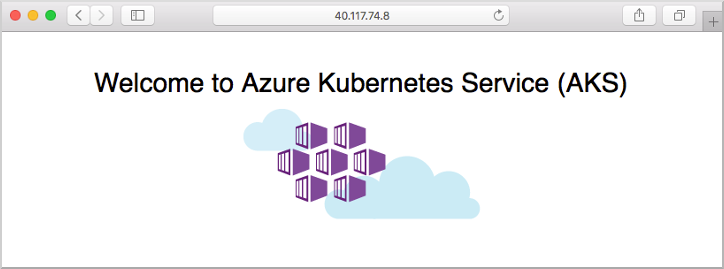
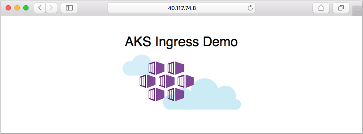

# Create an unmanaged ingress controller

An ingress controller is a piece of software that provides reverse proxy, configurable traffic routing, and TLS termination for Kubernetes services. Kubernetes ingress resources are used to configure the ingress rules and routes for individual Kubernetes services. When you use an ingress controller and ingress rules, a single IP address can be used to route traffic to multiple services in a Kubernetes cluster.

This article shows you how to deploy the [NGINX ingress controller][nginx-ingress] in an Azure Kubernetes Service (AKS) cluster. Two applications are then run in the AKS cluster, each of which is accessible over the single IP address.

> [!NOTE]
> There are two open source ingress controllers for Kubernetes based on Nginx: one is maintained by the Kubernetes community ([kubernetes/ingress-nginx][nginx-ingress]), and one is maintained by NGINX, Inc. ([nginxinc/kubernetes-ingress]). This article will be using the Kubernetes community ingress controller.

## Before you begin

* This article uses [Helm 3][helm] to install the NGINX ingress controller on a [supported version of Kubernetes][aks-supported versions]. Make sure that you're using the latest release of Helm and have access to the *ingress-nginx* Helm repository. The steps outlined in this article may not be compatible with previous versions of the Helm chart, NGINX ingress controller, or Kubernetes.
* This article assumes you have an existing AKS cluster with an integrated Azure Container Registry (ACR). For more information on creating an AKS cluster with an integrated ACR, see [Authenticate with Azure Container Registry from Azure Kubernetes Service][aks-integrated-acr].
* The Kubernetes API health endpoint, `healthz` was deprecated in Kubernetes v1.16. You can replace this endpoint with the `livez` and `readyz` endpoints instead. See [Kubernetes API endpoints for health](https://kubernetes.io/docs/reference/using-api/health-checks/#api-endpoints-for-health) to determine which endpoint to use for your scenario.
* If you're using Azure CLI, this article requires that you're running the Azure CLI version 2.0.64 or later. Run `az --version` to find the version. If you need to install or upgrade, see [Install Azure CLI][azure-cli-install].
* If you're using Azure PowerShell, this article requires that you're running Azure PowerShell version 5.9.0 or later. Run `Get-InstalledModule -Name Az` to find the version. If you need to install or upgrade, see [Install Azure PowerShell][azure-powershell-install].

## Basic configuration

To create a basic NGINX ingress controller without customizing the defaults, you'll use Helm. The following configuration uses the default configuration for simplicity. You can add parameters for customizing the deployment, like `--set controller.replicaCount=3`.

### [Azure CLI](#tab/azure-cli)

```console
NAMESPACE=ingress-basic

helm repo add ingress-nginx https://kubernetes.github.io/ingress-nginx
helm repo update

helm install ingress-nginx ingress-nginx/ingress-nginx \
  --create-namespace \
  --namespace $NAMESPACE \
  --set controller.service.annotations."service\.beta\.kubernetes\.io/azure-load-balancer-health-probe-request-path"=/healthz
```

### [Azure PowerShell](#tab/azure-powershell)

```powershell-interactive
$Namespace = 'ingress-basic'

helm repo add ingress-nginx https://kubernetes.github.io/ingress-nginx
helm repo update

helm install ingress-nginx ingress-nginx/ingress-nginx `
  --create-namespace `
  --namespace $Namespace `
  --set controller.service.annotations."service\.beta\.kubernetes\.io/azure-load-balancer-health-probe-request-path"=/healthz
```

---

## Customized configuration

As an alternative to the basic configuration presented in the above section, the next set of steps will show how to deploy a customized ingress controller. You'll have the option of using an internal static IP address, or using a dynamic public IP address.

### Import the images used by the Helm chart into your ACR

### [Azure CLI](#tab/azure-cli)

To control image versions, you'll want to import them into your own Azure Container Registry. The [NGINX ingress controller Helm chart][ingress-nginx-helm-chart] relies on three container images. Use `az acr import` to import those images into your ACR.

```azurecli
REGISTRY_NAME=<REGISTRY_NAME>
SOURCE_REGISTRY=registry.k8s.io
CONTROLLER_IMAGE=ingress-nginx/controller
CONTROLLER_TAG=v1.2.1
PATCH_IMAGE=ingress-nginx/kube-webhook-certgen
PATCH_TAG=v1.1.1
DEFAULTBACKEND_IMAGE=defaultbackend-amd64
DEFAULTBACKEND_TAG=1.5

az acr import --name $REGISTRY_NAME --source $SOURCE_REGISTRY/$CONTROLLER_IMAGE:$CONTROLLER_TAG --image $CONTROLLER_IMAGE:$CONTROLLER_TAG
az acr import --name $REGISTRY_NAME --source $SOURCE_REGISTRY/$PATCH_IMAGE:$PATCH_TAG --image $PATCH_IMAGE:$PATCH_TAG
az acr import --name $REGISTRY_NAME --source $SOURCE_REGISTRY/$DEFAULTBACKEND_IMAGE:$DEFAULTBACKEND_TAG --image $DEFAULTBACKEND_IMAGE:$DEFAULTBACKEND_TAG
```

### [Azure PowerShell](#tab/azure-powershell)

To control image versions, you'll want to import them into your own Azure Container Registry. The [NGINX ingress controller Helm chart][ingress-nginx-helm-chart] relies on three container images. Use `Import-AzContainerRegistryImage` to import those images into your ACR.

```azurepowershell-interactive
$RegistryName = "<REGISTRY_NAME>"
$ResourceGroup = (Get-AzContainerRegistry | Where-Object {$_.name -eq $RegistryName} ).ResourceGroupName
$SourceRegistry = "registry.k8s.io"
$ControllerImage = "ingress-nginx/controller"
$ControllerTag = "v1.2.1"
$PatchImage = "ingress-nginx/kube-webhook-certgen"
$PatchTag = "v1.1.1"
$DefaultBackendImage = "defaultbackend-amd64"
$DefaultBackendTag = "1.5"

Import-AzContainerRegistryImage -ResourceGroupName $ResourceGroup -RegistryName $RegistryName -SourceRegistryUri $SourceRegistry -SourceImage "${ControllerImage}:${ControllerTag}"
Import-AzContainerRegistryImage -ResourceGroupName $ResourceGroup -RegistryName $RegistryName -SourceRegistryUri $SourceRegistry -SourceImage "${PatchImage}:${PatchTag}"
Import-AzContainerRegistryImage -ResourceGroupName $ResourceGroup -RegistryName $RegistryName -SourceRegistryUri $SourceRegistry -SourceImage "${DefaultBackendImage}:${DefaultBackendTag}"
```
---

> [!NOTE]
> In addition to importing container images into your ACR, you can also import Helm charts into your ACR. For more information, see [Push and pull Helm charts to an Azure Container Registry][acr-helm].

### Create an ingress controller

To create the ingress controller, use Helm to install *ingress-nginx*. The ingress controller needs to be scheduled on a Linux node. Windows Server nodes shouldn't run the ingress controller. A node selector is specified using the `--set nodeSelector` parameter to tell the Kubernetes scheduler to run the NGINX ingress controller on a Linux-based node.

For added redundancy, two replicas of the NGINX ingress controllers are deployed with the `--set controller.replicaCount` parameter. To fully benefit from running replicas of the ingress controller, make sure there's more than one node in your AKS cluster.

The following example creates a Kubernetes namespace for the ingress resources named *ingress-basic* and is intended to work within that namespace. Specify a namespace for your own environment as needed. If your AKS cluster isn't Kubernetes role-based access control enabled, add `--set rbac.create=false` to the Helm commands.

> [!NOTE]
> If you would like to enable [client source IP preservation][client-source-ip] for requests to containers in your cluster, add `--set controller.service.externalTrafficPolicy=Local` to the Helm install command. The client source IP is stored in the request header under *X-Forwarded-For*. When you're using an ingress controller with client source IP preservation enabled, TLS pass-through won't work.

### [Azure CLI](#tab/azure-cli)

```console
# Add the ingress-nginx repository
helm repo add ingress-nginx https://kubernetes.github.io/ingress-nginx
helm repo update

# Set variable for ACR location to use for pulling images
ACR_URL=<REGISTRY_URL>

# Use Helm to deploy an NGINX ingress controller
helm install ingress-nginx ingress-nginx/ingress-nginx \
    --version 4.1.3 \
    --namespace ingress-basic \
    --create-namespace \
    --set controller.replicaCount=2 \
    --set controller.nodeSelector."kubernetes\.io/os"=linux \
    --set controller.image.registry=$ACR_URL \
    --set controller.image.image=$CONTROLLER_IMAGE \
    --set controller.image.tag=$CONTROLLER_TAG \
    --set controller.image.digest="" \
    --set controller.admissionWebhooks.patch.nodeSelector."kubernetes\.io/os"=linux \
    --set controller.service.annotations."service\.beta\.kubernetes\.io/azure-load-balancer-health-probe-request-path"=/healthz \
    --set controller.admissionWebhooks.patch.image.registry=$ACR_URL \
    --set controller.admissionWebhooks.patch.image.image=$PATCH_IMAGE \
    --set controller.admissionWebhooks.patch.image.tag=$PATCH_TAG \
    --set controller.admissionWebhooks.patch.image.digest="" \
    --set defaultBackend.nodeSelector."kubernetes\.io/os"=linux \
    --set defaultBackend.image.registry=$ACR_URL \
    --set defaultBackend.image.image=$DEFAULTBACKEND_IMAGE \
    --set defaultBackend.image.tag=$DEFAULTBACKEND_TAG \
    --set defaultBackend.image.digest=""
```

### [Azure PowerShell](#tab/azure-powershell)

```azurepowershell-interactive
# Add the ingress-nginx repository
helm repo add ingress-nginx https://kubernetes.github.io/ingress-nginx
helm repo update

# Set variable for ACR location to use for pulling images
$AcrUrl = (Get-AzContainerRegistry -ResourceGroupName $ResourceGroup -Name $RegistryName).LoginServer

# Use Helm to deploy an NGINX ingress controller
helm install ingress-nginx ingress-nginx/ingress-nginx `
    --namespace ingress-basic `
    --create-namespace `
    --set controller.replicaCount=2 `
    --set controller.nodeSelector."kubernetes\.io/os"=linux `
    --set controller.image.registry=$AcrUrl `
    --set controller.image.image=$ControllerImage `
    --set controller.image.tag=$ControllerTag `
    --set controller.image.digest="" `
    --set controller.admissionWebhooks.patch.nodeSelector."kubernetes\.io/os"=linux `
    --set controller.service.annotations."service\.beta\.kubernetes\.io/azure-load-balancer-health-probe-request-path"=/healthz `
    --set controller.admissionWebhooks.patch.image.registry=$AcrUrl `
    --set controller.admissionWebhooks.patch.image.image=$PatchImage `
    --set controller.admissionWebhooks.patch.image.tag=$PatchTag `
    --set controller.admissionWebhooks.patch.image.digest="" `
    --set defaultBackend.nodeSelector."kubernetes\.io/os"=linux `
    --set defaultBackend.image.registry=$AcrUrl `
    --set defaultBackend.image.image=$DefaultBackendImage `
    --set defaultBackend.image.tag=$DefaultBackendTag `
    --set defaultBackend.image.digest=""
```

---

### Create an ingress controller using an internal IP address

By default, an NGINX ingress controller is created with a dynamic public IP address assignment. A common configuration requirement is to use an internal, private network and IP address. This approach allows you to restrict access to your services to internal users, with no external access.

Use the `--set controller.service.loadBalancerIP` and `--set controller.service.annotations."service\.beta\.kubernetes\.io/azure-load-balancer-internal"=true` parameters to assign an internal IP address to your ingress controller. Provide your own internal IP address for use with the ingress controller. Make sure that this IP address isn't already in use within your virtual network. If you're using an existing virtual network and subnet, you must configure your AKS cluster with the correct permissions to manage the virtual network and subnet. For more information, see [Use kubenet networking with your own IP address ranges in Azure Kubernetes Service (AKS)][aks-configure-kubenet-networking] or [Configure Azure CNI networking in Azure Kubernetes Service (AKS)][aks-configure-advanced-networking].

### [Azure CLI](#tab/azure-cli)

```console
# Add the ingress-nginx repository
helm repo add ingress-nginx https://kubernetes.github.io/ingress-nginx
helm repo update

# Set variable for ACR location to use for pulling images
ACR_URL=<REGISTRY_URL>

# Use Helm to deploy an NGINX ingress controller
helm install ingress-nginx ingress-nginx/ingress-nginx \
    --version 4.1.3 \
    --namespace ingress-basic \
    --create-namespace \
    --set controller.replicaCount=2 \
    --set controller.nodeSelector."kubernetes\.io/os"=linux \
    --set controller.image.registry=$ACR_URL \
    --set controller.image.image=$CONTROLLER_IMAGE \
    --set controller.image.tag=$CONTROLLER_TAG \
    --set controller.image.digest="" \
    --set controller.admissionWebhooks.patch.nodeSelector."kubernetes\.io/os"=linux \
    --set controller.service.loadBalancerIP=10.224.0.42 \
    --set controller.service.annotations."service\.beta\.kubernetes\.io/azure-load-balancer-internal"=true \
    --set controller.service.annotations."service\.beta\.kubernetes\.io/azure-load-balancer-health-probe-request-path"=/healthz \
    --set controller.admissionWebhooks.patch.image.registry=$ACR_URL \
    --set controller.admissionWebhooks.patch.image.image=$PATCH_IMAGE \
    --set controller.admissionWebhooks.patch.image.tag=$PATCH_TAG \
    --set controller.admissionWebhooks.patch.image.digest="" \
    --set defaultBackend.nodeSelector."kubernetes\.io/os"=linux \
    --set defaultBackend.image.registry=$ACR_URL \
    --set defaultBackend.image.image=$DEFAULTBACKEND_IMAGE \
    --set defaultBackend.image.tag=$DEFAULTBACKEND_TAG \
    --set defaultBackend.image.digest="" 
```

### [Azure PowerShell](#tab/azure-powershell)

```azurepowershell-interactive
# Add the ingress-nginx repository
helm repo add ingress-nginx https://kubernetes.github.io/ingress-nginx
helm repo update

# Set variable for ACR location to use for pulling images
$AcrUrl = (Get-AzContainerRegistry -ResourceGroupName $ResourceGroup -Name $RegistryName).LoginServer

# Use Helm to deploy an NGINX ingress controller
helm install ingress-nginx ingress-nginx/ingress-nginx `
    --namespace ingress-basic `
    --create-namespace `
    --set controller.replicaCount=2 `
    --set controller.nodeSelector."kubernetes\.io/os"=linux `
    --set controller.image.registry=$AcrUrl `
    --set controller.image.image=$ControllerImage `
    --set controller.image.tag=$ControllerTag `
    --set controller.image.digest="" `
    --set controller.admissionWebhooks.patch.nodeSelector."kubernetes\.io/os"=linux `
    --set controller.service.loadBalancerIP=10.224.0.42 \
    --set controller.service.annotations."service\.beta\.kubernetes\.io/azure-load-balancer-internal"=true \
    --set controller.service.annotations."service\.beta\.kubernetes\.io/azure-load-balancer-health-probe-request-path"=/healthz `
    --set controller.admissionWebhooks.patch.image.registry=$AcrUrl `
    --set controller.admissionWebhooks.patch.image.image=$PatchImage `
    --set controller.admissionWebhooks.patch.image.tag=$PatchTag `
    --set controller.admissionWebhooks.patch.image.digest="" `
    --set defaultBackend.nodeSelector."kubernetes\.io/os"=linux `
    --set defaultBackend.image.registry=$AcrUrl `
    --set defaultBackend.image.image=$DefaultBackendImage `
    --set defaultBackend.image.tag=$DefaultBackendTag `
    --set defaultBackend.image.digest="" `
```

---

## Check the load balancer service

Check the load balancer service by using `kubectl get services`.

```console
kubectl get services --namespace ingress-basic -o wide -w ingress-nginx-controller
```

When the Kubernetes load balancer service is created for the NGINX ingress controller, an IP address is assigned under *EXTERNAL-IP*, as shown in the following example output:

```console
NAME                       TYPE           CLUSTER-IP    EXTERNAL-IP     PORT(S)                      AGE   SELECTOR
ingress-nginx-controller   LoadBalancer   10.0.65.205   EXTERNAL-IP     80:30957/TCP,443:32414/TCP   1m   app.kubernetes.io/component=controller,app.kubernetes.io/instance=ingress-nginx,app.kubernetes.io/name=ingress-nginx
```

If you browse to the external IP address at this stage, you see a 404 page displayed. This is because you still need to set up the connection to the external IP, which is done in the next sections.

## Run demo applications

To see the ingress controller in action, run two demo applications in your AKS cluster. In this example, you use `kubectl apply` to deploy two instances of a simple *Hello world* application.

1. Create an `aks-helloworld-one.yaml` file and copy in the following example YAML:

    ```yaml
    apiVersion: apps/v1
    kind: Deployment
    metadata:
      name: aks-helloworld-one  
    spec:
      replicas: 1
      selector:
        matchLabels:
          app: aks-helloworld-one
      template:
        metadata:
          labels:
            app: aks-helloworld-one
        spec:
          containers:
          - name: aks-helloworld-one
            image: mcr.microsoft.com/azuredocs/aks-helloworld:v1
            ports:
            - containerPort: 80
            env:
            - name: TITLE
              value: "Welcome to Azure Kubernetes Service (AKS)"
    ---
    apiVersion: v1
    kind: Service
    metadata:
      name: aks-helloworld-one  
    spec:
      type: ClusterIP
      ports:
      - port: 80
      selector:
        app: aks-helloworld-one
    ```

2. Create an `aks-helloworld-two.yaml` file and copy in the following example YAML:

    ```yaml
    apiVersion: apps/v1
    kind: Deployment
    metadata:
      name: aks-helloworld-two  
    spec:
      replicas: 1
      selector:
        matchLabels:
          app: aks-helloworld-two
      template:
        metadata:
          labels:
            app: aks-helloworld-two
        spec:
          containers:
          - name: aks-helloworld-two
            image: mcr.microsoft.com/azuredocs/aks-helloworld:v1
            ports:
            - containerPort: 80
            env:
            - name: TITLE
              value: "AKS Ingress Demo"
    ---
    apiVersion: v1
    kind: Service
    metadata:
      name: aks-helloworld-two  
    spec:
      type: ClusterIP
      ports:
      - port: 80
      selector:
        app: aks-helloworld-two
    ```

3. Run the two demo applications using `kubectl apply`:

    ```console
    kubectl apply -f aks-helloworld-one.yaml --namespace ingress-basic
    kubectl apply -f aks-helloworld-two.yaml --namespace ingress-basic
    ```

## Create an ingress route

Both applications are now running on your Kubernetes cluster. To route traffic to each application, create a Kubernetes ingress resource. The ingress resource configures the rules that route traffic to one of the two applications.

In the following example, traffic to *EXTERNAL_IP/hello-world-one* is routed to the service named `aks-helloworld-one`. Traffic to *EXTERNAL_IP/hello-world-two* is routed to the `aks-helloworld-two` service. Traffic to *EXTERNAL_IP/static* is routed to the service named `aks-helloworld-one` for static assets.

1. Create a file named `hello-world-ingress.yaml` and copy in the following example YAML:

    ```yaml
    apiVersion: networking.k8s.io/v1
    kind: Ingress
    metadata:
      name: hello-world-ingress
      annotations:
        nginx.ingress.kubernetes.io/ssl-redirect: "false"
        nginx.ingress.kubernetes.io/use-regex: "true"
        nginx.ingress.kubernetes.io/rewrite-target: /$2
    spec:
      ingressClassName: nginx
      rules:
      - http:
          paths:
          - path: /hello-world-one(/|$)(.*)
            pathType: Prefix
            backend:
              service:
                name: aks-helloworld-one
                port:
                  number: 80
          - path: /hello-world-two(/|$)(.*)
            pathType: Prefix
            backend:
              service:
                name: aks-helloworld-two
                port:
                  number: 80
          - path: /(.*)
            pathType: Prefix
            backend:
              service:
                name: aks-helloworld-one
                port:
                  number: 80
    ---
    apiVersion: networking.k8s.io/v1
    kind: Ingress
    metadata:
      name: hello-world-ingress-static
      annotations:
        nginx.ingress.kubernetes.io/ssl-redirect: "false"
        nginx.ingress.kubernetes.io/rewrite-target: /static/$2
    spec:
      ingressClassName: nginx
      rules:
      - http:
          paths:
          - path: /static(/|$)(.*)
            pathType: Prefix
            backend:
              service:
                name: aks-helloworld-one
                port: 
                  number: 80
    ```

2. Create the ingress resource using the `kubectl apply` command.

    ```console
    kubectl apply -f hello-world-ingress.yaml --namespace ingress-basic
    ```

## Test the ingress controller

To test the routes for the ingress controller, browse to the two applications. Open a web browser to the IP address of your NGINX ingress controller, such as *EXTERNAL_IP*. The first demo application is displayed in the web browser, as shown in the following example:



Now add the */hello-world-two* path to the IP address, such as *EXTERNAL_IP/hello-world-two*. The second demo application with the custom title is displayed:



### Test an internal IP address

1. Create a test pod and attach a terminal session to it.

    ```console
    kubectl run -it --rm aks-ingress-test --image=mcr.microsoft.com/dotnet/runtime-deps:6.0 --namespace ingress-basic
    ```

2. Install `curl` in the pod using `apt-get`.

    ```console
    apt-get update && apt-get install -y curl
    ```

3. Access the address of your Kubernetes ingress controller using `curl`, such as *http://10.224.0.42*. Provide your own internal IP address specified when you deployed the ingress controller.

    ```console
    curl -L http://10.224.0.42
    ```

    No path was provided with the address, so the ingress controller defaults to the */* route. The first demo application is returned, as shown in the following condensed example output:

    ```console
    <!DOCTYPE html>
    <html xmlns="http://www.w3.org/1999/xhtml">
    <head>
        <link rel="stylesheet" type="text/css" href="/static/default.css">
        <title>Welcome to Azure Kubernetes Service (AKS)</title>
    [...]
    ```

4. Add the */hello-world-two* path to the address, such as *http://10.224.0.42/hello-world-two*.

    ```console
    curl -L -k http://10.224.0.42/hello-world-two
    ```

    The second demo application with the custom title is returned, as shown in the following condensed example output:

    ```console
    <!DOCTYPE html>
    <html xmlns="http://www.w3.org/1999/xhtml">
    <head>
        <link rel="stylesheet" type="text/css" href="/static/default.css">
        <title>AKS Ingress Demo</title>
    [...]
    ```

---

## Clean up resources

This article used Helm to install the ingress components and sample apps. When you deploy a Helm chart, many Kubernetes resources are created. These resources include pods, deployments, and services. To clean up these resources, you can either delete the entire sample namespace, or the individual resources.

### Delete the sample namespace and all resources

To delete the entire sample namespace, use the `kubectl delete` command and specify your namespace name. All the resources in the namespace are deleted.

```console
kubectl delete namespace ingress-basic
```

### Delete resources individually

Alternatively, a more granular approach is to delete the individual resources created. 

1. List the Helm releases with the `helm list` command.

    ```console
    helm list --namespace ingress-basic
    ```

    Look for charts named *ingress-nginx* and *aks-helloworld*, as shown in the following example output:

    ```console
    NAME                    NAMESPACE       REVISION        UPDATED                                 STATUS          CHART                   APP VERSION
    ingress-nginx           ingress-basic   1               2020-01-06 19:55:46.358275 -0600 CST    deployed        nginx-ingress-1.27.1    0.26.1  
    ```

2. Uninstall the releases with the `helm uninstall` command.

    ```console
    helm uninstall ingress-nginx --namespace ingress-basic
    ```

3. Remove the two sample applications.

    ```console
    kubectl delete -f aks-helloworld-one.yaml --namespace ingress-basic
    kubectl delete -f aks-helloworld-two.yaml --namespace ingress-basic
    ```

4. Remove the ingress route that directed traffic to the sample apps.

    ```console
    kubectl delete -f hello-world-ingress.yaml
    ```

5. Delete the namespace using the `kubectl delete` command and specifying your namespace name.

    ```console
    kubectl delete namespace ingress-basic
    ```

## Next steps

To configure TLS with your existing ingress components, see [Use TLS with an ingress controller][aks-ingress-tls].

To configure your AKS cluster to use HTTP application routing, see [Enable the HTTP application routing add-on][aks-http-app-routing].

This article included some external components to AKS. To learn more about these components, see the following project pages:

- [Helm CLI][helm-cli]
- [NGINX ingress controller][nginx-ingress]

<!-- LINKS - external -->
[helm]: https://helm.sh/
[helm-cli]: ./kubernetes-helm.md
[nginx-ingress]: https://github.com/kubernetes/ingress-nginx
[ingress-nginx-helm-chart]: https://github.com/kubernetes/ingress-nginx/tree/main/charts/ingress-nginx
[nginxinc/kubernetes-ingress]: https://github.com/nginxinc/kubernetes-ingress

<!-- LINKS - internal -->
[use-helm]: kubernetes-helm.md
[azure-cli-install]: /cli/azure/install-azure-cli
[aks-configure-advanced-networking]: configure-azure-cni.md
[aks-configure-kubenet-networking]: configure-kubenet.md
[aks-ingress-tls]: ingress-tls.md
[aks-http-app-routing]: http-application-routing.md
[client-source-ip]: concepts-network.md#ingress-controllers
[aks-supported versions]: supported-kubernetes-versions.md
[aks-integrated-acr]: cluster-container-registry-integration.md#create-a-new-acr
[acr-helm]: ../container-registry/container-registry-helm-repos.md
[azure-powershell-install]: /powershell/azure/install-az-ps
