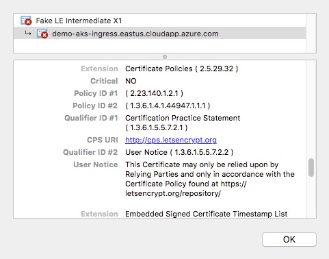
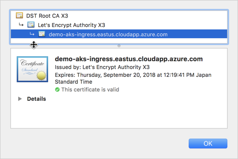
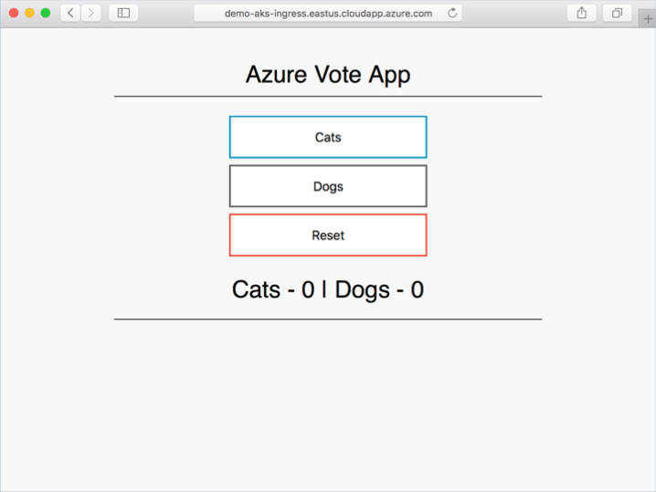
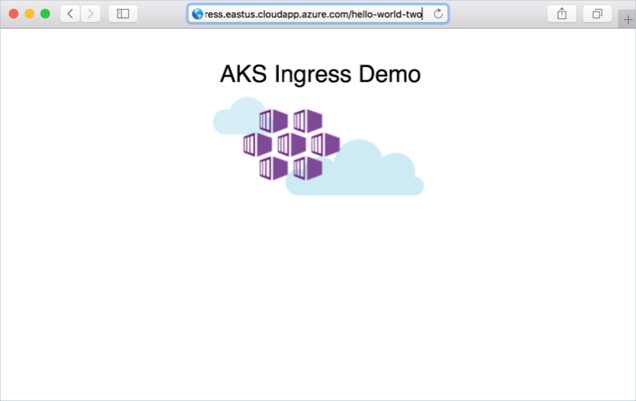

# Create an HTTPS ingress controller on Azure Kubernetes Service (AKS)

An ingress controller is a piece of software that provides reverse proxy, configurable traffic routing, and TLS termination for Kubernetes services. Kubernetes ingress resources are used to configure the ingress rules and routes for individual Kubernetes services. Using an ingress controller and ingress rules, a single IP address can be used to route traffic to multiple services in a Kubernetes cluster.

This article shows you how to deploy the [NGINX ingress controller][nginx-ingress] in an Azure Kubernetes Service (AKS) cluster. The [cert-manager][cert-manager] project is used to automatically generate and configure [Let's Encrypt][lets-encrypt] certificates. Finally, two applications are run in the AKS cluster, each of which is accessible over a single IP address.

You can also:

- [Create a basic ingress controller with external network connectivity][aks-ingress-basic]
- [Enable the HTTP application routing add-on][aks-http-app-routing]
- [Create an ingress controller that uses an internal, private network and IP address][aks-ingress-internal]
- [Create an ingress controller that uses your own TLS certificates][aks-ingress-own-tls]
- [Create an ingress controller that uses Let's Encrypt to automatically generate TLS certificates with a static public IP address][aks-ingress-static-tls]

## Before you begin

This article assumes that you have an existing AKS cluster. If you need an AKS cluster, see the AKS quickstart [using the Azure CLI][aks-quickstart-cli] or [using the Azure portal][aks-quickstart-portal].

This article uses Helm to install the NGINX ingress controller, cert-manager, and a sample web app. You need to have Helm initialized within your AKS cluster and using a service account for Tiller. Make sure that you are using the latest release of Helm. For upgrade instructions, see the [Helm install docs][helm-install]. For more information on configuring and using Helm, see [Install applications with Helm in Azure Kubernetes Service (AKS)][use-helm].

This article also requires that you are running the Azure CLI version 2.0.64 or later. Run `az --version` to find the version. If you need to install or upgrade, see [Install Azure CLI][azure-cli-install].

## Create an ingress controller

To create the ingress controller, use `Helm` to install *nginx-ingress*. For added redundancy, two replicas of the NGINX ingress controllers are deployed with the `--set controller.replicaCount` parameter. To fully benefit from running replicas of the ingress controller, make sure there's more than one node in your AKS cluster.

The ingress controller also needs to be scheduled on a Linux node. Windows Server nodes (currently in preview in AKS) shouldn't run the ingress controller. A node selector is specified using the `--set nodeSelector` parameter to tell the Kubernetes scheduler to run the NGINX ingress controller on a Linux-based node.

> [!TIP]
> The following example creates a Kubernetes namespace for the ingress resources named *ingress-basic*. Specify a namespace for your own environment as needed. If your AKS cluster is not RBAC enabled, add `--set rbac.create=false` to the Helm commands.

> [!TIP]
> If you would like to enable [client source IP preservation][client-source-ip] for requests to containers in your cluster, add `--set controller.service.externalTrafficPolicy=Local` to the Helm install command. The client source IP is stored in the request header under *X-Forwarded-For*. When using an ingress controller with client source IP preservation enabled, SSL pass-through will not work.

```console
# Create a namespace for your ingress resources
kubectl create namespace ingress-basic

# Use Helm to deploy an NGINX ingress controller
helm install stable/nginx-ingress \
    --namespace ingress-basic \
    --set controller.replicaCount=2 \
    --set controller.nodeSelector."beta\.kubernetes\.io/os"=linux \
    --set defaultBackend.nodeSelector."beta\.kubernetes\.io/os"=linux
```

During the installation, an Azure public IP address is created for the ingress controller. This public IP address is static for the life-span of the ingress controller. If you delete the ingress controller, the public IP address assignment is lost. If you then create an additional ingress controller, a new public IP address is assigned. If you wish to retain the use of the public IP address, you can instead [create an ingress controller with a static public IP address][aks-ingress-static-tls].

To get the public IP address, use the `kubectl get service` command. It takes a few minutes for the IP address to be assigned to the service.

```
$ kubectl get service -l app=nginx-ingress --namespace ingress-basic

NAME                                             TYPE           CLUSTER-IP     EXTERNAL-IP     PORT(S)                      AGE
billowing-kitten-nginx-ingress-controller        LoadBalancer   10.0.182.160   51.145.155.210  80:30920/TCP,443:30426/TCP   20m
billowing-kitten-nginx-ingress-default-backend   ClusterIP      10.0.255.77    <none>          80/TCP                       20m
```

No ingress rules have been created yet. If you browse to the public IP address, the NGINX ingress controller's default 404 page is displayed.

## Configure a DNS name

For the HTTPS certificates to work correctly, configure an FQDN for the ingress controller IP address. Update the following script with the IP address of your ingress controller and a unique name that you would like to use for the FQDN:

```azurecli-interactive
#!/bin/bash

# Public IP address of your ingress controller
IP="51.145.155.210"

# Name to associate with public IP address
DNSNAME="demo-aks-ingress"

# Get the resource-id of the public ip
PUBLICIPID=$(az network public-ip list --query "[?ipAddress!=null]|[?contains(ipAddress, '$IP')].[id]" --output tsv)

# Update public ip address with DNS name
az network public-ip update --ids $PUBLICIPID --dns-name $DNSNAME
```

The ingress controller is now accessible through the FQDN.

## Install cert-manager

The NGINX ingress controller supports TLS termination. There are several ways to retrieve and configure certificates for HTTPS. This article demonstrates using [cert-manager][cert-manager], which provides automatic [Lets Encrypt][lets-encrypt] certificate generation and management functionality.

> [!NOTE]
> This article uses the `staging` environment for Let's Encrypt. In production deployments, use `letsencrypt-prod` and `https://acme-v02.api.letsencrypt.org/directory` in the resource definitions and when installing the Helm chart.

To install the cert-manager controller in an RBAC-enabled cluster, use the following `helm install` command:

```console
# Install the CustomResourceDefinition resources separately
kubectl apply -f https://raw.githubusercontent.com/jetstack/cert-manager/release-0.8/deploy/manifests/00-crds.yaml

# Create the namespace for cert-manager
kubectl create namespace cert-manager

# Label the cert-manager namespace to disable resource validation
kubectl label namespace cert-manager certmanager.k8s.io/disable-validation=true

# Add the Jetstack Helm repository
helm repo add jetstack https://charts.jetstack.io

# Update your local Helm chart repository cache
helm repo update

# Install the cert-manager Helm chart
helm install \
  --name cert-manager \
  --namespace cert-manager \
  --version v0.8.0 \
  jetstack/cert-manager
```

For more information on cert-manager configuration, see the [cert-manager project][cert-manager].

## Create a CA cluster issuer

Before certificates can be issued, cert-manager requires an [Issuer][cert-manager-issuer] or [ClusterIssuer][cert-manager-cluster-issuer] resource. These Kubernetes resources are identical in functionality, however `Issuer` works in a single namespace, and `ClusterIssuer` works across all namespaces. For more information, see the [cert-manager issuer][cert-manager-issuer] documentation.

Create a cluster issuer, such as `cluster-issuer.yaml`, using the following example manifest. Update the email address with a valid address from your organization:

```yaml
apiVersion: certmanager.k8s.io/v1alpha1
kind: ClusterIssuer
metadata:
  name: letsencrypt-staging
  namespace: ingress-basic
spec:
  acme:
    server: https://acme-staging-v02.api.letsencrypt.org/directory
    email: user@contoso.com
    privateKeySecretRef:
      name: letsencrypt-staging
    http01: {}
```

To create the issuer, use the `kubectl apply -f cluster-issuer.yaml` command.

```
$ kubectl apply -f cluster-issuer.yaml

clusterissuer.certmanager.k8s.io/letsencrypt-staging created
```

## Run demo applications

An ingress controller and a certificate management solution have been configured. Now let's run two demo applications in your AKS cluster. In this example, Helm is used to deploy two instances of a simple 'Hello world' application.

Before you can install the sample Helm charts, add the Azure samples repository to your Helm environment as follows:

```console
helm repo add azure-samples https://azure-samples.github.io/helm-charts/
```

Create the first demo application from a Helm chart with the following command:

```console
helm install azure-samples/aks-helloworld --namespace ingress-basic
```

Now install a second instance of the demo application. For the second instance, you specify a new title so that the two applications are visually distinct. You also specify a unique service name:

```console
helm install azure-samples/aks-helloworld \
    --namespace ingress-basic \
    --set title="AKS Ingress Demo" \
    --set serviceName="ingress-demo"
```

## Create an ingress route

Both applications are now running on your Kubernetes cluster, however they're configured with a service of type `ClusterIP`. As such, the applications aren't accessible from the internet. To make them publicly available, create a Kubernetes ingress resource. The ingress resource configures the rules that route traffic to one of the two applications.

In the following example, traffic to the address `https://demo-aks-ingress.eastus.cloudapp.azure.com/` is routed to the service named `aks-helloworld`. Traffic to the address `https://demo-aks-ingress.eastus.cloudapp.azure.com/hello-world-two` is routed to the `ingress-demo` service. Update the *hosts* and *host* to the DNS name you created in a previous step.

Create a file named `hello-world-ingress.yaml` and copy in the following example YAML.

```yaml
apiVersion: extensions/v1beta1
kind: Ingress
metadata:
  name: hello-world-ingress
  namespace: ingress-basic
  annotations:
    kubernetes.io/ingress.class: nginx
    certmanager.k8s.io/cluster-issuer: letsencrypt-staging
    nginx.ingress.kubernetes.io/rewrite-target: /$1
spec:
  tls:
  - hosts:
    - demo-aks-ingress.eastus.cloudapp.azure.com
    secretName: tls-secret
  rules:
  - host: demo-aks-ingress.eastus.cloudapp.azure.com
    http:
      paths:
      - backend:
          serviceName: aks-helloworld
          servicePort: 80
        path: /(.*)
      - backend:
          serviceName: ingress-demo
          servicePort: 80
        path: /hello-world-two(/|$)(.*)
```

Create the ingress resource using the `kubectl apply -f hello-world-ingress.yaml` command.

```
$ kubectl apply -f hello-world-ingress.yaml

ingress.extensions/hello-world-ingress created
```

## Create a certificate object

Next, a certificate resource must be created. The certificate resource defines the desired X.509 certificate. For more information, see [cert-manager certificates][cert-manager-certificates].

Cert-manager has likely automatically created a certificate object for you using ingress-shim, which is automatically deployed with cert-manager since v0.2.2. For more information, see the [ingress-shim documentation][ingress-shim].

To verify that the certificate was created successfully, use the `kubectl describe certificate tls-secret --namespace ingress-basic` command.

If the certificate was issued, you will see output similar to the following:
```
Type    Reason          Age   From          Message
----    ------          ----  ----          -------
  Normal  CreateOrder     11m   cert-manager  Created new ACME order, attempting validation...
  Normal  DomainVerified  10m   cert-manager  Domain "demo-aks-ingress.eastus.cloudapp.azure.com" verified with "http-01" validation
  Normal  IssueCert       10m   cert-manager  Issuing certificate...
  Normal  CertObtained    10m   cert-manager  Obtained certificate from ACME server
  Normal  CertIssued      10m   cert-manager  Certificate issued successfully
```

If you need to create an additional certificate resource, you can do so with the following example manifest. Update the *dnsNames* and *domains* to the DNS name you created in a previous step. If you use an internal-only ingress controller, specify the internal DNS name for your service.

```yaml
apiVersion: certmanager.k8s.io/v1alpha1
kind: Certificate
metadata:
  name: tls-secret
  namespace: ingress-basic
spec:
  secretName: tls-secret-staging
  dnsNames:
  - demo-aks-ingress.eastus.cloudapp.azure.com
  acme:
    config:
    - http01:
        ingressClass: nginx
      domains:
      - demo-aks-ingress.eastus.cloudapp.azure.com
  issuerRef:
    name: letsencrypt-staging
    kind: ClusterIssuer
```

To create the certificate resource, use the `kubectl apply -f certificates.yaml` command.

```
$ kubectl apply -f certificates.yaml

certificate.certmanager.k8s.io/tls-secret-staging created
```

## Test the ingress configuration

Open a web browser to the FQDN of your Kubernetes ingress controller, such as *https://demo-aks-ingress.eastus.cloudapp.azure.com*.

As these examples use `letsencrypt-staging`, the issued SSL certificate is not trusted by the browser. Accept the warning prompt to continue to your application. The certificate information shows this *Fake LE Intermediate X1* certificate is issued by Let's Encrypt. This fake certificate indicates `cert-manager` processed the request correctly and received a certificate from the provider:



When you change Let's Encrypt to use `prod` rather than `staging`, a trusted certificate issued by Let's Encrypt is used, as shown in the following example:



The demo application is shown in the web browser:



Now add the */hello-world-two* path to the FQDN, such as *https://demo-aks-ingress.eastus.cloudapp.azure.com/hello-world-two*. The second demo application with the custom title is shown:



## Clean up resources

This article used Helm to install the ingress components, certificates, and sample apps. When you deploy a Helm chart, a number of Kubernetes resources are created. These resources includes pods, deployments, and services. To clean up these resources, you can either delete the entire sample namespace, or the individual resources.

### Delete the sample namespace and all resources

To delete the entire sample namespace, use the `kubectl delete` command and specify your namespace name. All the resources in the namespace are deleted.

```console
kubectl delete namespace ingress-basic
```

Then, remove the Helm repo for the AKS hello world app:

```console
helm repo remove azure-samples
```

### Delete resources individually

Alternatively, a more granular approach is to delete the individual resources created. First, remove the certificate resources:

```console
kubectl delete -f certificates.yaml
kubectl delete -f cluster-issuer.yaml
```

Now list the Helm releases with the `helm list` command. Look for charts named *nginx-ingress*, *cert-manager*, and *aks-helloworld*, as shown in the following example output:

```
$ helm list

NAME                  	REVISION	UPDATED                 	STATUS  	CHART               	APP VERSION	NAMESPACE
billowing-kitten      	1       	Wed Mar  6 19:37:43 2019	DEPLOYED	nginx-ingress-1.3.1  	0.22.0     	kube-system
loitering-waterbuffalo	1       	Wed Mar  6 20:25:01 2019	DEPLOYED	cert-manager-v0.6.6 	v0.6.2     	kube-system
flabby-deer           	1       	Wed Mar  6 20:27:54 2019	DEPLOYED	aks-helloworld-0.1.0	           	default
linting-echidna       	1       	Wed Mar  6 20:27:59 2019	DEPLOYED	aks-helloworld-0.1.0	           	default
```

Delete the releases with the `helm delete` command. The following example deletes the NGINX ingress deployment, certificate manager, and the two sample AKS hello world apps.

```
$ helm delete billowing-kitten loitering-waterbuffalo flabby-deer linting-echidna

release "billowing-kitten" deleted
release "loitering-waterbuffalo" deleted
release "flabby-deer" deleted
release "linting-echidna" deleted
```

Next, remove the Helm repo for the AKS hello world app:

```console
helm repo remove azure-samples
```

Delete the itself namespace. Use the `kubectl delete` command and specify your namespace name:

```console
kubectl delete namespace ingress-basic
```

Finally, remove the ingress route that directed traffic to the sample apps:

```console
kubectl delete -f hello-world-ingress.yaml
```

## Next steps

This article included some external components to AKS. To learn more about these components, see the following project pages:

- [Helm CLI][helm-cli]
- [NGINX ingress controller][nginx-ingress]
- [cert-manager][cert-manager]

You can also:

- [Create a basic ingress controller with external network connectivity][aks-ingress-basic]
- [Enable the HTTP application routing add-on][aks-http-app-routing]
- [Create an ingress controller that uses an internal, private network and IP address][aks-ingress-internal]
- [Create an ingress controller that uses your own TLS certificates][aks-ingress-own-tls]
- [Create an ingress controller that uses Let's Encrypt to automatically generate TLS certificates with a static public IP address][aks-ingress-static-tls]

<!-- LINKS - external -->
[helm-cli]: https://docs.microsoft.com/azure/aks/kubernetes-helm
[cert-manager]: https://github.com/jetstack/cert-manager
[cert-manager-certificates]: https://cert-manager.readthedocs.io/en/latest/reference/certificates.html
[ingress-shim]: https://docs.cert-manager.io/en/latest/tasks/issuing-certificates/ingress-shim.html
[cert-manager-cluster-issuer]: https://cert-manager.readthedocs.io/en/latest/reference/clusterissuers.html
[cert-manager-issuer]: https://cert-manager.readthedocs.io/en/latest/reference/issuers.html
[lets-encrypt]: https://letsencrypt.org/
[nginx-ingress]: https://github.com/kubernetes/ingress-nginx
[helm-install]: https://docs.helm.sh/using_helm/#installing-helm

<!-- LINKS - internal -->
[use-helm]: kubernetes-helm.md
[azure-cli-install]: /cli/azure/install-azure-cli
[az-aks-show]: /cli/azure/aks#az-aks-show
[az-network-public-ip-create]: /cli/azure/network/public-ip#az-network-public-ip-create
[aks-ingress-internal]: ingress-internal-ip.md
[aks-ingress-static-tls]: ingress-static-ip.md
[aks-ingress-basic]: ingress-basic.md
[aks-http-app-routing]: http-application-routing.md
[aks-ingress-own-tls]: ingress-own-tls.md
[aks-quickstart-cli]: kubernetes-walkthrough.md
[aks-quickstart-portal]: kubernetes-walkthrough-portal.md
[client-source-ip]: concepts-network.md#ingress-controllers
[install-azure-cli]: /cli/azure/install-azure-cli