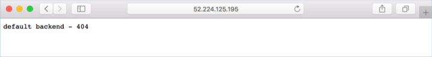

# Deploy an HTTPS ingress controller on Azure Kubernetes Service (AKS)

An ingress controller is a piece of software that provides reverse proxy, configurable traffic routing, and TLS termination for Kubernetes services. Kubernetes ingress resources are used to configure the ingress rules and routes for individual Kubernetes services. Using an ingress controller and ingress rules, a single external address can be used to route traffic to multiple services in a Kubernetes cluster.

This article shows you how to deploy the [NGINX ingress controller][nginx-ingress] in an Azure Kubernetes Service (AKS) cluster. The [cert-manager][cert-manager] project is used to automatically generate and configure [Let's Encrypt][lets-encrypt] certificates. Finally, several applications are run in the AKS cluster, each of which is accessible over a single address.

## Before you begin

This article uses Helm to install the NGINX ingress controller, cert-manager, and a sample web app. You need to have Helm initialized within your AKS cluster and using a service account for Tiller. For more information on configuring and using Helm, see [Install applications with Helm in Azure Kubernetes Service (AKS)][use-helm].

This article also requires that you are running the Azure CLI version 2.0.41 or later. Run `az --version` to find the version. If you need to install or upgrade, see [Install Azure CLI][azure-cli-install].

## Install an ingress controller

Use Helm to install the NGINX ingress controller. For detailed deployment information, see the [NGINX ingress controller documentation][nginx-ingress].

The following example installs the controller in the `kube-system` namespace. You can specify a different namespace for your own environment. If your AKS cluster is not RBAC enabled, add `--set rbac.create=false` to the command.

```console
helm install stable/nginx-ingress --namespace kube-system
```

During the installation, an Azure public IP address is created for the ingress controller. To get the public IP address, use the `kubectl get service` command. It takes a few minutes for the IP address to be assigned to the service.

```
$ kubectl get service -l app=nginx-ingress --namespace kube-system

NAME                                       TYPE           CLUSTER-IP     EXTERNAL-IP     PORT(S)                      AGE
eager-crab-nginx-ingress-controller        LoadBalancer   10.0.182.160   51.145.155.210  80:30920/TCP,443:30426/TCP   20m
eager-crab-nginx-ingress-default-backend   ClusterIP      10.0.255.77    <none>          80/TCP                       20m
```

No ingress rules have been created yet. If you browse to the public IP address, the NGINX ingress controller's default 404 page is displayed, as shown in the following example:



## Configure a DNS name

For the HTTPS certificates to work correctly, configure an FQDN for the ingress controller IP address. Update the following script with the IP address of your ingress controller and a unique name that you would like to use for the FQDN:

```console
#!/bin/bash

# Public IP address of your ingress controller
IP="51.145.155.210"

# Name to associate with public IP address
DNSNAME="demo-aks-ingress"

# Get the resource-id of the public ip
PUBLICIPID=$(az network public-ip list --query "[?ipAddress!=null]|[?contains(ipAddress, '$IP')].[id]" --output tsv)

# Update public ip address with DNS name
az network public-ip update --ids $PUBLICIPID --dns-name $DNSNAME
```

The ingress controller is now accessible through the FQDN.

## Install cert-manager

The NGINX ingress controller supports TLS termination. There are several ways to retrieve and configure certificates for HTTPS. This article demonstrates using [cert-manager][cert-manager], which provides automatic [Lets Encrypt][lets-encrypt] certificate generation and management functionality.

> [!NOTE]
> This article uses the `staging` environment for Let's Encrypt. In production deployments, use `letsencrypt-prod` and `https://acme-v02.api.letsencrypt.org/directory` in the resource definitions and when installing the Helm chart.

To install the cert-manager controller in an RBAC-enabled cluster, use the following `helm install` command:

```console
helm install stable/cert-manager --set ingressShim.defaultIssuerName=letsencrypt-staging --set ingressShim.defaultIssuerKind=ClusterIssuer
```

If your cluster is not RBAC enabled, instead use the following command:

```console
helm install stable/cert-manager \
  --set ingressShim.defaultIssuerName=letsencrypt-staging \
  --set ingressShim.defaultIssuerKind=ClusterIssuer \
  --set rbac.create=false \
  --set serviceAccount.create=false
```

For more information on cert-manager configuration, see the [cert-manager project][cert-manager].

## Create a CA cluster issuer

Before certificates can be issued, cert-manager requires an [Issuer][cert-manager-issuer] or [ClusterIssuer][cert-manager-cluster-issuer] resource. These Kubernetes resources are identical in functionality, however `Issuer` works in a single namespace, and `ClusterIssuer` works across all namespaces. For more information, see the [cert-manager issuer][cert-manager-issuer] documentation.

Create a cluster issuer, such as `cluster-issuer.yaml`, using the following example manifest. Update the email address with a valid address from your organization:

```yaml
apiVersion: certmanager.k8s.io/v1alpha1
kind: ClusterIssuer
metadata:
  name: letsencrypt-staging
spec:
  acme:
    server: https://acme-staging-v02.api.letsencrypt.org/directory
    email: user@contoso.com
    privateKeySecretRef:
      name: letsencrypt-staging
    http01: {}
```

To create the issuer, use the `kubectl create -f cluster-issuer.yaml` command.

```
$ kubectl create -f cluster-issuer.yaml

clusterissuer.certmanager.k8s.io/letsencrypt-prod created
```

## Create a certificate object

Next, a certificate resource must be created. The certificate resource defines the desired X.509 certificate. For more information, see [cert-manager certificates][cert-manager-certificates].

Create the certificate resource, such as `certificates.yaml`, with the following example manifest. Update the *dnsNames* and *domains* to the DNS name you created in a previous step.

```yaml
apiVersion: certmanager.k8s.io/v1alpha1
kind: Certificate
metadata:
  name: tls-secret
spec:
  secretName: tls-secret
  dnsNames:
  - demo-aks-ingress.eastus.cloudapp.azure.com
  acme:
    config:
    - http01:
        ingressClass: nginx
      domains:
      - demo-aks-ingress.eastus.cloudapp.azure.com
  issuerRef:
    name: letsencrypt-staging
    kind: ClusterIssuer
```

To create the certificate resource, use the `kubectl create -f certificates.yaml` command.

```
$ kubectl create -f certificates.yaml

certificate.certmanager.k8s.io/tls-secret created
```

## Run demo applications

An ingress controller and a certificate management solution have been configured. Now let's run two demo applications in your AKS cluster. In this example, Helm is used to deploy two instances of a simple 'Hello world' application.

Before you can install the sample Helm charts, add the Azure samples repository to your Helm environment as follows:

```console
helm repo add azure-samples https://azure-samples.github.io/helm-charts/
```

Create the first demo application from a Helm chart with the following command:

```console
helm install azure-samples/aks-helloworld
```

Now install a second instance of the demo application. For the second instance, you specify a new title so that the two applications are visually distinct. You also specify a unique service name:

```console
helm install azure-samples/aks-helloworld --set title="AKS Ingress Demo" --set serviceName="ingress-demo"
```

## Create an ingress route

Both applications are now running on your Kubernetes cluster, however they're configured with a service of type `ClusterIP`. As such, the applications aren't accessible from the internet. To make them publicly available, create a Kubernetes ingress resource. The ingress resource configures the rules that route traffic to one of the two applications.

In the following example, traffic to the address `https://demo-aks-ingress.eastus.cloudapp.azure.com/` is routed to the service named `aks-helloworld`. Traffic to the address `https://demo-aks-ingress.eastus.cloudapp.azure.com/hello-world-two` is routed to the `ingress-demo` service. Update the *hosts* and *host* to the DNS name you created in a previous step.

Create a file named `hello-world-ingress.yaml` and copy in the following example YAML:

```yaml
apiVersion: extensions/v1beta1
kind: Ingress
metadata:
  name: hello-world-ingress
  annotations:
    kubernetes.io/ingress.class: nginx
    certmanager.k8s.io/cluster-issuer: letsencrypt-staging
    nginx.ingress.kubernetes.io/rewrite-target: /
spec:
  tls:
  - hosts:
    - demo-aks-ingress.eastus.cloudapp.azure.com
    secretName: tls-secret
  rules:
  - host: demo-aks-ingress.eastus.cloudapp.azure.com
    http:
      paths:
      - path: /
        backend:
          serviceName: aks-helloworld
          servicePort: 80
      - path: /hello-world-two
        backend:
          serviceName: ingress-demo
          servicePort: 80
```

Create the ingress resource using the `kubectl create -f hello-world-ingress.yaml` command.

```
$ kubectl create -f hello-world-ingress.yaml

ingress.extensions/hello-world-ingress created
```

## Test the ingress configuration

Open a web browser to the FQDN of your Kubernetes ingress controller, such as *https://demo-aks-ingress.eastus.cloudapp.azure.com*.

As these examples use `letsencrypt-staging`, the issued SSL certificate is not trusted by the browser. Accept the warning prompt to continue to your application. The certificate information shows this *Fake LE Intermediate X1* certificate is issued by Let's Encrypt. This fake certificate indicates `cert-manager` processed the request correctly and received a certificate from the provider:


When you change Let's Encrypt to use `prod` rather than `staging`, a trusted certificate issued by Let's Encrypt is used, as shown in the following example:


The demo application is shown in the web browser:


Now add the */hello-world-two* path to the FQDN, such as *https://demo-aks-ingress.eastus.cloudapp.azure.com/hello-world-two*. The second demo application with the custom title is shown:


## Next steps

This article included some external components to AKS. To learn more about these components, see the following project pages:

- [Helm CLI][helm-cli]
- [NGINX ingress controller][nginx-ingress]
- [cert-manager][cert-manager]

<!-- LINKS - external -->
[helm-cli]: https://docs.microsoft.com/azure/aks/kubernetes-helm#install-helm-cli
[cert-manager]: https://github.com/jetstack/cert-manager
[cert-manager-certificates]: https://cert-manager.readthedocs.io/en/latest/reference/certificates.html
[cert-manager-cluster-issuer]: https://cert-manager.readthedocs.io/en/latest/reference/clusterissuers.html
[cert-manager-issuer]: https://cert-manager.readthedocs.io/en/latest/reference/issuers.html
[lets-encrypt]: https://letsencrypt.org/
[nginx-ingress]: https://github.com/kubernetes/ingress-nginx

<!-- LINKS - internal -->
[use-helm]: kubernetes-helm.md
[azure-cli-install]: /cli/azure/install-azure-cli