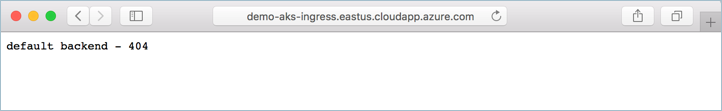

# HTTP load balancing and TLS termination with Ingress

An ingress controller is a piece of software that provides configurable traffic and TLS termination among other capabilities. Using an ingress controller, a single external address can be used to route traffic to multiple Kubernetes services.

This document will walk through a sample deployment of the NGIX ingress controller in an AKS cluster. Dynamic TLS certificate creation and configuration will be provided by kube-lego. 

## Install the ingress controller

First, use Helm to install the NGINX ingress controller. This will provide an out of the box / default configuration for the ingress controller. See the NGINX ingress controller documentation for detailed information. 

```
helm install stable/nginx-ingress
```

An Azure public IP address is also created. This public IP address is used to contact Kubernetes services behind the ingress controller.  

To get the public IP address, use the kubectl get service command. It may take some time for the IP address to be assiged to the service.

```console
$ kubectl get service

NAME                                          TYPE           CLUSTER-IP     EXTERNAL-IP      PORT(S)                      AGE
kubernetes                                    ClusterIP      10.0.0.1       <none>           443/TCP                      3d
toned-spaniel-nginx-ingress-controller        LoadBalancer   10.0.236.223   52.224.125.195   80:30927/TCP,443:31144/TCP   18m
toned-spaniel-nginx-ingress-default-backend   ClusterIP      10.0.5.86      <none>           80/TCP                       18m
```

Becasue no ingress rules have been created, if you browse to the publis IP address, you are routed to the default back end / 404 response.


## Configure DNS name

Now configure a DNS name for the ingress controllers public IP address.

The following sample sets the DNS name on a given public IP address. Update the sample with the IP address of the ingress controller and the DNS name that you would like to use.

```
#!/bin/bash

# Public IP address
IP="52.224.125.195"

# DNS name to associate with public IP address
DNSNAME="demo-aks-ingress"

# Get resource group and public ip name
RESOURCEGROUP=$(az network public-ip list --query "[?contains(ipAddress, '$IP')].[resourceGroup]" --output tsv)
PIPNAME=$(az network public-ip list --query "[?contains(ipAddress, '$IP')].[name]" --output tsv)

# Update public ip address with dns name
az network public-ip update --resource-group $RESOURCEGROUP --name  $PIPNAME --dns-name $DNSNAME
```

Run the following command to retrieve the IP address. Update the IP address value with that of your ingress controller.

```
$ az network public-ip list --query "[?contains(ipAddress, '52.224.125.195')].[dnsSettings.fqdn]" --output tsv

demo-aks-ingress.eastus.cloudapp.azure.com
```

At this point, the ingress controller is accessable through the DNS name. Because an ingress rule or application have been configured, the default back end is returned.



## Install kube-lego

The NGINX ingress controller supports TLS termination. While there are several ways to retrieve and configure certificates for TLS, this document will demonstrate using Kube-Lego. Kube-Lego provides automatic Lets Encrypt certificate generation and management functionality. 

To install the Kube-Lego controller, use the following Helm install command. 

```
helm install --name my-release stable/kube-lego --set config.LEGO_EMAIL=nepeters@microsoft.com --set config.LEGO_URL=https://acme-v01.api.letsencrypt.org/directory
```

## Create ingress route

```
apiVersion: extensions/v1beta1
kind: Ingress
metadata:
  name: kube-aci-demo
  annotations:
    kubernetes.io/tls-acme: "true"
    kubernetes.io/ingress.class: nginx
    ingress.kubernetes.io/ssl-redirect: "true"
spec:
  tls:
  - hosts:
    - demo-aks-ingress.eastus.cloudapp.azure.com
    secretName: tls-secret
  rules:
  - host: demo-aks-ingress.eastus.cloudapp.azure.com
    http:
      paths:
      - path: /
        backend:
          serviceName: kube-aci-demo
          servicePort: 80
```

## Run application

```
apiVersion: extensions/v1beta1
kind: Deployment
metadata:
  labels:
    app: kube-aci-demo
  name: kube-aci-demo
spec:
  replicas: 1
  selector:
    matchLabels:
      app: kube-aci-demo
  template:
    metadata:
      labels:
        app: kube-aci-demo
    spec:
      containers:
      - image: microsoft/aci-helloworld
        name: kube-aci-demo
---
apiVersion: v1
kind: Service
metadata:
  labels:
    app: kube-aci-demo
  name: kube-aci-demo
spec:
  ports:
  - port: 80
    protocol: TCP
    targetPort: 80
  selector:
    app: kube-aci-demo
  sessionAffinity: None
  type: ClusterIP  
```

## Update ingress route

```
apiVersion: extensions/v1beta1
kind: Ingress
metadata:
  name: kube-aci-demo
  annotations:
    kubernetes.io/tls-acme: "true"
    kubernetes.io/ingress.class: nginx
    ingress.kubernetes.io/ssl-redirect: "true"
spec:
  tls:
  - hosts:
    - demo-aks-ingress.eastus.cloudapp.azure.com
    secretName: tls-secret
  rules:
  - host: demo-aks-ingress.eastus.cloudapp.azure.com
    http:
      paths:
      - path: /
        backend:
          serviceName: kube-aci-demo
          servicePort: 80
  - host: demo-aks-ingress.eastus.cloudapp.azure.com
    http:
      paths:
      - path: /azure-vote
        backend:
          serviceName: azure-vote-front
          servicePort: 80
```

## Run second application

```console
$ kubectl create -f https://raw.githubusercontent.com/Azure-Samples/azure-voting-app-redis/master/azure-vote-all-in-one-redis.yaml

deployment "azure-vote-back" created
service "azure-vote-back" created
deployment "azure-vote-front" created
service "azure-vote-front" created
```