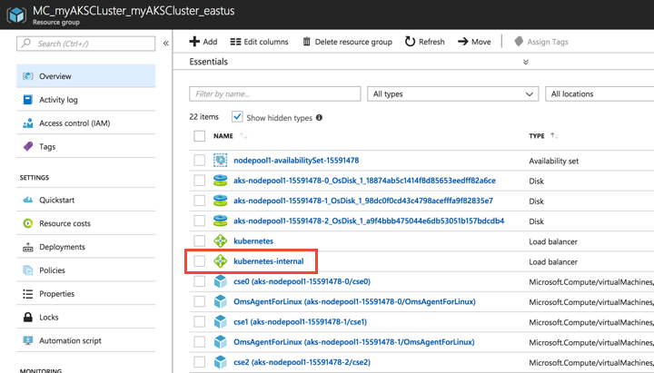

# Use an internal load balancer with Azure Kubernetes Service (AKS)

Internal load balancing makes a Kubernetes service accessible to applications running in the same virtual network as the Kubernetes cluster. This article shows you how to create and use an internal load balancer with Azure Kubernetes Service (AKS). Azure Load Balancer is available in two SKUs: Basic and Standard. AKS uses the Basic SKU.

## Create an internal load balancer

To create an internal load balancer, create a service manifest with the service type *LoadBalancer* and the *azure-load-balancer-internal* annotation as shown in the following example:

```yaml
apiVersion: v1
kind: Service
metadata:
  name: azure-vote-front
  annotations:
    service.beta.kubernetes.io/azure-load-balancer-internal: "true"
spec:
  type: LoadBalancer
  ports:
  - port: 80
  selector:
    app: azure-vote-front
```

Once deployed with `kubetctl apply`, an Azure load balancer is created and made available on the same virtual network as the AKS cluster.



When you view the service details, the IP address in the *EXTERNAL-IP* column is the IP address of the internal load balancer, as shown in the following example:

```
$ kubectl get service azure-vote-front

NAME               TYPE           CLUSTER-IP    EXTERNAL-IP   PORT(S)        AGE
azure-vote-front   LoadBalancer   10.0.248.59   10.240.0.7    80:30555/TCP   10s
```

## Specify an IP address

If you would like to use a specific IP address with the internal load balancer, add the *loadBalancerIP* property to the load balancer spec. The specified IP address must reside in the same subnet as the AKS cluster and must not already be assigned to a resource.

```yaml
apiVersion: v1
kind: Service
metadata:
  name: azure-vote-front
  annotations:
    service.beta.kubernetes.io/azure-load-balancer-internal: "true"
spec:
  type: LoadBalancer
  loadBalancerIP: 10.240.0.25
  ports:
  - port: 80
  selector:
    app: azure-vote-front
```

When you view the service details, the IP address on the *EXTERNAL-IP* reflects the specified IP address:

```
$ kubectl get service azure-vote-front

NAME               TYPE           CLUSTER-IP     EXTERNAL-IP   PORT(S)        AGE
azure-vote-front   LoadBalancer   10.0.184.168   10.240.0.25   80:30225/TCP   4m
```

## Use private networks

When you create your AKS cluster, you can specify advanced networking settings. This approach lets you deploy the cluster into an existing Azure virtual network and subnets. One scenario is to deploy your AKS cluster into a private network connected to your on-premises environment and run services only accessible internally. For more information, see [advanced network configuration in AKS][advanced-networking].

No changes to the previous steps are needed to deploy an internal load balancer in an AKS cluster that uses a private network. The load balancer is created in the same resource group as your AKS cluster but connected to your private virtual network and subnet, as shown in the following example:

```
$ kubectl get service azure-vote-front

NAME               TYPE           CLUSTER-IP    EXTERNAL-IP   PORT(S)        AGE
azure-vote-front   LoadBalancer   10.1.15.188   10.0.0.35     80:31669/TCP   1m
```

> [!NOTE]
> You may need to grant the service principal for your AKS cluster the *Network Contributor* role to the resource group where your Azure virtual network resources are deployed. View the service principal with [az aks show][az-aks-show], such as `az aks show --resource-group myResourceGroup --name myAKSCluster --query "servicePrincipalProfile.clientId"`. To create a role assignment, use the [az role assignment create][az-role-assignment-create] command.

## Specify a different subnet

To specify a subnet for your load balancer, add the *azure-load-balancer-internal-subnet* annotation to your service. The subnet specified must be in the same virtual network as your AKS cluster. When deployed, the load balancer *EXTERNAL-IP* address is part of the specified subnet.

```yaml
apiVersion: v1
kind: Service
metadata:
  name: azure-vote-front
  annotations:
    service.beta.kubernetes.io/azure-load-balancer-internal: "true"
    service.beta.kubernetes.io/azure-load-balancer-internal-subnet: "apps-subnet"
spec:
  type: LoadBalancer
  ports:
  - port: 80
  selector:
    app: azure-vote-front
```

## Delete the load balancer

When all services that use the internal load balancer are deleted, the load balancer itself is also deleted.

## Next steps

Learn more about Kubernetes services at the [Kubernetes services documentation][kubernetes-services].

<!-- LINKS - External -->
[kubernetes-services]: https://kubernetes.io/docs/concepts/services-networking/service/

<!-- LINKS - Internal -->
[advanced-networking]: networking-overview.md
[deploy-advanced-networking]: networking-overview.md#configure-networking---cli
[az-aks-show]: /cli/azure/aks#az-aks-show
[az-role-assignment-create]: /cli/azure/role/assignment#az-role-assignment-create