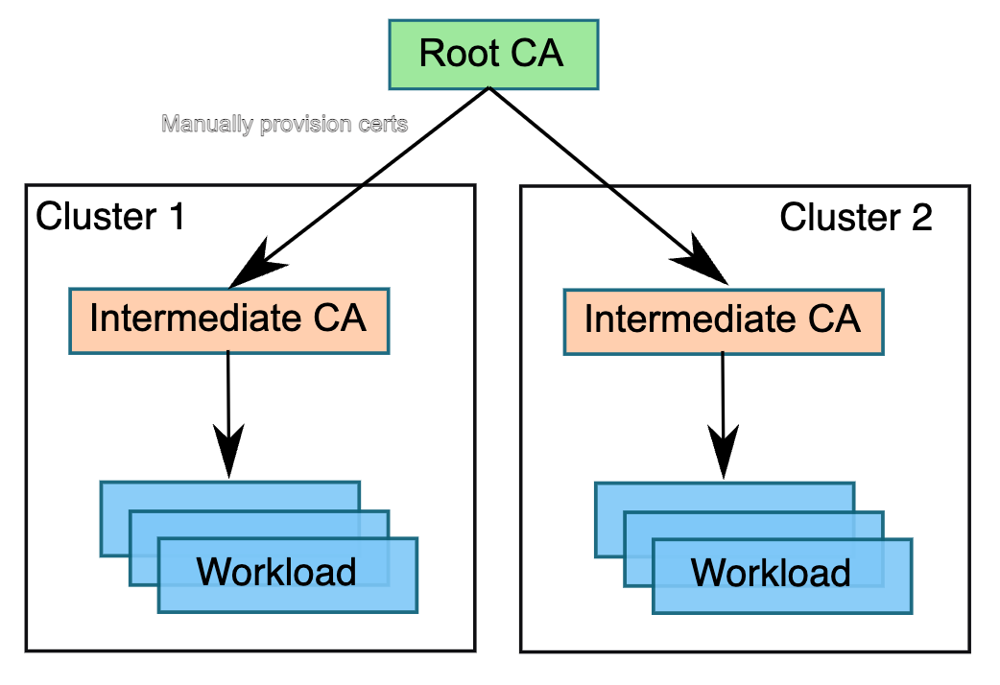

# Plug in CA certificates for Istio-based service mesh add-on on Azure Kubernetes Service

In the Istio-based service mesh addon for Azure Kubernetes Service, by default the Istio certificate authority (CA) generates a self-signed root certificate and key and uses them to sign the workload certificates. To protect the root CA key, you should use a root CA, which runs on a secure machine offline. You can use the root CA to issue intermediate certificates to the Istio CAs that run in each cluster. An Istio CA can sign workload certificates using the administrator-specified certificate and key, and distribute an administrator-specified root certificate to the workloads as the root of trust. This article addresses how to bring your own certificates and keys for Istio CA in the Istio-based service mesh add-on for Azure Kubernetes Service.

[  ](./media/istio/istio-byo-ca.png#lightbox)

This article addresses how you can configure the Istio certificate authority with a root certificate, signing certificate and key provided as inputs using Azure Key Vault to the Istio-based service mesh add-on.

## Before you begin

### Verify Azure CLI version

The add-on requires Azure CLI version 2.57.0 or later installed. You can run `az --version` to verify version. To install or upgrade, see [Install Azure CLI][azure-cli-install].

### Set up Azure Key Vault

1. You need an [Azure Key Vault resource][akv-quickstart] to supply the certificate and key inputs to the Istio add-on.

1. You need to generate root certificate, intermediate certificates, intermediate key, and the certificate chain offline. Steps 1-3 from [here][istio-generate-certs] has an example of how to generate these files.

1. Create secrets in Azure Key Vault using the certificates and key:

    ```bash
    az keyvault secret set --vault-name $AKV_NAME --name root-cert --file <path-to-folder/root-cert.pem>
    az keyvault secret set --vault-name $AKV_NAME --name ca-cert --file <path-to-folder/ca-cert.pem>
    az keyvault secret set --vault-name $AKV_NAME --name ca-key --file <path-to-folder/ca-key.pem>
    az keyvault secret set --vault-name $AKV_NAME --name cert-chain --file <path/cert-chain.pem>
    ```

1. Enable [Azure Key Vault provider for Secret Store CSI Driver for your cluster][akv-addon]:

    ```bash
    az aks enable-addons --addons azure-keyvault-secrets-provider --resource-group $RESOURCE_GROUP --name $CLUSTER
    ```

    > [!NOTE]
    > When rotating certificates, to control how quickly the secrets are synced down to the cluster you can use the `--rotation-poll-interval` parameter of the Azure Key Vault Secrets Provider add-on. For example:
    > `az aks addon update --resource-group $RESOURCE_GROUP --name $CLUSTER --addon azure-keyvault-secrets-provider --enable-secret-rotation --rotation-poll-interval 20s`

1. Authorize the user-assigned managed identity of the add-on to have access to the Azure Key Vault resource:

    ```bash
    OBJECT_ID=$(az aks show --resource-group $RESOURCE_GROUP --name $CLUSTER --query 'addonProfiles.azureKeyvaultSecretsProvider.identity.objectId' -o tsv)

    az keyvault set-policy --name $AKV_NAME --object-id $OBJECT_ID --secret-permissions get list
    ```

    > [!NOTE]
    > If you created your Key Vault with Azure RBAC Authorization for your permission model instead of Vault Access Policy, follow the instructions [here][akv-rbac-guide] to create permissions for the managed identity. Add an Azure role assignment for `Key Vault Reader` for the add-on's user-assigned managed identity. 

## Set up Istio-based service mesh addon with plug-in CA certificates

1. Enable the Istio service mesh addon for your existing AKS cluster while referencing the Azure Key Vault secrets that were created earlier:

    ```bash
    az aks mesh enable --resource-group $RESOURCE_GROUP --name $CLUSTER \
    --root-cert-object-name root-cert \
    --ca-cert-object-name ca-cert \
    --ca-key-object-name ca-key \
    --cert-chain-object-name cert-chain \
    --key-vault-id /subscriptions/$SUBSCRIPTION/resourceGroups/$RESOURCE_GROUP/providers/Microsoft.KeyVault/vaults/$AKV_NAME
    ```

    > [!NOTE]
    > For existing clusters with Istio addon using self-signed root certificate generated by Istio CA, switching to plugin CA is not supported. You need to [disable the mesh][az-aks-mesh-disable] on these clusters first and then enable it again using the above command to pass through the plugin CA inputs.


1. Verify that the `cacerts` gets created on the cluster:

    ```bash
    kubectl get secret -n aks-istio-system
    ```

    Expected output:

    ```bash
    NAME                                                         TYPE                 DATA   AGE
    cacerts                                                      opaque               4      13h
    sh.helm.release.v1.azure-service-mesh-istio-discovery.v380   helm.sh/release.v1   1      2m15s
    sh.helm.release.v1.azure-service-mesh-istio-discovery.v381   helm.sh/release.v1   1      8s    
    ```

1. Verify that the Istio control plane picked up the custom certificate authority:

    ```bash
    kubectl logs deploy/istiod-asm-1-17 -c discovery -n aks-istio-system | grep -v validationController | grep x509
    ```

    Expected output should be similar to:

    ```bash
    2023-11-06T15:49:15.493732Z     info    x509 cert - Issuer: "CN=Intermediate CA - A1,O=Istio,L=cluster-A1", Subject: "", SN: e191d220af347c7e164ec418d75ed19e, NotBefore: "2023-11-06T15:47:15Z", NotAfter: "2033-11-03T15:49:15Z"
    2023-11-06T15:49:15.493764Z     info    x509 cert - Issuer: "CN=Root A,O=Istio", Subject: "CN=Intermediate CA - A1,O=Istio,L=cluster-A1", SN: 885034cba2894f61036f2956fd9d0ed337dc636, NotBefore: "2023-11-04T01:40:02Z", NotAfter: "2033-11-01T01:40:02Z"
    2023-11-06T15:49:15.493795Z     info    x509 cert - Issuer: "CN=Root A,O=Istio", Subject: "CN=Root A,O=Istio", SN: 18e2ee4089c5a7363ec306627d21d9bb212bed3e, NotBefore: "2023-11-04T01:38:27Z", NotAfter: "2033-11-01T01:38:27Z"
    ```

## Certificate authority rotation

You may need to periodically rotate the certificate authorities for security or policy reasons. This section walks you through how to handle intermediate CA and root CA rotation scenarios.

### Intermediate certificate authority rotation

1. You can rotate the intermediate CA while keeping the root CA the same. Update the secrets in Azure Key Vault resource with the new certificate and key files:

    ```bash
    az keyvault secret set --vault-name $AKV_NAME --name root-cert --file <path-to-folder/root-cert.pem>
    az keyvault secret set --vault-name $AKV_NAME --name ca-cert --file <path-to-folder/ca-cert.pem>
    az keyvault secret set --vault-name $AKV_NAME --name ca-key --file <path-to-folder/ca-key.pem>
    az keyvault secret set --vault-name $AKV_NAME --name cert-chain --file <path/cert-chain.pem>
    ```

1. Wait for the time duration of `--rotation-poll-interval`. Check if the `cacerts` secret was refreshed on the cluster based on the new intermediate CA that was updated on the Azure Key Vault resource:

    ```bash
    kubectl logs deploy/istiod-asm-1-17 -c discovery -n aks-istio-system | grep -v validationController
    ```

    Expected output should be similar to:

    ```bash
    2023-11-07T06:16:21.091844Z     info    Update Istiod cacerts
    2023-11-07T06:16:21.091901Z     info    Using istiod file format for signing ca files
    2023-11-07T06:16:21.354423Z     info    Istiod has detected the newly added intermediate CA and updated its key and certs accordingly
    2023-11-07T06:16:21.354910Z     info    x509 cert - Issuer: "CN=Intermediate CA - A2,O=Istio,L=cluster-A2", Subject: "", SN: b2753c6a23b54d8364e780bf664672ce, NotBefore: "2023-11-07T06:14:21Z", NotAfter: "2033-11-04T06:16:21Z"
    2023-11-07T06:16:21.354967Z     info    x509 cert - Issuer: "CN=Root A,O=Istio", Subject: "CN=Intermediate CA - A2,O=Istio,L=cluster-A2", SN: 17f36ace6496ac2df88e15878610a0725bcf8ae9, NotBefore: "2023-11-04T01:40:22Z", NotAfter: "2033-11-01T01:40:22Z"
    2023-11-07T06:16:21.355007Z     info    x509 cert - Issuer: "CN=Root A,O=Istio", Subject: "CN=Root A,O=Istio", SN: 18e2ee4089c5a7363ec306627d21d9bb212bed3e, NotBefore: "2023-11-04T01:38:27Z", NotAfter: "2033-11-01T01:38:27Z"
    2023-11-07T06:16:21.355012Z     info    Istiod certificates are reloaded
    ```

1. The workloads receive certificates from the Istio control plane that are valid for 24 hours by default. If you don't restart the pods, all the workloads obtain new leaf certificates based on the new intermediate CA in 24 hours. If you want to force all these workloads to obtain new leaf certificates right away from the new intermediate CA, then you need to restart the workloads.


    ```bash
    kubectl rollout restart deployment <deployment name> -n <deployment namespace>
    ```

### Root certificate authority rotation

1. You need to update Azure Key Vault secrets with the root certificate file having the concatenation of the old and the new root certificates:

    ```bash
    az keyvault secret set --vault-name $AKV_NAME --name root-cert --file <path-to-folder/root-cert.pem>
    az keyvault secret set --vault-name $AKV_NAME --name ca-cert --file <path-to-folder/ca-cert.pem>
    az keyvault secret set --vault-name $AKV_NAME --name ca-key --file <path-to-folder/ca-key.pem>
    az keyvault secret set --vault-name $AKV_NAME --name cert-chain --file <path/cert-chain.pem>
    ```

    Contents of `root-cert.pem` follow this format:

    ```
    -----BEGIN CERTIFICATE-----
    <contents of old root certificate>
    -----END CERTIFICATE-----
    -----BEGIN CERTIFICATE-----
    <contents of new root certificate>
    -----END CERTIFICATE-----
    ```

    The add-on includes a `CronJob` running every ten minutes on the cluster to check for updates to root certificate. If it detects an update, it restarts the Istio control plane (`istiod` deployment) to pick up the updates. You can check its logs to confirm that the root certificate update was detected and that the Istio control plane was restarted:

    ```bash
    kubectl logs -n aks-istio-system $(kubectl get pods -n aks-istio-system | grep 'istio-cert-validator-cronjob-' | sort -k8 | tail -n 1 | awk '{print $1}')
    ```

    Expected output:

    ```bash
    Root certificate update detected. Restarting deployment...
    deployment.apps/istiod-asm-1-17 restarted
    Deployment istiod-asm-1-17 restarted.
    ```

    After `istiod` was restarted, it should indicate that two certificates were added to the trust domain:

    ```bash
    kubectl logs deploy/istiod-asm-1-17 -c discovery -n aks-istio-system 
    ```

    Expected output:

    ```bash
    2023-11-07T06:42:00.287916Z     info    Using istiod file format for signing ca files
    2023-11-07T06:42:00.287928Z     info    Use plugged-in cert at etc/cacerts/ca-key.pem
    2023-11-07T06:42:00.288254Z     info    x509 cert - Issuer: "CN=Intermediate CA - A2,O=Istio,L=cluster-A2", Subject: "", SN: 286451ca8ff7bf9e6696f56bef829d42, NotBefore: "2023-11-07T06:40:00Z", NotAfter: "2033-11-04T06:42:00Z"
    2023-11-07T06:42:00.288279Z     info    x509 cert - Issuer: "CN=Root A,O=Istio", Subject: "CN=Intermediate CA - A2,O=Istio,L=cluster-A2", SN: 17f36ace6496ac2df88e15878610a0725bcf8ae9, NotBefore: "2023-11-04T01:40:22Z", NotAfter: "2033-11-01T01:40:22Z"
    2023-11-07T06:42:00.288298Z     info    x509 cert - Issuer: "CN=Root A,O=Istio", Subject: "CN=Root A,O=Istio", SN: 18e2ee4089c5a7363ec306627d21d9bb212bed3e, NotBefore: "2023-11-04T01:38:27Z", NotAfter: "2033-11-01T01:38:27Z"
    2023-11-07T06:42:00.288303Z     info    Istiod certificates are reloaded
    2023-11-07T06:42:00.288365Z     info    spiffe  Added 2 certs to trust domain cluster.local in peer cert verifier
    ```

1. You need to either wait for 24 hours (the default time for leaf certificate validity) or force a restart of all the workloads. This way, all workloads recognize both the old and the new certificate authorities for [mTLS verification][istio-mtls-reference].

    ```bash
    kubectl rollout restart deployment <deployment name> -n <deployment namespace>
    ```

1. You can now update Azure Key Vault secrets with only the new CA (without the old CA):

    ```bash
    az keyvault secret set --vault-name $AKV_NAME --name root-cert --file <path-to-folder/root-cert.pem>
    az keyvault secret set --vault-name $AKV_NAME --name ca-cert --file <path-to-folder/ca-cert.pem>
    az keyvault secret set --vault-name $AKV_NAME --name ca-key --file <path-to-folder/ca-key.pem>
    az keyvault secret set --vault-name $AKV_NAME --name cert-chain --file <path/cert-chain.pem>
    ```

    Check the logs of the `CronJob` to confirm detection of root certificate update and the restart of `istiod`:


    ```bash
    kubectl logs -n aks-istio-system $(kubectl get pods -n aks-istio-system | grep 'istio-cert-validator-cronjob-' | sort -k8 | tail -n 1 | awk '{print $1}')
    ```

    Expected output:

    ```bash
    Root certificate update detected. Restarting deployment...
    deployment.apps/istiod-asm-1-17 restarted
    Deployment istiod-asm-1-17 restarted.
    ```

    After `istiod` was updated, it should only confirm the usage of new root CA:

    ```bash
    kubectl logs deploy/istiod-asm-1-17 -c discovery -n aks-istio-system | grep -v validationController
    ```

    Expected output:

    ```bash
    2023-11-07T08:01:17.780299Z     info    x509 cert - Issuer: "CN=Intermediate CA - B1,O=Istio,L=cluster-B1", Subject: "", SN: 1159747c72cc7ac7a54880cd49b8df0a, NotBefore: "2023-11-07T07:59:17Z", NotAfter: "2033-11-04T08:01:17Z"
    2023-11-07T08:01:17.780330Z     info    x509 cert - Issuer: "CN=Root B,O=Istio", Subject: "CN=Intermediate CA - B1,O=Istio,L=cluster-B1", SN: 2aba0c438652a1f9beae4249457023013948c7e2, NotBefore: "2023-11-04T01:42:12Z", NotAfter: "2033-11-01T01:42:12Z"
    2023-11-07T08:01:17.780345Z     info    x509 cert - Issuer: "CN=Root B,O=Istio", Subject: "CN=Root B,O=Istio", SN: 3f9da6ddc4cb03749c3f43243a4b701ce5eb4e96, NotBefore: "2023-11-04T01:41:54Z", NotAfter: "2033-11-01T01:41:54Z"
    ```

    From the example outputs shown in this article, you can observe that we moved from Root A (used when enabling the addon) to Root B.


1. You can either again wait for 24 hours or force a restart of all the workloads. Forcing a restart makes the workloads obtain new leaf certificates from the new root CA immediately.

    ```bash
    kubectl rollout restart deployment <deployment name> -n <deployment namespace>
    ```

[akv-quickstart]: ../key-vault/general/quick-create-cli.md
[akv-addon]: ./csi-secrets-store-driver.md
[akv-rbac-guide]: ../key-vault/general/rbac-guide.md
[install-azure-cli]: /cli/azure/install-azure-cli
[az-feature-register]: /cli/azure/feature#az-feature-register
[az-feature-show]: /cli/azure/feature#az-feature-show
[az-provider-register]: /cli/azure/provider#az-provider-register
[az-aks-mesh-disable]: /cli/azure/aks/mesh#az-aks-mesh-disable
[istio-generate-certs]: https://istio.io/latest/docs/tasks/security/cert-management/plugin-ca-cert/#plug-in-certificates-and-key-into-the-cluster
[istio-mtls-reference]: https://istio.io/latest/docs/concepts/security/#mutual-tls-authentication

