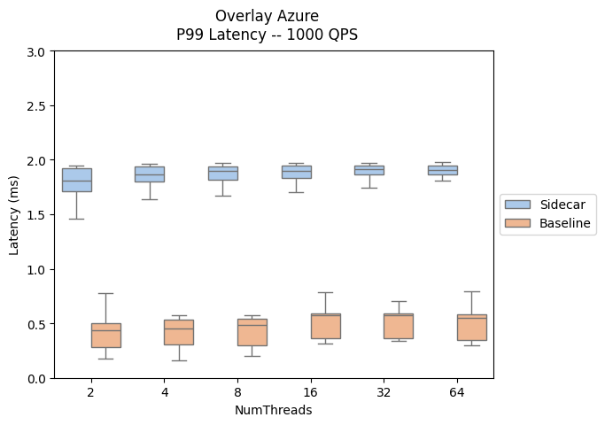
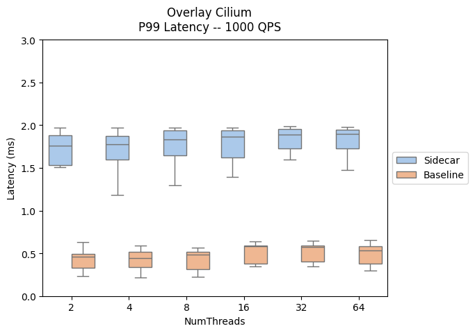
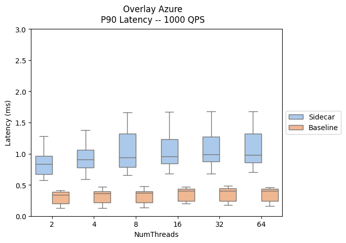
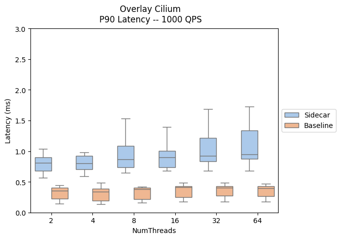

# Istio service mesh add-on performance
The Istio-based service mesh add-on is logically split into a control plane (`istiod`) and a data plane. The data plane is composed of Envoy sidecar proxies inside workload pods. Istiod manages and configures these Envoy proxies. This article presents the performance of both the control and data plane for revision asm-1-19, including resource consumption, sidecar capacity, and latency overhead. Additionally, it provides suggestions for addressing potential strain on resources during periods of heavy load. 

## Control plane performance
[Istiod’s CPU and memory requirements][control-plane-performance] correlate with the rate of deployment and configuration changes and the number of proxies connected. The scenarios tested were:

- Pod churn: examines the impact of pod churning on `istiod`. To reduce variables, only one service is used for all sidecars. 
- Multiple services: examines the impact of multiple services on the maximum sidecars Istiod can manage (sidecar capacity), where each service has `N` sidecars, totaling the overall maximum.

#### Test specifications
- One `istiod` instance with default settings
- Horizontal pod autoscaling disabled
- Tested with two network plugins: Azure CNI Overlay and Azure CNI Overlay with Cilium [ (recommended network plugins for large scale clusters) ](/azure/aks/azure-cni-overlay?tabs=kubectl#choosing-a-network-model-to-use)
- Node SKU: Standard D16 v3 (16 vCPU, 64-GB memory)
- Kubernetes version: 1.28.5
- Istio revision: asm-1-19

### Pod churn
The [ClusterLoader2 framework][clusterloader2] was used to determine the maximum number of sidecars Istiod can manage when there's sidecar churning. The churn percent is defined as the percent of sidecars churned down/up during the test. For example, 50% churn for 10,000 sidecars would mean that 5,000 sidecars were churned down, then 5,000 sidecars were churned up. The churn percents tested were determined from the typical churn percentage during deployment rollouts (`maxUnavailable`). The churn rate was calculated by determining the total number of sidecars churned (up and down) over the actual time taken to complete the churning process.

#### Sidecar capacity and Istiod CPU and memory

**Azure CNI overlay**

|   Churn (%) | Churn Rate (sidecars/sec)   |   Sidecar Capacity |   Istiod Memory (GB) |   Istiod CPU |
|-------------|-----------------------------|--------------------|----------------------|--------------|
|           0 | --                          |              25000 |                 32.1 |           15 |
|          25 | 31.2                        |              15000 |                 22.2 |           15 |
|          50 | 31.2                        |              15000 |                 25.4 |           15 |

**Azure CNI overlay with Cilium**

|   Churn (%) | Churn Rate (sidecars/sec)   |   Sidecar Capacity |   Istiod Memory (GB) |   Istiod CPU |
|-------------|-----------------------------|--------------------|----------------------|--------------|
|           0 |--                           |              30000 |                 41.2 |           15 |
|          25 | 41.7                        |              25000 |                 36.1 |           16 |
|          50 | 37.9                        |              25000 |                 42.7 |           16 |

### Multiple services
The [ClusterLoader2 framework][clusterloader2] was used to determine the maximum number of sidecars `istiod` can manage with 1,000 services. The results can be compared to the 0% churn test (one service) in the pod churn scenario. Each service had `N` sidecars contributing to the overall maximum sidecar count. The API Server resource usage was observed to determine if there was any significant stress from the add-on.

**Sidecar capacity**

|   Azure CNI Overlay |   Azure CNI Overlay with Cilium |
|---------------------|---------------------------------|
|               20000 |                           20000 |

**CPU and memory**

| Resource               | Azure CNI Overlay  |   Azure CNI Overlay with Cilium |
|------------------------|--------------------|---------------------------------|
| API Server Memory (GB) |        38.9        |               9.7               |
| API Server CPU         |         6.1        |               4.7               |
| Istiod Memory (GB)     |        40.4        |              42.6               |
| Istiod CPU             |         15         |                16               |

## Data plane performance
Various factors impact [sidecar performance][data-plane-performance] such as request size, number of proxy worker threads, and number of client connections. Additionally, any request flowing through the mesh traverses the client-side proxy and then the server-side proxy. Therefore, latency and resource consumption are measured to determine the data plane performance.

[Fortio][fortio] was used to create the load. The test was conducted with the [Istio benchmark repository][istio-benchmark] that was modified for use with the add-on.

#### Test specifications
- Tested with two network plugins: Azure CNI Overlay and Azure CNI Overlay with Cilium [ (recommended network plugins for large scale clusters) ](/azure/aks/azure-cni-overlay?tabs=kubectl#choosing-a-network-model-to-use)
- Node SKU: Standard D16 v5 (16 vCPU, 64-GB memory)
- Kubernetes version: 1.28.5
- Two proxy workers
- 1-KB payload
- 1000 QPS at varying client connections
- `http/1.1` protocol and mutual TLS enabled
- 26 data points collected

#### CPU and memory
The memory and CPU usage for both the client and server proxy for 16 client connections and 1000 QPS across all network plugin scenarios is roughly 0.4 vCPU and 72 MB. 

#### Latency
The sidecar Envoy proxy collects raw telemetry data after responding to a client, which doesn't directly affect the request's total processing time. However, this process delays the start of handling the next request, contributing to queue wait times and influencing average and tail latencies. Depending on the traffic pattern, the actual tail latency varies. 

The following evaluates the impact of adding sidecar proxies to the data path, showcasing the P90 and P99 latency.

| Azure CNI Overlay |Azure CNI Overlay with Cilium |
|:-------------------------:|:-------------------------:|
 |  
  |  

## Service entry
Istio's ServiceEntry custom resource definition enables adding other services into the Istio’s internal service registry. A [ServiceEntry][serviceentry] allows services already in the mesh to route or access the services specified. However, the configuration of multiple ServiceEntries with the `resolution` field set to DNS can cause a [heavy load on DNS servers][understanding-dns]. The following suggestions can help reduce the load:

- Switch to `resolution: NONE` to avoid proxy DNS lookups entirely. Suitable for most use cases.
- Increase TTL (Time To Live) if you control the domains being resolved.
- Limit the ServiceEntry scope with `exportTo`.

[control-plane-performance]: https://istio.io/latest/docs/ops/deployment/performance-and-scalability/#control-plane-performance
[data-plane-performance]: https://istio.io/latest/docs/ops/deployment/performance-and-scalability/#data-plane-performance
[clusterloader2]: https://github.com/kubernetes/perf-tests/tree/master/clusterloader2#clusterloader
[fortio]: https://fortio.org/
[istio-benchmark]: https://github.com/istio/tools/tree/master/perf/benchmark#istio-performance-benchmarking
[serviceentry]: https://istio.io/latest/docs/reference/config/networking/service-entry/
[understanding-dns]: https://preliminary.istio.io/latest/docs/ops/configuration/traffic-management/dns/#proxy-dns-resolution
