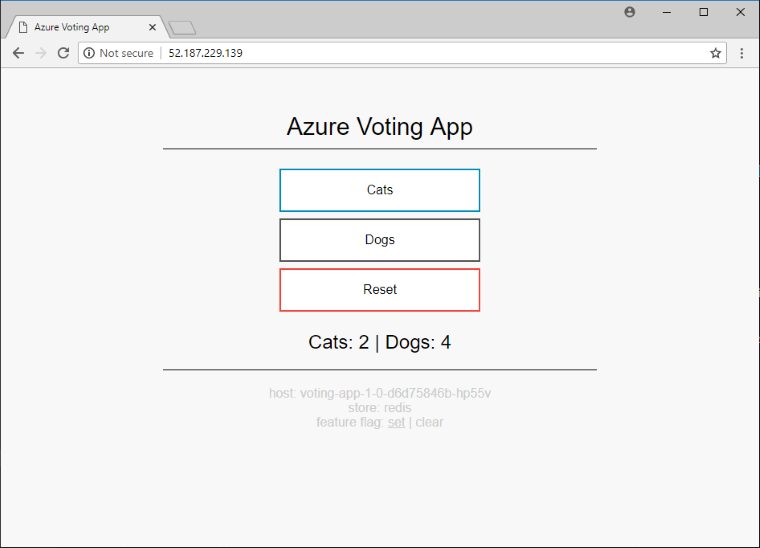
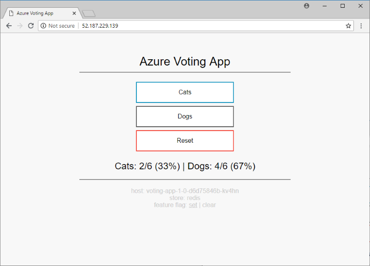
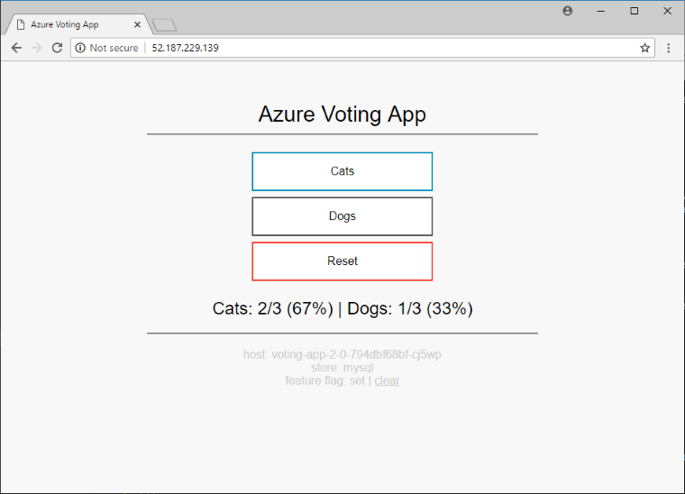

# Use intelligent routing and canary releases with Istio in Azure Kubernetes Service (AKS)

[Istio][istio-github] is an open-source service mesh that provides a key set of functionality across the microservices in a Kubernetes cluster. These features include traffic management, service identity and security, policy enforcement, and observability. For more information about Istio, see the official [What is Istio?][istio-docs-concepts] documentation.

This article shows you how to use the traffic management functionality of Istio. A sample AKS voting app is used to explore intelligent routing and canary releases.

In this article, you learn how to:

> [!div class="checklist"]
> * Deploy the application
> * Update the application
> * Roll out a canary release of the application
> * Finalize the rollout

## Before you begin

> [!NOTE]
> This scenario has been tested against Istio version `1.1.3`.

The steps detailed in this article assume you've created an AKS cluster (Kubernetes `1.11` and above, with RBAC enabled) and have established a `kubectl` connection with the cluster. You'll also need Istio installed in your cluster.

If you need help with any of these items, then see the [AKS quickstart][aks-quickstart] and [Install Istio in AKS][istio-install] guidance.

## About this application scenario

The sample AKS voting app provides two voting options (**Cats** or **Dogs**) to users. There is a storage component that persists the number of votes for each option. Additionally, there is an analytics component that provides details around the votes cast for each option.

In this application scenario, you start by deploying version `1.0` of the voting app and version `1.0` of the analytics component. The analytics component provides simple counts for the number of votes. The voting app and analytics component interact with version `1.0` of the storage component, which is backed by Redis.

You upgrade the analytics component to version `1.1`, which provides counts, and now totals and percentages.

A subset of users test version `2.0` of the app via a canary release. This new version uses a storage component that is backed by a MySQL database.

Once you're confident that version `2.0` works as expected on your subset of users, you roll out version `2.0` to all your users.

## Deploy the application

Let's start by deploying the application into your Azure Kubernetes Service (AKS) cluster. The following diagram shows what runs by the end of this section - version `1.0` of all components with inbound requests serviced via the Istio ingress gateway:


The artifacts you need to follow along with this article are available in the [Azure-Samples/aks-voting-app][github-azure-sample] GitHub repo. You can either download the artifacts or clone the repo as follows:

```console
git clone https://github.com/Azure-Samples/aks-voting-app.git
```

Change to the following folder in the downloaded / cloned repo and run all subsequent steps from this folder:

```console
cd scenarios/intelligent-routing-with-istio
```

First, create a namespace in your AKS cluster for the sample AKS voting app named `voting` as follows:

```azurecli
kubectl create namespace voting
```

Label the namespace with `istio-injection=enabled`. This label instructs Istio to automatically inject the istio-proxies as sidecars into all of your pods in this namespace.

```azurecli
kubectl label namespace voting istio-injection=enabled
```

Now let's create the components for the AKS Voting app. Create these components in the `voting` namespace created in a previous step.

```azurecli
kubectl apply -f kubernetes/step-1-create-voting-app.yaml --namespace voting
```

The following example output shows the resources being created:

```console
deployment.apps/voting-storage-1-0 created
service/voting-storage created
deployment.apps/voting-analytics-1-0 created
service/voting-analytics created
deployment.apps/voting-app-1-0 created
service/voting-app created
```

> [!NOTE]
> Istio has some specific requirements around pods and services. For more information, see the [Istio Requirements for Pods and Services documentation][istio-requirements-pods-and-services].

To see the pods that have been created, use the [kubectl get pods][kubectl-get] command as follows:

```azurecli
kubectl get pods -n voting
```

The following example output shows there are three instances of the `voting-app` pod and a single instance of both the `voting-analytics` and `voting-storage` pods. Each of the pods has two containers. One of these containers is the component, and the other is the `istio-proxy`:

```console
NAME                                    READY     STATUS    RESTARTS   AGE
voting-analytics-1-0-57c7fccb44-ng7dl   2/2       Running   0          39s
voting-app-1-0-956756fd-d5w7z           2/2       Running   0          39s
voting-app-1-0-956756fd-f6h69           2/2       Running   0          39s
voting-app-1-0-956756fd-wsxvt           2/2       Running   0          39s
voting-storage-1-0-5d8fcc89c4-2jhms     2/2       Running   0          39s
```

To see information about the pod, use the [kubectl describe pod][kubectl-describe]. Replace the pod name with the name of a pod in your own AKS cluster from the previous output:

```azurecli
kubectl describe pod voting-app-1-0-956756fd-d5w7z --namespace voting
```

The `istio-proxy` container has automatically been injected by Istio to manage the network traffic to and from your components, as shown in the following example output:

```
[...]
Containers:
  voting-app:
    Image:         mcr.microsoft.com/aks/samples/voting/app:1.0
    ...
  istio-proxy:
    Image:         docker.io/istio/proxyv2:1.1.3
[...]
```

You can't connect to the voting app until you create the Istio [Gateway][istio-reference-gateway] and [Virtual Service][istio-reference-virtualservice]. These Istio resources route traffic from the default Istio ingress gateway to our application.

> [!NOTE]
> A **Gateway** is a component at the edge of the service mesh that receives inbound or outbound HTTP and TCP traffic.
> 
> A **Virtual Service** defines a set of routing rules for one or more destination services.

Use the `kubectl apply` command to deploy the Gateway and Virtual Service yaml. Remember to specify the namespace that these resources are deployed into.

```azurecli
kubectl apply -f istio/step-1-create-voting-app-gateway.yaml --namespace voting
```

The following example output shows the new Gateway and Virtual Service being created:

```console
virtualservice.networking.istio.io/voting-app created
gateway.networking.istio.io/voting-app-gateway created
```

Obtain the IP address of the Istio Ingress Gateway using the following command:

```azurecli
kubectl get service istio-ingressgateway --namespace istio-system -o jsonpath='{.status.loadBalancer.ingress[0].ip}'
```

The following example output shows the IP address of the Ingress Gateway:

```
20.188.211.19
```

Open up a browser and paste in the IP address. The sample AKS voting app is displayed.



The information at the bottom of the screen shows that the app uses version `1.0` of `voting-app` and version `1.0` of `voting-storage` (Redis).

## Update the application

We let's deploy a new version of the analytics component. This new version `1.1` displays totals and percentages in addition to the count for each category.

The following diagram shows what will be running at the end of this section - only version `1.1` of our `voting-analytics` component has traffic routed from the `voting-app` component. Even though version `1.0` of our `voting-analytics` component continues to run and is referenced by the `voting-analytics` service, the Istio proxies disallow traffic to and from it.


Let's deploy version `1.1` of the `voting-analytics` component. Create this component in the `voting` namespace:

```console
kubectl apply -f kubernetes/step-2-update-voting-analytics-to-1.1.yaml --namespace voting
```

The following example output shows the resources being created:

```console
deployment.apps/voting-analytics-1-1 created
```

Open the sample AKS voting app in a browser again, using the IP address of the Istio Ingress Gateway obtained in the previous step.

Your browser alternates between the two views shown below. Since you are using a Kubernetes [Service][kubernetes-service] for the `voting-analytics` component with only a single label selector (`app: voting-analytics`), Kubernetes uses the default behavior of round-robin between the pods that match that selector. In this case, it is both version `1.0` and `1.1` of your `voting-analytics` pods.




You can visualize the switching between the two versions of the `voting-analytics` component as follows. Remember to use the IP address of your own Istio Ingress Gateway.

Bash 

```bash
INGRESS_IP=20.188.211.19
for i in {1..5}; do curl -si $INGRESS_IP | grep results; done
```

Powershell

```powershell
$INGRESS_IP="20.188.211.19"
(1..5) |% { (Invoke-WebRequest -Uri $INGRESS_IP).Content.Split("`n") | Select-String -Pattern "results" }
```

The following example output shows the relevant part of the returned web site as the site switches between versions:

```
  <div id="results"> Cats: 2 | Dogs: 4 </div>
  <div id="results"> Cats: 2 | Dogs: 4 </div>
  <div id="results"> Cats: 2/6 (33%) | Dogs: 4/6 (67%) </div>
  <div id="results"> Cats: 2 | Dogs: 4 </div>
  <div id="results"> Cats: 2/6 (33%) | Dogs: 4/6 (67%) </div>
```

### Lock down traffic to version 1.1 of the application

Now let's lock down traffic to only version `1.1` of the `voting-analytics` component and to version `1.0` of the `voting-storage` component. You then define routing rules for all of the other components.

> * A **Virtual Service** defines a set of routing rules for one or more destination services.
> * A **Destination Rule** defines traffic policies and version specific policies.
> * A **Policy** defines what authentication methods can be accepted on workload(s).

Use the `kubectl apply` command to replace the Virtual Service definition on your `voting-app` and add [Destination Rules][istio-reference-destinationrule] and [Virtual Services][istio-reference-virtualservice] for the other components. You will  add a [Policy][istio-reference-policy] to the `voting` namespace to ensure that all communicate between services is secured using mutual TLS and client certificates.

* The Policy has `peers.mtls.mode` set to `STRICT` to ensure that mutual TLS is enforced between your services within the `voting` namespace.
* We also set the `trafficPolicy.tls.mode` to `ISTIO_MUTUAL` in all our Destination Rules. Istio provides services with strong identities and secures communications between services using mutual TLS and client certificates that Istio transparently manages.

```azurecli
kubectl apply -f istio/step-2-update-and-add-routing-for-all-components.yaml --namespace voting
```

The following example output shows the new Policy, Destination Rules, and Virtual Services being updated/created:

```console
virtualservice.networking.istio.io/voting-app configured
policy.authentication.istio.io/default created
destinationrule.networking.istio.io/voting-app created
destinationrule.networking.istio.io/voting-analytics created
virtualservice.networking.istio.io/voting-analytics created
destinationrule.networking.istio.io/voting-storage created
virtualservice.networking.istio.io/voting-storage created
```

If you open the AKS Voting app in a browser again, only the new version `1.1` of the `voting-analytics` component is used by the `voting-app` component.


You can visualize that you are now only routed to version `1.1` of your `voting-analytics` component as follows. Remember to use the IP address of your own Istio Ingress Gateway:

Bash 

```bash
INGRESS_IP=20.188.211.19
for i in {1..5}; do curl -si $INGRESS_IP | grep results; done
```

Powershell

```powershell
$INGRESS_IP="20.188.211.19"
(1..5) |% { (Invoke-WebRequest -Uri $INGRESS_IP).Content.Split("`n") | Select-String -Pattern "results" }
```

The following example output shows the relevant part of the returned web site:

```
  <div id="results"> Cats: 2/6 (33%) | Dogs: 4/6 (67%) </div>
  <div id="results"> Cats: 2/6 (33%) | Dogs: 4/6 (67%) </div>
  <div id="results"> Cats: 2/6 (33%) | Dogs: 4/6 (67%) </div>
  <div id="results"> Cats: 2/6 (33%) | Dogs: 4/6 (67%) </div>
  <div id="results"> Cats: 2/6 (33%) | Dogs: 4/6 (67%) </div>
```

Let's now confirm that Istio is using mutual TLS to secure communications between each of our services. For this we will use the [authn tls-check][istioctl-authn-tls-check] command on the `istioctl` client binary, which takes the following form.

```console
istioctl authn tls-check <pod-name[.namespace]> [<service>]
```

This set of commands provide information about the access to the specified services, from all pods that are in a namespace and match a set of labels:

Bash

```bash
# mTLS configuration between each of the istio ingress pods and the voting-app service
kubectl get pod -n istio-system -l app=istio-ingressgateway | grep Running | cut -d ' ' -f1 | xargs -n1 -I{} istioctl authn tls-check {}.istio-system voting-app.voting.svc.cluster.local

# mTLS configuration between each of the voting-app pods and the voting-analytics service
kubectl get pod -n voting -l app=voting-app | grep Running | cut -d ' ' -f1 | xargs -n1 -I{} istioctl authn tls-check {}.voting voting-analytics.voting.svc.cluster.local

# mTLS configuration between each of the voting-app pods and the voting-storage service
kubectl get pod -n voting -l app=voting-app | grep Running | cut -d ' ' -f1 | xargs -n1 -I{} istioctl authn tls-check {}.voting voting-storage.voting.svc.cluster.local

# mTLS configuration between each of the voting-analytics version 1.1 pods and the voting-storage service
kubectl get pod -n voting -l app=voting-analytics,version=1.1 | grep Running | cut -d ' ' -f1 | xargs -n1 -I{} istioctl authn tls-check {}.voting voting-storage.voting.svc.cluster.local
```

Powershell

```powershell
# mTLS configuration between each of the istio ingress pods and the voting-app service
(kubectl get pod -n istio-system -l app=istio-ingressgateway | Select-String -Pattern "Running").Line |% { $_.Split()[0] |% { istioctl authn tls-check $($_ + ".istio-system") voting-app.voting.svc.cluster.local } }

# mTLS configuration between each of the voting-app pods and the voting-analytics service
(kubectl get pod -n voting -l app=voting-app | Select-String -Pattern "Running").Line |% { $_.Split()[0] |% { istioctl authn tls-check $($_ + ".voting") voting-analytics.voting.svc.cluster.local } }

# mTLS configuration between each of the voting-app pods and the voting-storage service
(kubectl get pod -n voting -l app=voting-app | Select-String -Pattern "Running").Line |% { $_.Split()[0] |% { istioctl authn tls-check $($_ + ".voting") voting-storage.voting.svc.cluster.local } }

# mTLS configuration between each of the voting-analytics version 1.1 pods and the voting-storage service
(kubectl get pod -n voting -l app=voting-analytics,version=1.1 | Select-String -Pattern "Running").Line |% { $_.Split()[0] |% { istioctl authn tls-check $($_ + ".voting") voting-storage.voting.svc.cluster.local } }
```

This following example output shows that mutual TLS is enforced for each of our queries above. The output also shows the Policy and Destination Rules that enforces the mutual TLS:

```console
# mTLS configuration between istio ingress pods and the voting-app service
HOST:PORT                                    STATUS     SERVER     CLIENT     AUTHN POLICY       DESTINATION RULE
voting-app.voting.svc.cluster.local:8080     OK         mTLS       mTLS       default/voting     voting-app/voting

# mTLS configuration between each of the voting-app pods and the voting-analytics service
HOST:PORT                                          STATUS     SERVER     CLIENT     AUTHN POLICY       DESTINATION RULE
voting-analytics.voting.svc.cluster.local:8080     OK         mTLS       mTLS       default/voting     voting-analytics/voting
HOST:PORT                                          STATUS     SERVER     CLIENT     AUTHN POLICY       DESTINATION RULE
voting-analytics.voting.svc.cluster.local:8080     OK         mTLS       mTLS       default/voting     voting-analytics/voting
HOST:PORT                                          STATUS     SERVER     CLIENT     AUTHN POLICY       DESTINATION RULE
voting-analytics.voting.svc.cluster.local:8080     OK         mTLS       mTLS       default/voting     voting-analytics/voting

# mTLS configuration between each of the voting-app pods and the voting-storage service
HOST:PORT                                        STATUS     SERVER     CLIENT     AUTHN POLICY       DESTINATION RULE
voting-storage.voting.svc.cluster.local:6379     OK         mTLS       mTLS       default/voting     voting-storage/voting
HOST:PORT                                        STATUS     SERVER     CLIENT     AUTHN POLICY       DESTINATION RULE
voting-storage.voting.svc.cluster.local:6379     OK         mTLS       mTLS       default/voting     voting-storage/voting
HOST:PORT                                        STATUS     SERVER     CLIENT     AUTHN POLICY       DESTINATION RULE
voting-storage.voting.svc.cluster.local:6379     OK         mTLS       mTLS       default/voting     voting-storage/voting

# mTLS configuration between each of the voting-analytics version 1.1 pods and the voting-storage service
HOST:PORT                                        STATUS     SERVER     CLIENT     AUTHN POLICY       DESTINATION RULE
voting-storage.voting.svc.cluster.local:6379     OK         mTLS       mTLS       default/voting     voting-storage/voting
```

## Roll out a canary release of the application

Now let's deploy a new version `2.0` of the `voting-app`, `voting-analytics`, and `voting-storage` components. The new `voting-storage` component use MySQL instead of Redis, and the `voting-app` and `voting-analytics` components are updated to allow them to use this new `voting-storage` component.

The `voting-app` component now supports feature flag functionality. This feature flag allows you to test the canary release capability of Istio for a subset of users.

The following diagram shows what you will have running at the end of this section.

* Version `1.0` of the `voting-app` component, version `1.1` of the `voting-analytics` component and version `1.0` of the `voting-storage` component are able to communicate with each other.
* Version `2.0` of the `voting-app` component, version `2.0` of the `voting-analytics` component and version `2.0` of the `voting-storage` component are able to communicate with each other.
* Version `2.0` of the `voting-app` component are only accessible to users that have a specific feature flag set. This change is managed using a feature flag via a cookie.


First, update the Istio Destination Rules and Virtual Services to cater for these new components. These updates ensure that you don't route traffic incorrectly to the new components and users don't get unexpected access:

```azurecli
kubectl apply -f istio/step-3-add-routing-for-2.0-components.yaml --namespace voting
```

The following example output shows the Destination Rules and Virtual Services being updated:

```console
destinationrule.networking.istio.io/voting-app configured
virtualservice.networking.istio.io/voting-app configured
destinationrule.networking.istio.io/voting-analytics configured
virtualservice.networking.istio.io/voting-analytics configured
destinationrule.networking.istio.io/voting-storage configured
virtualservice.networking.istio.io/voting-storage configured
```

Next, let's add the Kubernetes objects for the new version `2.0` components. You also update the `voting-storage` service to include the `3306` port for MySQL:

```azurecli
kubectl apply -f kubernetes/step-3-update-voting-app-with-new-storage.yaml --namespace voting
```

The following example output shows the Kubernetes objects are successfully updated or created:

```console
service/voting-storage configured
secret/voting-storage-secret created
deployment.apps/voting-storage-2-0 created
persistentvolumeclaim/mysql-pv-claim created
deployment.apps/voting-analytics-2-0 created
deployment.apps/voting-app-2-0 created
```

Wait until all the version `2.0` pods are running. Use the [kubectl get pods][kubectl-get] command to view all pods in the `voting` namespace:

```azurecli
kubectl get pods --namespace voting
```

You should now be able to switch between the version `1.0` and version `2.0` (canary) of the voting application. The feature flag toggle at the bottom of the screen sets a cookie. This cookie is used by the `voting-app` Virtual Service to route users to the new version `2.0`.




The vote counts are different between the versions of the app. This difference highlights that you are using two different storage backends.

## Finalize the rollout

Once you've successfully tested the canary release, update the `voting-app` Virtual Service to route all traffic to version `2.0` of the `voting-app` component. All users then see version `2.0` of the application, regardless of whether the feature flag is set or not:


Update all the Destination Rules to remove the versions of the components you no longer want active. Then, update all the Virtual Services to stop referencing those versions.

Since there's no longer any traffic to any of the older versions of the components, you can now safely delete all the deployments for those components.


You have now successfully rolled out a new version of the AKS Voting App.

## Clean up 

You can remove the AKS voting app we used in this scenario from your AKS cluster by deleting the `voting` namespace as follows:

```azurecli
kubectl delete namespace voting
```

The following example output shows that all the components of the AKS voting app have been removed from your AKS cluster.

```console
namespace "voting" deleted
```

## Next steps

You can explore additional scenarios using the [Istio Bookinfo Application example][istio-bookinfo-example].

<!-- LINKS - external -->
[github-azure-sample]: https://github.com/Azure-Samples/aks-voting-app
[istio-github]: https://github.com/istio/istio

[istio]: https://istio.io
[istio-docs-concepts]: https://istio.io/docs/concepts/what-is-istio/
[istio-requirements-pods-and-services]: https://istio.io/docs/setup/kubernetes/prepare/requirements/
[istio-reference-gateway]: https://istio.io/docs/reference/config/networking/v1alpha3/gateway/
[istio-reference-policy]: https://istio.io/docs/reference/config/istio.authentication.v1alpha1/#Policy
[istio-reference-virtualservice]: https://istio.io/docs/reference/config/networking/v1alpha3/virtual-service/
[istio-reference-destinationrule]: https://istio.io/docs/reference/config/networking/v1alpha3/destination-rule/
[istio-bookinfo-example]: https://istio.io/docs/examples/bookinfo/
[istioctl-authn-tls-check]: https://istio.io/docs/reference/commands/istioctl/#istioctl-authn-tls-check

[kubernetes-service]: https://kubernetes.io/docs/concepts/services-networking/service/
[kubectl-get]: https://kubernetes.io/docs/reference/generated/kubectl/kubectl-commands#get
[kubectl-describe]: https://kubernetes.io/docs/reference/generated/kubectl/kubectl-commands#describe

<!-- LINKS - internal -->
[aks-quickstart]: ./kubernetes-walkthrough.md
[istio-install]: ./istio-install.md
