# Continuous deployment with Jenkins and Azure Kubernetes Service

This document demonstrates how to set up a basic continuous deployment workflow between Jenkins and an Azure Kubernetes Service (AKS) cluster.

The example workflow includes the following steps:

> [!div class="checklist"]
> * Deploy the Azure vote application to your Kubernetes cluster.
> * Update the Azure vote application code and push to a GitHub repository, which starts the continuous deployment process.
> * Jenkins clones the repository, and builds a new container image with the updated code.
> * This image is pushed to Azure Container Registry (ACR).
> * The application running in the AKS cluster is updated with the new container image.

## Prerequisites

You need the following items in order to complete the steps in this article.

- Basic understanding of Kubernetes, Git, CI/CD, and Azure Container Registry (ACR).
- An [Azure Kubernetes Service (AKS) cluster][aks-quickstart] and [AKS credentials configured][aks-credentials] on your development system.
- An [Azure Container Registry (ACR) registry][acr-quickstart], the ACR login server name, and [ACR credentials][acr-authentication] with push and pull access.
- Azure CLI installed on your development system.
- Docker installed on your development system.
- GitHub account, [GitHub personal access token][git-access-token], and Git client installed on your development system.

## Prepare application

The Azure vote application used throughout this document contains a web interface hosted in one or more pods, and a second pod hosting Redis for temporary data storage.

Before building the Jenkins / AKS integration, prepare and deploy the Azure vote application to your AKS cluster. Think of this as version one of the application.

Fork the following GitHub repository.

```
https://github.com/Azure-Samples/azure-voting-app-redis
```

Once the fork has been created, clone it your development system. Ensure that you are using the URL of your fork when cloning this repo.

```bash
git clone https://github.com/<your-github-account>/azure-voting-app-redis.git
```

Change directories so that you are working from the cloned directory.

```bash
cd azure-voting-app-redis
```

Run the `docker-compose.yaml` file to create the `azure-vote-front` container image and start the application.

```bash
docker-compose up -d
```

When completed, use the [docker images][docker-images] command to see the created image.

Notice that three images have been downloaded or created. The `azure-vote-front` image contains the application and uses the `nginx-flask` image as a base. The `redis` image is used to start a Redis instance.

```console
$ docker images

REPOSITORY                   TAG        IMAGE ID            CREATED             SIZE
azure-vote-front             latest     9cc914e25834        40 seconds ago      694MB
redis                        latest     a1b99da73d05        7 days ago          106MB
tiangolo/uwsgi-nginx-flask   flask      788ca94b2313        9 months ago        694MB
```

Get the ACR login server with the [az acr list][az-acr-list] command. Make sure to update the resource group name with the resource group hosting your ACR registry.

```azurecli
az acr list --resource-group myResourceGroup --query "[].{acrLoginServer:loginServer}" --output table
```

Use the [docker tag][docker-tag] command to tag the image with the login server name and a version number of `v1`.

```bash
docker tag azure-vote-front <acrLoginServer>/azure-vote-front:v1
```

Update the ACR login server value with your ACR login server name, and push the `azure-vote-front` image to the registry.

```bash
docker push <acrLoginServer>/azure-vote-front:v1
```

## Deploy application to Kubernetes

A Kubernetes manifest file can be found at the root of the Azure vote repository and can be used to deploy the application to your Kubernetes cluster.

First, update the **azure-vote-all-in-one-redis.yaml** manifest file with the location of your ACR registry. Open the file with any text editor and replace `microsoft` with the ACR login server name. This value is found on line **47** of the manifest file.

```yaml
containers:
- name: azure-vote-front
  image: microsoft/azure-vote-front:v1
```

Next, use the [kubectl apply][kubectl-apply] command to run the application. This command parses the manifest file and creates the defined Kubernetes objects.

```bash
kubectl apply -f azure-vote-all-in-one-redis.yaml
```

A [Kubernetes service][kubernetes-service] is created to expose the application to the internet. This process can take a few minutes.

To monitor progress, use the [kubectl get service][kubectl-get] command with the `--watch` argument.

```bash
kubectl get service azure-vote-front --watch
```

Initially the *EXTERNAL-IP* for the *azure-vote-front* service appears as *pending*.

```
azure-vote-front   10.0.34.242   <pending>     80:30676/TCP   7s
```

Once the *EXTERNAL-IP* address has changed from *pending* to an *IP address*, use `control+c` to stop the kubectl watch process.

```
azure-vote-front   10.0.34.242   13.90.150.118   80:30676/TCP   2m
```

To see the application, browse to the external IP address.

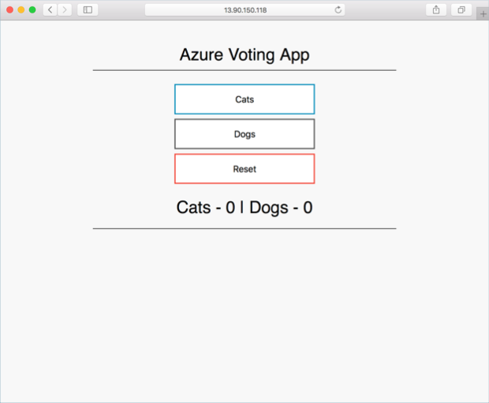

## Deploy Jenkins to VM

A script has been pre-created to deploy a virtual machine, configure network access, and complete a basic installation of Jenkins. Additionally, the script copies your Kubernetes configuration file from your development system to the Jenkins system. This file is used for authentication between Jenkins and the AKS cluster.

Run the following commands to download and run the script. The below URL can also be used to review the content of the script.

> [!WARNING]
> This sample script is for demo purposes to quickly provision a Jenkins environment that runs on an Azure VM. It uses the Azure custom script extension to configure a VM and then display the required credentials. Your *~/.kube/config* is copied to the Jenkins VM.

```console
curl https://raw.githubusercontent.com/Azure-Samples/azure-voting-app-redis/master/jenkins-tutorial/deploy-jenkins-vm.sh > azure-jenkins.sh
sh azure-jenkins.sh
```

When the script has completed, it outputs an address for the Jenkins server, as well a key to unlock Jenkins. Browse to the URL, enter the key, and following the on-screen prompts to complete the Jenkins configuration.

```console
Open a browser to http://52.166.118.64:8080
Enter the following to Unlock Jenkins:
667e24bba78f4de6b51d330ad89ec6c6
```

## Jenkins environment variables

A Jenkins environment variable is used to hold Azure Container Registry (ACR) login server name. This variable is referenced during the Jenkins continuous deployment job.

While on the Jenkins admin portal, click **Manage Jenkins** > **Configure System**.

Under **Global Properties**, select **Environment variables**, and add a variable with the name `ACR_LOGINSERVER` and a value of your ACR login server.

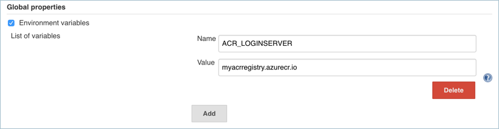

When complete, click **Save** on the Jenkins configuration page.

## Jenkins credentials

Now store your ACR credentials in a Jenkins credential object. These credentials are referenced during the Jenkins build job.

Back on the Jenkins admin portal, click **Credentials** > **Jenkins** > **Global credentials (unrestricted)** > **Add Credentials**.

Ensure that the credential kind is **Username with password** and enter the following items:

- **Username** - ID of the service principal use for authentication with your ACR registry.
- **Password** - Client secret of the service principal use for authentication with your ACR registry.
- **ID** - Credential identifier such as `acr-credentials`.

When complete, the credentials form should look similar to this image:

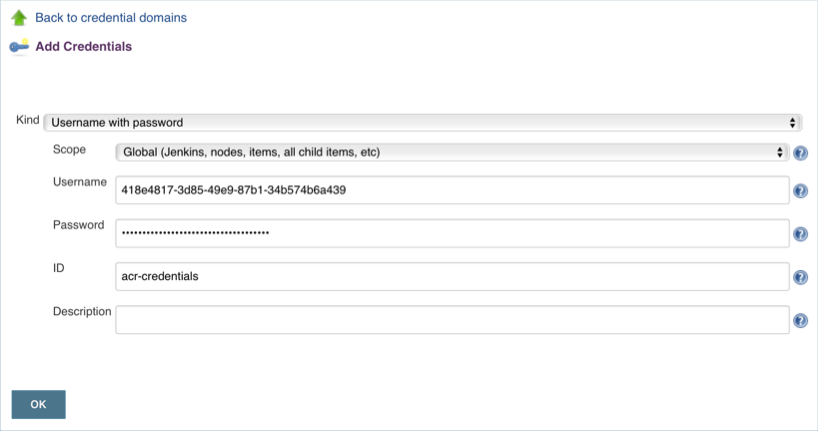

Click **OK** and return to the Jenkins admin portal.

## Create Jenkins project

From the Jenkins admin portal, click **New Item**.

Give the project a name, for example `azure-vote`, select **Freestyle Project**, and click **OK**.

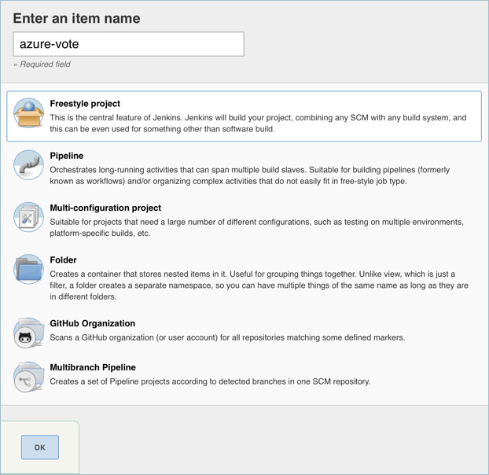

Under **General**, select **GitHub project** and enter the URL to your fork of the Azure vote GitHub project.

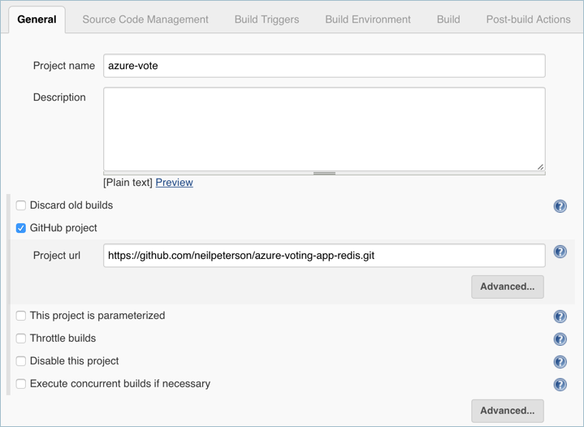

Under **Source Code Management**, select **Git**, enter the URL to your fork of the Azure Vote GitHub repo.

For the credentials, click on and **Add** > **Jenkins**. Under **Kind**, select **Secret text** and enter your [GitHub personal access token][git-access-token] as the secret.

Select **Add** when done.

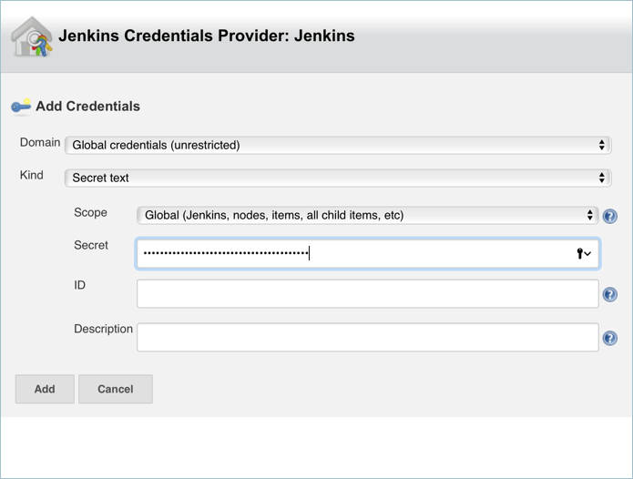

Under **Build Triggers**, select **GitHub hook trigger for GITScm polling**.

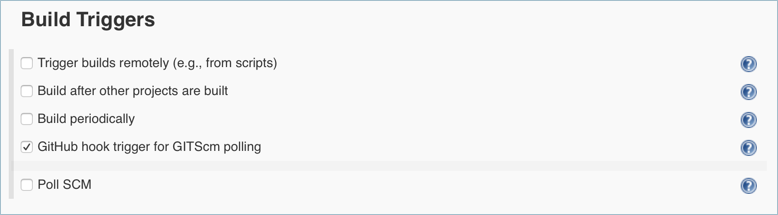

Under **Build Environment**, select **Use secret texts or files**.

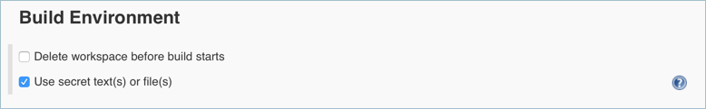

Under **Bindings**, select **Add** > **Username and password (separated)**.

Enter `ACR_ID` for the **Username Variable**, and `ACR_PASSWORD` for the **Password Variable**.

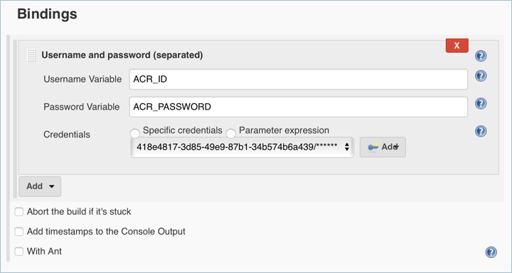

Add a **Build Step** of type **Execute shell** and use the following text. This script builds a new container image and pushes it to your ACR registry.

```bash
# Build new image and push to ACR.
WEB_IMAGE_NAME="${ACR_LOGINSERVER}/azure-vote-front:kube${BUILD_NUMBER}"
docker build -t $WEB_IMAGE_NAME ./azure-vote
docker login ${ACR_LOGINSERVER} -u ${ACR_ID} -p ${ACR_PASSWORD}
docker push $WEB_IMAGE_NAME
```

Add another **Build Step** of type **Execute shell** and use the following text. This script updates the Kubernetes deployment.

```bash
# Update kubernetes deployment with new image.
WEB_IMAGE_NAME="${ACR_LOGINSERVER}/azure-vote-front:kube${BUILD_NUMBER}"
kubectl set image deployment/azure-vote-front azure-vote-front=$WEB_IMAGE_NAME --kubeconfig /var/lib/jenkins/config
```

Once completed, click **Save**.

## Test the Jenkins build

Before proceeding, test the Jenkins build. This validates that the build job has been correctly configured, the proper Kubernetes authentication file is in place, and that the proper ACR credentials have been provided.

Click **Build Now** in the left-hand menu of the project.

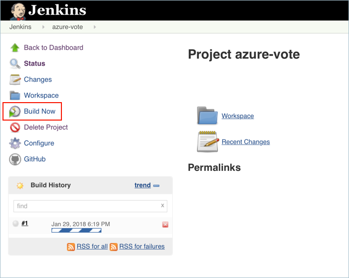

During this process, the GitHub repository is cloned to the Jenkins build server. A new container image is built and pushed to the ACR registry. Finally, the Azure vote application running on the AKS cluster is updated to use the new image. Because no changes have been made to the application code, the application is not changed.

Once the process is complete, click on **build #1** under build history and select **Console Output** to see all output from the build process. The final line should indicate a successful build.

## Create GitHub webhook

Next, hook the application repository to the Jenkins build server so that on any commit, a new build is triggered.

1. Browse to the forked GitHub repository.
2. Select **Settings**, then select **Webhooks** on the left-hand side.
3. Choose to **Add webhook**. For the *Payload URL*, enter `http://<publicIp:8080>/github-webhook/` where `publicIp` is the IP address of the Jenkins server. Make sure to include the trailing /. Leave the other defaults for content type and to trigger on *push* events.
4. Select **Add webhook**.

    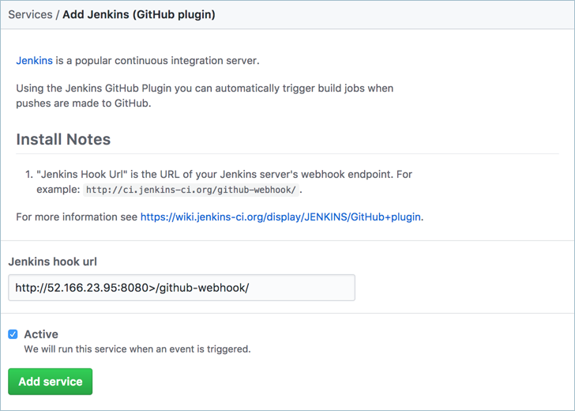

## Test CI/CD process end to end

On your development machine, open up the cloned application with a code editor.

Under the **/azure-vote/azure-vote** directory, find a file named **config_file.cfg**. Update the vote values in this file to something other than cats and dogs.

The following example shows and updated **config_file.cfg** file.

```bash
# UI Configurations
TITLE = 'Azure Voting App'
VOTE1VALUE = 'Blue'
VOTE2VALUE = 'Purple'
SHOWHOST = 'false'
```

When complete, save the file, commit the changes, and push these to your fork of the GitHub repository.. Once the commit has completed, the GitHub webhook triggers a new Jenkins build, which updates the container image, and the AKS deployment. Monitor the build process on the Jenkins admin console.

Once the build has completed, browse again to the application endpoint to observe the changes.

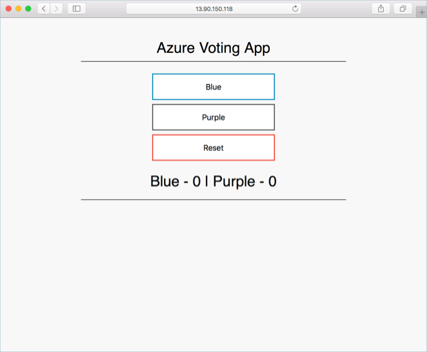

At this point, a simple continuous deployment process has been completed. The steps and configurations shown in this example can be used to build out a more robust and production-ready continuous build automation.

<!-- LINKS - external -->
[docker-images]: https://docs.docker.com/engine/reference/commandline/images/
[docker-tag]: https://docs.docker.com/engine/reference/commandline/tag/
[git-access-token]: https://help.github.com/articles/creating-a-personal-access-token-for-the-command-line/
[kubectl-apply]: https://kubernetes.io/docs/reference/generated/kubectl/kubectl-commands#apply
[kubectl-get]: https://kubernetes.io/docs/reference/generated/kubectl/kubectl-commands#get
[kubernetes-service]: https://kubernetes.io/docs/concepts/services-networking/service/

<!-- LINKS - internal -->
[az-acr-list]: /cli/azure/acr#az-acr-list
[acr-authentication]: ../container-registry/container-registry-auth-aks.md
[acr-quickstart]: ../container-registry/container-registry-get-started-azure-cli.md
[aks-credentials]: /cli/azure/aks#az-aks-get-credentials
[aks-quickstart]: kubernetes-walkthrough.md
[azure-cli-install]: /cli/azure/install-azure-cli