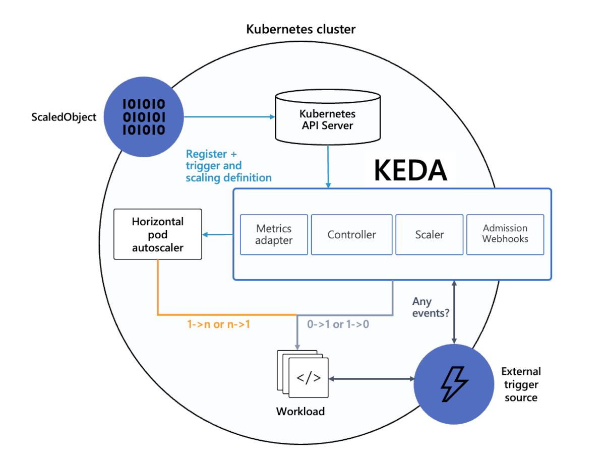

# Simplified application autoscaling with Kubernetes Event-driven Autoscaling (KEDA) add-on (Preview)

Kubernetes Event-driven Autoscaling (KEDA) is a single-purpose and lightweight component that strives to make application autoscaling simple and is a CNCF Incubation project.

It applies event-driven autoscaling to scale your application to meet demand in a sustainable and cost-efficient manner with scale-to-zero.

The KEDA add-on makes it even easier by deploying a managed KEDA installation, providing you with [a rich catalog of 50+ KEDA scalers][keda-scalers] that you can scale your applications with on your Azure Kubernetes Services (AKS) cluster.

[!INCLUDE [preview features callout](./includes/preview/preview-callout.md)]

## Architecture

[KEDA][keda] provides two main components:

- **KEDA operator** allows end-users to scale workloads in/out from 0 to N instances with support for Kubernetes Deployments, Jobs, StatefulSets or any custom resource that defines `/scale` subresource.
- **Metrics server** exposes external metrics to Horizontal Pod Autoscaler (HPA) in Kubernetes for autoscaling purposes such as messages in a Kafka topic, or number of events in an Azure event hub. Due to upstream limitations, KEDA must be the only installed metric adapter.

Learn more about how KEDA works in the [official KEDA documentation][keda-architecture].

## Installation and version

KEDA can be added to your Azure Kubernetes Service (AKS) cluster by enabling the KEDA add-on using an [ARM template][keda-arm] or [Azure CLI][keda-cli].

The KEDA add-on provides a fully supported installation of KEDA that is integrated with AKS.

## Capabilities and features

KEDA provides the following capabilities and features:

- Build sustainable and cost-efficient applications with scale-to-zero
- Scale application workloads to meet demand using [a rich catalog of 50+ KEDA scalers][keda-scalers]
- Autoscale applications with `ScaledObjects`, such as Deployments, StatefulSets or any custom resource that defines `/scale` subresource
- Autoscale job-like workloads with `ScaledJobs`
- Use production-grade security by decoupling autoscaling authentication from workloads
- Bring-your-own external scaler to use tailor-made autoscaling decisions

## Add-on limitations

The KEDA AKS add-on has the following limitations:

* KEDA's [HTTP add-on (preview)][keda-http-add-on] to scale HTTP workloads isn't installed with the extension, but can be deployed separately.
* KEDA's [external scaler for Azure Cosmos DB][keda-cosmos-db-scaler] to scale based on Azure Cosmos DB change feed isn't installed with the extension, but can be deployed separately.
* Only one metric server is allowed in the Kubernetes cluster. Because of that the KEDA add-on should be the only metrics server inside the cluster.
    * Multiple KEDA installations aren't supported
* Managed identity isn't supported.

For general KEDA questions, we recommend [visiting the FAQ overview][keda-faq].

## Next steps

* [Enable the KEDA add-on with an ARM template][keda-arm]
* [Enable the KEDA add-on with the Azure CLI][keda-cli]
* [Troubleshoot KEDA add-on problems][keda-troubleshoot]
* [Autoscale a .NET Core worker processing Azure Service Bus Queue messages][keda-sample]

<!-- LINKS - internal -->
[keda-azure-cli]: keda-deploy-addon-az-cli.md
[keda-cli]: keda-deploy-add-on-cli.md
[keda-arm]: keda-deploy-add-on-arm.md
[keda-troubleshoot]: /troubleshoot/azure/azure-kubernetes/troubleshoot-kubernetes-event-driven-autoscaling-add-on?context=/azure/aks/context/aks-context

<!-- LINKS - external -->
[keda]: https://keda.sh/
[keda-architecture]: https://keda.sh/docs/latest/concepts/
[keda-faq]: https://keda.sh/docs/latest/faq/
[keda-sample]: https://github.com/kedacore/sample-dotnet-worker-servicebus-queue
[keda-scalers]: https://keda.sh/docs/scalers/
[keda-http-add-on]: https://github.com/kedacore/http-add-on
[keda-cosmos-db-scaler]: https://github.com/kedacore/external-scaler-azure-cosmos-db
