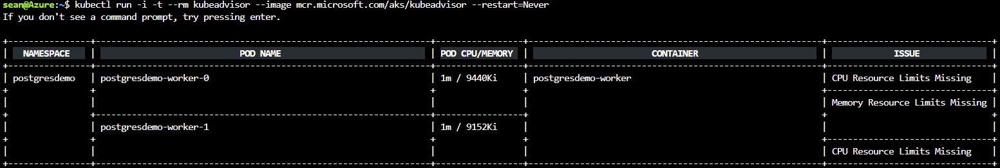

# Checking for Kubernetes best practices in your cluster

There are several best practice that you should follow on your Kubernetes deployments to ensure the best performance and resilience for your applications. You can use the kube-advisor tool to look for deployments that are not following those suggestions.

## About kube-advisor

The [kube-advisor tool][kube-advisor-github] is a single container designed to be run on your cluster. It queries the Kubernetes API server for information about your deployments and returns a set of suggested improvements.

> [!NOTE]
> The kube-advisor tool is supported by Microsoft on a best-effort basis. Issues and suggestions should be filed on GitHub.

## Running kube-advisor

To run the tool on a cluster that is configured for [role-based access control (RBAC)](aad-integration.md), using the following commands. The first command creates a Kubernetes service account.The second command runs the tool in a pod using that service account and configures the pod to be deleted after it exits. 

```bash
kubectl apply -f https://raw.githubusercontent.com/Azure/kube-advisor/master/sa.yaml?token=ABLLDrNcuHMro9jQ0xduCaEbpzLupzQUks5bh3RhwA%3D%3D

kubectl run --rm -i -t kube-advisor --image=mcr.microsoft.com/kube-advisor --restart=Never --overrides="{ \"apiVersion\": \"v1\", \"spec\": { \"serviceAccountName\": \"kube-advisor\" } }"
```

If you are not using RBAC, you can run the command as follows:

```bash
kubectl run --rm -i -t kube-advisor --image=mcr.microsoft.com/kube-advisor --restart=Never
```

Within a few seconds, you should see a table describing potential improvements to your deployments.



## Checks performed

The tool validates several Kubernetes best practices, each with their own suggested remediation.

### Resource requests and limits

Kubernetes supports defining [resource requests and limits on pod specifications][kube-cpumem]. The request defines the minimum CPU and memory required to run the container, while the limit defines the maximum CPU and memory that should be allowed.

By default, no requests or limits are set on pod specifications, which can lead to nodes being overscheduled and containers being starved. The kube-advisor tool highlights pods without requests and limits set.

## Cleaning up

If your cluster has RBAC enabled, you can clean up the `ClusterRoleBinding` after you've run the tool using the following command:

```bash
kubectl delete -f https://raw.githubusercontent.com/Azure/kube-advisor/master/sa.yaml?token=ABLLDrNcuHMro9jQ0xduCaEbpzLupzQUks5bh3RhwA%3D%3D
```

If you are running the tool against a cluster that is not RBAC-enabled, no cleanup is required.

## Next steps

- [Troubleshoot issues with Azure Kubernetes Service](troubleshooting.md)

<!-- RESOURCES -->

[kube-cpumem]: https://github.com/Azure/azure-quickstart-templates
[kube-advisor-github]: https://github.com/azure/kube-advisor