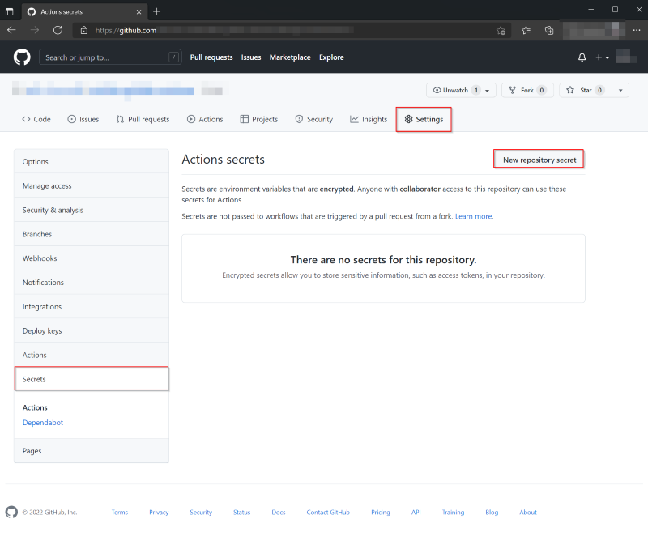
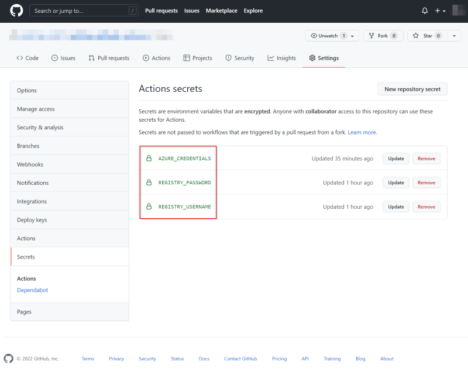

# GitHub Actions for deploying to Kubernetes service

[GitHub Actions](https://docs.github.com/en/actions) gives you the flexibility to build an automated software development lifecycle workflow. You can use multiple Kubernetes actions to deploy to containers from Azure Container Registry to Azure Kubernetes Service with GitHub Actions. 

## Prerequisites 

- An Azure account with an active subscription. [Create an account for free](https://azure.microsoft.com/free/?WT.mc_id=A261C142F).
- A GitHub account. If you don't have one, sign up for [free](https://github.com/join).  
- A working Kubernetes cluster
    - [Tutorial: Prepare an application for Azure Kubernetes Service](tutorial-kubernetes-prepare-app.md)

## Workflow file overview

A workflow is defined by a YAML (.yml) file in the `/.github/workflows/` path in your repository. This definition contains the various steps and parameters that make up the workflow.

For a workflow targeting AKS, the file has three sections:

|Section  |Tasks  |
|---------|---------|
|**Authentication** | Login to a private container registry (ACR) |
|**Build** | Build & push the container image  |
|**Deploy** | 1. Set the target AKS cluster |
| |2. Create a generic/docker-registry secret in Kubernetes cluster  |
||3. Deploy to the Kubernetes cluster|

## Create a service principal

You can create a [service principal](../active-directory/develop/app-objects-and-service-principals.md#service-principal-object) by using the [az ad sp create-for-rbac](/cli/azure/ad/sp#az_ad_sp_create_for_rbac) command in the [Azure CLI](/cli/azure/). You can run this command using [Azure Cloud Shell](https://shell.azure.com/) in the Azure portal or by selecting the **Try it** button.

```azurecli-interactive
az ad sp create-for-rbac --name "myApp" --role contributor --scopes /subscriptions/<SUBSCRIPTION_ID>/resourceGroups/<RESOURCE_GROUP> --sdk-auth
```

In the above command, replace the placeholders with your subscription ID, and resource group. The output is the role assignment credentials that provide access to your resource. The command should output a JSON object similar to this.

```json
  {
    "clientId": "<GUID>",
    "clientSecret": "<GUID>",
    "subscriptionId": "<GUID>",
    "tenantId": "<GUID>",
    (...)
  }
```
Copy this JSON object, which you can use to authenticate from GitHub.

## Configure the GitHub secrets

Follow the steps to configure the secrets:

1. In [GitHub](https://github.com/), browse to your repository, select **Settings > Secrets > Add a new secret**.

    

2. Paste the contents of the above `az cli` command as the value of secret variable. For example, `AZURE_CREDENTIALS`.

3. Similarly, define the following additional secrets for the container registry credentials and set them in Docker login action. 

    - REGISTRY_USERNAME
    - REGISTRY_PASSWORD

4. You will see the secrets as shown below once defined.

    

##  Build a container image and deploy to Azure Kubernetes Service cluster

The build and push of the container images is done using `Azure/docker-login@v1` action. 


```yml
env:
  REGISTRY_NAME: {registry-name}
  CLUSTER_NAME: {cluster-name}
  CLUSTER_RESOURCE_GROUP: {resource-group-name}
  NAMESPACE: {namespace-name}
  APP_NAME: {app-name}
  
jobs:
  build:
    runs-on: ubuntu-latest
    steps:
    - uses: actions/checkout@main
    
    # Connect to Azure Container registry (ACR)
    - uses: azure/docker-login@v1
      with:
        login-server: ${{ env.REGISTRY_NAME }}.azurecr.io
        username: ${{ secrets.REGISTRY_USERNAME }} 
        password: ${{ secrets.REGISTRY_PASSWORD }}
    
    # Container build and push to a Azure Container registry (ACR)
    - run: |
        docker build . -t ${{ env.REGISTRY_NAME }}.azurecr.io/${{ env.APP_NAME }}:${{ github.sha }}
        docker push ${{ env.REGISTRY_NAME }}.azurecr.io/${{ env.APP_NAME }}:${{ github.sha }}

```

### Deploy to Azure Kubernetes Service cluster

To deploy a container image to AKS, you will need to use the `Azure/k8s-deploy@v1` action. This action has five parameters:

| **Parameter**  | **Explanation**  |
|---------|---------|
| **namespace** | (Optional) Choose the target Kubernetes namespace. If the namespace is not provided, the commands will run in the default namespace | 
| **manifests** |  (Required) Path to the manifest files, that will be used for deployment |
| **images** | (Optional) Fully qualified resource URL of the image(s) to be used for substitutions on the manifest files |
| **imagepullsecrets** | (Optional) Name of a docker-registry secret that has already been set up within the cluster. Each of these secret names is added under imagePullSecrets field for the workloads found in the input manifest files |
| **kubectl-version** | (Optional) Installs a specific version of kubectl binary |


Before you can deploy to AKS, you'll need to set target Kubernetes namespace and create an image pull secret. See [Pull images from an Azure container registry to a Kubernetes cluster](../container-registry/container-registry-auth-kubernetes.md), to learn more about how pulling images works. 

```yaml
  # Create namespace if doesn't exist
  - run: |
      kubectl create namespace ${{ env.NAMESPACE }} --dry-run -o json | kubectl apply -f -
  
  # Create image pull secret for ACR
  - uses: azure/k8s-create-secret@v1
    with:
      container-registry-url: ${{ env.REGISTRY_NAME }}.azurecr.io
      container-registry-username: ${{ secrets.REGISTRY_USERNAME }}
      container-registry-password: ${{ secrets.REGISTRY_PASSWORD }}
      secret-name: ${{ env.SECRET }}
      namespace: ${{ env.NAMESPACE }}
      force: true
```


Complete your deployment with the `k8s-deploy` action. Replace the environment variables with values for your application. 

```yaml

on: [push]

# Environment variables available to all jobs and steps in this workflow
env:
  REGISTRY_NAME: {registry-name}
  CLUSTER_NAME: {cluster-name}
  CLUSTER_RESOURCE_GROUP: {resource-group-name}
  NAMESPACE: {namespace-name}
  SECRET: {secret-name}
  APP_NAME: {app-name}
  
jobs:
  build:
    runs-on: ubuntu-latest
    steps:
    - uses: actions/checkout@main
    
    # Connect to Azure Container registry (ACR)
    - uses: azure/docker-login@v1
      with:
        login-server: ${{ env.REGISTRY_NAME }}.azurecr.io
        username: ${{ secrets.REGISTRY_USERNAME }} 
        password: ${{ secrets.REGISTRY_PASSWORD }}
    
    # Container build and push to a Azure Container registry (ACR)
    - run: |
        docker build . -t ${{ env.REGISTRY_NAME }}.azurecr.io/${{ env.APP_NAME }}:${{ github.sha }}
        docker push ${{ env.REGISTRY_NAME }}.azurecr.io/${{ env.APP_NAME }}:${{ github.sha }}
    
    # Set the target Azure Kubernetes Service (AKS) cluster. 
    - uses: azure/aks-set-context@v1
      with:
        creds: '${{ secrets.AZURE_CREDENTIALS }}'
        cluster-name: ${{ env.CLUSTER_NAME }}
        resource-group: ${{ env.CLUSTER_RESOURCE_GROUP }}
    
    # Create namespace if doesn't exist
    - run: |
        kubectl create namespace ${{ env.NAMESPACE }} --dry-run -o json | kubectl apply -f -
    
    # Create image pull secret for ACR
    - uses: azure/k8s-create-secret@v1
      with:
        container-registry-url: ${{ env.REGISTRY_NAME }}.azurecr.io
        container-registry-username: ${{ secrets.REGISTRY_USERNAME }}
        container-registry-password: ${{ secrets.REGISTRY_PASSWORD }}
        secret-name: ${{ env.SECRET }}
        namespace: ${{ env.NAMESPACE }}
        force: true
    
    # Deploy app to AKS
    - uses: azure/k8s-deploy@v1
      with:
        manifests: |
          manifests/deployment.yml
          manifests/service.yml
        images: |
          ${{ env.REGISTRY_NAME }}.azurecr.io/${{ env.APP_NAME }}:${{ github.sha }}
        imagepullsecrets: |
          ${{ env.SECRET }}
        namespace: ${{ env.NAMESPACE }}
```

## Clean up resources

When your Kubernetes cluster, container registry, and repository are no longer needed, clean up the resources you deployed by deleting the resource group and your GitHub repository. 

## Next steps

> [!div class="nextstepaction"]
> [Learn about Azure Kubernetes Service](/azure/architecture/reference-architectures/containers/aks-start-here)

### More Kubernetes GitHub Actions

* [Kubectl tool installer](https://github.com/Azure/setup-kubectl) (`azure/setup-kubectl`): Installs a specific version of kubectl on the runner.
* [Kubernetes set context](https://github.com/Azure/k8s-set-context) (`azure/k8s-set-context`): Set the target Kubernetes cluster context which will be used by other actions or run any kubectl commands.
* [AKS set context](https://github.com/Azure/aks-set-context) (`azure/aks-set-context`): Set the target Azure Kubernetes Service cluster context.
* [Kubernetes create secret](https://github.com/Azure/k8s-create-secret) (`azure/k8s-create-secret`): Create a generic secret or docker-registry secret in the Kubernetes cluster.
* [Kubernetes deploy](https://github.com/Azure/k8s-deploy) (`azure/k8s-deploy`): Bake and deploy manifests to Kubernetes clusters.
* [Setup Helm](https://github.com/Azure/setup-helm) (`azure/setup-helm`): Install a specific version of Helm binary on the runner.
* [Kubernetes bake](https://github.com/Azure/k8s-bake) (`azure/k8s-bake`): Bake manifest file to be used for deployments using helm2, kustomize or kompose.
* [Kubernetes lint](https://github.com/azure/k8s-lint) (`azure/k8s-lint`): Validate/lint your manifest files.
