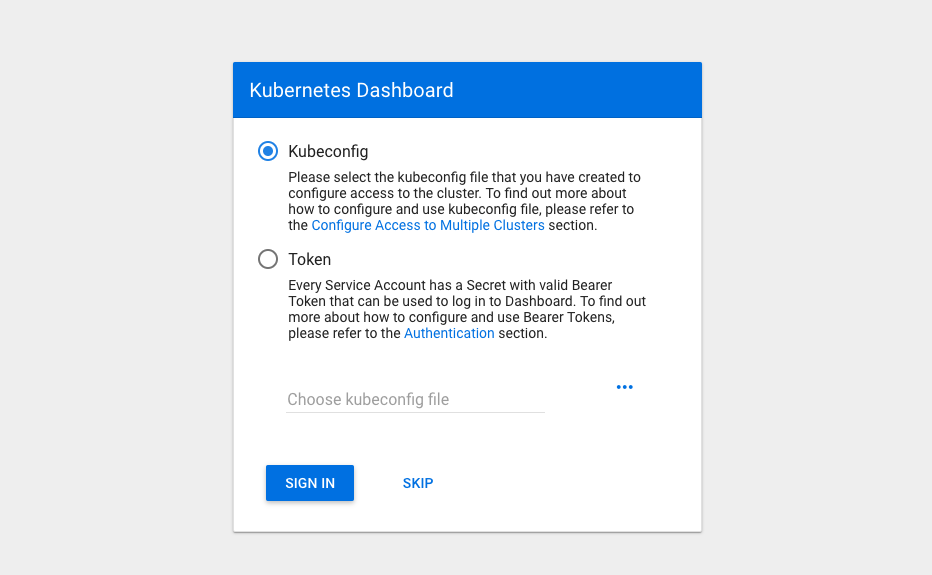

# Access the Kubernetes web dashboard in Azure Kubernetes Service (AKS)

Kubernetes includes a web dashboard that can be used for basic management operations. This dashboard lets you view basic health status and metrics for your applications, create and deploy services, and edit existing applications. This article shows you how to access the Kubernetes dashboard using the Azure CLI, then guides you through some basic dashboard operations.

For more information on the Kubernetes dashboard, see [Kubernetes Web UI Dashboard][kubernetes-dashboard].

## Before you begin

The steps detailed in this document assume that you have created an AKS cluster and have established a `kubectl` connection with the cluster. If you need to create an AKS cluster, see the [AKS quickstart][aks-quickstart].

You also need the Azure CLI version 2.0.46 or later installed and configured. Run `az --version` to find the version. If you need to install or upgrade, see [Install Azure CLI][install-azure-cli].

## Start the Kubernetes dashboard

To start the Kubernetes dashboard, use the [az aks browse][az-aks-browse] command. The following example opens the dashboard for the cluster named *myAKSCluster* in the resource group named *myResourceGroup*:

```azurecli
az aks browse --resource-group myResourceGroup --name myAKSCluster
```

This command creates a proxy between your development system and the Kubernetes API, and opens a web browser to the Kubernetes dashboard. If a web browser doesn't open to the Kubernetes dashboard, copy and paste the URL address noted in the Azure CLI, typically `http://127.0.0.1:8001`.

<!--


You have the following options to sign in to your cluster's dashboard:

* A [kubeconfig file][kubeconfig-file]. You can generate a kubeconfig file using [az aks get-credentials][az-aks-get-credentials].
* A token, such as a [service account token][aks-service-accounts] or user token. On [AAD-enabled clusters][aad-cluster], this token would be an AAD token. You can use `kubectl config view` to list the tokens in your kubeconfig file. For more details on creating an AAD token for use with an AKS cluster see [Integrate Azure Active Directory with Azure Kubernetes Service using the Azure CLI][aad-cluster].
* The default dashboard service account, which is used if you click *Skip*.

> [!WARNING]
> Never expose the Kubernetes dashboard publicly, regardless of the authentication method used.
> 
> When setting up authentication for the Kubernetes dashboard, it is recommended that you use a token over the default dashboard service account. A token allows each user to use their own permissions. Using the default dashboard service account may allow a user to bypass their own permissions and use the service account instead.
> 
> If you do choose to use the default dashboard service account and your AKS cluster uses RBAC, a *ClusterRoleBinding* must be created before you can correctly access the dashboard. By default, the Kubernetes dashboard is deployed with minimal read access and displays RBAC access errors. A cluster administrator can choose to grant additional access to the *kubernetes-dashboard* service account, however this can be a vector for privilege escalation. You can also integrate Azure Active Directory authentication to provide a more granular level of access.
>
> To create a binding, use the [kubectl create clusterrolebinding][kubectl-create-clusterrolebinding] command as shown in the following example. **This sample binding does not apply any additional authentication components and may lead to insecure use.**
>
> ```console
> kubectl create clusterrolebinding kubernetes-dashboard --clusterrole=cluster-admin --serviceaccount=kube-system:kubernetes-dashboard
> ```
> 
> You can now access the Kubernetes dashboard in your RBAC-enabled cluster. To start the Kubernetes dashboard, use the [az aks browse][az-aks-browse] command as detailed in the previous step.
>
> If your cluster does not use RBAC, it is not recommended to create a *ClusterRoleBinding*.
> 
> For more information on using the different authentication methods, see the Kubernetes dashboard wiki on [access controls][dashboard-authentication].

After you choose a method to sign in, the Kubernetes dashboard is displayed. If you chose to use *token* or *skip*, the Kubernetes dashboard will use the permissions of the currently logged in user to access the cluster.
-->

> [!IMPORTANT]
> If your AKS cluster uses RBAC, a *ClusterRoleBinding* must be created before you can correctly access the dashboard. By default, the Kubernetes dashboard is deployed with minimal read access and displays RBAC access errors. The Kubernetes dashboard does not currently support user-provided credentials to determine the level of access, rather it uses the roles granted to the service account. A cluster administrator can choose to grant additional access to the *kubernetes-dashboard* service account, however this can be a vector for privilege escalation. You can also integrate Azure Active Directory authentication to provide a more granular level of access.
> 
> To create a binding, use the [kubectl create clusterrolebinding][kubectl-create-clusterrolebinding] command. The following example shows how to create a sample binding, however, this sample binding does not apply any additional authentication components and may lead to insecure use. The Kubernetes dashboard is open to anyone with access to the URL. Do not expose the Kubernetes dashboard publicly.
>
> ```console
> kubectl create clusterrolebinding kubernetes-dashboard --clusterrole=cluster-admin --serviceaccount=kube-system:kubernetes-dashboard
> ```
> 
> For more information on using the different authentication methods, see the Kubernetes dashboard wiki on [access controls][dashboard-authentication].


## Create an application

To see how the Kubernetes dashboard can reduce the complexity of management tasks, let's create an application. You can create an application from the Kubernetes dashboard by providing text input, a YAML file, or through a graphical wizard.

To create an application, complete the following steps:

1. Select the **Create** button in the upper right window.
1. To use the graphical wizard, choose to **Create an app**.
1. Provide a name for the deployment, such as *nginx*
1. Enter the name for the container image to use, such as *nginx:1.15.5*
1. To expose port 80 for web traffic, you create a Kubernetes service. Under **Service**, select **External**, then enter **80** for both the port and target port.
1. When ready, select **Deploy** to create the app.


It takes a minute or two for a public external IP address to be assigned to the Kubernetes service. On the left-hand size, under **Discovery and Load Balancing** select **Services**. Your application's service is listed, including the *External endpoints*, as shown in the following example:


Select the endpoint address to open a web browser window to the default NGINX page:


## View pod information

The Kubernetes dashboard can provide basic monitoring metrics and troubleshooting information such as logs.

To see more information about your application pods, select **Pods** in the left-hand menu. The list of available pods is shown. Choose your *nginx* pod to view information, such as resource consumption:


## Edit the application

In addition to creating and viewing applications, the Kubernetes dashboard can be used to edit and update application deployments. To provide additional redundancy for the application, let's increase the number of NGINX replicas.

To edit a deployment:

1. Select **Deployments** in the left-hand menu, and then choose your *nginx* deployment.
1. Select **Edit** in the upper right-hand navigation bar.
1. Locate the `spec.replica` value, at around line 20. To increase the number of replicas for the application, change this value from *1* to *3*.
1. Select **Update** when ready.


It takes a few moments for the new pods to be created inside a replica set. On the left-hand menu, choose **Replica Sets**, and then choose your *nginx* replica set. The list of pods now reflects the updated replica count, as shown in the following example output:


## Next steps

For more information about the Kubernetes dashboard, see the [Kubernetes Web UI Dashboard][kubernetes-dashboard].

<!-- LINKS - external -->
[dashboard-authentication]: https://github.com/kubernetes/dashboard/wiki/Access-control
[kubeconfig-file]: https://kubernetes.io/docs/tasks/access-application-cluster/configure-access-multiple-clusters/
[kubectl-create-clusterrolebinding]: https://kubernetes.io/docs/reference/generated/kubectl/kubectl-commands#-em-clusterrolebinding-em-
[kubectl-apply]: https://kubernetes.io/docs/reference/generated/kubectl/kubectl-commands#apply
[kubernetes-dashboard]: https://kubernetes.io/docs/tasks/access-application-cluster/web-ui-dashboard/

<!-- LINKS - internal -->
[aad-cluster]: ./azure-ad-integration-cli.md
[aks-quickstart]: ./kubernetes-walkthrough.md
[aks-service-accounts]: ./concepts-identity.md#kubernetes-service-accounts
[az-account-get-access-token]: /cli/azure/account?view=azure-cli-latest#az-account-get-access-token
[az-aks-browse]: /cli/azure/aks#az-aks-browse
[az-aks-get-credentials]: /cli/azure/aks?view=azure-cli-latest#az-aks-get-credentials
[install-azure-cli]: /cli/azure/install-azure-cli
