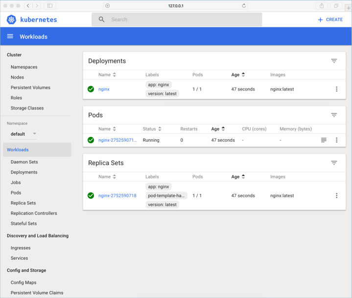
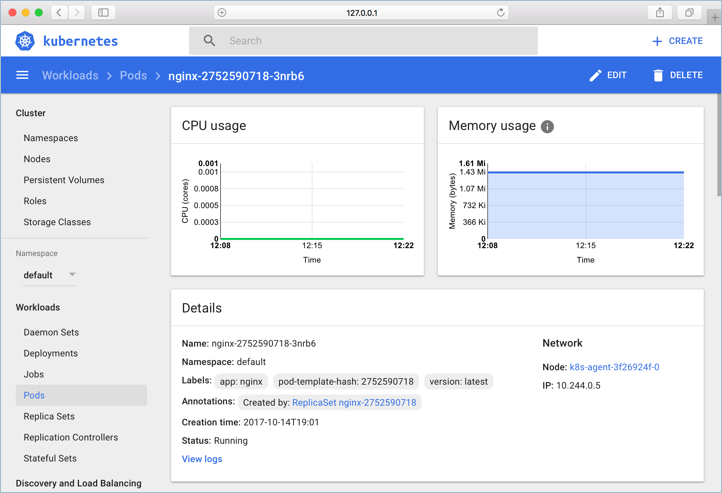
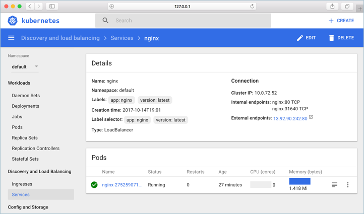
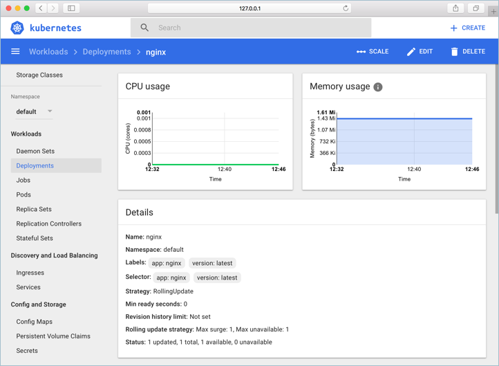
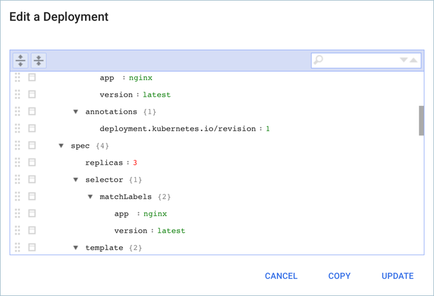

# Access the Kubernetes dashboard with Azure Kubernetes Service (AKS)

Kubernetes includes a web dashboard that can be used for basic management operations. This article shows you how to access the Kubernetes dashboard using the Azure CLI, then guides you through some basic dashboard operations. For more information on the Kubernetes dashboard, see [Kubernetes Web UI Dashboard][kubernetes-dashboard].

## Before you begin

The steps detailed in this document assume that you have created an AKS cluster and have established a `kubectl` connection with the cluster. If you need to create an AKS cluster, see the [AKS quickstart][aks-quickstart].

You also need the Azure CLI version 2.0.27 or later installed and configured. Run `az --version` to find the version. If you need to install or upgrade, see [Install Azure CLI][install-azure-cli].

## Start Kubernetes dashboard

To start the Kubernetes dashboard, use the [az aks browse][az-aks-browse] command. The following example opens the dashboard for the cluster named *myAKSCluster* in the resource group named *myResourceGroup*:

```azurecli
az aks browse --resource-group myResourceGroup --name myAKSCluster
```

This command creates a proxy between your development system and the Kubernetes API, and opens a web browser to the Kubernetes dashboard.

### For RBAC-enabled clusters

If your AKS cluster uses RBAC, a *ClusterRoleBinding* must be created before you can correctly access the dashboard. By default, the Kubernetes dashboard is deployed with minimal read access and displays RBAC access errors. The Kubernetes dashboard does not currently support user-provided credentials to determine the level of access, rather it uses the roles granted to the service account. A cluster administrator can choose to grant additional access to the *kubernetes-dashboard* service account, however this can be a vector for privilege escalation. You can also integrate Azure Active Directory authentication to provide a more granular level of access.

To create a binding, use the [kubectl create clusterrolebinding][kubectl-create-clusterrolebinding] command as shown in the following example. 

> [!WARNING]
> This sample binding does not apply any additional authentication components and may lead to insecure use. The Kubernetes dashboard is open to anyone with access to the URL. Do not expose the Kubernetes dashboard publicly.
>
> For more information on using the different authentication methods, see the Kubernetes dashboard wiki on [access controls][dashboard-authentication].

```console
kubectl create clusterrolebinding kubernetes-dashboard --clusterrole=cluster-admin --serviceaccount=kube-system:kubernetes-dashboard
```

You can now access the Kubernetes dashboard in your RBAC-enabled cluster. To start the Kubernetes dashboard, use the [az aks browse][az-aks-browse] command as detailed in the previous step.

## Run an application

In the Kubernetes dashboard, click the **Create** button in the upper right window. Give the deployment the name `nginx` and enter `nginx:latest` for the container image name. Under **Service**, select **External** and enter `80` for both the port and target port.

When ready, click **Deploy** to create the deployment.


## View the application

Status about the application can be seen on the Kubernetes dashboard. Once the application is running, each component has a green checkbox next to it.



To see more information about the application pods, click on **Pods** in the left-hand menu, and then select the **NGINX** pod. Here you can see pod-specific information such as resource consumption.



To find the IP address of the application, click on **Services** in the left-hand menu, and then select the **NGINX** service.



## Edit the application

In addition to creating and viewing applications, the Kubernetes dashboard can be used to edit and update application deployments.

To edit a deployment, click **Deployments** in the left-hand menu, and then select the **NGINX** deployment. Finally, select **Edit** in the upper right-hand navigation bar.



Locate the `spec.replica` value, which should be 1, change this value to 3. In doing so, the replica count of the NGINX deployment is increased from 1 to 3.

Select **Update** when ready.



## Next steps

For more information about the Kubernetes dashboard, see the Kubernetes documentation.

> [!div class="nextstepaction"]
> [Kubernetes Web UI Dashboard][kubernetes-dashboard]

<!-- LINKS - external -->
[kubernetes-dashboard]: https://kubernetes.io/docs/tasks/access-application-cluster/web-ui-dashboard/
[dashboard-authentication]: https://github.com/kubernetes/dashboard/wiki/Access-control
[kubectl-create-clusterrolebinding]: https://kubernetes.io/docs/reference/generated/kubectl/kubectl-commands#-em-clusterrolebinding-em-
[kubectl-apply]: https://kubernetes.io/docs/reference/generated/kubectl/kubectl-commands#apply

<!-- LINKS - internal -->
[aks-quickstart]: ./kubernetes-walkthrough.md
[install-azure-cli]: /cli/azure/install-azure-cli
[az-aks-browse]: /cli/azure/aks#az-aks-browse
