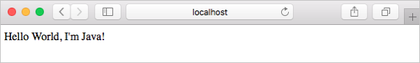

# Use Draft with Azure Kubernetes Service (AKS)

Draft is an open-source tool that helps package and deploy application containers in a Kubernetes cluster, leaving you free to concentrate on the dev cycle - the "inner loop" of concentrated development. Draft works as the code is being developed, but before committing to version control. With Draft, you can quickly redeploy an application to Kubernetes as code changes occur. For more information on Draft, see the [Draft documentation on Github][draft-documentation].

This article shows you how to use Draft with a Kubernetes cluster on AKS.

## Prerequisites

The steps detailed in this article assume that you have created an AKS cluster and have established a `kubectl` connection with the cluster. If you need these items, see the [AKS quickstart][aks-quickstart].

You need a private Docker registry in Azure Container Registry (ACR). For steps on how to create an ACR instance, see the [Azure Container Registry quickstart][acr-quickstart].

Helm must also be installed in your AKS cluster. For more information on how to install and configure Helm, see [Use Helm with Azure Kubernetes Service (AKS)][aks-helm].

Finally, you must install [Docker](https://www.docker.com).

## Install Draft

The Draft CLI is a client that runs on your development system and allows you to deploy code into a Kubernetes cluster. To install the Draft CLI on a Mac, use `brew`. For additional installation options, see the [Draft Install guide][draft-documentation].

> [!NOTE]
> If you installed Draft prior to version 0.12, first delete Draft from your cluster using `helm delete --purge draft` and then remove your local configuration by running `rm -rf ~/.draft`. If you are on MacOS, then run `brew upgrade draft`.

```console
brew tap azure/draft
brew install draft
```

Now initialize Draft with the `draft init` command:

```console
draft init
```

## Configure Draft

Draft builds the container images locally, and then either deploys them from the local registry (such as with Minikube), or uses an image registry that you specify. This article uses Azure Container Registry (ACR), so you must establish a trust relationship between your AKS cluster and the ACR registry, then configure Draft to push your container images to ACR.

### Create trust between AKS cluster and ACR

To establish trust between an AKS cluster and an ACR registry, grant permissions for the Azure Active Directory service principal used by the AKS cluster to access the ACR registry. In the following commands, provide your own `<resourceGroupName>`, replace `<aksName>` with name of your AKS cluster, and replace `<acrName>` with the name of your ACR registry:

```azurecli
# Get the service principal ID of your AKS cluster
AKS_SP_ID=$(az aks show --resource-group <resourceGroupName> --name <aksName> --query "servicePrincipalProfile.clientId" -o tsv)

# Get the resource ID of your ACR instance
ACR_RESOURCE_ID=$(az acr show --resource-group <resourceGroupName> --name <acrName> --query "id" -o tsv)

# Create a role assignment for your AKS cluster to access the ACR instance
az role assignment create --assignee $AKS_SP_ID --scope $ACR_RESOURCE_ID --role contributor
```

For more information on these steps to access ACR, see [authenticating with ACR](../container-registry/container-registry-auth-aks.md).

### Configure Draft to push to and deploy from ACR

Now that there is a trust relationship between AKS and ACR, enable the use of ACR from your AKS cluster.

1. Set the Draft configuration *registry* value. In the following commands, replace `<acrName>` with the name of your ACR registry:

    ```console
    draft config set registry <acrName>.azurecr.io
    ```

1. Log on to the ACR registry with [az acr login][az-acr-login]:

    ```azurecli
    az acr login --name <acrName>
    ```

As a trust was created between AKS and ACR, no passwords or secrets are required to push to or pull from the ACR registry. Authentication happens at the Azure Resource Manager level, using Azure Active Directory.

## Run an application

To see Draft in action, let's deploy a sample application from the [Draft repository][draft-repo]. First, clone the repo:

```console
git clone https://github.com/Azure/draft
```

Change to the Java examples directory:

```console
cd draft/examples/example-java/
```

Use the `draft create` command to start the process. This command creates the artifacts that are used to run the application in a Kubernetes cluster. These items include a Dockerfile, a Helm chart, and a *draft.toml* file, which is the Draft configuration file.

```
$ draft create

--> Draft detected Java (92.205567%)
--> Ready to sail
```

To run the sample application in your AKS cluster, use the `draft up` command. This command builds the Dockerfile to create a container image, pushes the image to ACR, and finally installs the Helm chart to start the application in AKS.

The first time this command is run, pushing and pulling the container image may take some time. Once the base layers are cached, the time taken to deploy the application is dramatically reduced.

```
$ draft up

Draft Up Started: 'example-java': 01CMZAR1F4T1TJZ8SWJQ70HCNH
example-java: Building Docker Image: SUCCESS ⚓  (73.0720s)
example-java: Pushing Docker Image: SUCCESS ⚓  (19.5727s)
example-java: Releasing Application: SUCCESS ⚓  (4.6979s)
Inspect the logs with `draft logs 01CMZAR1F4T1TJZ8SWJQ70HCNH`
```

If you encounter issues pushing the Docker image, ensure that you have successfully logged in to your ACR registry with [az acr login][az-acr-login], then try the `draft up` command again.

## Test the application locally

To test the application, use the `draft connect` command. This command proxies a secure connection to the Kubernetes pod. When complete, the application can be accessed on the provided URL.

> [!NOTE]
> It may take a few minutes for the container image to be downloaded and the application to start. If you receive an error when accessing the application, retry the connection.

```
$ draft connect

Connect to java:4567 on localhost:49804
[java]: SLF4J: Failed to load class "org.slf4j.impl.StaticLoggerBinder".
[java]: SLF4J: Defaulting to no-operation (NOP) logger implementation
[java]: SLF4J: See http://www.slf4j.org/codes.html#StaticLoggerBinder for further details.
[java]: == Spark has ignited ...
[java]: >> Listening on 0.0.0.0:4567
```

To access your application, open a web browser to the address and port specified in the `draft connect` output, such as *http://localhost:49804*. 



Use `Control+C` to stop the proxy connection.

> [!NOTE]
> You can also use the `draft up --auto-connect` command to build and deploy your application then immediately connect to the first running container.

## Access the application on the internet

The previous step created a proxy connection to the application pod in your AKS cluster. As you develop and test your application, you may want to make the application available on the internet. To expose an application on the internet, you create a Kubernetes service with a type of [LoadBalancer][kubernetes-service-loadbalancer], or create an [ingress controller][kubernetes-ingress]. Let's create a *LoadBalancer* service.

First, update the *values.yaml* Draft pack to specify that a service with a type *LoadBalancer* should be created:

```console
vi charts/java/values.yaml
```

Locate the *service.type* property and update the value from *ClusterIP* to *LoadBalancer*, as shown in the following condensed example:

```yaml
[...]
service:
  name: java
  type: LoadBalancer
  externalPort: 80
  internalPort: 4567
[...]
```

Save and close the file, then use `draft up` to rerun the application:

```console
draft up
```

It takes a few minutes for the service to return a public IP address. To monitor the progress, use the `kubectl get service` command with the *watch* parameter:

```console
kubectl get service --watch
```

Initially, the *EXTERNAL-IP* for the service appears as *pending*:

```
NAME                TYPE          CLUSTER-IP    EXTERNAL-IP   PORT(S)        AGE
example-java-java   LoadBalancer  10.0.141.72   <pending>     80:32150/TCP   2m
```

Once the EXTERNAL-IP address has changed from *pending* to an IP address, use `Control+C` to stop the `kubectl` watch process:

```
NAME                TYPE           CLUSTER-IP    EXTERNAL-IP     PORT(S)        AGE
example-java-java   LoadBalancer   10.0.141.72   52.175.224.118  80:32150/TCP   7m
```

To see the application, browse to the external IP address of your load balancer with `curl`:

```
$ curl 52.175.224.118

Hello World, I'm Java
```

## Iterate on the application

Now that Draft has been configured and the application is running in Kubernetes, you are set for code iteration. Each time you want to test updated code, run the `draft up` command to update the running application.

In this example, update the Java sample application to change the display text. Open the *Hello.java* file:

```console
vi src/main/java/helloworld/Hello.java
```

Update the output text to display, *Hello World, I'm Java in AKS!*:

```java
package helloworld;

import static spark.Spark.*;

public class Hello {
    public static void main(String[] args) {
        get("/", (req, res) -> "Hello World, I'm Java in AKS!");
    }
}
```

Run the `draft up` command to redeploy the application:

```console
$ draft up

Draft Up Started: 'example-java': 01CMZC9RF0TZT7XPWGFCJE15X4
example-java: Building Docker Image: SUCCESS ⚓  (25.0202s)
example-java: Pushing Docker Image: SUCCESS ⚓  (7.1457s)
example-java: Releasing Application: SUCCESS ⚓  (3.5773s)
Inspect the logs with `draft logs 01CMZC9RF0TZT7XPWGFCJE15X4`
```

To see the updated application, curl the IP address of your load balancer again:

```
$ curl 52.175.224.118

Hello World, I'm Java in AKS!
```

## Next steps

For more information about using Draft, see the Draft documentation on GitHub.

> [!div class="nextstepaction"]
> [Draft documentation][draft-documentation]

<!-- LINKS - external -->
[draft-documentation]: https://github.com/Azure/draft/tree/master/docs
[kubernetes-service-loadbalancer]: https://kubernetes.io/docs/concepts/services-networking/service/#type-loadbalancer
[draft-repo]: https://github.com/Azure/draft

<!-- LINKS - internal -->
[acr-quickstart]: ../container-registry/container-registry-get-started-azure-cli.md
[aks-helm]: ./kubernetes-helm.md
[kubernetes-ingress]: ./ingress-basic.md
[aks-quickstart]: ./kubernetes-walkthrough.md
[az-acr-login]: /cli/azure/acr#az-acr-login
