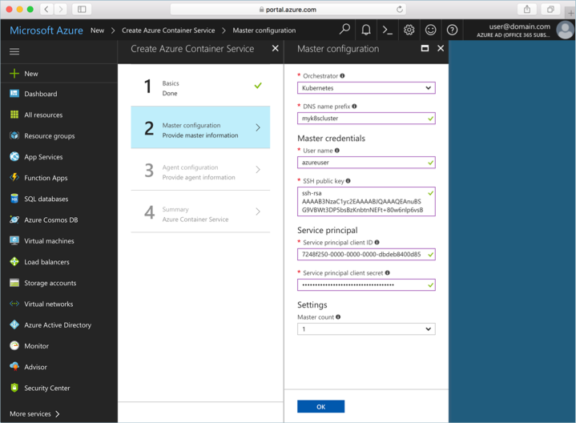

# Service principals with Azure Kubernetes Service (AKS)

An AKS cluster requires an [Azure Active Directory service principal][aad-service-principal] to interact with Azure APIs. The service principal is needed to dynamically create and manage resources such as the [Azure Load Balancer][azure-load-balancer-overview].

This article shows different options for setting up a service principal for your Kubernetes cluster in AKS.

## Before you begin


To create an Azure AD service principal, you must have permissions to register an application with your Azure AD tenant, and to assign the application to a role in your subscription. If you don't have the necessary permissions, you might need to ask your Azure AD or subscription administrator to assign the necessary permissions, or pre-create a service principal for the Kubernetes cluster.

You also need the Azure CLI version 2.0.27 or later installed and configured. Run `az --version` to find the version. If you need to install or upgrade, see [Install Azure CLI][install-azure-cli].

## Create SP with AKS cluster

When deploying an AKS cluster with the `az aks create` command, you have the option to automatically generate a service principal.

In the following example, an AKS cluster is created, and because an existing service principal is not specified, a service principal is created for the cluster. In order to complete this operation, your account must have the proper rights for creating a service principal.

```azurecli-interactive
az aks create --name myAKSCluster --resource-group myResourceGroup --generate-ssh-keys
```

## Use an existing SP

An existing Azure AD service principal can be used or pre-created for use with an AKS cluster. This is helpful when deploying a cluster from the Azure portal where you are required to provide the service principal information. When using an existing service principal, the client secret must be configured as a password.

## Pre-create a new SP

To create the service principal with the Azure CLI, use the [az ad sp create-for-rbac][az-ad-sp-create] command.

```azurecli-interactive
az ad sp create-for-rbac --skip-assignment
```

Output is similar to the following. Take note of the `appId` and `password`. These values are used when creating an AKS cluster.

```json
{
  "appId": "7248f250-0000-0000-0000-dbdeb8400d85",
  "displayName": "azure-cli-2017-10-15-02-20-15",
  "name": "http://azure-cli-2017-10-15-02-20-15",
  "password": "77851d2c-0000-0000-0000-cb3ebc97975a",
  "tenant": "72f988bf-0000-0000-0000-2d7cd011db47"
}
```

## Use an existing SP

When using a pre-created service principal, provide the `appId` and `password` as argument values to the `az aks create` command.

```azurecli-interactive
az aks create --resource-group myResourceGroup --name myAKSCluster --service-principal <appId> --client-secret <password>
```

If you're deploying an AKS cluster by using the Azure portal, enter the `appId` value in the **Service principal client ID** field, and the `password` value in the **Service principal client secret** field in the AKS cluster configuration form.



## Additional considerations

When working with AKS and Azure AD service principals, keep the following in mind.

* The service principal for Kubernetes is a part of the cluster configuration. However, don't use the identity to deploy the cluster.
* Every service principal is associated with an Azure AD application. The service principal for a Kubernetes cluster can be associated with any valid Azure AD application name (for example: `https://www.contoso.org/example`). The URL for the application doesn't have to be a real endpoint.
* When specifying the service principal **Client ID**, use the value of the `appId`.
* On the master and node VMs in the Kubernetes cluster, the service principal credentials are stored in the file `/etc/kubernetes/azure.json`.
* When you use the `az aks create` command to generate the service principal automatically, the service principal credentials are written to the file `~/.azure/aksServicePrincipal.json` on the machine used to run the command.
* When deleting an AKS cluster that was created by `az aks create`, the service principal that was created automatically is not deleted. To delete the service principal, first get the ID for the service principal with [az ad app list][az-ad-app-list]. The following example queries for the cluster named *myAKSCluster* and then deletes the app ID with [az ad app delete][az-ad-app-delete]. Replace these names with your own values:

    ```azurecli-interactive
    az ad app list --query "[?displayName=='myAKSCluster'].{Name:displayName,Id:appId}" --output table
    az ad app delete --id <appId>
    ```

## Next steps

For more information about Azure Active Directory service principals, see the Azure AD applications documentation.

> [!div class="nextstepaction"]
> [Application and service principal objects][service-principal]

<!-- LINKS - internal -->
[aad-service-principal]:../active-directory/develop/app-objects-and-service-principals.md
[acr-intro]: ../container-registry/container-registry-intro.md
[az-ad-sp-create]: /cli/azure/ad/sp#az-ad-sp-create-for-rbac
[azure-load-balancer-overview]: ../load-balancer/load-balancer-overview.md
[install-azure-cli]: /cli/azure/install-azure-cli
[service-principal]:../active-directory/develop/app-objects-and-service-principals.md
[user-defined-routes]: ../load-balancer/load-balancer-overview.md
[az-ad-app-list]: /cli/azure/ad/app#az-ad-app-list
[az-ad-app-delete]: /cli/azure/ad/app#az-ad-app-delete
