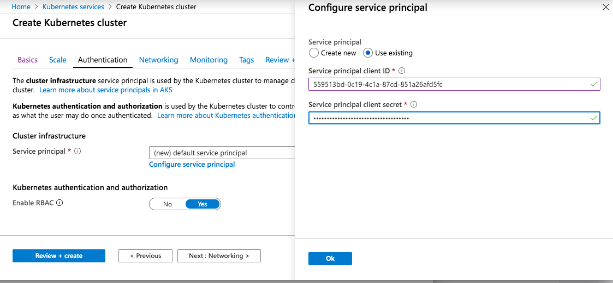

# Service principals with Azure Kubernetes Service (AKS)

To interact with Azure APIs, an AKS cluster requires either an [Azure Active Directory (AD) service principal][aad-service-principal] or a [managed identity](use-managed-identity.md). A service principal or managed identity is needed to dynamically create and manage other Azure resources such as an Azure load balancer or container registry (ACR).

This article shows how to create and use a service principal for your AKS clusters.

## Before you begin

To create an Azure AD service principal, you must have permissions to register an application with your Azure AD tenant, and to assign the application to a role in your subscription. If you don't have the necessary permissions, you might need to ask your Azure AD or subscription administrator to assign the necessary permissions, or pre-create a service principal for you to use with the AKS cluster.

If you are using a service principal from a different Azure AD tenant, there are additional considerations around the permissions available when you deploy the cluster. You may not have the appropriate permissions to read and write directory information. For more information, see [What are the default user permissions in Azure Active Directory?][azure-ad-permissions]

You also need the Azure CLI version 2.0.59 or later installed and configured. Run `az --version` to find the version. If you need to install or upgrade, see [Install Azure CLI][install-azure-cli].

## Automatically create and use a service principal

When you create an AKS cluster in the Azure portal or using the [az aks create][az-aks-create] command, Azure can automatically generate a service principal.

In the following Azure CLI example, a service principal is not specified. In this scenario, the Azure CLI creates a service principal for the AKS cluster. To successfully complete the operation, your Azure account must have the proper rights to create a service principal.

```azurecli
az aks create --name myAKSCluster --resource-group myResourceGroup
```

## Manually create a service principal

To manually create a service principal with the Azure CLI, use the [az ad sp create-for-rbac][az-ad-sp-create] command. In the following example, the `--skip-assignment` parameter prevents any additional default assignments being assigned:

```azurecli-interactive
az ad sp create-for-rbac --skip-assignment --name myAKSClusterServicePrincipal
```

The output is similar to the following example. Make a note of your own `appId` and `password`. These values are used when you create an AKS cluster in the next section.

```json
{
  "appId": "559513bd-0c19-4c1a-87cd-851a26afd5fc",
  "displayName": "myAKSClusterServicePrincipal",
  "name": "http://myAKSClusterServicePrincipal",
  "password": "e763725a-5eee-40e8-a466-dc88d980f415",
  "tenant": "72f988bf-86f1-41af-91ab-2d7cd011db48"
}
```

## Specify a service principal for an AKS cluster

To use an existing service principal when you create an AKS cluster using the [az aks create][az-aks-create] command, use the `--service-principal` and `--client-secret` parameters to specify the `appId` and `password` from the output of the [az ad sp create-for-rbac][az-ad-sp-create] command:

```azurecli-interactive
az aks create \
    --resource-group myResourceGroup \
    --name myAKSCluster \
    --service-principal <appId> \
    --client-secret <password>
```

> [!NOTE]
> If you're using an existing service principal with customized secret, ensure the secret is no longer than 190 bytes.

If you deploy an AKS cluster using the Azure portal, on the *Authentication* page of the **Create Kubernetes cluster** dialog, choose to **Configure service principal**. Select **Use existing**, and specify the following values:

- **Service principal client ID** is your *appId*
- **Service principal client secret** is the *password* value



## Delegate access to other Azure resources

The service principal for the AKS cluster can be used to access other resources. For example, if you want to deploy your AKS cluster into an existing Azure virtual network subnet or connect to Azure Container Registry (ACR), you need to delegate access to those resources to the service principal.

To delegate permissions, create a role assignment using the [az role assignment create][az-role-assignment-create] command. Assign the `appId` to a particular scope, such as a resource group or virtual network resource. A role then defines what permissions the service principal has on the resource, as shown in the following example:

```azurecli
az role assignment create --assignee <appId> --scope <resourceScope> --role Contributor
```

The `--scope` for a resource needs to be a full resource ID, such as */subscriptions/\<guid\>/resourceGroups/myResourceGroup* or */subscriptions/\<guid\>/resourceGroups/myResourceGroupVnet/providers/Microsoft.Network/virtualNetworks/myVnet*

> [!NOTE]
> If you have removed the Contributor role assignment from the node resource group, the operations below may fail.  

The following sections detail common delegations that you may need to make.

### Azure Container Registry

If you use Azure Container Registry (ACR) as your container image store, you need to grant permissions to the service principal for your AKS cluster to read and pull images. Currently, the recommended configuration is to use the [az aks create][az-aks-create] or [az aks update][az-aks-update] command to integrate with a registry and assign the appropriate role for the service principal. For detailed steps, see [Authenticate with Azure Container Registry from Azure Kubernetes Service][aks-to-acr].

### Networking

You may use advanced networking where the virtual network and subnet or public IP addresses are in another resource group. Assign the [Network Contributor][rbac-network-contributor] built-in role on the subnet within the virtual network. Alternatively, you can create a [custom role][rbac-custom-role] with permissions to access the network resources in that resource group. See [AKS service permissions][aks-permissions] for more details.

### Storage

You may need to access existing Disk resources in another resource group. Assign one of the following set of role permissions:

- Create a [custom role][rbac-custom-role] and define the following role permissions:
  - *Microsoft.Compute/disks/read*
  - *Microsoft.Compute/disks/write*
- Or, assign the [Storage Account Contributor][rbac-storage-contributor] built-in role on the resource group

### Azure Container Instances

If you use Virtual Kubelet to integrate with AKS and choose to run Azure Container Instances (ACI) in resource group separate to the AKS cluster, the AKS service principal must be granted *Contributor* permissions on the ACI resource group.

## Additional considerations

When using AKS and Azure AD service principals, keep the following considerations in mind.

- The service principal for Kubernetes is a part of the cluster configuration. However, don't use the identity to deploy the cluster.
- By default, the service principal credentials are valid for one year. You can [update or rotate the service principal credentials][update-credentials] at any time.
- Every service principal is associated with an Azure AD application. The service principal for a Kubernetes cluster can be associated with any valid Azure AD application name (for example: *https://www.contoso.org/example*). The URL for the application doesn't have to be a real endpoint.
- When you specify the service principal **Client ID**, use the value of the `appId`.
- On the agent node VMs in the Kubernetes cluster, the service principal credentials are stored in the file `/etc/kubernetes/azure.json`
- When you use the [az aks create][az-aks-create] command to generate the service principal automatically, the service principal credentials are written to the file `~/.azure/aksServicePrincipal.json` on the machine used to run the command.
- If you do not specifically pass a service principal in additional AKS CLI commands, the default service principal located at `~/.azure/aksServicePrincipal.json` is used.  
- You can also optionally remove the aksServicePrincipal.json file, and AKS will create a new service principal.
- When you delete an AKS cluster that was created by [az aks create][az-aks-create], the service principal that was created automatically is not deleted.
    - To delete the service principal, query for your cluster *servicePrincipalProfile.clientId* and then delete with [az ad sp delete][az-ad-sp-delete]. Replace the following resource group and cluster names with your own values:

        ```azurecli
        az ad sp delete --id $(az aks show -g myResourceGroup -n myAKSCluster --query servicePrincipalProfile.clientId -o tsv)
        ```

## Troubleshoot

The service principal credentials for an AKS cluster are cached by the Azure CLI. If these credentials have expired, you encounter errors deploying AKS clusters. The following error message when running [az aks create][az-aks-create] may indicate a problem with the cached service principal credentials:

```console
Operation failed with status: 'Bad Request'.
Details: The credentials in ServicePrincipalProfile were invalid. Please see https://aka.ms/aks-sp-help for more details.
(Details: adal: Refresh request failed. Status Code = '401'.
```

Check the age of the credentials file using the following command:

```console
ls -la $HOME/.azure/aksServicePrincipal.json
```

The default expiration time for the service principal credentials is one year. If your *aksServicePrincipal.json* file is older than one year, delete the file and try to deploy an AKS cluster again.

## Next steps

For more information about Azure Active Directory service principals, see [Application and service principal objects][service-principal].

For information on how to update the credentials, see [Update or rotate the credentials for a service principal in AKS][update-credentials].

<!-- LINKS - internal -->
[aad-service-principal]:../active-directory/develop/app-objects-and-service-principals.md
[acr-intro]: ../container-registry/container-registry-intro.md
[az-ad-sp-create]: /cli/azure/ad/sp#az_ad_sp_create_for_rbac
[az-ad-sp-delete]: /cli/azure/ad/sp#az_ad_sp_delete
[azure-load-balancer-overview]: ../load-balancer/load-balancer-overview.md
[install-azure-cli]: /cli/azure/install-azure-cli
[service-principal]:../active-directory/develop/app-objects-and-service-principals.md
[user-defined-routes]: ../load-balancer/load-balancer-overview.md
[az-ad-app-list]: /cli/azure/ad/app#az_ad_app_list
[az-ad-app-delete]: /cli/azure/ad/app#az_ad_app_delete
[az-aks-create]: /cli/azure/aks#az_aks_create
[az-aks-update]: /cli/azure/aks#az_aks_update
[rbac-network-contributor]: ../role-based-access-control/built-in-roles.md#network-contributor
[rbac-custom-role]: ../role-based-access-control/custom-roles.md
[rbac-storage-contributor]: ../role-based-access-control/built-in-roles.md#storage-account-contributor
[az-role-assignment-create]: /cli/azure/role/assignment#az_role_assignment_create
[aks-to-acr]: cluster-container-registry-integration.md
[update-credentials]: update-credentials.md
[azure-ad-permissions]: ../active-directory/fundamentals/users-default-permissions.md
[aks-permissions]: concepts-identity.md#aks-service-permissions
