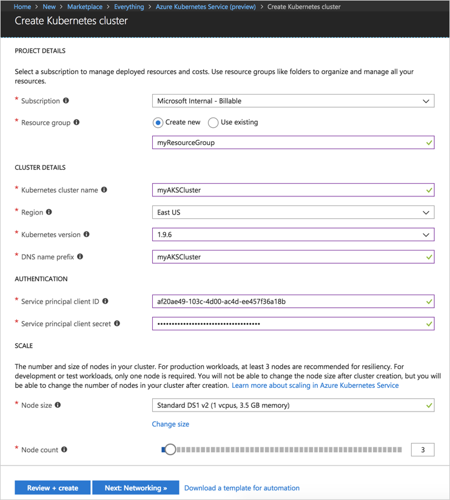
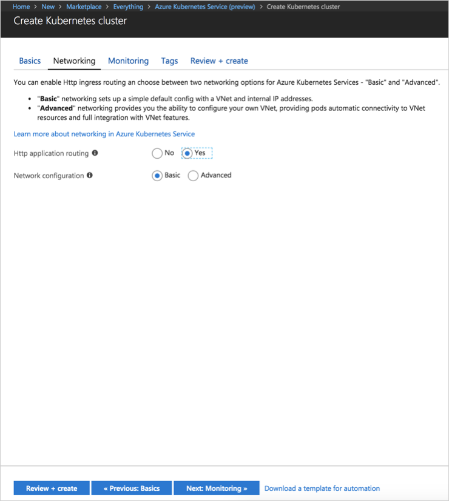
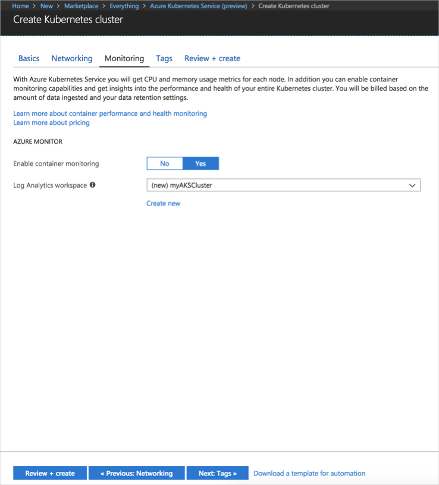
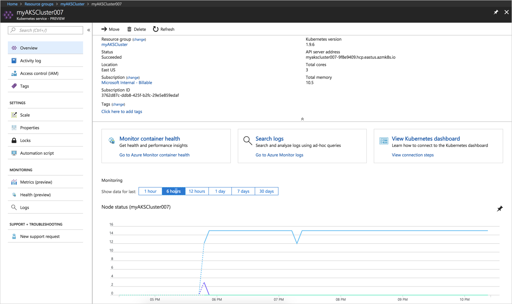
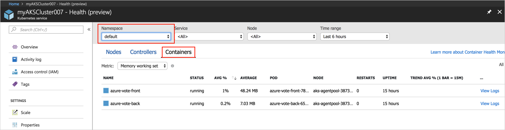
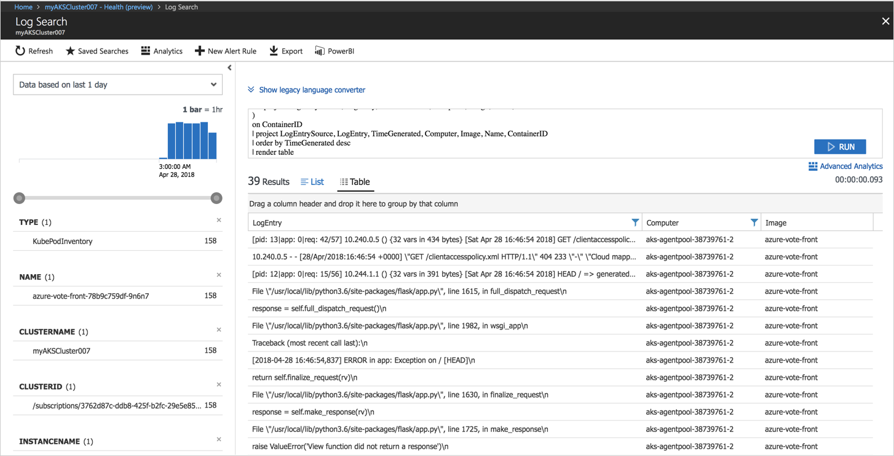

# Quickstart: Deploy an Azure Kubernetes Service (AKS) cluster

In this quickstart, you deploy an AKS cluster using the Azure portal. A multi-container application consisting of web front end and a Redis instance is then run on the cluster. Once completed, the application is accessible over the internet.


This quickstart assumes a basic understanding of Kubernetes concepts. For detailed information on Kubernetes, see the [Kubernetes documentation][kubernetes-documentation].

## Sign in to Azure

Sign in to the Azure portal at http://portal.azure.com.


## Create AKS cluster

Choose **Create a resource** > select **Kubernetes Service** > **Create**.

Complete the following steps under each heading of the create AKS cluster form.

- **PROJECT DETAILS**:  select an Azure subscription and a new or existing Azure resource group.
- **CLUSTER DETAILS**: enter a name, region, version, and DNS name prefix for the AKS cluster.
- **AUTHENTICATION**: create a new service principal or use an existing one. When using an existing SPN, you need to provide the SPN client ID and secret.
- **SCALE**: select a VM size for the AKS nodes. The VM size **cannot** be changed once an AKS cluster has been deployed. Also, select the number of nodes to deploy into the cluster. Node count **can** be adjusted after the cluster has been deployed.

Select **Next: Networking** when complete.



Configure the following networking options:

- **Http application routing** - configures an integrated ingress controller with automatic public DNS name creation. For more information on Http routing, see, [AKS HTTP routing and DNS][http-routing].
- **Network configuration** - choose between basic network configuration using the [kubenet][kubenet] Kubernetes plugin, or advanced networking configuration using [Azure CNI][azure-cni]. For more information on networking options, see [AKS networking overview][aks-network].

Select **Next: Monitoring** when complete.



When deploying an AKS cluster, Azure Container Insights can be configured to monitor health of the AKS cluster and pods running on the cluster. For more information on container health monitoring, see [Monitor Azure Kubernetes Service health][aks-monitor].

Select **Yes** to enable container monitoring and select an existing Log Analytics workspace, or create a new one.

Select **Review + create** and then **Create** when complete.



After a short wait, the AKS cluster is deployed and ready to use. Browse to the AKS cluster resource group, select the AKS resource, and you should see the AKS cluster dashboard.



## Connect to the cluster

To manage a Kubernetes cluster, use [kubectl][kubectl], the Kubernetes command-line client. The kubectl client is pre-installed in the Azure Cloud Shell.

Open Cloud Shell using the button on the top right-hand corner of the Azure portal.


Use the [az aks get-credentials][az-aks-get-credentials] command to configure kubectl to connect to your Kubernetes cluster.

Copy and paste the following command into the Cloud Shell. Modify the resource group and cluster name if needed.

```azurecli-interactive
az aks get-credentials --resource-group myAKSCluster --name myAKSCluster
```

To verify the connection to your cluster, use the [kubectl get][kubectl-get] command to return a list of the cluster nodes.

```azurecli-interactive
kubectl get nodes
```

Output:

```
NAME                       STATUS    ROLES     AGE       VERSION
aks-agentpool-11482510-0   Ready     agent     9m        v1.9.6
aks-agentpool-11482510-1   Ready     agent     8m        v1.9.6
aks-agentpool-11482510-2   Ready     agent     9m        v1.9.6
```

## Run the application

Kubernetes manifest files define a desired state for a cluster, including what container images should be running. For this example, a manifest is used to create all objects needed to run the Azure Vote application. These objects include two [Kubernetes deployments][kubernetes-deployment], one for the Azure Vote front end, and the other for a Redis instance. Also, two [Kubernetes Services][kubernetes-service] are created, an internal service for the Redis instance, and an external service for accessing the Azure Vote application from the internet.

Create a file named `azure-vote.yaml` and copy into it the following YAML code. If you are working in Azure Cloud Shell, create the file using vi or Nano, as if working on a virtual or physical system.

```yaml
apiVersion: apps/v1beta1
kind: Deployment
metadata:
  name: azure-vote-back
spec:
  replicas: 1
  template:
    metadata:
      labels:
        app: azure-vote-back
    spec:
      containers:
      - name: azure-vote-back
        image: redis
        ports:
        - containerPort: 6379
          name: redis
---
apiVersion: v1
kind: Service
metadata:
  name: azure-vote-back
spec:
  ports:
  - port: 6379
  selector:
    app: azure-vote-back
---
apiVersion: apps/v1beta1
kind: Deployment
metadata:
  name: azure-vote-front
spec:
  replicas: 1
  template:
    metadata:
      labels:
        app: azure-vote-front
    spec:
      containers:
      - name: azure-vote-front
        image: microsoft/azure-vote-front:v1
        ports:
        - containerPort: 80
        env:
        - name: REDIS
          value: "azure-vote-back"
---
apiVersion: v1
kind: Service
metadata:
  name: azure-vote-front
spec:
  type: LoadBalancer
  ports:
  - port: 80
  selector:
    app: azure-vote-front
```

Use the [kubectl apply][kubectl-apply] command to run the application.

```azurecli-interactive
kubectl apply -f azure-vote.yaml
```

Output:

```
deployment "azure-vote-back" created
service "azure-vote-back" created
deployment "azure-vote-front" created
service "azure-vote-front" created
```

## Test the application

As the application is run, a [Kubernetes service][kubernetes-service] is created to expose the application to the internet. This process can take a few minutes to complete.

To monitor progress, use the [kubectl get service][kubectl-get] command with the `--watch` argument.

```azurecli-interactive
kubectl get service azure-vote-front --watch
```

Initially, the *EXTERNAL-IP* for the *azure-vote-front* service appears as *pending*.

```
NAME               TYPE           CLUSTER-IP   EXTERNAL-IP   PORT(S)        AGE
azure-vote-front   LoadBalancer   10.0.37.27   <pending>     80:30572/TCP   6s
```

Once the *EXTERNAL-IP* address has changed from *pending* to an *IP address*, use `CTRL-C` to stop the kubectl watch process.

```
azure-vote-front   LoadBalancer   10.0.37.27   52.179.23.131   80:30572/TCP   2m
```

Now browse to the external IP address to see the Azure Vote App.


## Monitor health and logs

If container insights monitoring has been enabled, health metrics for both the AKS cluster and pods running on the cluster are available on the AKS cluster dashboard. For more information on container health monitoring, see [Monitor Azure Kubernetes Service health][aks-monitor].

To see current status, uptime, and resource usage for the Azure Vote pods, browse back to the AKS resource, select **Monitor Container Health** > select the **default** namespace > and select **Containers**. It may take a few minutes for this data to populate in the Azure portal.



To see logs for the `azure-vote-front` pod, select the **View Logs** link. These logs include the stdout and stderr streams from the container.



## Delete cluster

When the cluster is no longer needed, delete the cluster resource, which deletes all associated resources. This operation can be completed in the Azure portal by selecting the delete button on the AKS cluster dashboard. Alternatively, the [az aks delete][az-aks-delete] command can be used in the Cloud Shell.

```azurecli-interactive
az aks delete --resource-group myAKSCluster --name myAKSCluster --no-wait
```

## Get the code

In this quickstart, pre-created container images have been used to create a Kubernetes deployment. The related application code, Dockerfile, and Kubernetes manifest file are available on GitHub.

[https://github.com/Azure-Samples/azure-voting-app-redis][azure-vote-app]

## Next steps

In this quickstart, you deployed a Kubernetes cluster and deployed a multi-container application to it.

To learn more about AKS, and walk through a complete code to deployment example, continue to the Kubernetes cluster tutorial.

> [!div class="nextstepaction"]
> [AKS tutorial][aks-tutorial]

<!-- LINKS - external -->
[azure-vote-app]: https://github.com/Azure-Samples/azure-voting-app-redis.git
[azure-cni]: https://github.com/Azure/azure-container-networking/blob/master/docs/cni.md
[kubectl]: https://kubernetes.io/docs/user-guide/kubectl/
[kubectl-apply]: https://kubernetes.io/docs/reference/generated/kubectl/kubectl-commands#apply
[kubectl-get]: https://kubernetes.io/docs/reference/generated/kubectl/kubectl-commands#get
[kubenet]: https://kubernetes.io/docs/concepts/cluster-administration/network-plugins/#kubenet
[kubernetes-deployment]: https://kubernetes.io/docs/concepts/workloads/controllers/deployment/
[kubernetes-documentation]: https://kubernetes.io/docs/home/
[kubernetes-service]: https://kubernetes.io/docs/concepts/services-networking/service/

<!-- LINKS - internal -->
[az-aks-get-credentials]: /cli/azure/aks?view=azure-cli-latest#az_aks_get_credentials
[az-aks-delete]: /cli/azure/aks#az-aks-delete
[aks-monitor]: ../monitoring/monitoring-container-health.md
[aks-network]: ./networking-overview.md
[aks-tutorial]: ./tutorial-kubernetes-prepare-app.md
[http-routing]: ./http-application-routing.md
