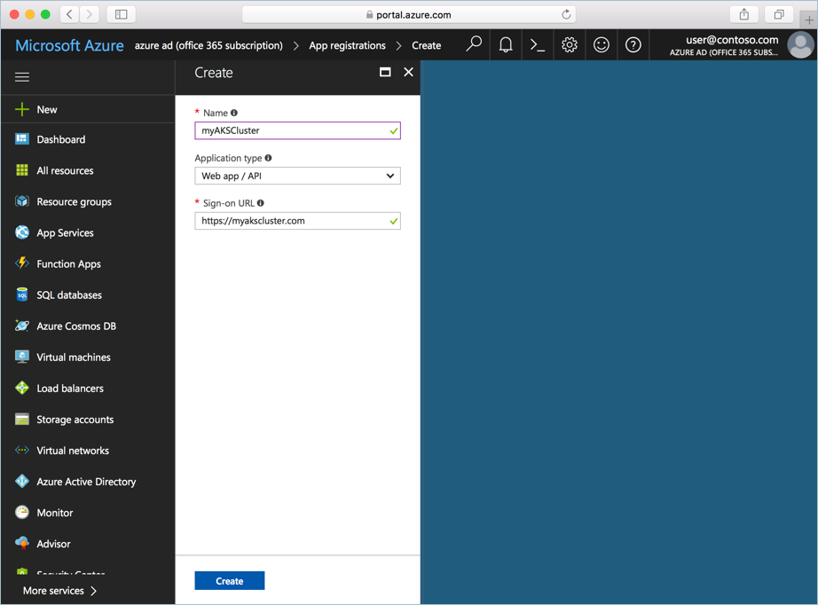
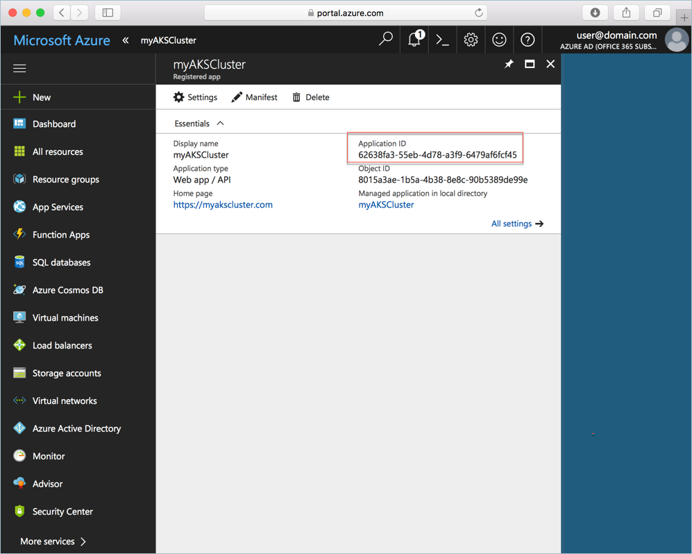
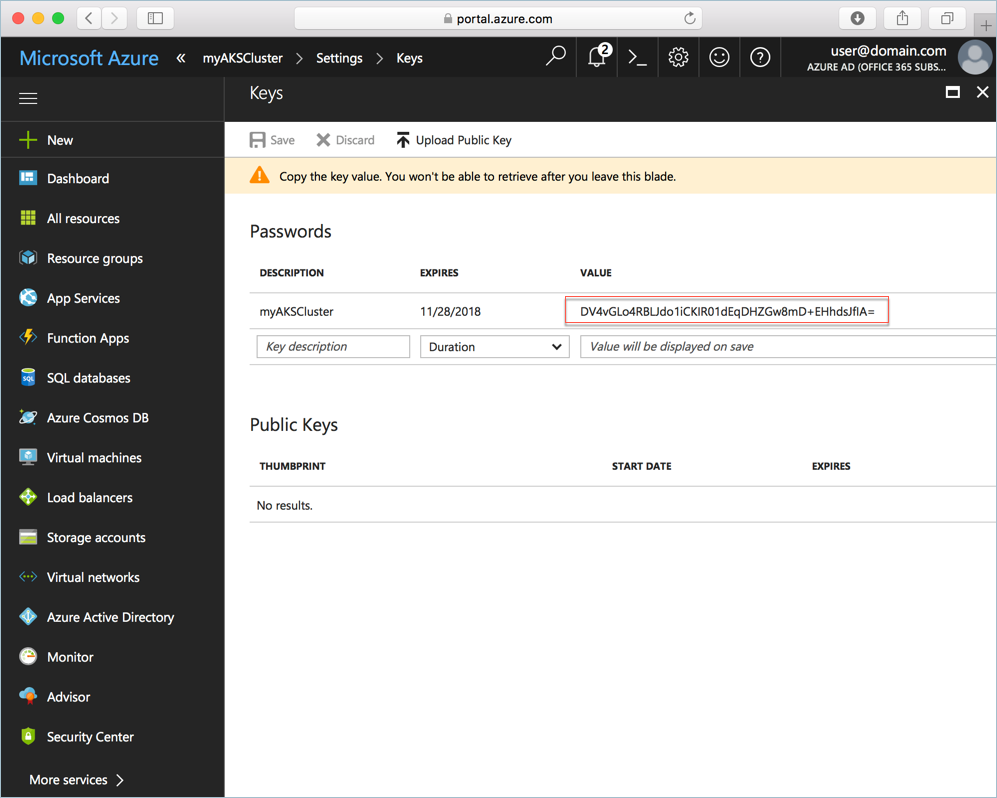
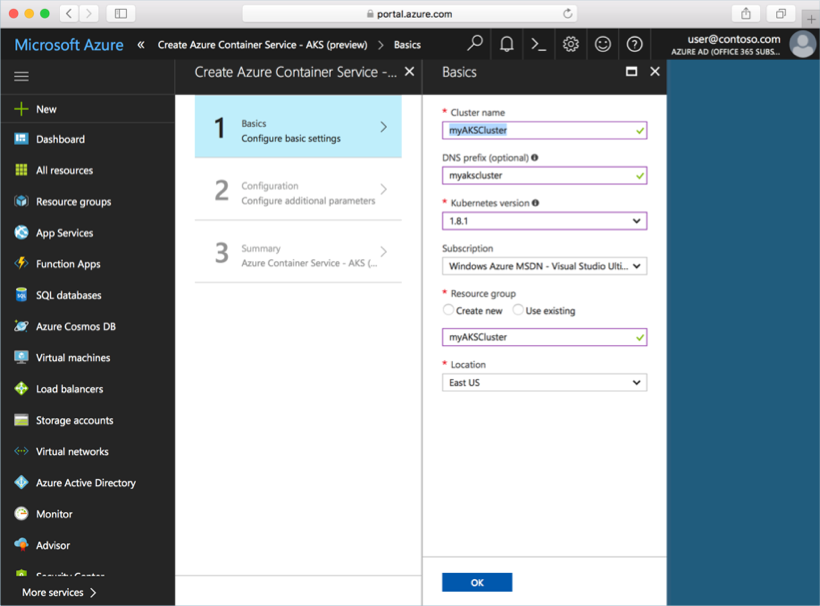
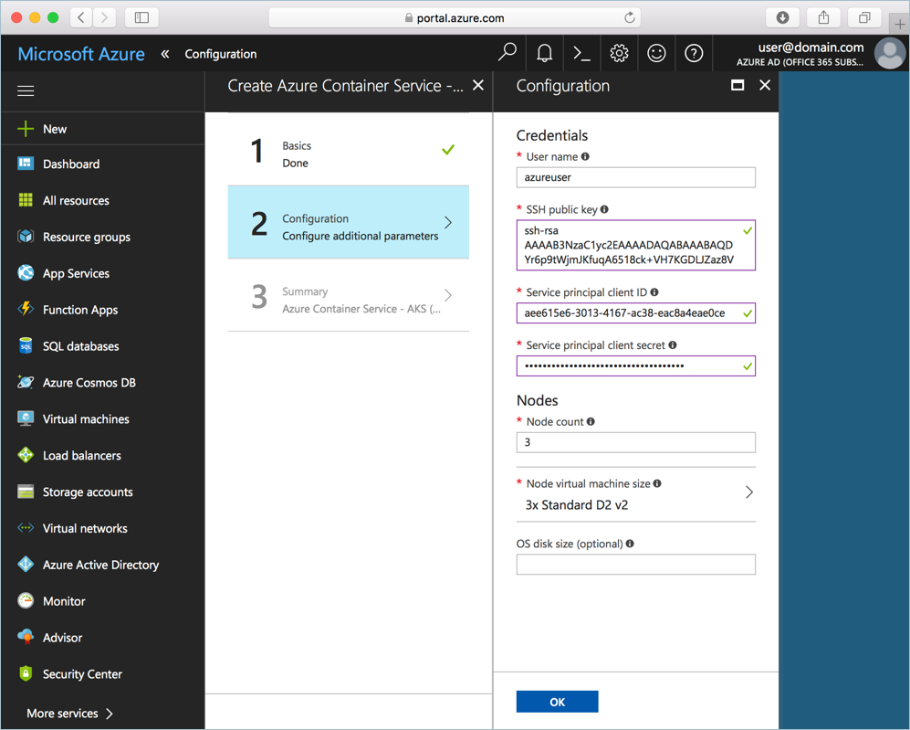

# Quickstart: Deploy an Azure Kubernetes Service (AKS) cluster

In this quickstart, you deploy an AKS cluster using the Azure portal. A multi-container application consisting of web front end and a Redis instance is then run on the cluster. Once completed, the application is accessible over the internet.


This quickstart assumes a basic understanding of Kubernetes concepts. For detailed information on Kubernetes see the [Kubernetes documentation][kubernetes-documentation].

## Sign in to Azure

Sign in to the Azure portal at http://portal.azure.com.

## Create service principal

Before creating the AKS cluster in the Azure portal, you need to create a service principal. Azure uses this service principal to manage the infrastructure associated with the AKS cluster.

Select **Azure Active Directory** > **App registrations** > **New application registration**.

Enter a name for the application, this can be any value. Select **Web app / API** for the application type. Enter a value for the **Sign-on URL**; this can be any value in a valid URL format, but does not need to be a real endpoint.

Select **Create** when finished.



Select the newly created application registration, and take note of the Application ID. This value is needed when creating the AKS cluster.



Next, you must create a password for the service principal. Select **All Settings** > **Keys**, and enter any value for the key description. Select a duration, which is the time for which the service principal is valid.

Click **Save**, and take note of the password value. The password is needed when creating an AKS cluster.



## Create AKS cluster

Select **Create a resource** > **Containers** > **Azure Kubernetes Service - AKS (preview)**.

Provide a cluster name, DNS prefix, resource group name, location, and Kubernetes version for the cluster. Take note of the cluster name and resource group name, these are needed when connecting to the cluster.

Select **OK** when complete.



On the configuration form, enter the following:

- User Name - the name given to the administrative accounts on the cluster nodes.
- SSH public key - associated with the key that will be used to access the cluster nodes.
- Service principal client ID - the Application ID of the service principle you created earlier in this document.
- Service principal client secret - the service principal password you created earlier in this document.
- Node count - number of AKS nodes to create.
- Node virtual machine size - VM size for the AKS nodes
- OS disk size - size for the AKS nodes OS disk.

Select **OK** when complete, and the **OK** again after validation has completed.



After a short wait, the ASK cluster is deployed and ready to use.

## Connect to the cluster

To manage a Kubernetes cluster, use [kubectl][kubectl], the Kubernetes command-line client. The kubectl client is pre-installed in the Azure Cloud Shell.

Open Cloud Shell using the button on the top right-hand corner of the Azure portal.


Specify subscription (if not done already)
```azurecli-interactive
az account set -s SUBSCRIPTION_NAME
```

Use the [az aks get-credentials][az-aks-get-credentials] command to configure kubectl to connect to your Kubernetes cluster.

Copy and paste the following command into the Cloud Shell. Modify the resource group and cluster name if needed.

```azurecli-interactive
az aks get-credentials --resource-group myAKSCluster --name myAKSCluster
```

To verify the connection to your cluster, use the [kubectl get][kubectl-get] command to return a list of the cluster nodes.

```azurecli-interactive
kubectl get nodes
```

Output:

```
NAME                       STATUS    ROLES     AGE       VERSION
aks-agentpool-14693408-0   Ready     agent     6m        v1.8.1
aks-agentpool-14693408-1   Ready     agent     6m        v1.8.1
aks-agentpool-14693408-2   Ready     agent     7m        v1.8.1
```

## Run the application

A Kubernetes manifest file defines a desired state for the cluster, including which container images should be running. For this example, you use a manifest to create all objects needed to run the Azure Vote application.

Create a file named `azure-vote.yaml` and copy into it the following YAML code. If you are working in Azure Cloud Shell, create the file using vi or Nano, as if working on a virtual or physical system.

```yaml
apiVersion: apps/v1beta1
kind: Deployment
metadata:
  name: azure-vote-back
spec:
  replicas: 1
  template:
    metadata:
      labels:
        app: azure-vote-back
    spec:
      containers:
      - name: azure-vote-back
        image: redis
        ports:
        - containerPort: 6379
          name: redis
---
apiVersion: v1
kind: Service
metadata:
  name: azure-vote-back
spec:
  ports:
  - port: 6379
  selector:
    app: azure-vote-back
---
apiVersion: apps/v1beta1
kind: Deployment
metadata:
  name: azure-vote-front
spec:
  replicas: 1
  template:
    metadata:
      labels:
        app: azure-vote-front
    spec:
      containers:
      - name: azure-vote-front
        image: microsoft/azure-vote-front:v1
        ports:
        - containerPort: 80
        env:
        - name: REDIS
          value: "azure-vote-back"
---
apiVersion: v1
kind: Service
metadata:
  name: azure-vote-front
spec:
  type: LoadBalancer
  ports:
  - port: 80
  selector:
    app: azure-vote-front
```

Use the [kubectl create][kubectl-create] command to run the application.

```azurecli-interactive
kubectl create -f azure-vote.yaml
```

Output:

```
deployment "azure-vote-back" created
service "azure-vote-back" created
deployment "azure-vote-front" created
service "azure-vote-front" created
```

## Test the application

As the application is run, a [Kubernetes service][kubernetes-service] is created that exposes the application front end to the internet. This process can take a few minutes to complete.

To monitor progress, use the [kubectl get service][kubectl-get] command with the `--watch` argument.

```azurecli-interactive
kubectl get service azure-vote-front --watch
```

Initially, the *EXTERNAL-IP* for the *azure-vote-front* service appears as *pending*.

```
NAME               TYPE           CLUSTER-IP   EXTERNAL-IP   PORT(S)        AGE
azure-vote-front   LoadBalancer   10.0.37.27   <pending>     80:30572/TCP   6s
```

Once the *EXTERNAL-IP* address has changed from *pending* to an *IP address*, use `CTRL-C` to stop the kubectl watch process.

```
azure-vote-front   LoadBalancer   10.0.37.27   52.179.23.131   80:30572/TCP   2m
```

Now browse to the external IP address to see the Azure Vote App.


## Delete cluster

When the cluster is no longer needed, delete the cluster resource group, which deletes all associated resources. This can be completed in the Azure portal by selecting the resource group and clicking the delete button. Alternatively, the [az group delete][az-group-delete] command can be used in the Cloud Shell.

```azurecli-interactive
az group delete --name myAKSCluster --no-wait
```

## Get the code

In this quickstart, pre-created container images have been used to create a Kubernetes deployment. The related application code, Dockerfile, and Kubernetes manifest file are available on GitHub.

[https://github.com/Azure-Samples/azure-voting-app-redis][azure-vote-app]

## Next steps

In this quick start, you deployed a Kubernetes cluster and deployed a multi-container application to it.

To learn more about AKS, and walk through a complete code to deployment example, continue to the Kubernetes cluster tutorial.

> [!div class="nextstepaction"]
> [AKS tutorial][aks-tutorial]

<!-- LINKS - external -->
[azure-vote-app]: https://github.com/Azure-Samples/azure-voting-app-redis.git
[kubectl]: https://kubernetes.io/docs/user-guide/kubectl/
[kubectl-create]: https://kubernetes.io/docs/reference/generated/kubectl/kubectl-commands#create
[kubectl-get]: https://kubernetes.io/docs/reference/generated/kubectl/kubectl-commands#get
[kubernetes-documentation]: https://kubernetes.io/docs/home/
[kubernetes-service]: https://kubernetes.io/docs/concepts/services-networking/service/

<!-- LINKS - internal -->
[az-aks-get-credentials]: /cli/azure/aks?view=azure-cli-latest#az_aks_get_credentials
[az-group-delete]: /cli/azure/group#delete
[aks-tutorial]: ./tutorial-kubernetes-prepare-app.md


