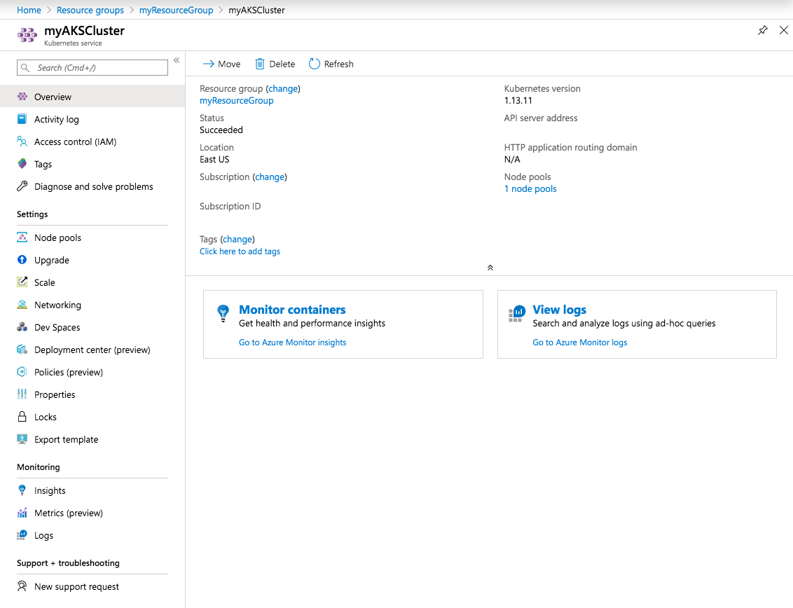
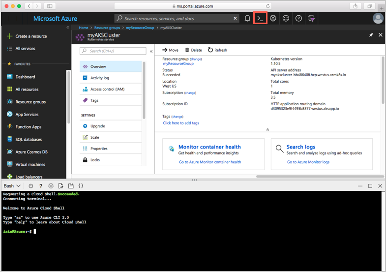
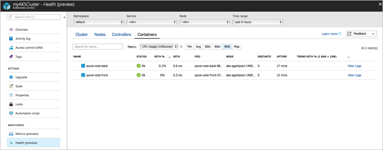
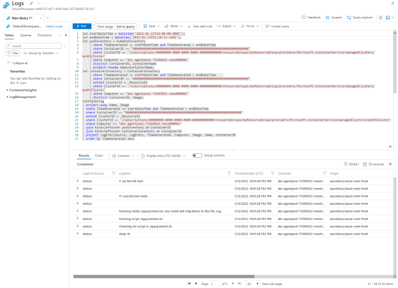

# Quickstart: Deploy an Azure Kubernetes Service (AKS) cluster using the Azure portal

Azure Kubernetes Service (AKS) is a managed Kubernetes service that lets you quickly deploy and manage clusters. In this quickstart, you will:
* Deploy an AKS cluster using the Azure portal. 
* Run a multi-container application with a web front-end and a Redis instance in the cluster. 
* Monitor the health of the cluster and pods that run your application.


This quickstart assumes a basic understanding of Kubernetes concepts. For more information, see [Kubernetes core concepts for Azure Kubernetes Service (AKS)][kubernetes-concepts].

If you don't have an Azure subscription, create a [free account](https://azure.microsoft.com/free/?WT.mc_id=A261C142F) before you begin.

## Prerequisites

Sign in to the Azure portal at [https://portal.azure.com](https://portal.azure.com).

## Create an AKS cluster

1. On the Azure portal menu or from the **Home** page, select **Create a resource**.

2. Select **Containers** > **Kubernetes Service**.

3. On the **Basics** page, configure the following options:
    - **Project details**: 
        * Select an Azure **Subscription**.
        * Select or create an Azure **Resource group**, such as *myResourceGroup*.
    - **Cluster details**: 
        * Enter a **Kubernetes cluster name**, such as *myAKSCluster*. 
        * Select a **Region** and **Kubernetes version** for the AKS cluster.
    - **Primary node pool**: 
        * Select a VM **Node size** for the AKS nodes. The VM size *cannot* be changed once an AKS cluster has been deployed.
        * Select the number of nodes to deploy into the cluster. For this quickstart, set **Node count** to *1*. Node count *can* be adjusted after the cluster has been deployed.
    
    

4. Select **Next: Node pools** when complete.

5. Keep the default **Node pools** options. At the bottom of the screen, click **Next: Authentication**.
    > [!CAUTION]
    > Newly created Azure AD service principals may take several minutes to propagate and become available, causing "service principal not found" errors and validation failures in Azure portal. If you hit this bump, please visit [our troubleshooting article](troubleshooting.md#received-an-error-saying-my-service-principal-wasnt-found-or-is-invalid-when-i-try-to-create-a-new-cluster) for mitigation.

6. On the **Authentication** page, configure the following options:
    - Create a new cluster identity by either:
        * Leaving the **Authentication** field with **System-assinged managed identity**, or
        * Choosing **Service Principal** to use a service principal. 
            * Select *(new) default service principal* to create a default service principal, or
            * Select *Configure service principal* to use an existing one. You will need to provide the existing principal's SPN client ID and secret.
    - Enable the Kubernetes role-based access control (Kubernetes RBAC) option to provide more fine-grained control over access to the Kubernetes resources deployed in your AKS cluster.

    By default, *Basic* networking is used, and Azure Monitor for containers is enabled. 

7. Click **Review + create** and then **Create** when validation completes. 


8. It takes a few minutes to create the AKS cluster. When your deployment is complete, navigate to your resource by either:
    * Clicking **Go to resource**, or
    * Browsing to the AKS cluster resource group and selecting the AKS resource. 
        * Per example cluster dashboard below: browsing for *myResourceGroup* and selecting *myAKSCluster* resource.

        

## Connect to the cluster

To manage a Kubernetes cluster, use the Kubernetes command-line client, [kubectl][kubectl]. `kubectl` is already installed if you use Azure Cloud Shell. 

1. Open Cloud Shell using the `>_` button on the top of the Azure portal.

    

    > [!NOTE]
    > To perform these operations in a local shell installation:
    > 1. Verify Azure CLI is installed.
    > 2. Connect to Azure via the `az login` command.

2. Configure `kubectl` to connect to your Kubernetes cluster using the [az aks get-credentials][az-aks-get-credentials] command. The following command downloads credentials and configures the Kubernetes CLI to use them.

    ```azurecli
    az aks get-credentials --resource-group myResourceGroup --name myAKSCluster
    ```

3. Verify the connection to your cluster using `kubectl get` to return a list of the cluster nodes.

    ```console
    kubectl get nodes
    ```

    Output shows the single node created in the previous steps. Make sure the node status is *Ready*:

    ```output
    NAME                       STATUS    ROLES     AGE       VERSION
    aks-agentpool-14693408-0   Ready     agent     15m       v1.11.5
    ```

## Run the application

A Kubernetes manifest file defines a cluster's desired state, like which container images to run. 

In this quickstart, you will use a manifest to create all objects needed to run the Azure Vote application. This manifest includes two Kubernetes deployments:
* The sample Azure Vote Python applications.
* A Redis instance. 

Two Kubernetes Services are also created:
* An internal service for the Redis instance.
* An external service to access the Azure Vote application from the internet.

1. In the Cloud Shell, use an editor to create a file named `azure-vote.yaml`, such as:
    * `code azure-vote.yaml`
    * `nano azure-vote.yaml`, or 
    * `vi azure-vote.yaml`. 

1. Copy in the following YAML definition:

    ```yaml
    apiVersion: apps/v1
    kind: Deployment
    metadata:
      name: azure-vote-back
    spec:
      replicas: 1
      selector:
        matchLabels:
          app: azure-vote-back
      template:
        metadata:
          labels:
            app: azure-vote-back
        spec:
          nodeSelector:
            "beta.kubernetes.io/os": linux
          containers:
          - name: azure-vote-back
            image: mcr.microsoft.com/oss/bitnami/redis:6.0.8
            env:
            - name: ALLOW_EMPTY_PASSWORD
              value: "yes"
            resources:
              requests:
                cpu: 100m
                memory: 128Mi
              limits:
                cpu: 250m
                memory: 256Mi
            ports:
            - containerPort: 6379
              name: redis
    ---
    apiVersion: v1
    kind: Service
    metadata:
      name: azure-vote-back
    spec:
      ports:
      - port: 6379
      selector:
        app: azure-vote-back
    ---
    apiVersion: apps/v1
    kind: Deployment
    metadata:
      name: azure-vote-front
    spec:
      replicas: 1
      selector:
        matchLabels:
          app: azure-vote-front
      template:
        metadata:
          labels:
            app: azure-vote-front
        spec:
          nodeSelector:
            "beta.kubernetes.io/os": linux
          containers:
          - name: azure-vote-front
            image: mcr.microsoft.com/azuredocs/azure-vote-front:v1
            resources:
              requests:
                cpu: 100m
                memory: 128Mi
              limits:
                cpu: 250m
                memory: 256Mi
            ports:
            - containerPort: 80
            env:
            - name: REDIS
              value: "azure-vote-back"
    ---
    apiVersion: v1
    kind: Service
    metadata:
      name: azure-vote-front
    spec:
      type: LoadBalancer
      ports:
      - port: 80
      selector:
        app: azure-vote-front
    ```

1. Deploy the application using the `kubectl apply` command and specify the name of your YAML manifest:

    ```console
    kubectl apply -f azure-vote.yaml
    ```

    Output shows the successfully created deployments and services:

    ```output
    deployment "azure-vote-back" created
    service "azure-vote-back" created
    deployment "azure-vote-front" created
    service "azure-vote-front" created
    ```

## Test the application

When the application runs, a Kubernetes service exposes the application front end to the internet. This process can take a few minutes to complete.

To monitor progress, use the `kubectl get service` command with the `--watch` argument.

```console
kubectl get service azure-vote-front --watch
```

The **EXTERNAL-IP** output for the `azure-vote-front` service will initially show as *pending*.

```output
NAME               TYPE           CLUSTER-IP   EXTERNAL-IP   PORT(S)        AGE
azure-vote-front   LoadBalancer   10.0.37.27   <pending>     80:30572/TCP   6s
```

Once the **EXTERNAL-IP** address changes from *pending* to an actual public IP address, use `CTRL-C` to stop the `kubectl` watch process. The following example output shows a valid public IP address assigned to the service:


```output
azure-vote-front   LoadBalancer   10.0.37.27   52.179.23.131   80:30572/TCP   2m
```

To see the Azure Vote app in action, open a web browser to the external IP address of your service.


## Monitor health and logs

When you created the cluster, Azure Monitor for containers was enabled. Azure Monitor for containers provides health metrics for both the AKS cluster and pods running on the cluster.

Metric data takes a few minutes to populate in the Azure portal. To see current health status, uptime, and resource usage for the Azure Vote pods:

1. Browse back to the AKS resource in the Azure portal.
1. Under **Monitoring** on the left-hand side, choose **Insights**.
1. Across the top, choose to **+ Add Filter**.
1. Select **Namespace** as the property, then choose *\<All but kube-system\>*.
1. Select **Containers** to view them.

The `azure-vote-back` and `azure-vote-front` containers will display, as shown in the following example:



To view logs for the `azure-vote-front` pod, select **View container logs** from the containers list drop-down. These logs include the *stdout* and *stderr* streams from the container.



## Delete cluster

To avoid Azure charges, clean up your unnecessary resources. Select the **Delete** button on the AKS cluster dashboard. You can also use the [az aks delete][az-aks-delete] command in the Cloud Shell:

```azurecli
az aks delete --resource-group myResourceGroup --name myAKSCluster --no-wait
```
> [!NOTE]
> When you delete the cluster, the Azure Active Directory service principal used by the AKS cluster is not removed. For steps on how to remove the service principal, see [AKS service principal considerations and deletion][sp-delete].
> 
> If you used a managed identity, the identity is managed by the platform and does not require removal.

## Get the code

Pre-existing container images were used in this quickstart to create a Kubernetes deployment. The related application code, Dockerfile, and Kubernetes manifest file are [available on GitHub.][azure-vote-app]

## Next steps

In this quickstart, you deployed a Kubernetes cluster and then deployed a multi-container application to it. Access the Kubernetes web dashboard for your AKS cluster.


To learn more about AKS by walking through a complete example, including building an application, deploying from Azure Container Registry, updating a running application, and scaling and upgrading your cluster, continue to the Kubernetes cluster tutorial.

> [!div class="nextstepaction"]
> [AKS tutorial][aks-tutorial]

<!-- LINKS - external -->
[azure-vote-app]: https://github.com/Azure-Samples/azure-voting-app-redis.git
[kubectl]: https://kubernetes.io/docs/user-guide/kubectl/
[kubectl-apply]: https://kubernetes.io/docs/reference/generated/kubectl/kubectl-commands#apply
[kubectl-get]: https://kubernetes.io/docs/reference/generated/kubectl/kubectl-commands#get
[kubernetes-documentation]: https://kubernetes.io/docs/home/

<!-- LINKS - internal -->
[kubernetes-concepts]: concepts-clusters-workloads.md
[az-aks-get-credentials]: /cli/azure/aks#az_aks_get_credentials
[az-aks-delete]: /cli/azure/aks#az_aks_delete
[aks-monitor]: ../azure-monitor/containers/container-insights-overview.md
[aks-network]: ./concepts-network.md
[aks-tutorial]: ./tutorial-kubernetes-prepare-app.md
[http-routing]: ./http-application-routing.md
[sp-delete]: kubernetes-service-principal.md#additional-considerations