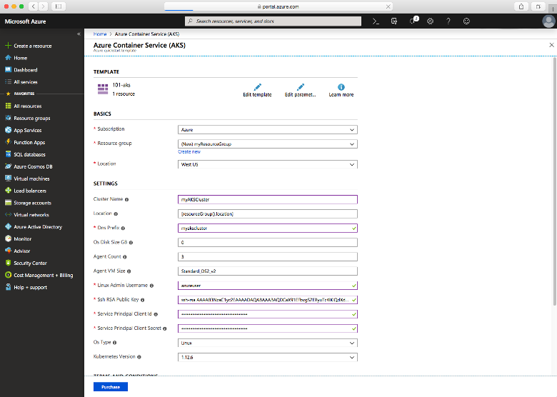

# Quickstart: Deploy an Azure Kubernetes Service (AKS) cluster using an ARM template

Azure Kubernetes Service (AKS) is a managed Kubernetes service that lets you quickly deploy and manage clusters. In this quickstart, you will:
* Deploy an AKS cluster using an Azure Resource Manager template. 
* Run a multi-container application with a web front-end and a Redis instance in the cluster. 


[!INCLUDE [About Azure Resource Manager](../../includes/resource-manager-quickstart-introduction.md)]

This quickstart assumes a basic understanding of Kubernetes concepts. For more information, see [Kubernetes core concepts for Azure Kubernetes Service (AKS)][kubernetes-concepts].

If your environment meets the prerequisites and you're familiar with using ARM templates, select the **Deploy to Azure** button. The template will open in the Azure portal.

[](https://portal.azure.com/#create/Microsoft.Template/uri/https%3A%2F%2Fraw.githubusercontent.com%2FAzure%2Fazure-quickstart-templates%2Fmaster%2F101-aks%2Fazuredeploy.json)

[!INCLUDE [quickstarts-free-trial-note](../../includes/quickstarts-free-trial-note.md)]

[!INCLUDE [azure-cli-prepare-your-environment.md](../../includes/azure-cli-prepare-your-environment.md)]

- This article requires version 2.0.61 or later of the Azure CLI. If using Azure Cloud Shell, the latest version is already installed.

- To create an AKS cluster using a Resource Manager template, you provide an SSH public key. If you need this resource, see the following section; otherwise skip to the [Review the template](#review-the-template) section.

### Create an SSH key pair

To access AKS nodes, you connect using an SSH key pair (public and private), which you generate using the `ssh-keygen` command. By default, these files are created in the *~/.ssh* directory. Running the `ssh-keygen` command will overwrite any SSH key pair with the same name already existing in the given location.

1. Go to [https://shell.azure.com](https://shell.azure.com) to open Cloud Shell in your browser.

1. Run the `ssh-keygen` command. The following example creates an SSH key pair using RSA encryption and a bit length of 2048:

    ```console
    ssh-keygen -t rsa -b 2048
    ```

For more information about creating SSH keys, see [Create and manage SSH keys for authentication in Azure][ssh-keys].

## Review the template

The template used in this quickstart is from [Azure Quickstart templates](https://azure.microsoft.com/resources/templates/101-aks/).

:::code language="json" source="~/quickstart-templates/101-aks/azuredeploy.json":::

For more AKS samples, see the [AKS quickstart templates][aks-quickstart-templates] site.

## Deploy the template

1. Select the following button to sign in to Azure and open a template.

    [](https://portal.azure.com/#create/Microsoft.Template/uri/https%3A%2F%2Fraw.githubusercontent.com%2FAzure%2Fazure-quickstart-templates%2Fmaster%2F101-aks%2Fazuredeploy.json)

2. Select or enter the following values.

    For this quickstart, leave the default values for the *OS Disk Size GB*, *Agent Count*, *Agent VM Size*, *OS Type*, and *Kubernetes Version*. Provide your own values for the following template parameters:

    * **Subscription**: Select an Azure subscription.
    * **Resource group**: Select **Create new**. Enter a unique name for the resource group, such as *myResourceGroup*, then choose **OK**.
    * **Location**: Select a location, such as **East US**.
    * **Cluster name**: Enter a unique name for the AKS cluster, such as *myAKSCluster*.
    * **DNS prefix**: Enter a unique DNS prefix for your cluster, such as *myakscluster*.
    * **Linux Admin Username**: Enter a username to connect using SSH, such as *azureuser*.
    * **SSH RSA Public Key**: Copy and paste the *public* part of your SSH key pair (by default, the contents of *~/.ssh/id_rsa.pub*).

    

3. Select **Review + Create**.

It takes a few minutes to create the AKS cluster. Wait for the cluster to be successfully deployed before you move on to the next step.

## Validate the deployment

### Connect to the cluster

To manage a Kubernetes cluster, use the Kubernetes command-line client, [kubectl][kubectl]. `kubectl` is already installed if you use Azure Cloud Shell. 

1. Install `kubectl` locally using the [az aks install-cli][az-aks-install-cli] command:

    ```azurecli
    az aks install-cli
    ```

2. Configure `kubectl` to connect to your Kubernetes cluster using the [az aks get-credentials][az-aks-get-credentials] command. This command downloads credentials and configures the Kubernetes CLI to use them.

    ```azurecli-interactive
    az aks get-credentials --resource-group myResourceGroup --name myAKSCluster
    ```

3. Verify the connection to your cluster using the [kubectl get][kubectl-get] command. This command returns a list of the cluster nodes.

    ```console
    kubectl get nodes
    ```

    Output shows the nodes created in the previous steps. Make sure that the status for all the nodes is *Ready*:

    ```output
    NAME                       STATUS   ROLES   AGE     VERSION
    aks-agentpool-41324942-0   Ready    agent   6m44s   v1.12.6    
    aks-agentpool-41324942-1   Ready    agent   6m46s   v1.12.6
    aks-agentpool-41324942-2   Ready    agent   6m45s   v1.12.6
    ```

### Run the application

A [Kubernetes manifest file][kubernetes-deployment] defines a cluster's desired state, such as which container images to run. 

In this quickstart, you will use a manifest to create all objects needed to run the [Azure Vote application][azure-vote-app]. This manifest includes two [Kubernetes deployments][kubernetes-deployment]:
* The sample Azure Vote Python applications.
* A Redis instance. 

Two [Kubernetes Services][kubernetes-service] are also created:
* An internal service for the Redis instance.
* An external service to access the Azure Vote application from the internet.

1. Create a file named `azure-vote.yaml`.
    * If you use the Azure Cloud Shell, this file can be created using `vi` or `nano` as if working on a virtual or physical system
1. Copy in the following YAML definition:

    ```yaml
    apiVersion: apps/v1
    kind: Deployment
    metadata:
      name: azure-vote-back
    spec:
      replicas: 1
      selector:
        matchLabels:
          app: azure-vote-back
      template:
        metadata:
          labels:
            app: azure-vote-back
        spec:
          nodeSelector:
            "beta.kubernetes.io/os": linux
          containers:
          - name: azure-vote-back
            image: mcr.microsoft.com/oss/bitnami/redis:6.0.8
            env:
            - name: ALLOW_EMPTY_PASSWORD
              value: "yes"
            resources:
              requests:
                cpu: 100m
                memory: 128Mi
              limits:
                cpu: 250m
                memory: 256Mi
            ports:
            - containerPort: 6379
              name: redis
    ---
    apiVersion: v1
    kind: Service
    metadata:
      name: azure-vote-back
    spec:
      ports:
      - port: 6379
      selector:
        app: azure-vote-back
    ---
    apiVersion: apps/v1
    kind: Deployment
    metadata:
      name: azure-vote-front
    spec:
      replicas: 1
      selector:
        matchLabels:
          app: azure-vote-front
      template:
        metadata:
          labels:
            app: azure-vote-front
        spec:
          nodeSelector:
            "beta.kubernetes.io/os": linux
          containers:
          - name: azure-vote-front
            image: mcr.microsoft.com/azuredocs/azure-vote-front:v1
            resources:
              requests:
                cpu: 100m
                memory: 128Mi
              limits:
                cpu: 250m
                memory: 256Mi
            ports:
            - containerPort: 80
            env:
            - name: REDIS
              value: "azure-vote-back"
    ---
    apiVersion: v1
    kind: Service
    metadata:
      name: azure-vote-front
    spec:
      type: LoadBalancer
      ports:
      - port: 80
      selector:
        app: azure-vote-front
    ```

1. Deploy the application using the [kubectl apply][kubectl-apply] command and specify the name of your YAML manifest:

    ```console
    kubectl apply -f azure-vote.yaml
    ```

    Output shows the successfully created deployments and services:

    ```output
    deployment "azure-vote-back" created
    service "azure-vote-back" created
    deployment "azure-vote-front" created
    service "azure-vote-front" created
    ```

### Test the application

When the application runs, a Kubernetes service exposes the application front end to the internet. This process can take a few minutes to complete.

Monitor progress using the [kubectl get service][kubectl-get] command with the `--watch` argument.

```console
kubectl get service azure-vote-front --watch
```

The **EXTERNAL-IP** output for the `azure-vote-front` service will initially show as *pending*.

```output
NAME               TYPE           CLUSTER-IP   EXTERNAL-IP   PORT(S)        AGE
azure-vote-front   LoadBalancer   10.0.37.27   <pending>     80:30572/TCP   6s
```

Once the **EXTERNAL-IP** address changes from *pending* to an actual public IP address, use `CTRL-C` to stop the `kubectl` watch process. The following example output shows a valid public IP address assigned to the service:

```output
azure-vote-front   LoadBalancer   10.0.37.27   52.179.23.131   80:30572/TCP   2m
```

To see the Azure Vote app in action, open a web browser to the external IP address of your service.


## Clean up resources

To avoid Azure charges, clean up your unnecessary resources. Use the [az group delete][az-group-delete] command to remove the resource group, container service, and all related resources.

```azurecli-interactive
az group delete --name myResourceGroup --yes --no-wait
```

> [!NOTE]
> When you delete the cluster, the Azure Active Directory service principal used by the AKS cluster is not removed. For steps on how to remove the service principal, see [AKS service principal considerations and deletion][sp-delete].
> 
> If you used a managed identity, the identity is managed by the platform and does not require removal.

## Get the code

Pre-existing container images were used in this quickstart to create a Kubernetes deployment. The related application code, Dockerfile, and Kubernetes manifest file are [available on GitHub.][azure-vote-app]

## Next steps

In this quickstart, you deployed a Kubernetes cluster and then deployed a multi-container application to it. [Access the Kubernetes web dashboard][kubernetes-dashboard] for your AKS cluster.

To learn more about AKS, and walk through a complete code to deployment example, continue to the Kubernetes cluster tutorial.

> [!div class="nextstepaction"]
> [AKS tutorial][aks-tutorial]

<!-- LINKS - external -->
[azure-vote-app]: https://github.com/Azure-Samples/azure-voting-app-redis.git
[kubectl]: https://kubernetes.io/docs/user-guide/kubectl/
[kubectl-apply]: https://kubernetes.io/docs/reference/generated/kubectl/kubectl-commands#apply
[kubectl-get]: https://kubernetes.io/docs/reference/generated/kubectl/kubectl-commands#get
[azure-dev-spaces]: ../dev-spaces/index.yml
[aks-quickstart-templates]: https://azure.microsoft.com/resources/templates/?term=Azure+Kubernetes+Service

<!-- LINKS - internal -->
[kubernetes-concepts]: concepts-clusters-workloads.md
[aks-monitor]: ../azure-monitor/containers/container-insights-onboard.md
[aks-tutorial]: ./tutorial-kubernetes-prepare-app.md
[az-aks-browse]: /cli/azure/aks#az_aks_browse
[az-aks-create]: /cli/azure/aks#az_aks_create
[az-aks-get-credentials]: /cli/azure/aks#az_aks_get_credentials
[az-aks-install-cli]: /cli/azure/aks#az_aks_install_cli
[az-group-create]: /cli/azure/group#az_group_create
[az-group-delete]: /cli/azure/group#az_group_delete
[azure-cli-install]: /cli/azure/install-azure-cli
[sp-delete]: kubernetes-service-principal.md#additional-considerations
[azure-portal]: https://portal.azure.com
[kubernetes-deployment]: concepts-clusters-workloads.md#deployments-and-yaml-manifests
[kubernetes-service]: concepts-network.md#services
[kubernetes-dashboard]: kubernetes-dashboard.md
[ssh-keys]: ../virtual-machines/linux/create-ssh-keys-detailed.md
[az-ad-sp-create-for-rbac]: /cli/azure/ad/sp#az_ad_sp_create_for_rbac
