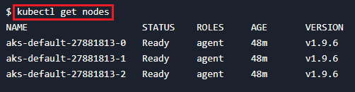

# Quickstart: Create an Azure Kubernetes Service (AKS) cluster by using Terraform

Azure Kubernetes Service (AKS) is a managed Kubernetes service that lets you quickly deploy and manage clusters. In this quickstart, you:

* Deploy an AKS cluster using Terraform. The sample code is fully encapsulated such that it automatically creates a service principal and SSH key pair (using the [AzAPI provider](/azure/developer/terraform/overview-azapi-provider)).
* Run a sample multi-container application with a web front-end and a Redis instance in the cluster.

:::image type="content" source="media/quick-kubernetes-deploy-terraform/azure-voting-application.png" alt-text="Preview of Azure Vote sample application.":::

[!INCLUDE [Terraform abstract](~/azure-dev-docs-pr/articles/terraform/includes/abstract.md)]

In this article, you learn how to:

> [!div class="checklist"]
> * Create a random value for the Azure resource group name using [random_pet](https://registry.terraform.io/providers/hashicorp/random/latest/docs/resources/pet).
> * Create an Azure resource group using [azurerm_resource_group](https://registry.terraform.io/providers/hashicorp/azurerm/latest/docs/resources/resource_group).
> * Access the configuration of the AzureRM provider to get the Azure Object ID using [azurerm_client_config](https://registry.terraform.io/providers/hashicorp/azurerm/latest/docs/data-sources/client_config).
> * Create a Kubernetes cluster using [azurerm_kubernetes_cluster](https://registry.terraform.io/providers/hashicorp/azurerm/latest/docs/resources/kubernetes_cluster).
> * Create an AzAPI resource [azapi_resource](https://registry.terraform.io/providers/Azure/azapi/latest/docs/resources/azapi_resource).
> * Create an AzAPI resource to generate an SSH key pair using [azapi_resource_action](https://registry.terraform.io/providers/Azure/azapi/latest/docs/resources/azapi_resource_action).

## Prerequisites

- [Install and configure Terraform](/azure/developer/terraform/quickstart-configure)

- **Kubernetes command-line tool (kubectl):** [Download kubectl](https://kubernetes.io/releases/download/).

## Login to your Azure Account

[!INCLUDE [authenticate-to-azure.md](~/azure-dev-docs-pr/articles/terraform/includes/authenticate-to-azure.md)]

## Implement the Terraform code

> [!NOTE]
> The sample code for this article is located in the [Azure Terraform GitHub repo](https://github.com/Azure/terraform/tree/master/quickstart/201-k8s-cluster-with-tf-and-aks). You can view the log file containing the [test results from current and previous versions of Terraform](https://github.com/Azure/terraform/tree/master/quickstart/201-k8s-cluster-with-tf-and-aks/TestRecord.md).
>
> See more [articles and sample code showing how to use Terraform to manage Azure resources](/azure/terraform)

1. Create a directory in which to test the sample Terraform code and make it the current directory.

1. Create a file named `providers.tf` and insert the following code:

    [!code-terraform[master](~/terraform_samples/quickstart/201-k8s-cluster-with-tf-and-aks/providers.tf)]

1. Create a file named `ssh.tf` and insert the following code:

    [!code-terraform[master](~/terraform_samples/quickstart/201-k8s-cluster-with-tf-and-aks/ssh.tf)]

1. Create a file named `main.tf` and insert the following code:

    [!code-terraform[master](~/terraform_samples/quickstart/201-k8s-cluster-with-tf-and-aks/main.tf)]

1. Create a file named `variables.tf` and insert the following code:

    [!code-terraform[master](~/terraform_samples/quickstart/201-k8s-cluster-with-tf-and-aks/variables.tf)]

1. Create a file named `outputs.tf` and insert the following code:

    [!code-terraform[master](~/terraform_samples/quickstart/201-k8s-cluster-with-tf-and-aks/outputs.tf)]

## Initialize Terraform

[!INCLUDE [terraform-init.md](~/azure-dev-docs-pr/articles/terraform/includes/terraform-init.md)]

## Create a Terraform execution plan

[!INCLUDE [terraform-plan.md](~/azure-dev-docs-pr/articles/terraform/includes/terraform-plan.md)]

## Apply a Terraform execution plan

[!INCLUDE [terraform-apply-plan.md](~/azure-dev-docs-pr/articles/terraform/includes/terraform-apply-plan.md)]

## Verify the results

#### [Azure CLI](#tab/azure-cli)

1. Get the Azure resource group name.

    ```console
    resource_group_name=$(terraform output -raw resource_group_name)
    ```

1. Run [az aks list](/cli/azure/aks#az-aks-list) to display the name of the new Kubernetes cluster.

    ```azurecli
    az aks list \
      --resource-group $resource_group_name \
      --query "[].{\"K8s cluster name\":name}" \
      --output table
    ```

1. Get the Kubernetes configuration from the Terraform state and store it in a file that kubectl can read.

    ```console
    echo "$(terraform output kube_config)" > ./azurek8s
    ```

1. Verify the previous command didn't add an ASCII EOT character.

    ```console
    cat ./azurek8s
    ```

   **Key points:**

    - If you see `<< EOT` at the beginning and `EOT` at the end, remove these characters from the file. Otherwise, you could receive the following error message: `error: error loading config file "./azurek8s": yaml: line 2: mapping values are not allowed in this context`

1. Set an environment variable so that kubectl picks up the correct config.

    ```console
    export KUBECONFIG=./azurek8s
    ```

1. Verify the health of the cluster.

    ```console
    kubectl get nodes
    ```

    

**Key points:**

- When the AKS cluster was created, monitoring was enabled to capture health metrics for both the cluster nodes and pods. These health metrics are available in the Azure portal. For more information on container health monitoring, see [Monitor Azure Kubernetes Service health](/azure/azure-monitor/insights/container-insights-overview).
- Several key values were output when you applied the Terraform execution plan. For example, the host address, AKS cluster user name, and AKS cluster password are output.

## Deploy the application

A [Kubernetes manifest file](/azure/aks/concepts-clusters-workloads#deployments-and-yaml-manifests) defines a cluster's desired state, such as which container images to run.

In this quickstart, you use a manifest to create all the objects needed to run the [Azure Vote application](https://github.com/Azure-Samples/azure-voting-app-redis.git). This manifest includes two [Kubernetes deployments](/azure/aks/concepts-clusters-workloads#deployments-and-yaml-manifests):

* The sample Azure Vote Python applications.
* A Redis instance.

Two [Kubernetes Services](/azure/aks/concepts-network#services) are created:

* An internal service for the Redis instance.
* An external service to access the Azure Vote application from the internet.

1. Create a file named `azure-vote.yaml` and insert the following code:

    [!code-terraform[master](~/terraform_samples/quickstart/201-k8s-cluster-with-tf-and-aks/azure-vote.yaml)]

    **Key points:**

    - For more information about YAML manifest files, see [Deployments and YAML manifests](/azure/aks/concepts-clusters-workloads#deployments-and-yaml-manifests).

1. Run [kubectl apply](https://kubernetes.io/docs/reference/generated/kubectl/kubectl-commands#apply) to deploy the application.

    ```console
    kubectl apply -f azure-vote.yaml
    ```

### Test the application

1. When the application runs, a Kubernetes service exposes the application front end to the internet. This process can take a few minutes to complete. Run [kubectl get service](https://kubernetes.io/docs/reference/generated/kubectl/kubectl-commands#get) with the `--watch` argument to monitor progress.

    ```console
    kubectl get service azure-vote-front --watch
    ```

1. The **EXTERNAL-IP** output for the `azure-vote-front` service initially shows as *pending*. Once the **EXTERNAL-IP** address displays an IP address, use `CTRL-C` to stop the `kubectl` watch process.
  
1. To see the **Azure Vote** app in action, open a web browser to the external IP address of your service.

    :::image type="content" source="media/quick-kubernetes-deploy-terraform/azure-voting-application.png" alt-text="Screenshot of Azure Vote sample application.":::

## Clean up resources

### Delete AKS resources

[!INCLUDE [terraform-plan-destroy.md](~/azure-dev-docs-pr/articles/terraform/includes/terraform-plan-destroy.md)]

### Delete service principal

1. Get the service principal ID.

    ```azurecli
    sp=$(terraform output -raw sp)
    ```
    
1. Run [az ad sp delete](/cli/azure/ad/sp#az-ad-sp-delete) to delete the service principal.

    ```azurecli
    az ad sp delete --id $sp
    ```
    
## Troubleshoot Terraform on Azure

[Troubleshoot common problems when using Terraform on Azure](/azure/developer/terraform/troubleshoot)

## Next steps

> [!div class="nextstepaction"]
> [Learn more about using AKS](/azure/aks)
