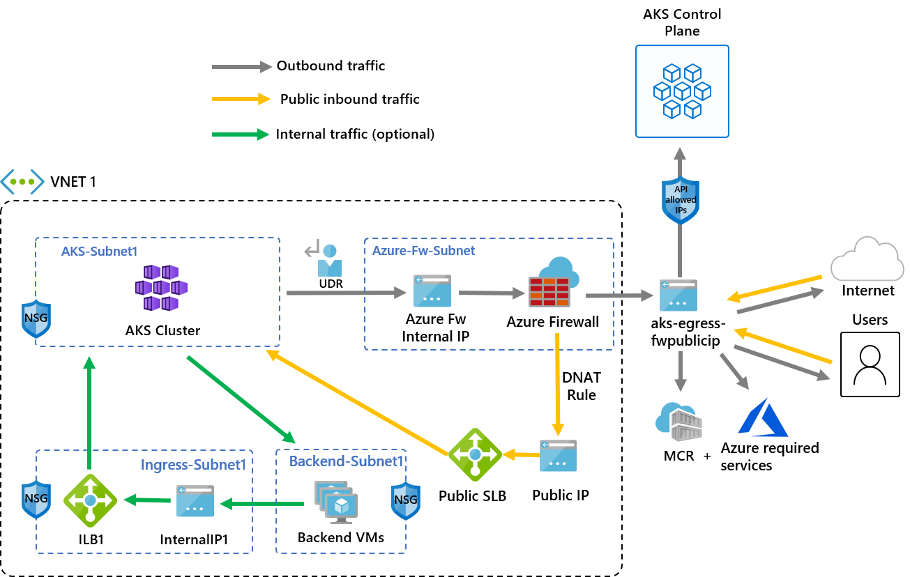

# Control egress traffic using Azure Firewall in Azure Kubernetes Service (AKS)

This article provides a walkthrough of how to use the [Outbound network and FQDN rules for AKS clusters][outbound-fqdn-rules] to control egress traffic using Azure Firewall in AKS. To simplify this configuration, Azure Firewall provides an Azure Kubernetes Service (`AzureKubernetesService`) FQDN that restricts outbound traffic from the AKS cluster. This article also provides an example of how to configure public inbound traffic via the firewall.

> [!NOTE]
>
> The FQDN tag contains all the FQDNs listed in [Outbound network and FQDN rules for AKS clusters][outbound-fqdn-rules] and is automatically updated.
>
> For production scenarios, we recommend having a *minimum of 20 frontend IPs* on the Azure Firewall to avoid SNAT port exhaustion issues.

The following information provides an example architecture of the deployment:



* **Public ingress is forced to flow through firewall filters**
  * AKS agent nodes are isolated in a dedicated subnet
  * [Azure Firewall](../firewall/overview.md) is deployed in its own subnet
  * A DNAT rule translates the firewall public IP into the load balancer frontend IP
* **Outbound requests start from agent nodes to the Azure Firewall internal IP using a [user-defined route (UDR)](egress-outboundtype.md)**
  * Requests from AKS agent nodes follow a UDR that has been placed on the subnet the AKS cluster was deployed into
  * Azure Firewall egresses out of the virtual network from a public IP frontend
  * Access to the public internet or other Azure services flows to and from the firewall frontend IP address
  * Access to the AKS control plane can be protected by [API server authorized IP ranges](./api-server-authorized-ip-ranges.md), including the firewall public frontend IP address
* **Internal traffic**
  * You can use an [internal load balancer](internal-lb.md) for internal traffic, which you could isolate on its own subnet, instead of or alongside a [public load balancer](load-balancer-standard.md)

## Set configuration using environment variables

Define a set of environment variables to be used in resource creations.

```bash
PREFIX="aks-egress"
RG="${PREFIX}-rg"
LOC="eastus"
PLUGIN=azure
AKSNAME="${PREFIX}"
VNET_NAME="${PREFIX}-vnet"
AKSSUBNET_NAME="aks-subnet"
# DO NOT CHANGE FWSUBNET_NAME - This is currently a requirement for Azure Firewall.
FWSUBNET_NAME="AzureFirewallSubnet"
FWNAME="${PREFIX}-fw"
FWPUBLICIP_NAME="${PREFIX}-fwpublicip"
FWIPCONFIG_NAME="${PREFIX}-fwconfig"
FWROUTE_TABLE_NAME="${PREFIX}-fwrt"
FWROUTE_NAME="${PREFIX}-fwrn"
FWROUTE_NAME_INTERNET="${PREFIX}-fwinternet"
```

## Create a virtual network with multiple subnets

Provision a virtual network with two separate subnets: one for the cluster and one for the firewall. Optionally, you can create one for internal service ingress.


1. Create a resource group using the [`az group create`][az-group-create] command.

    ```azurecli
    az group create --name $RG --location $LOC
    ```

2. Create a virtual network with two subnets to host the AKS cluster and the Azure Firewall using the [`az network vnet create`][az-network-vnet-create] and [`az network vnet subnet create`][az-network-vnet-subnet-create] commands.

    ```azurecli
    # Dedicated virtual network with AKS subnet
    az network vnet create \
        --resource-group $RG \
        --name $VNET_NAME \
        --location $LOC \
        --address-prefixes 10.42.0.0/16 \
        --subnet-name $AKSSUBNET_NAME \
        --subnet-prefix 10.42.1.0/24

    # Dedicated subnet for Azure Firewall (Firewall name can't be changed)
    az network vnet subnet create \
        --resource-group $RG \
        --vnet-name $VNET_NAME \
        --name $FWSUBNET_NAME \
        --address-prefix 10.42.2.0/24
    ```

## Create and set up an Azure Firewall with a UDR

You need to configure Azure Firewall inbound and outbound rules. The main purpose of the firewall is to enable organizations to configure granular ingress and egress traffic rules into and out of the AKS cluster.

> [!IMPORTANT]
>
> If your cluster or application creates a large number of outbound connections directed to the same or a small subset of destinations, you might require more firewall frontend IPs to avoid maxing out the ports per frontend IP.
>
> For more information on how to create an Azure Firewall with multiple IPs, see [Create an Azure Firewall with multiple public IP addresses using Bicep](../firewall/quick-create-multiple-ip-bicep.md).


1. Create a standard SKU public IP resource using the [`az network public-ip create`][az-network-public-ip-create] command. This resource will be used as the Azure Firewall frontend address.

    ```azurecli
    az network public-ip create -g $RG -n $FWPUBLICIP_NAME -l $LOC --sku "Standard"
    ```

2. Register the [Azure Firewall preview CLI extension](https://github.com/Azure/azure-cli-extensions/tree/main/src/azure-firewall) to create an Azure Firewall using the [`az extension add`][az-extension-add] command.

    ```azurecli
    az extension add --name azure-firewall
    ```

3. Create an Azure Firewall and enable DNS proxy using the [`az network firewall create`][az-network-firewall-create] command and setting the `--enable-dns-proxy` to `true`.

    ```azurecli
    az network firewall create -g $RG -n $FWNAME -l $LOC --enable-dns-proxy true
    ```

  Setting up the public IP address to the Azure Firewall may take a few minutes. Once it's ready, the IP address created earlier can be assigned to the firewall front end.

  > [!NOTE]
  >
  > To leverage FQDN on network rules, we need DNS proxy enabled. When DNS proxy is enabled, the firewall listens on port 53 and forwards DNS requests to the DNS server specified above. This allows the firewall to translate the FQDN automatically.

4. Create an Azure Firewall IP configuration using the [`az network firewall ip-config create`][az-network-firewall-ip-config-create] command.

    ```azurecli
    az network firewall ip-config create -g $RG -f $FWNAME -n $FWIPCONFIG_NAME --public-ip-address $FWPUBLICIP_NAME --vnet-name $VNET_NAME
   ```

5. Once the previous command succeeds, save the firewall frontend IP address for configuration later.

    ```azurecli
    FWPUBLIC_IP=$(az network public-ip show -g $RG -n $FWPUBLICIP_NAME --query "ipAddress" -o tsv)
    FWPRIVATE_IP=$(az network firewall show -g $RG -n $FWNAME --query "ipConfigurations[0].privateIPAddress" -o tsv)
    ```

  > [!NOTE]
  >
  > If you use secure access to the AKS API server with [authorized IP address ranges](./api-server-authorized-ip-ranges.md), you need to add the firewall public IP into the authorized IP range.

### Create a UDR with a hop to Azure Firewall

Azure automatically routes traffic between Azure subnets, virtual networks, and on-premises networks. If you want to change any of Azure's default routing, you can create a route table.

1. Create an empty route table to be associated with a given subnet using the [`az network route-table create`][az-network-route-table-create] command. The route table will define the next hop as the Azure Firewall created above. Each subnet can have zero or one route table associated to it.

    ```azurecli
    az network route-table create -g $RG -l $LOC --name $FWROUTE_TABLE_NAME
    ```

2. Create routes in the route table for the subnets using the [`az network route-table route create`][az-network-route-table-route-create] command.

    ```azurecli
    az network route-table route create -g $RG --name $FWROUTE_NAME --route-table-name $FWROUTE_TABLE_NAME --address-prefix 0.0.0.0/0 --next-hop-type VirtualAppliance --next-hop-ip-address $FWPRIVATE_IP

    az network route-table route create -g $RG --name $FWROUTE_NAME_INTERNET --route-table-name $FWROUTE_TABLE_NAME --address-prefix $FWPUBLIC_IP/32 --next-hop-type Internet
    ```

For information on how to override Azure's default system routes or add additional routes to a subnet's route table, see the [virtual network route table documentation](../virtual-network/virtual-networks-udr-overview.md#user-defined).

### Add firewall rules

> [!NOTE]
>
> For applications outside of the kube-system or gatekeeper-system namespaces that need to talk to the API server, an additional network rule to allow TCP communication to port 443 for the API server IP in addition to adding application rule for fqdn-tag `AzureKubernetesService` is required.

This section covers three network rules and an application rule you can use to configure on your firewall. You may need to adapt these rules based on your deployment.

* The first network rule allows access to port 9000 via TCP.
* The second network rule allows access to port 1194 and 123 via UDP. If you're deploying to Microsoft Azure operated by 21Vianet, see the [Azure operated by 21Vianet required network rules](./outbound-rules-control-egress.md#microsoft-azure-operated by-21vianet-required-network-rules). Both these rules will only allow traffic destined to the Azure Region CIDR in this article, which is East US.
* The third network rule opens port 123 to `ntp.ubuntu.com` FQDN via UDP. Adding an FQDN as a network rule is one of the specific features of Azure Firewall, so you'll need to adapt it when using your own options.
* The application rule covers all needed FQDNs accessible through TCP port 443 and port 80.

1. Create the network rules using the [`az network firewall network-rule create`][az-network-firewall-network-rule-create] command.

    ```azurecli
    az network firewall network-rule create -g $RG -f $FWNAME --collection-name 'aksfwnr' -n 'apiudp' --protocols 'UDP' --source-addresses '*' --destination-addresses "AzureCloud.$LOC" --destination-ports 1194 --action allow --priority 100

    az network firewall network-rule create -g $RG -f $FWNAME --collection-name 'aksfwnr' -n 'apitcp' --protocols 'TCP' --source-addresses '*' --destination-addresses "AzureCloud.$LOC" --destination-ports 9000

    az network firewall network-rule create -g $RG -f $FWNAME --collection-name 'aksfwnr' -n 'time' --protocols 'UDP' --source-addresses '*' --destination-fqdns 'ntp.ubuntu.com' --destination-ports 123
    ```

2. Create the application rule using the [`az network firewall application-rule create`][az-network-firewall-application-rule-create] command.

    ```azurecli
    az network firewall application-rule create -g $RG -f $FWNAME --collection-name 'aksfwar' -n 'fqdn' --source-addresses '*' --protocols 'http=80' 'https=443' --fqdn-tags "AzureKubernetesService" --action allow --priority 100
    ```

To learn more about Azure Firewall, see the [Azure Firewall documentation](../firewall/overview.md).

### Associate the route table to AKS

To associate the cluster with the firewall, the dedicated subnet for the cluster's subnet must reference the route table created above. Use the [`az network vnet subnet update`][az-network-vnet-subnet-update] command to associate the route table to AKS.

```azurecli
az network vnet subnet update -g $RG --vnet-name $VNET_NAME --name $AKSSUBNET_NAME --route-table $FWROUTE_TABLE_NAME
```

## Deploy an AKS cluster with a UDR outbound type to the existing network

Now, you can deploy an AKS cluster into the existing virtual network. You will use the [`userDefinedRouting` outbound type](egress-outboundtype.md), which ensures that any outbound traffic is forced through the firewall and no other egress paths will exist. The [`loadBalancer` outbound type](egress-outboundtype.md#outbound-type-of-loadbalancer) can also be used.


The target subnet to be deployed into is defined with the environment variable, `$SUBNETID`. Set the value for the subnet ID using the following command:

```azurecli
SUBNETID=$(az network vnet subnet show -g $RG --vnet-name $VNET_NAME --name $AKSSUBNET_NAME --query id -o tsv)
```

You'll define the outbound type to use the UDR that already exists on the subnet. This configuration will enable AKS to skip the setup and IP provisioning for the load balancer.

> [!TIP]
> You can add additional features to the cluster deployment, such as [**private clusters**](private-clusters.md).
>
> You can add the AKS feature for [**API server authorized IP ranges**](api-server-authorized-ip-ranges.md) to limit API server access to only the firewall's public endpoint. The authorized IP ranges feature is denoted in the diagram as optional. When enabling the authorized IP range feature to limit API server access, your developer tools must use a jumpbox from the firewall's virtual network, or you must add all developer endpoints to the authorized IP range.

### Create an AKS cluster with system-assigned identities

> [!NOTE]
> AKS will create a system-assigned kubelet identity in the node resource group if you don't [specify your own kubelet managed identity][Use a pre-created kubelet managed identity].
>
> For user-defined routing, system-assigned identity only supports the CNI network plugin.

Create an AKS cluster using a system-assigned managed identity with the CNI network plugin using the [`az aks create`][az-aks-create] command.

```azurecli
az aks create -g $RG -n $AKSNAME -l $LOC \
  --node-count 3 \
  --network-plugin azure \
  --outbound-type userDefinedRouting \
  --vnet-subnet-id $SUBNETID \
  --api-server-authorized-ip-ranges $FWPUBLIC_IP
```

### Create user-assigned identities

If you don't have user-assigned identities, follow the steps in this section. If you already have user-assigned identities, skip to [Create an AKS cluster with user-assigned identities](#create-an-aks-cluster-with-user-assigned-identities).

1. Create a managed identity using the [`az identity create`][az-identity-create] command.

    ```azurecli-interactive
    az identity create --name myIdentity --resource-group myResourceGroup
    ```

    The output should resemble the following example output:

    ```output
     {                                  
       "clientId": "<client-id>",
        "clientSecretUrl": "<clientSecretUrl>",
        "id": "/subscriptions/<subscriptionid>/resourcegroups/myResourceGroup/providers/Microsoft.ManagedIdentity/userAssignedIdentities/myIdentity", 
       "location": "westus2",
      "name": "myIdentity",
       "principalId": "<principal-id>",
      "resourceGroup": "myResourceGroup",                       
       "tags": {},
       "tenantId": "<tenant-id>",
        "type": "Microsoft.ManagedIdentity/userAssignedIdentities"
     }
    ```

2. Create a kubelet managed identity using the [`az identity create`][az-identity-create] command.

    ```azurecli
    az identity create --name myKubeletIdentity --resource-group myResourceGroup
   ```

    The output should resemble the following example output:

    ```output
   {
      "clientId": "<client-id>",
     "clientSecretUrl": "<clientSecretUrl>",
     "id": "/subscriptions/<subscriptionid>/resourcegroups/myResourceGroup/providers/Microsoft.ManagedIdentity/userAssignedIdentities/myKubeletIdentity", 
      "location": "westus2",
      "name": "myKubeletIdentity",
     "principalId": "<principal-id>",
      "resourceGroup": "myResourceGroup",                       
      "tags": {},
     "tenantId": "<tenant-id>",
     "type": "Microsoft.ManagedIdentity/userAssignedIdentities"
    }
   ```

  > [!NOTE]
  > If you create your own VNet and route table where the resources are outside of the worker node resource group, the CLI will add the role assignment automatically. If you're using an ARM template or other method, you need to use the Principal ID of the cluster managed identity to perform a [role assignment][add role to identity].

### Create an AKS cluster with user-assigned identities

Create an AKS cluster with your existing identities in the subnet using the [`az aks create`][az-aks-create] command, provide the resource ID of the managed identity for the control plane by including the `assign-kubelet-identity` argument.

```azurecli
az aks create -g $RG -n $AKSNAME -l $LOC \
  --node-count 3 \
  --network-plugin kubenet \
  --outbound-type userDefinedRouting \
  --vnet-subnet-id $SUBNETID \
  --api-server-authorized-ip-ranges $FWPUBLIC_IP
  --enable-managed-identity \
  --assign-identity <identity-resource-id> \
  --assign-kubelet-identity <kubelet-identity-resource-id>
```

## Enable developer access to the API server

If you used authorized IP ranges for your cluster in the previous step, you need to add your developer tooling IP addresses to the AKS cluster list of approved IP ranges so you access the API server from there. You can also configure a jumpbox with the needed tooling inside a separate subnet in the firewall's virtual network.

1. Retrieve your IP address using the following command:

    ```bash
    CURRENT_IP=$(dig @resolver1.opendns.com ANY myip.opendns.com +short)
    ```

2. Add the IP address to the approved ranges using the [`az aks update`][az-aks-update] command.

    ```azurecli
    az aks update -g $RG -n $AKSNAME --api-server-authorized-ip-ranges $CURRENT_IP/32
    ```

3. Configure `kubectl` to connect to your AKS cluster using the [`az aks get-credentials`][az-aks-get-credentials] command.

    ```azurecli
    az aks get-credentials -g $RG -n $AKSNAME
    ```

## Deploy a public service

You can now start exposing services and deploying applications to this cluster. In this example, we'll expose a public service, but you also might want to expose an internal service using an [internal load balancer](internal-lb.md).


1. Copy the following YAML and save it as a file named `example.yaml`.

    ```yaml
    # voting-storage-deployment.yaml
    apiVersion: apps/v1
    kind: Deployment
    metadata:
      name: voting-storage
    spec:
      replicas: 1
      selector:
        matchLabels:
          app: voting-storage
      template:
        metadata:
          labels:
            app: voting-storage
        spec:
          containers:
          - name: voting-storage
            image: mcr.microsoft.com/aks/samples/voting/storage:2.0
            args: ["--ignore-db-dir=lost+found"]
            resources:
              requests:
                cpu: 100m
                memory: 128Mi
              limits:
                cpu: 250m
                memory: 256Mi
            ports:
            - containerPort: 3306
              name: mysql
            volumeMounts:
            - name: mysql-persistent-storage
              mountPath: /var/lib/mysql
            env:
            - name: MYSQL_ROOT_PASSWORD
              valueFrom:
                secretKeyRef:
                  name: voting-storage-secret
                  key: MYSQL_ROOT_PASSWORD
            - name: MYSQL_USER
              valueFrom:
                secretKeyRef:
                  name: voting-storage-secret
                  key: MYSQL_USER
            - name: MYSQL_PASSWORD
              valueFrom:
                secretKeyRef:
                  name: voting-storage-secret
                  key: MYSQL_PASSWORD
            - name: MYSQL_DATABASE
              valueFrom:
                secretKeyRef:
                  name: voting-storage-secret
                  key: MYSQL_DATABASE
          volumes:
          - name: mysql-persistent-storage
            persistentVolumeClaim:
              claimName: mysql-pv-claim
    ---
    # voting-storage-secret.yaml
    apiVersion: v1
    kind: Secret
    metadata:
      name: voting-storage-secret
    type: Opaque
    data:
      MYSQL_USER: ZGJ1c2Vy
      MYSQL_PASSWORD: UGFzc3dvcmQxMg==
      MYSQL_DATABASE: YXp1cmV2b3Rl
     MYSQL_ROOT_PASSWORD: UGFzc3dvcmQxMg==
    ---
    # voting-storage-pv-claim.yaml
    apiVersion: v1
    kind: PersistentVolumeClaim
    metadata:
      name: mysql-pv-claim
    spec:
      accessModes:
      - ReadWriteOnce
    resources:
        requests:
          storage: 1Gi
    ---
    # voting-storage-service.yaml
    apiVersion: v1
    kind: Service
    metadata:
      name: voting-storage
      labels: 
        app: voting-storage
    spec:
      ports:
      - port: 3306
        name: mysql
      selector:
        app: voting-storage
    ---
   # voting-app-deployment.yaml
    apiVersion: apps/v1
   kind: Deployment
    metadata:
      name: voting-app
    spec:
      replicas: 1
      selector:
        matchLabels:
          app: voting-app
      template:
        metadata:
          labels:
            app: voting-app
        spec:
          containers:
          - name: voting-app
            image: mcr.microsoft.com/aks/samples/voting/app:2.0
            imagePullPolicy: Always
            ports:
           - containerPort: 8080
             name: http
            env:
            - name: MYSQL_HOST
              value: "voting-storage"
            - name: MYSQL_USER
              valueFrom:
                secretKeyRef:
                  name: voting-storage-secret
                  key: MYSQL_USER
            - name: MYSQL_PASSWORD
              valueFrom:
                secretKeyRef:
                  name: voting-storage-secret
                  key: MYSQL_PASSWORD
            - name: MYSQL_DATABASE
              valueFrom:
                secretKeyRef:
                  name: voting-storage-secret
                  key: MYSQL_DATABASE
            - name: ANALYTICS_HOST
              value: "voting-analytics"
    ---
    # voting-app-service.yaml
    apiVersion: v1
    kind: Service
    metadata:
      name: voting-app
      labels: 
        app: voting-app
    spec:
      type: LoadBalancer
      ports:
      - port: 80
        targetPort: 8080
        name: http
      selector:
        app: voting-app
    ---
    # voting-analytics-deployment.yaml
    apiVersion: apps/v1
    kind: Deployment
    metadata:
      name: voting-analytics
    spec:
      replicas: 1
      selector:
        matchLabels:
          app: voting-analytics
          version: "2.0"
      template:
        metadata:
          labels:
            app: voting-analytics
            version: "2.0"
        spec:
          containers:
          - name: voting-analytics
            image: mcr.microsoft.com/aks/samples/voting/analytics:2.0
            imagePullPolicy: Always
            ports:
            - containerPort: 8080
              name: http
            env:
            - name: MYSQL_HOST
              value: "voting-storage"
            - name: MYSQL_USER
              valueFrom:
                secretKeyRef:
                  name: voting-storage-secret
                  key: MYSQL_USER
            - name: MYSQL_PASSWORD
              valueFrom:
                secretKeyRef:
                  name: voting-storage-secret
                  key: MYSQL_PASSWORD
            - name: MYSQL_DATABASE
              valueFrom:
                secretKeyRef:
                  name: voting-storage-secret
                  key: MYSQL_DATABASE
    ---
    # voting-analytics-service.yaml
    apiVersion: v1
    kind: Service
    metadata:
    name: voting-analytics
      labels: 
        app: voting-analytics
    spec:
      ports:
      - port: 8080
        name: http
      selector:
        app: voting-analytics
    ```

2. Deploy the service using the `kubectl apply` command.

    ```bash
   kubectl apply -f example.yaml
   ```

## Add a DNAT rule to Azure Firewall

> [!IMPORTANT]
>
> When you use Azure Firewall to restrict egress traffic and create a UDR to force all egress traffic, make sure you create an appropriate DNAT rule in Azure Firewall to correctly allow ingress traffic. Using Azure Firewall with a UDR breaks the ingress setup due to asymmetric routing. The issue occurs if the AKS subnet has a default route that goes to the firewall's private IP address, but you're using a public load balancer - ingress or Kubernetes service of type `loadBalancer`. In this case, the incoming load balancer traffic is received via its public IP address, but the return path goes through the firewall's private IP address. Because the firewall is stateful, it drops the returning packet because the firewall isn't aware of an established session. To learn how to integrate Azure Firewall with your ingress or service load balancer, see [Integrate Azure Firewall with Azure Standard Load Balancer](../firewall/integrate-lb.md).

To configure inbound connectivity, you need to write a DNAT rule to the Azure Firewall. To test connectivity to your cluster, a rule is defined for the firewall frontend public IP address to route to the internal IP exposed by the internal service. The destination address can be customized. The translated address must be the IP address of the internal load balancer. The translated port must be the exposed port for your Kubernetes service. You also need to specify the internal IP address assigned to the load balancer created by the Kubernetes service.

1. Get the internal IP address assigned to the load balancer using the `kubectl get services` command.

    ```bash
    kubectl get services
   ```

    The IP address will be listed in the `EXTERNAL-IP` column, as shown in the following example output:

    ```bash
   NAME               TYPE           CLUSTER-IP      EXTERNAL-IP   PORT(S)        AGE
   kubernetes         ClusterIP      10.41.0.1       <none>        443/TCP        10h
   voting-analytics   ClusterIP      10.41.88.129    <none>        8080/TCP       9m
   voting-app         LoadBalancer   10.41.185.82    20.39.18.6    80:32718/TCP   9m
   voting-storage     ClusterIP      10.41.221.201   <none>        3306/TCP       9m
    ```

2. Get the service IP using the `kubectl get svc voting-app` command.

   ```bash
    SERVICE_IP=$(kubectl get svc voting-app -o jsonpath='{.status.loadBalancer.ingress[*].ip}')
    ```

3. Add the NAT rule using the [`az network firewall nat-rule create`][az-network-firewall-nat-rule-create] command.

    ```azurecli
    az network firewall nat-rule create --collection-name exampleset --destination-addresses $FWPUBLIC_IP --destination-ports 80 --firewall-name $FWNAME --name inboundrule --protocols Any --resource-group $RG --source-addresses '*' --translated-port 80 --action Dnat --priority 100 --translated-address $SERVICE_IP
    ```

## Validate connectivity

Navigate to the Azure Firewall frontend IP address in a browser to validate connectivity.

You should see the AKS voting app. In this example, the firewall public IP was `52.253.228.132`.


### Clean up resources

To clean up Azure resources, delete the AKS resource group using the [`az group delete`][az-group-delete] command.

```azurecli
az group delete -g $RG
```

## Next steps

In this article, you learned how to secure your outbound traffic using Azure Firewall. If needed, you can generalize the steps above to forward the traffic to your preferred egress solution following the [Outbound Type `userDefinedRoute` documentation](egress-outboundtype.md).

<!-- LINKS - internal -->

[az-group-create]: /cli/azure/group#az_group_create
[outbound-fqdn-rules]: ./outbound-rules-control-egress.md
[az-network-vnet-create]: /cli/azure/network/vnet#az_network_vnet_create
[az-network-vnet-subnet-create]: /cli/azure/network/vnet/subnet#az_network_vnet_subnet_create
[az-network-vnet-subnet-update]: /cli/azure/network/vnet/subnet#az_network_vnet_subnet_update
[az-network-public-ip-create]: /cli/azure/network/public-ip#az_network_public_ip_create
[az-extension-add]: /cli/azure/extension#az_extension_add
[az-network-firewall-create]: /cli/azure/network/firewall#az_network_firewall_create
[az-network-firewall-ip-config-create]: /cli/azure/network/firewall/ip-config#az_network_firewall_ip_config_create
[az-network-route-table-create]: /cli/azure/network/route-table#az_network_route_table_create
[az-network-route-table-route-create]: /cli/azure/network/route-table/route#az_network_route_table_route_create
[az-network-firewall-network-rule-create]: /cli/azure/network/firewall/network-rule#az_network_firewall_network_rule_create
[az-network-firewall-application-rule-create]: /cli/azure/network/firewall/application-rule#az_network_firewall_application_rule_create
[az-aks-create]: /cli/azure/aks#az_aks_create
[az-aks-update]: /cli/azure/aks#az_aks_update
[az-network-firewall-nat-rule-create]: /cli/azure/network/firewall/nat-rule#az-network-firewall-nat-rule-create
[az-group-delete]: /cli/azure/group#az_group_delete
[add role to identity]: use-managed-identity.md#add-role-assignment-for-managed-identity
[Use a pre-created kubelet managed identity]: use-managed-identity.md#use-a-pre-created-kubelet-managed-identity
[az-identity-create]: /cli/azure/identity#az_identity_create
[az-aks-get-credentials]: /cli/azure/aks#az_aks_get_credentials
